# Exercise 1: Access OAC and load data

## Scenario

“9 o’clock of a Friday morning. An email from your manager pops-up asking you to help with some analysis. During a board meeting, expenses review appeared a bit higher than expected. Someone quickly pointed at you as the best person in the company to create some analysis and help identifying the root causes. An excel with expenses data is attached to the email. You wonder who said your name, as you would love to pay the favor back.”

__SUMMARY__

In this first exercise you will connect to the OAC instance, load an excel file, enhance it with extra information and prepare it to be used by the search.

Estimated Lab Time: 15 minutes

### Objectives
* Connect to the OAC instance
* Load an excel file
* Enhance and prepare the file for search

## **Task 1**: Connect to the OAC instance

Open the browser and enter the ‘OAC URL’ for ‘Oracle Analytics Cloud’ provided. It would be of the format http://host/dv/ui.

1. Your instructor will provide you with your User Name and Password. Accept the term of service and you will be directed to the main OAC Console page.
2. Login using the credentials provided.

You will be taken to the OAC Home page.

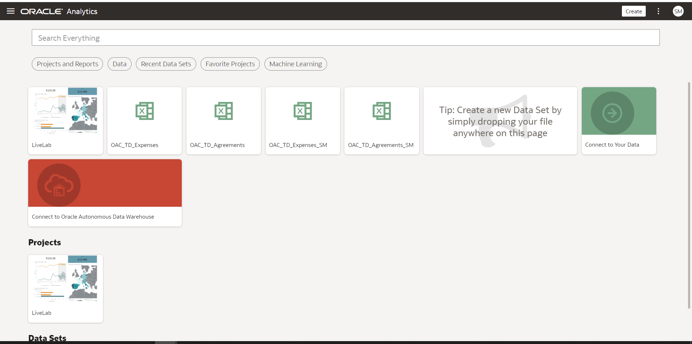

On the OAC Home Page

NOTE that you probably won’t have the same list of projects and datasets.

## **Task 2**: Load an excel file

Donwload the file: [OAC_TD_Expenses.xlsx](https://objectstorage.eu-frankfurt-1.oraclecloud.com/p/N7XvXLfts5Ld2YMVPhwg7uxnaLLSsP3D6d2Bis9VKa7EBiTWf7FE25EPiNg_UVEq/n/sehubemeaprod/b/OAC_LiveLab/o/OAC_TD_Expenses.xlsx)

1. Click on “Create”

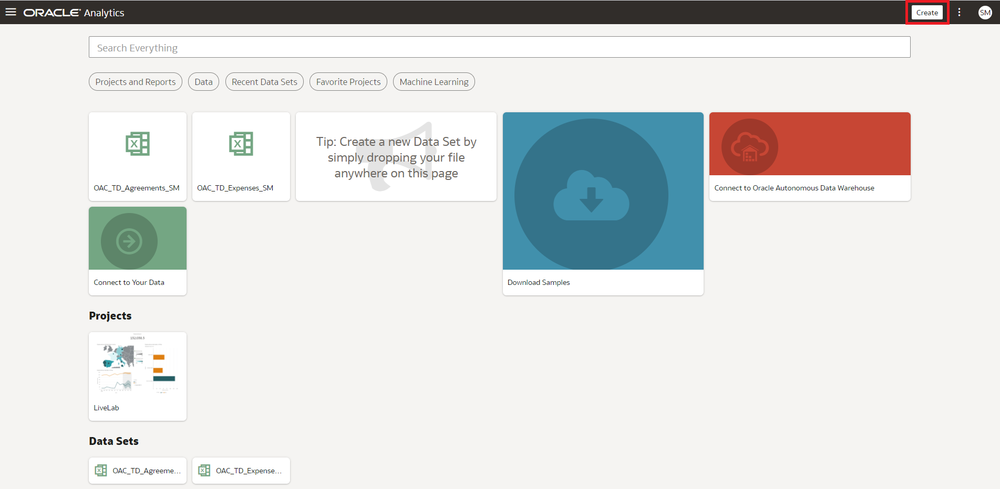

From the available options, focus on ingesting a new set of data to the system.

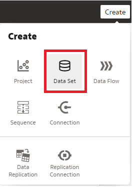

You are led to the data set screen and a pop-up windows appears to let you select where to find the data.
1. Click on “Drop data file here or click to browse” option.

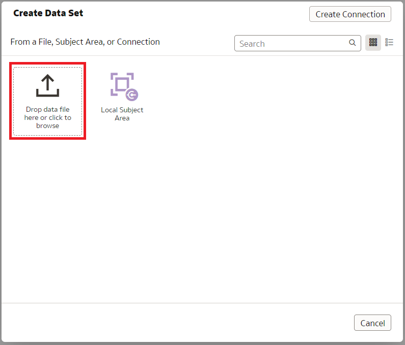

The explorer window appears.

1. Look for the folder with lab files and select “OAC_TD_Expenses.xlsx” file.
2. Click Open

The file gets uploaded and parsed.

On the screen you have a preview of the data.
1. Change the Name of the dataset adding your initials at the end, to avoid clashing with other attendees, for instance: OAC_TD_Expenses_JAMP
2. Click on “Add”

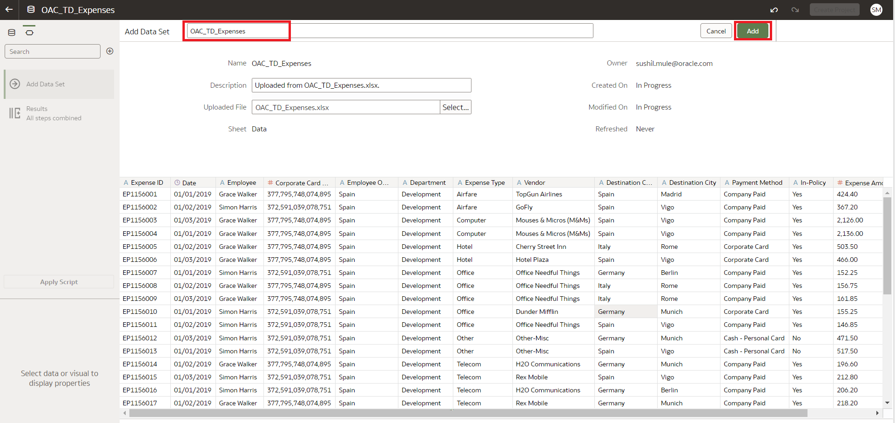

## **Task 3**: Enhance and prepare the file for search

Now, your data is profiled to provide you with some recommendations to enhance it.

This recommendation list is on the right part of the window.
1. Click anywhere on the “Corporate Card Number” column to see its suggested actions.

The engine discovered that you have a column with Credit Card numbers which probably is not GDPR complaint at all.

At most probably not needed for any analysis. So the system recommends you to obfuscate or delete this column.
1. Click on the option “Obfuscate Corporate Card Number”

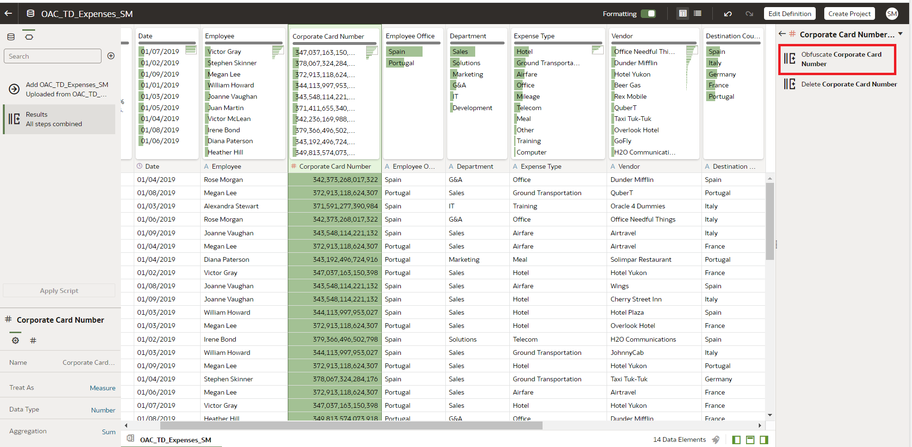

The column gets obfuscated and highlighted so you can easily spot the changes. This step has been added to the list of preparation steps on the left bar. At the end, all the steps will be applied to the dataset.

Now, you can explore other recommendations for a different type of column.

1. Click anywhere on the “Destination Country” column

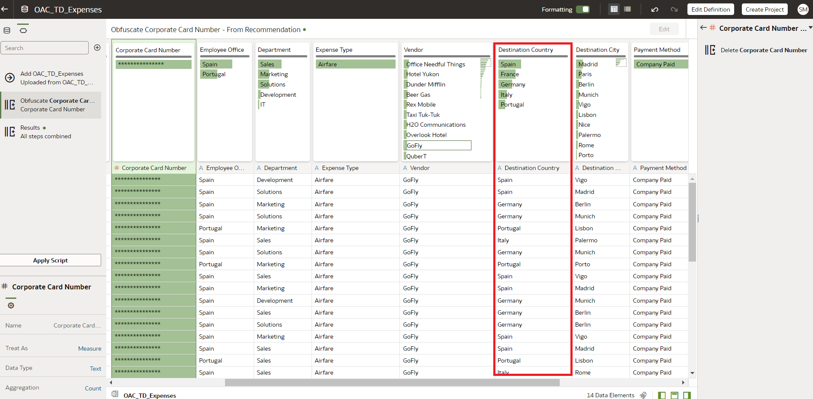

The engine detected this field as a Geo-country info so it suggests enhancements related to that, like providing the ISO code for you. This is quite convenient as standard codes are better for joining data and avoid burden with names, characters and string cases.
1. Click on “Enrich Destination Country with iso3”

Again, preparation preview gets applied and new column is highlighted.

This is enough for the exercise needs.
1. Click “Apply Script” Once the steps are applied to your data the button will get grayed out.

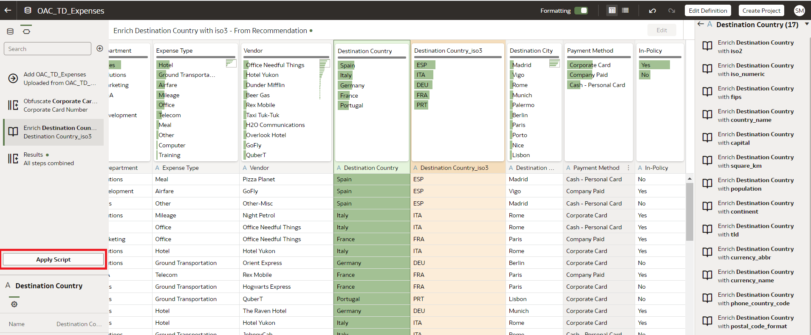

Data is now ready to be used, however, to have access to one of the easiest methods, you need to enable searching on the dataset.

To do so:
1. Click on the Navigator menu (“burger” icon) on the top left corner.
2. Click on “Data”

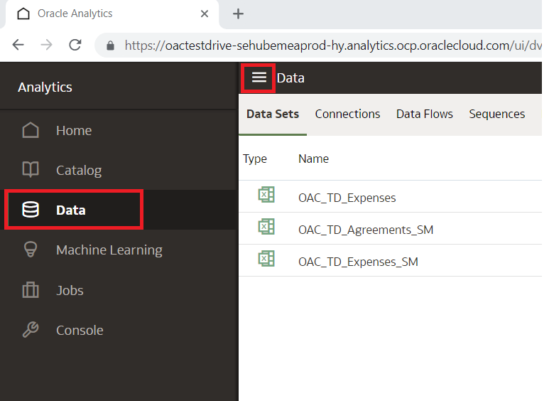

In this screen you can see a list of the Data Sets that you have access to.

The one at the top should be the file you just created.
1. Click on the “Actions Menu” (burger icon) at the right of the data set entry
2. Select “Inspect”

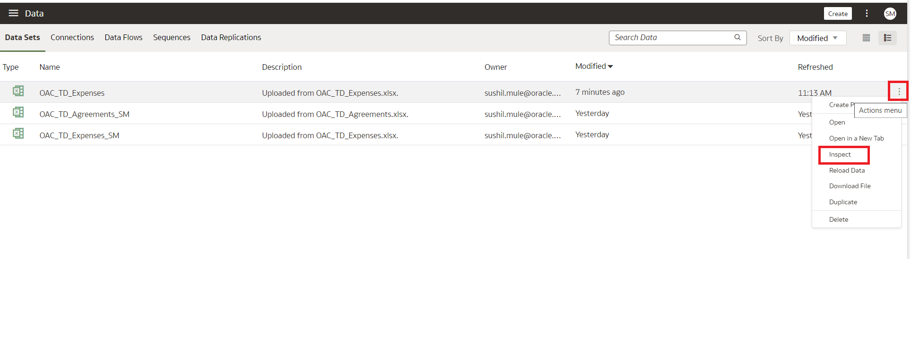

This menu allows you to configure the access to the file and data.

Here is were you can allow the search engine to run on the data and be “searchable” through the BIAsk bar.
1. Click on Search

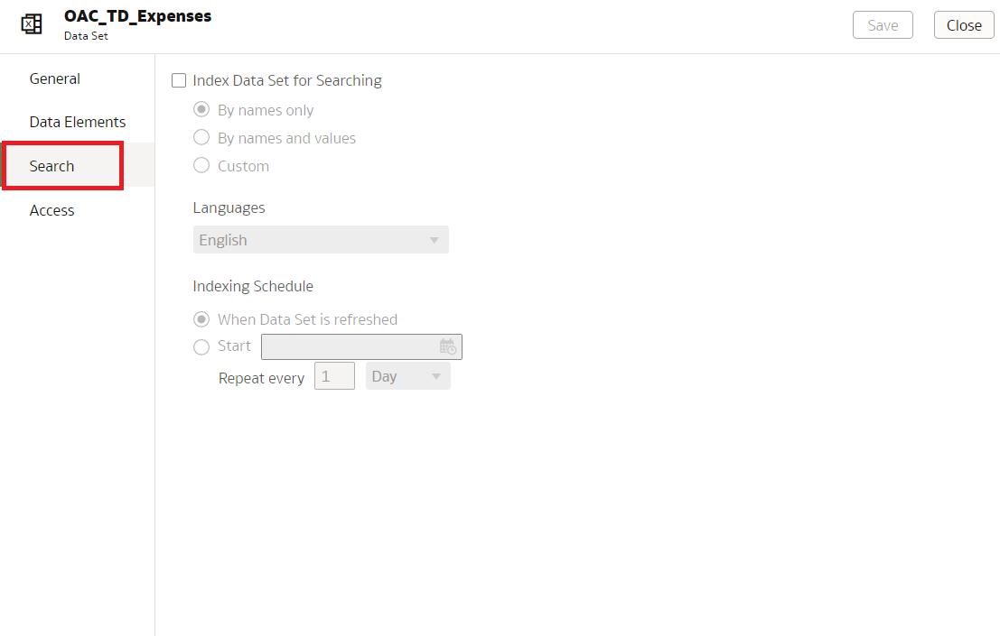

Search option can be configured in detail and for several Languages.
1. Click on “Index Data Set for Searching” checkbox

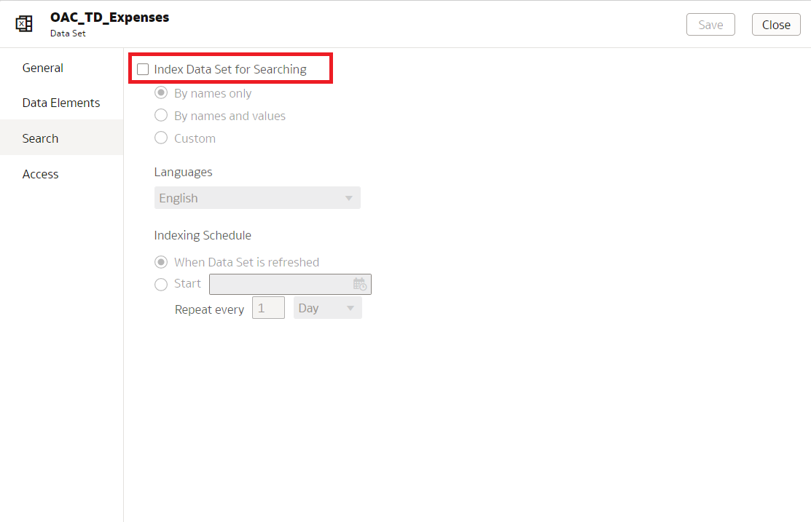

Default settings are enough as your data is in English and searching by names fits with the needs of the exercise.
1. Click on “Save”
2. Click on “Close”

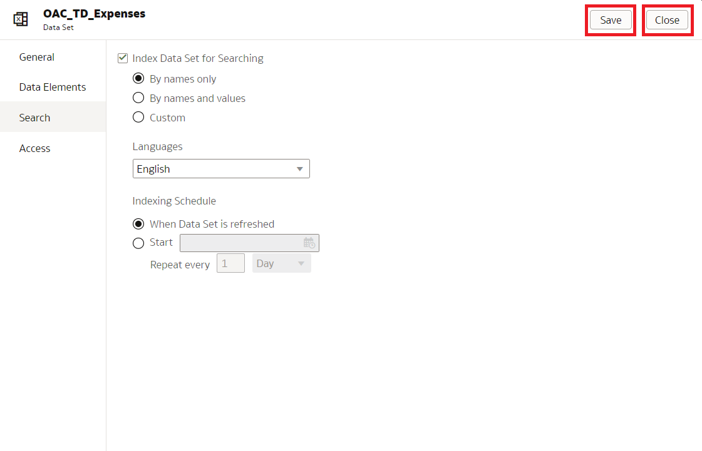

Search engine daemon runs in background every 2-3 minutes. You need to wait that time to be sure data is crawled.

So, time for a coffee or a short talk from your instructor.

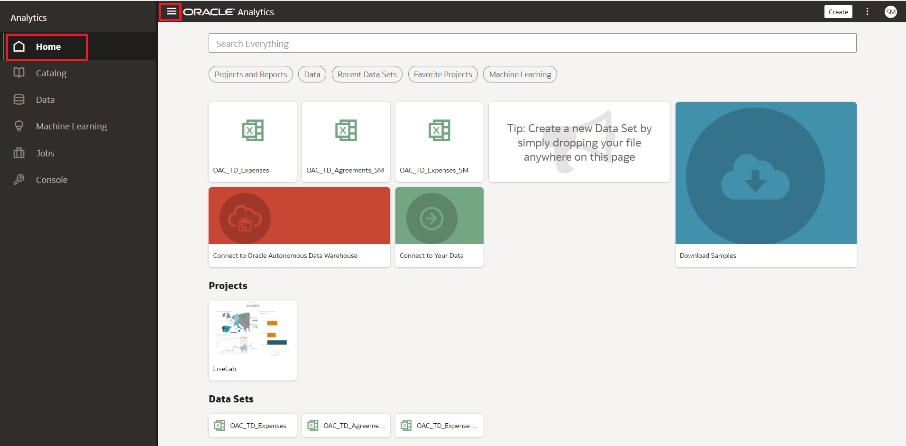

## End of Exercise 1

## Acknowledgements

- **Author** - Mahira Galal, Aydin Heydari and Sushil Mule
- **Adapted by** -  Mahira Galal, Aydin Heydari, Alex Chiru
- **Last Updated By/Date** - Sushil Mule, August 2021