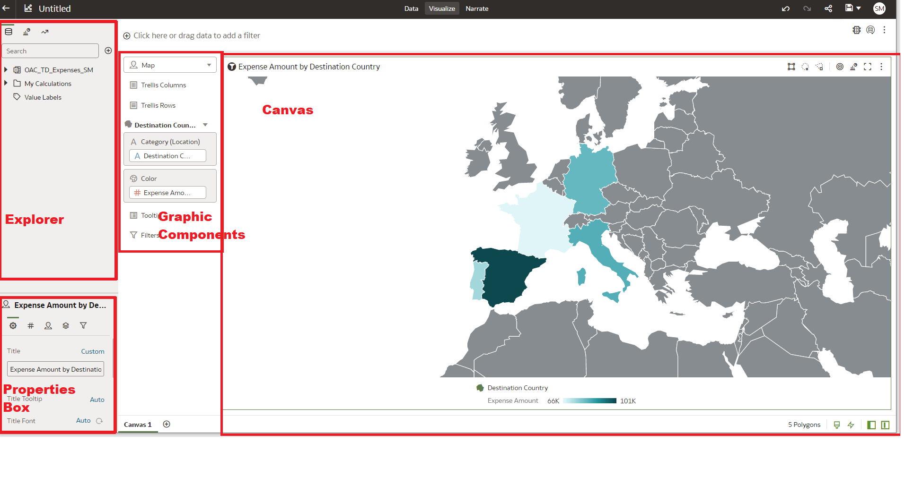
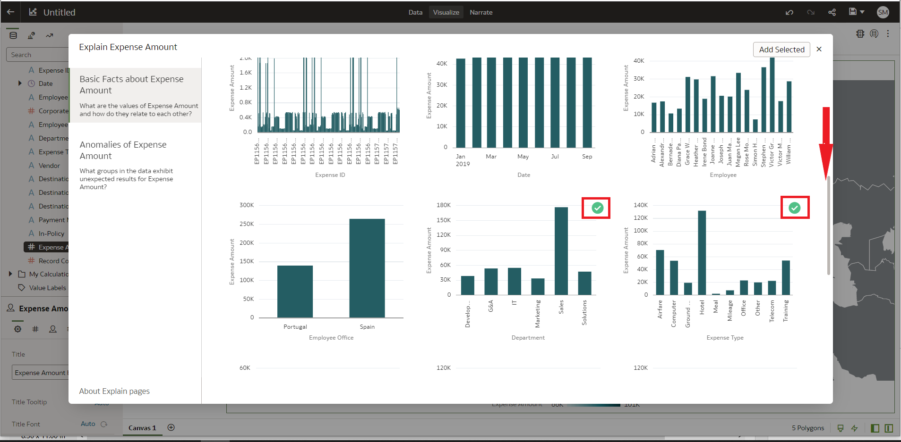
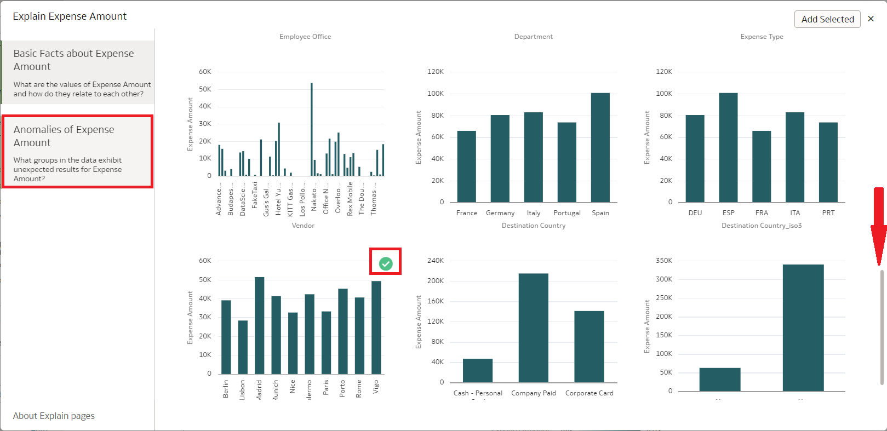
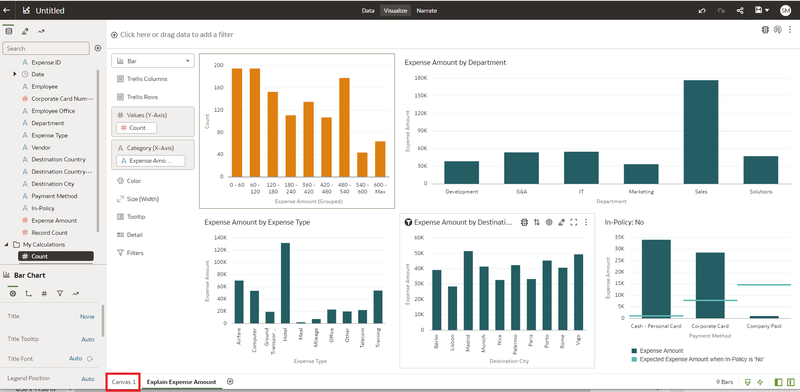

# Exercise 3: ML one right-click away

## Scenario

“A map is always a good starting point but, what else? The ‘empty canvas’ syndrome has been suffered by artist and analysts for decades. Now with a couple of clicks you can get rid of it. What a time to be alive!”

__SUMMARY__

In this exercise you will get into a Project to analyze the data and create several reports.

Out of the different possibilities, you will use the “Explain” functionality, that runs several ML and statistics in the background to help you understand your data easy and quickly. Of course, your business knowledge is key to interpret the results.

Estimated Lab Time: 30 minutes

### Objectives

* Explore in detail OAC powerful features
* Use the features that runs ML and statistics in background.
* Creating a Project with several reports

### Prerequisites
* Logged in to OAC

## **Task 1**: Explore the OAC Project

An Oracle Analytics project has 3 main parts:

**Prepare**: Here is where you configure your data. You get a preview of each dataset on the project. And you enrich it by adding columns, hiding or renaming the available ones. You also define joins between datasets here.

**Visualize**: Here is where you explore and Analyze the data.
You can create several canvases to hold the different visualizations you define.

**Narrate**: Here is where you can create a more presentation oriented view of the analysis you created.

During these exercises you will use only Visualize and Prepare tabs.

Focusing on Visualize. This is your project window:
Explorer: Here you have the list of datasets and columns.
Properties Box: Shows all properties and parameters of selected object. Selected component will be highlighted (if a column) or have a blue border (if a graphic).
Graphic Components: Configures which data is shown in the visualization
Canvas: Where all visuals are displayed. You can create several tab canvases (Canvas Tab are at the bottom).

First steps analyzing data usually requires time and effort. You can get a big push by leveraging the Explain functionality
1. Select “Expenses Amount” by clicking on it.
2. Right-click on “Expenses Amount” and select “Explain Expenses Amount”

## **Task 2**: Building a canvas using the **Explain** feature

Explain will run a series of ML and statistics to offer you a summary of the distribution, correlations and anomalies in your data.
You can see, for instance, a distribution of number of tickets grouped in Expense Amount buckets.
This feature allows you to select the insights you like and add them to your project.
1. Click on “Select for Canvas” at the top-right corner of the “Basic facts about Expense Amount”

More interesting distributions can be found on this screen.
You select 2 other analysis, one about Expenses by Type where you see Hotel as the category with higher expenses and
Expenses by Department where you see Sales as the Department with higher expenses.

This is already telling you where you should check first as potential savings will be higher.
1. Drag the slider down to see other visualizations
2. Click on “Select for Canvas” at the top right corner of the “Expense Amount by Expense Type” graphic
3. Click on “Select for Canvas” at the top right corner of the “Expense Amount by Department” graphic

Finally, you will select another analysis about cities.
1. Drag the slider bar to the bottom
2. Click on “Select for Canvas” at the top right corner of the “Expense Amount by Destination City” graphic

Now it is time to check the anomalies
3. Click on the “Anomalies of Expense Amount”

Anomalies use ML to find outliers. This means that it will try to highlight which combinations of values in your data do not follow the normal distribution and are out of the expected value.
This does not directly mean they are wrong. Your business knowledge is key to interpret the results.
Left visual tells you that Out of Policy expenses are made usually with Cash and Corporate card. This is normal, as company should not pay items against its own policy.
1. Click on “Select for Canvas” at the top right corner of the “Out-of-Policy” graphic
2. Click on “Add Selected” to close the Explain and go back to the project.

**NOTE:** You might not get exactly same results in Explain. This is normal. Data deviations are usually small and only few from all possible combinations are showed. 

If this happens just do step 2.

A new canvas is created and all selected analysis from Explain are added there.
This provides a real good explanation about your expenses data.
Sales Department, Hotels, and Out of Policy are the topics to review deeper in our next exercise.
1. Click on “Canvas 1” to continue with next exercise.

## End of Exercise 3