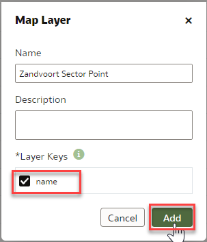
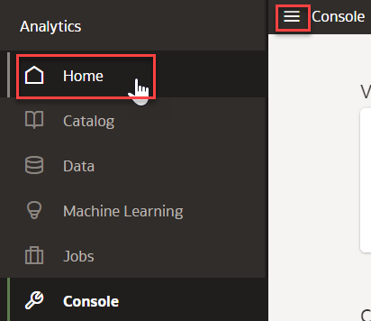

# Import your GeoJSON code into OAC 

**Introduction**

In this lab you will **import the GeoJSON files** you generated, into the OAC Console as a map layer.

###  Prerequisites

This lab assumes you have:

- An Oracle Free Tier, Always Free, Paid or Live Labs Cloud Account
- Provisioned Oracle Analytics Cloud
- All previous labs successfully completed
- Access to the console of OAC ("_BI Service Administrator Role_" Application Role)

##  Task 1: Import your geoJSON files into OAC 

1. Select the triple bar icon (**Navigator**)

    

2. Select **Console**  

    

3. Select Maps  

    

4. Select **Map Layers**  

    

5. **Add Custom** Map **Layer**  

    

6. Browse to your geoJSON file you created. If successful, you will see  a window asking for your layer name and which field you will use to map to your data. 

    In case you haven't created your own geoJSON, you can download [Zandvoort Sector LineString.geojson](https://objectstorage.us-ashburn-1.oraclecloud.com/p/a4JySgQvO_jUFX7Z9pOWPWKAgSs5BqweobA8kdxV3W_oqs-pAFiAJVOheNtAQ17x/n/idbwmyplhk4t/b/RedBullRacing-HondaWin/o/Zandvoort%20Sector%20LineString.geojson)
    > **Note:** if your file does not upload successfully, ensure you entered in a unique id for each property.  

    

7. Click **add Custom Map Layer** to load your second map layer

8. Browse to your second geoJSON file you created. If successful, you  will see a window asking for your layer name and which field you  will use to map to your data.

    In case you haven't created your own geoJSON, you can download [Zandvoort Sector Point.geojson](https://objectstorage.us-ashburn-1.oraclecloud.com/p/33Bt4LPdlJvJRtuLnHOAymQ8SitN46quzbHlFHOTgY9w_5YMUeEPY6npOXlaS_5C/n/idbwmyplhk4t/b/RedBullRacing-HondaWin/o/Zandvoort%20Sector%20Point.geojson)

    

9. Click **Go back** arrow from top left

    

10. Click **Navigator** and select **Home**

    

You have now loaded your custom **Map Layers** into OAC.  
Next we will associate the LineStrings and Points to your data.

Congratulations on completing this lab!

You may now *proceed to the next lab*.

## **Acknowledgements**

- **Author** - Carrie Nielsen (Oracle Analytics Product Strategy Director)
- **Contributors** - Lucian Dinescu (Oracle Analytics Product Strategy)
- **Last Updated By** - Lucian Dinescu (Oracle Analytics Product Strategy)