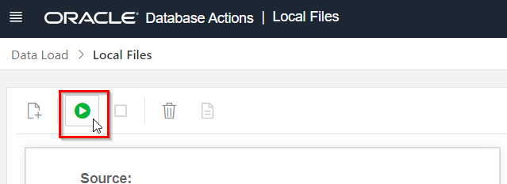

# Load Data into Autonomous Data Warehouse

## Introduction
In this lab you will load the Grand Prix data into the Autonomous Data Warehouse. After this lab we will be ready to start analyzing the data.

Estimated Lab Time: 5 minutes

### Objectives
- Learn how to load data into the data warehouse, so you can analyze it later.

### Prerequisites
To complete this lab, you need to have the following:
- A provisioned Autonomous Data Warehouse
- You're logged into your Oracle Cloud Account

## STEP 1: Create a New Database User/Schema in Autonomous Data Warehouse

This new user/schema will hold the Grand Prix data.

1. Go to **Menu** > **Oracle Database** > **Autonomous Data Warehouse**.

   

2. Click on the **REDBULL** database that you created earlier.

   

3. Go to **Tools** tab and click **Open Database Actions**.

   

   Login with user **ADMIN**, password **Oracle_12345** (you specified this upon creation of the Autonomous Data Warehouse earlier).

4. Click the **SQL** tile under **Development** section.

    

5. **Download** <a href="files/create_user.sql" target="\_blank">`create_user.sql`</a>. Save the file on your local machine. Make sure that the file is saved with extension `.sql`.

6. Open the `create_user.sql` file with a text editor and copy-and-paste all of its contents into the database actions worksheet area.

    

7. Click the run-script button (**not** the Run button). Then verify the output in the **Script Output** tab. The last lines in the output should indicate that the script has run successfully.

    

## **STEP 2**: Upload the Grand Prix data to Autonomous Data Warehouse

1. **Download** the three files that contain the data that we'll use in our analysis:

   <a href="files/RACES.csv" target="\_blank">Races data</a>

   <a href="files/LAP_TIMES.csv" target="\_blank">Lap Times data</a>

   <a href="files/SAFETY_CAR.csv" target="\_blank">Safety Car data</a>

   Save the files on your local machine. **Make sure that the files are saved with extension `.csv`**

2. Next, come back to your `REDBULL` ADW console, go to **Tools** tab and click **Open Database Actions**.

   > You should still have a browser tab open with the main page of the Autonomous Data Warehouse service. If not, navigate to this page first. Then, open Database Actions.

   

   This time **use the F1 user** (not the ADMIN user).

   - Username: F1
   - Password: Oracle_12345

3. Click to the **Data Load** option, under the **Data Tools** section.

   

4. Choose **Load Data** to answer the first question and **Local Files** to answer the second one. Click **Next**.

    

5. Select the files that you downloaded earlier.

    

6. Edit the configuration of SAFETY_CAR.csv by changing the load option into "Insert into table". We are doing this because we already have an empty table, and we want to add the data into that table.

   

   

7. Also change the load option for RACES and LAP_TIMES to "Insert into table".

8. After you have changed the load option of all three files, click the **Play** button to start the process and click **Run** on the **Run Data Load Job** verification window.

    

7. This process takes a few seconds. You will see a green tick when done.

    

Congratulations! You've successfully loaded the data into Autonomous Data Warehouse.

You can now proceed to the next lab.

## **Acknowledgements**

- **Author** - Jeroen Kloosterman, Technology Product Strategy Director
