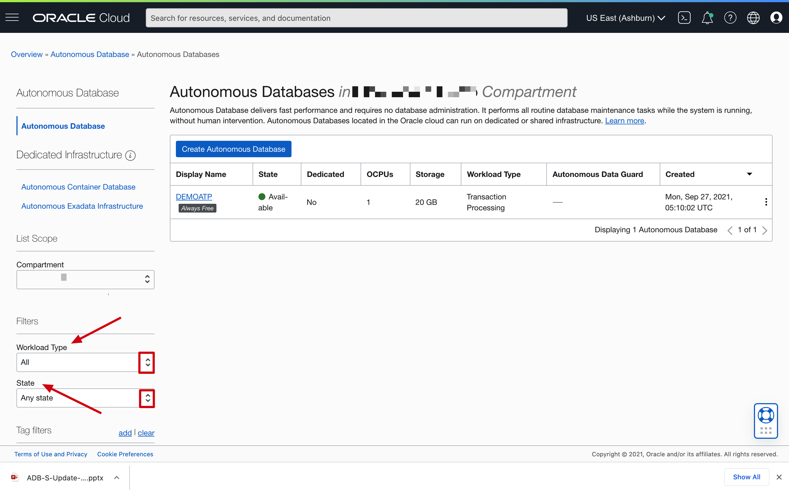
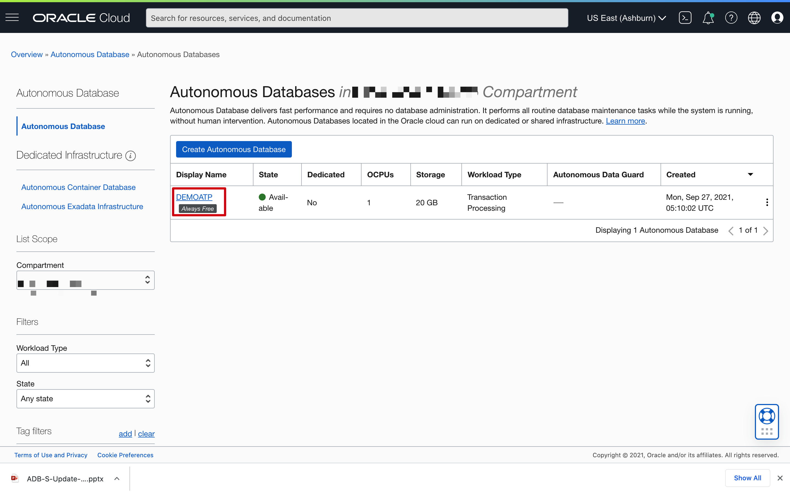
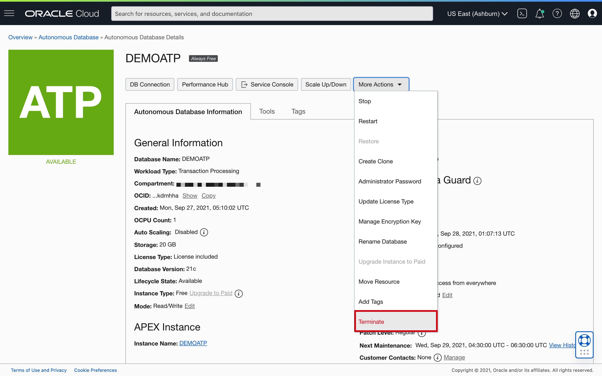
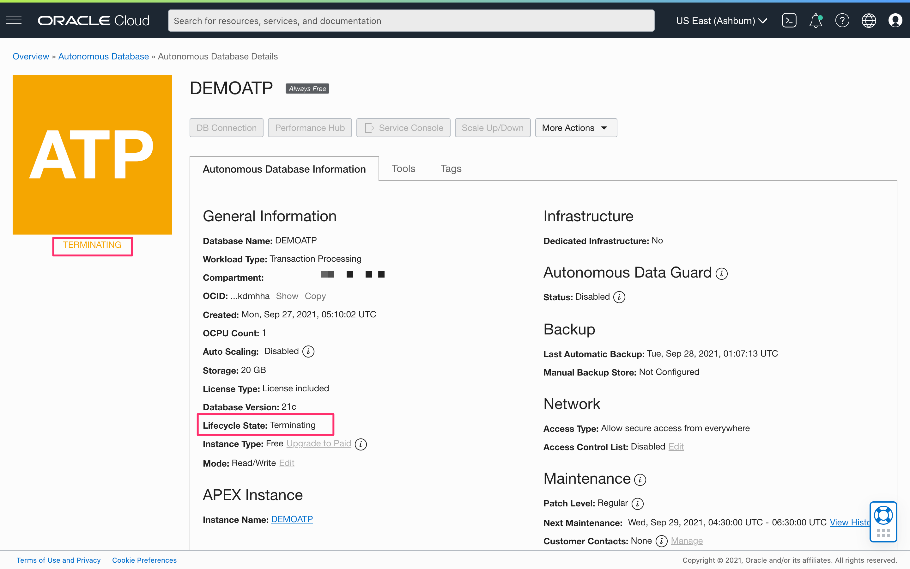

# Terminate Autonomous Database Instance

## Introduction

You can permanently delete (terminate) instances that you no longer need. Terminating an Autonomous Database permanently deletes the database data. However, automatic backups are not deleted if you have chosen Recovery Appliance or NFS as a backup destination. You can delete automatic backups directly from the Recovery Appliance or NFS.

This lab walks you through the steps to terminate an available or stopped Autonomous Database instance. For the purpose of this lab, an always free demo Autonomous Transaction Processing database instance named DEMOATP is provisioned in a compartment.

Estimated Time - 5 minutes

### Objectives

- Terminate an available or stopped Autonomous Database instance.

### Prerequisites

- Should have an Autonomous Database instance provisioned with Lifecycle Status - Available or Stopped.
- To provision an Autonomous Database, there are detailed instructions in Lab 1 of [Autonomous Database Quick Start](https://apexapps.oracle.com/pls/apex/dbpm/r/livelabs/view-workshop?wid=582) workshop.

## Task 1: Terminate a provisioned Autonomous Database Instance

1. If you are using a Free Trial or Always Free account, in the Oracle Cloud console, you need to be in the region where your Autonomous Database resources is provisioned. You can see your current default **Region** in the top right-hand corner of the page. To change the default region, click on the **Region** drop-down and choose the region where your Autonomous Database resources is provisioned.

    

2. Click on navigation menu, search Oracle Database and choose Autonomous Transaction Processing (ATP).

    **Note:** You can also directly access your Autonomous Transaction Processing service in the **Quick Actions** section of the dashboard.

    

3. From the compartment drop-down menu select the **Compartment** where your Autonomous Database resources is provisioned. If there were a long list of databases, you could filter the list by the **State** of the databases (Available, Stopped, Terminated, etc). You can also sort by **Workload Type**. In this demo, the **Transaction Processing** workload type is selected.

    
    

4. From the databases displayed, click **Display Name** of the database you wish to terminate.

    In this lab, we are terminating the available **DEMOATP** Autonomous Transaction Processing database instance. Click **DEMOATP**.

    

5. Click **More Actions**.

    

6. From the more actions drop-down, scroll down and click **Terminate**.

    

7. Confirm that you wish to terminate your Autonomous Database in the confirmation dialog. Type the database name in the input field and click **Terminate Autonomous Database**.

    In this lab, type **DEMOATP** and click **Terminate Autonomous Database**.

    

8.  Your instance will begin to terminate, the Lifecycle State will turn from Available to Terminating.

    

9. After a few minutes, once the instance is terminated, the Lifecycle state will change from Terminating to Terminated.

    

    You have successfully terminated an Autonomous Database instance.

## Learn More

* Click [here](https://docs.oracle.com/en-us/iaas/exadata/doc/eccmanagingadbs.html#GUID-A00BC3BB-3AE6-4FBF-AEAF-2D9C14CD1D9A) to know more about Managing Autonomous Databases.

## Acknowledgements

* **Author** - Anoosha Pilli, Oracle Database Product Management, Product Manager
* **Last Updated By/Date** - Anoosha Pilli, September, 2021
