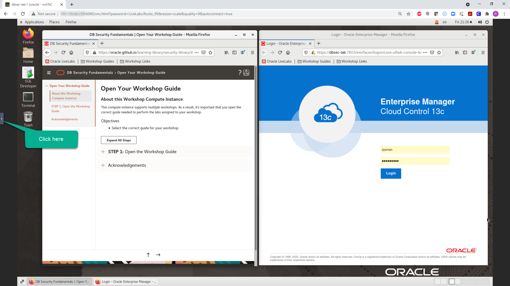
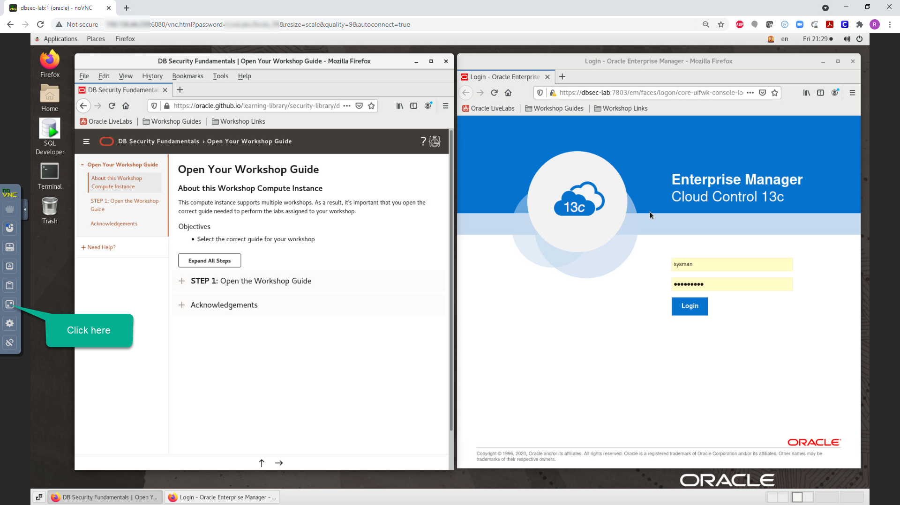
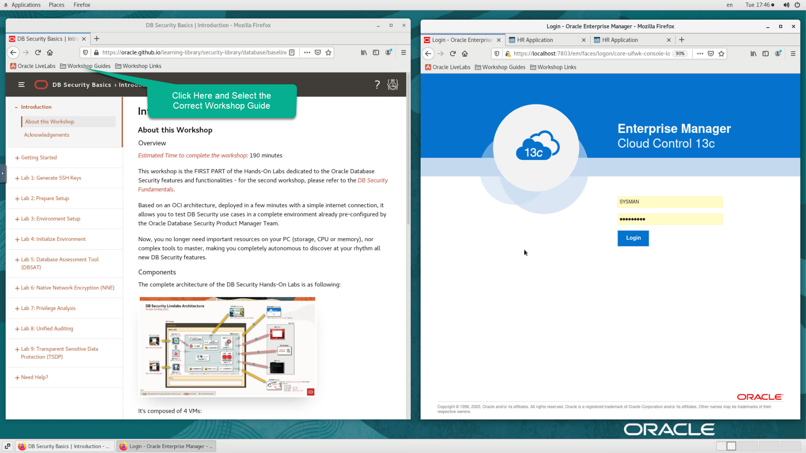

# Verify Compute Instance Setup

## Introduction
This lab will show you how to login to your pre-created compute instance running on Oracle Cloud.

*Estimated Lab Time*: 10 minutes

### Objectives
In this lab, you will:
- Gather details needed to connect to your instance (Public IP Address)
- Learn how to connect to your compute instance using Remote Desktop or SSH protocol

### Prerequisites

This lab assumes you have:
- A LiveLabs Cloud account and assigned compartment
- The IP address and instance name for your Compute instance
- Successfully logged into your LiveLabs account
- A Valid SSH Key ( for *SSH Terminal Connections only*)

## **STEP 1:** Access the Graphical Remote Desktop
For ease of execution of this workshop, your VM instance has been pre-configured with a remote graphical desktop accessible using any modern browser on your laptop or workstation. Proceed as detailed below to login.

1. Launch your browser to the following URL if no remote desktop URL is provided under **Workshop Details**

    ```
    <copy>http://[your instance public-ip address]/vnc.html?password=[password]&resize=remote&autoconnect=true</copy>
    ```

2. Update the URL with the IP address and password provided under **Workshop Details** from the prior step. Use *LiveLabs.Rocks_99* for password if none is listed

    
    e.g.

    ```
    <copy>http://111.111.111.111/vnc.html?password=LiveLabs.Rocks_99&resize=remote&autoconnect=true</copy>
    ```

    *Note:* Above URL uses a dummy IP address and is for illustration only. Provide the correct IP address.

## **STEP 2:** Enable Full-screen Display
For seamless desktop integration and to make the best use of your display, perform the following tasks to render your remote desktop session in fullscreen mode.

1. Click on the small gray tab on the middle-left side of your screen to open the control bar.

    

2. Select *Fullscreen* to render the session on your entire screen.

    
    

## **STEP 3:** Enable Copy/Paste from Local to Remote Desktop
During the execution of your labs you may need to copy text from your local PC/Mac to the remote desktop, such as commands from the lab guide. While such direct copy/paste isn't supported as you will realize, you may proceed as indicated below to enable an alternative local-to-remote clipboard with Input Text Field.

1. Continuing from the last task above, Select the *clipboard* icon

    

2. Copy some text from your local computer as illustrated below and paste into the clipboard widget, then finally open up the desired application (e.g. Terminal) and paste accordingly using *mouse controls*

    

    *Note:* Please make sure you initialize your clipboard with step [1] shown in the screenshot above before opening the target application in which you intend to paste the text. Otherwise will find the *paste* function in the context menu grayed out when attempting to paste for the first time.

## **STEP 4:** Open Your Workshop Guide

1. If the two *Firefox* browser windows are not already open, click on the icon from the remote desktop. This will launch two windows.

    

2. On the left windows is a workshop guide that may or may not be the correct guide as many VM images are shared by multiple workshops. To ensure that the guide displayed is the correct one, click on *Workshop Guides* from the browser toolbar bookmarks area and select the appropriate guide for your workshop.

    

## **STEP 5:** Login to Host using SSH Key Based Authentication (Optional) - Choose a path

Access by SSH terminal is optional and if needed, choose a path from the following 3 methods. If you are doing a LiveLab that can be done within a terminal completely, we recommend you choose Oracle Cloud Shell (Step 5A).

Your options are:
1. Step 5A: Connect using Cloud Shell *(recommended)*
2. Step 5B: Connect using MAC or a Windows CYGWIN Emulator
3. Step 5C: Connect using Putty *(Requires you to install applications on your machine)*

## **STEP 5A:** Upload Key to Cloud Shell and Connect

1.  Go to ***Compute >> Instances*** and select the instance you created (make sure you choose the correct compartment).

2.  To start the Oracle Cloud Shell, go to your Cloud console and click the Cloud Shell icon at the top right of the page.

	

    

    

3.  Click on the Cloud Shell hamburger icon and select **Upload** to upload your private key. Note the private key does not have a `.pub` extension.

    

4.  To connect to the compute instance that was created for you, you will need to load your private key.  This is the half of the key pair that does *not* have a `.pub` extension.  Locate that file on your machine and click **Upload** to process it.

    

5. Be patient while the key file uploads to your Cloud Shell directory.
    

    


6. Once finished run the command below to check to see if your ssh key was uploaded.  Move it into your .ssh directory and change the permissions.

    ```nohighlight
    <copy>
    ls
    </copy>
    ```
    ```nohighlight
    mkdir ~/.ssh
    mv <<keyname>> ~/.ssh
    chmod 600 ~/.ssh/<privatekeyname>
    ls ~/.ssh
    ```

    

7.  Secure Shell into the compute instance using your uploaded key name (the private key).

    ```
    ssh -i ~/.ssh/<sshkeyname> opc@<Your Compute Instance Public IP Address>
    ```
    

If you are unable to ssh in, check out the troubleshooting tips below.

You may now [proceed to the next lab](#next).

## **STEP 5B:** Connect via MAC or Windows CYGWIN Emulator
Depending on your workshop, you may need to connect to the instance via a secure shell client (SSH). If you're instructed in the next lab(s) to execute tasks via an SSH terminal, review the options below and select the one that best meet your needs.

1.  Go to ***Compute >> Instances*** and select the instance you created (make sure you choose the correct compartment)
2.  On the instance homepage, find the Public IP address for your instance.
3.  Open up a terminal (MAC) or cygwin emulator as the opc user.  Enter yes when prompted.

    ```
    ssh -i ~/.ssh/<sshkeyname> opc@<Your Compute Instance Public IP Address>
    ```
    

You may now [proceed to the next lab](#next).

## **STEP 5C:** Connect via Windows using Putty
On Windows, you can use PuTTY as an SSH client. PuTTY enables Windows users to connect to remote systems over the internet using SSH and Telnet. SSH is supported in PuTTY, provides for a secure shell, and encrypts information before it's transferred.

1.  Download and install PuTTY. [http://www.putty.org](http://www.putty.org)
2.  Run the PuTTY program. On your computer, go to **All Programs > PuTTY > PuTTY**
3.  Select or enter the following information:
    - Category: _Session_
    - IP address: _Your service instance’s public IP address_
    - Port: _22_
    - Connection type: _SSH_

    

### **Configuring Automatic Login**

1.  In the category section, **Click** Connection and then **Select** Data.

2.  Enter your auto-login username. Enter **opc**.

    

### **Adding Your Private Key**

1.  In the category section, **Click** Auth.
2.  **Click** browse and find the private key file that matches your VM’s public key. This private key should have a .ppk extension for PuTTy to work.  
3.  If you do not have a .ppk extension see the [Appendix](#Appendix:TroubleshootingTips) for instructions for converting your private key to .ppk format using PuttyGen.

    

### **To save all your settings:**

1.  In the category section, **Click** session.
2.  In the saved sessions section, name your session, for example ( EM13C-ABC ) and **Click** Save.

You may now [proceed to the next lab](#next).

## Appendix: Troubleshooting Tips

If you encountered any issues during the lab, follow the steps below to resolve them.  If you are unable to resolve, please skip to the **Need Help** section to submit your issue via our  support forum.

### Issue 1: Can't login to instance
Participant is unable to login to instance

#### Tips for fixing Issue #1
There may be several reasons why you can't login to the instance.  Here are some common ones we've seen from workshop participants
- Permissions are too open for the private key - be sure to chmod the file using `chmod 600 ~/.ssh/<yourprivatekeyname>`
- Incorrectly formatted ssh key (see above for fix)
- User chose to login from MAC Terminal, Putty, etc and the instance is being blocked by company VPN (shut down VPNs and try to access or use Cloud Shell)
- Incorrect name supplied for ssh key (Do not use sshkeyname, use the key name you provided)
- @ placed before opc user (Remove @ sign and login using the format above)
- Make sure you are the oracle user (type the command *whoami* to check, if not type *sudo su - oracle* to switch to the oracle user)
- Make sure the instance is running (type the command *ps -ef | grep oracle* to see if the oracle processes are running)

### Issue 2: Need a ppk key
Participant is running PuTTY on Windows and needs a private SSH key in *ppk* format

#### Tips for fixing Issue #2
If you want to use Putty to connect to your server, you must convert your SSH key into a format compatible with Putty. To convert your key into the required .ppk format, you can use PuTTYgen.

[Download PuTTYgen](https://www.google.com/url?sa=t&rct=j&q=&esrc=s&source=web&cd=&cad=rja&uact=8&ved=2ahUKEwigtZLx47DwAhUYKFkFHf99BmAQFjAAegQIAxAD&url=https%3A%2F%2Fwww.puttygen.com%2F&usg=AOvVaw1fagG6hM51oZWfQB_rqn2t)

To use PuTTYgen to convert a key into .ppk format, complete the following steps:

1. Open PuTTYgen, go to **Conversions**, and then click **Import key**. PuTTYgen will display a window to load your key.
2. Browse to your **SSH private key**, select the file, and then click **Open**. Your SSH private key may be in the Users\[user_name]\.ssh directory.
3. Enter the passphrase associated with the private key, or leave blank if none and then click **OK**. *Note the key fingerprint confirms the number of bits is 4096.*
4. Go to **File**, and then click **Save private key** to save the key in .ppk format.

## Acknowledgements
* **Author** - Rene Fontcha, LiveLabs Platform Lead, NA Technology
* **Contributors** - Kay Malcolm, Tom McGinn
* **Last Updated By/Date** - Rene Fontcha, LiveLabs Platform Lead, NA Technology, June 2021
