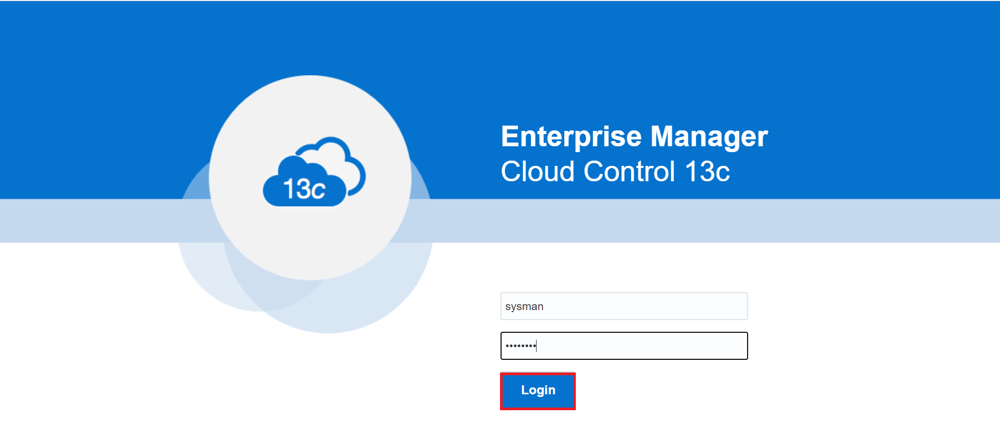
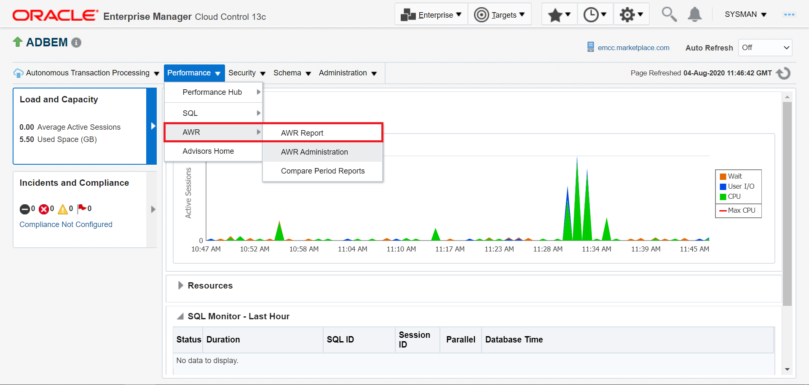
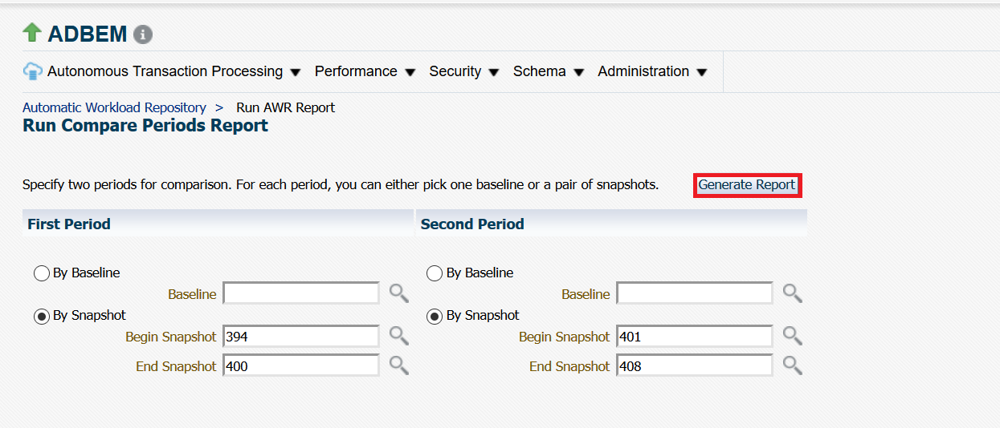
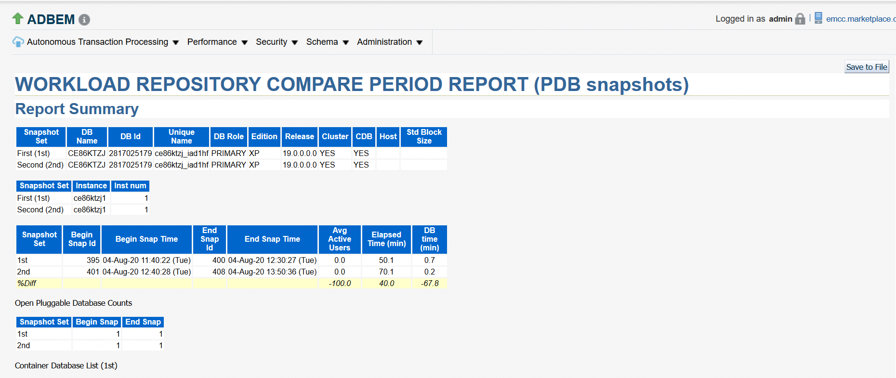

# AWR Management of Autonomous Transaction Processing Dedicated database using Oracle Enterprise Manager

## Introduction
Use Automatic Workload Repository (AWR) and automate database statistics gathering by collecting, processing, and maintaining performance statistics for database problem detection and self-tuning purposes.

*In this lab we will see the capabilities of Oracle Enterprise Manager in generating AWR reports.*

### Objectives

As a Database Administrator,

1. Learn how to generate AWR report of your ATP Dedicated Database using Oracle Enterprise Manager
2. Learn how to change retention period of AWR report generated for your ATP Dedicated Database using Oracle Enterprise Manager
3. Compare the two AWR reports of ATP Dedicated database taken at different intervals, using OEM.
   

### Required Artifacts

   - An Oracle Cloud Infrastructure account.
   - A pre-provisioned dedicated autonomous database instance. Refer to [Lab 7](?lab=lab-7-provisioning-databases).
   - Successful connection of ATP dedicated database from OEM.

## Task 1: Generate AWR report for ATP dedicated database from OEM.

- Login to your OEM from your browser as sysman user.
    

- Click on "Targets" and select "All Targets"
    

- Click on Autonomous Transaction Processing and select "ADBEM" (name of your ATP database)
    
    
	
- Click on "Performance" select "AWR" and then click on "AWR Report"
    
  
- Select the "Begin Snapshot" and "End Snapshot" and Click on "Generate Report".
     
     
	
## STEP2: Change the AWR retention period of the report generated

- On the OEM home page click on "Performance" select "AWR" and then click on "AWR Administration"
    

- Click on "Edit"
    

- Change the "Retention Period"
    
	
- Click "OK"
    
    

## STEP3: Compare two AWR reports of different period

- Click on "Performance" select "AWR" and then click on "Compare Period Reports".
    

- Select the "Begin Snapshot" and "End Snapshot" for "First Period" and "Second Period"
    

- Click on "Generate Report"
    
    
## Acknowledgements

*Congratulations! You have successfully completed AWR report analysis using Oracle Enterprise Manager .*

- **Authors** - Navya M S & Padma Priya Natarajan

