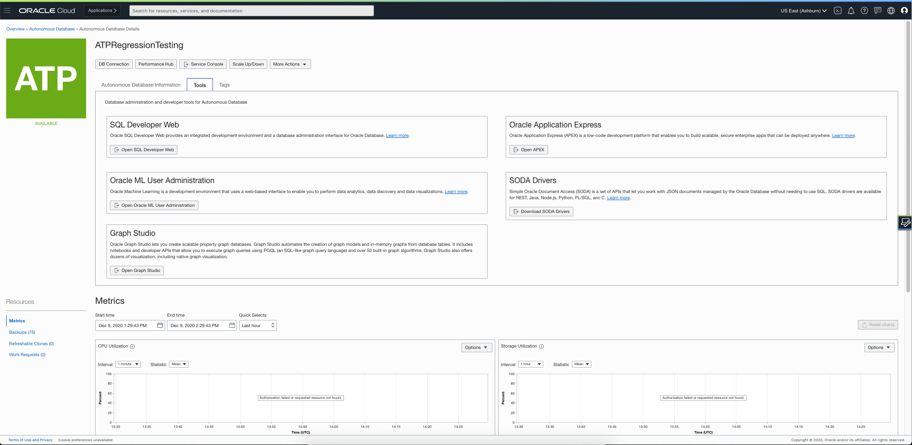
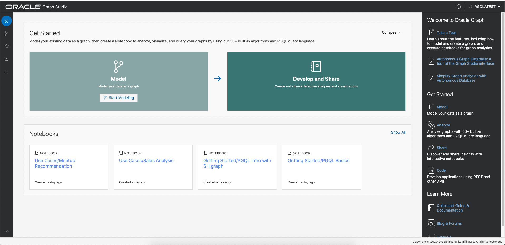
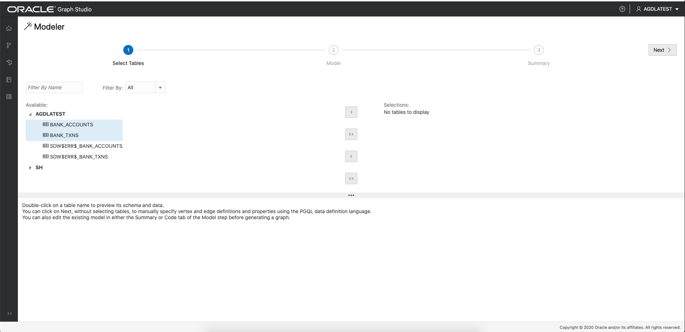
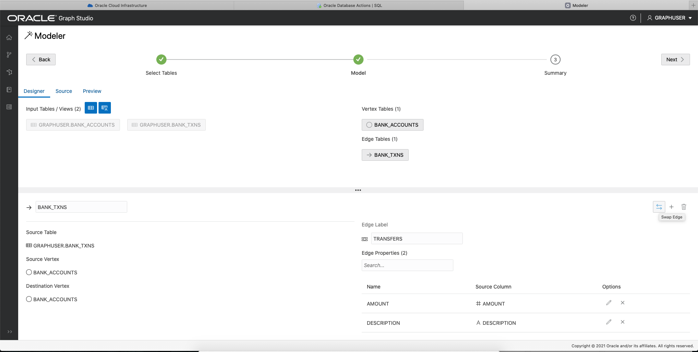
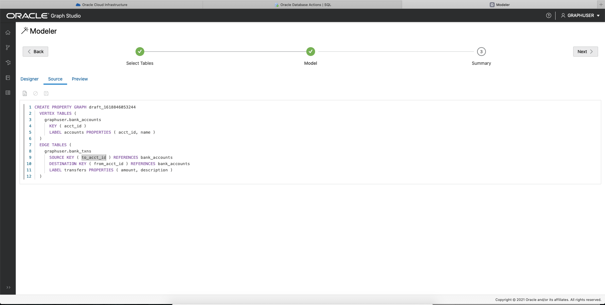

# Graph Studio: Create a graph using PGQL CREATE PROPERTY GRAPH statement

## Introduction

In this lab you will create a graph from the `bank_accounts` and `bank_txns` tables using Graph Studio and the CREATE PROPERTY GRAPH statement.

The following video shows the steps you will execute in this lab.

[](youtube:5g9i9HA_cn0) Graph Studio: Create a graph.

Estimated Lab Time: 15 minutes. 

### Objectives

Learn how to
- use Graph Studio and PGQL DDL (i.e. CREATE PROPERTY GRAPH statement) to model and create a graph from existing tables or views.

### Prerequisites

- The following lab requires an Autonomous Database - Shared Infrastructure account. 
- And that the Graph-enabled user has been created. That is, a database user with the correct roles and privileges exists.

## **STEP 1**: Connect to your Autonomous Database using Graph Studio

1. If you have the Graph Studio URL then proceed to step 4. 

    Log in to the OCI Console, choose the Autonomous Database instance, then click on the Tools tab on the details page menu on the left. 

   


2. Click on the Graph Studio card to open in a new page or tab in your browser.   
   
   If your tenancy administrator provided you the Graph Studio URL to connect directly then use that instead.


3. Enter your Autonomous Database account credentials (`GRAPHUSER`/`gs_LLwid770#`) into the login screen:

    

4. Then click the "Sign In" button. You should see the studio home page.   

     

## **STEP 2**: Create a graph of accounts and transactions from the corresponding tables

1. Click on the Models icon to naviagte to the start of the modeling workflow. Then select the `BANK_ACCOUNTS` and `BANK_TXNS` tables.   


2. Move them to the right, i.e. click the first icon on the shuttle control.   

   

3.  Click next to get a suggested model. We will edit and update this model.  

    The suggested model has BANK_ACCOUNTS as a vertex and BANK_TXNS as an edge.   

      

  We wish to update the default vertex and edge labels and then confirm that the edge has the right direction from source `from_acct_id` to destination `to_acct_id`. 

4.  Click the Source tab to bring up the existing statement and the edit dialog.  
    
    If the generated Create Property Graph statement looks the same as the one in the screenshot below then proceed to creating the graph.  

     

  Otherwise replace the existing statement with the following one which specifies that `BANK_ACCOUNTS` is a vertex table with label `ACCOUNTS` and `BANK_TXNS` is an edge table with label `TRANSFERS`. And the directed edge is from the source `from_acct_id` to destination `to_acct_id`.  
    ```
    <copy>
    CREATE PROPERTY GRAPH bank_graph
        VERTEX TABLES (
            BANK_ACCOUNTS as ACCOUNTS 
            KEY (ACCT_ID) 
            LABEL ACCOUNTS
            PROPERTIES (ACCT_ID, NAME)
        )
        EDGE TABLES (
            BANK_TXNS 
            KEY (FROM_ACCT_ID, TO_ACCT_ID, AMOUNT)
            SOURCE KEY (FROM_ACCT_ID) REFERENCES ACCOUNTS
            DESTINATION KEY (TO_ACCT_ID) REFERENCES ACCOUNTS
            LABEL TRANSFERS
            PROPERTIES (FROM_ACCT_ID, TO_ACCT_ID, DESCRIPTION, AMOUNT)
        )
    </copy>
    ```

5. Click the Save (floppy disk icon) to commit the changes. Then click the Designer tab to confirm that the model now has a vertex table and en edge table.  
    

6. Click `Create Graph` to move on to the next step in the flow.   

   Enter the prompted details. That is, supply a graph name (e.g. `bank_graph`), a model name (e.g. `bank_graph_model`), and other optional information.  
   

7. Graph Studio modeler will now save the metadata and start a job to create the graph.  
   The Jobs page shows the status of this job. 

     

   Once the graph has been created and loaded into memory, if you enabled that radio button, you can then query and visualize it in a notebook.


Please **proceed to the next lab** to do so.

## Acknowledgements
* **Author** - Jayant Sharma, Product Management
* **Contributors** -  Jayant Sharma, Product Management
* **Last Updated By/Date** - Jayant Sharma, April 2021
  
