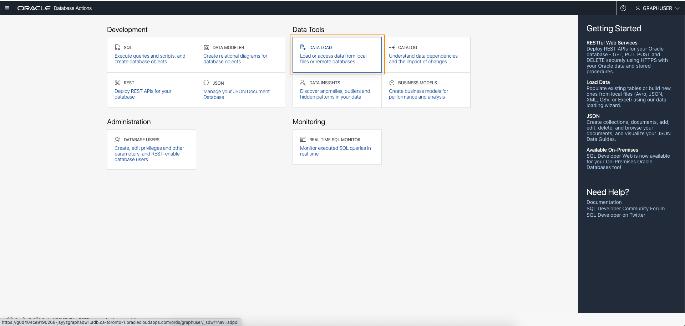
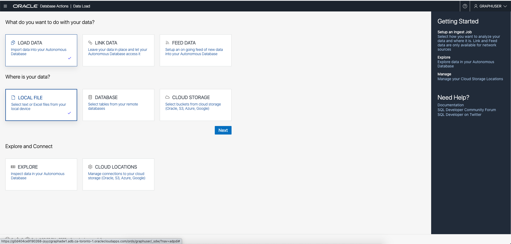
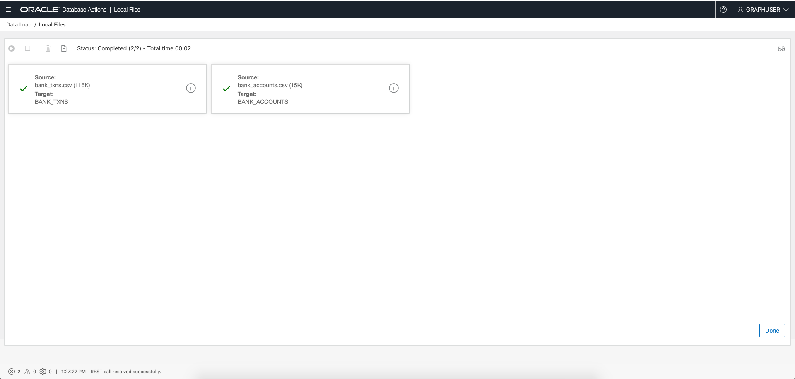
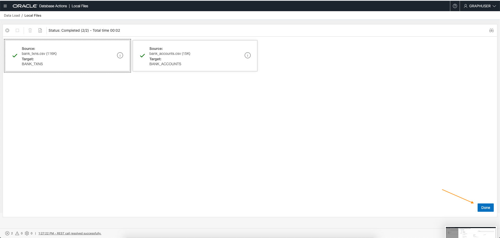
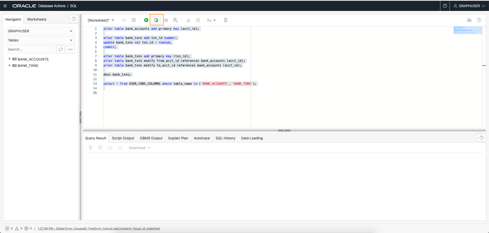
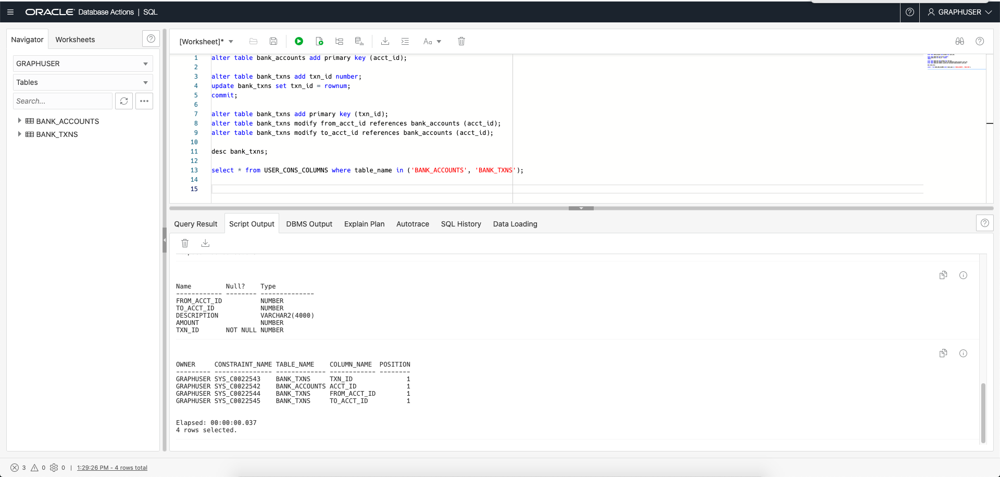

# Graph Studio: Load data from CSV files into tables

## Introduction

In this lab you will load two CSV files into corresponding tables using the Database Actions SQL (aka SQLDeveloperWeb) interface of your 
Autonomous Data Warehouse - Shared Infrastructure (ADW) or Autonomous Transaction Processing - Shared Infrastructure (ATP) instance.

The following video shows the steps you will execute in this lab.

[](youtube:F_3xe18kWoo) Graph Studio: Load CSV Files.


Estimated Lab Time: 10 minutes. 

### Objectives

Learn how to
- load CSV files into an Autonomous Database using Database Actions.


### Prerequisites

- The following lab requires an Autonomous Database - Shared Infrastructure account. 
- It assumes that a Graph and Web-Access enabled user has been created. That is, a database user with the correct roles and privileges exists and that user can log into Database Actions.


## **STEP 1**: Connect to the Database Actions for your Autonomous Database instance

1. Open the service detail page for your Autonomous Database instance in the OCI console.  

     

2. Click on the Tools tab and then the Database Actions link to open it.
   

## **STEP 2**: Login as the graph-enabled user

1. Login as the graph user (e.g. `GRAPHUSER`) for your Autonomous Database instance. 
   
      

    **Note:** If necessary, do the following to create the user with the right roles and privileges:
    - Log in to Database Actions as the ADMIN user for your Autonomous Database.
    - Select Administration and then Database Users from the navigation menu
    - Click on Create User
    - Turn on the Web-Access and Graph buttons

## **STEP 3**: Download the sample datasets from the ObjectStore

1. Copy and paste the url in your browser for the zip archive, i.e.  

    ```
    https://objectstorage.us-ashburn-1.oraclecloud.com/p/HRJM7Q18cpSP2T5whvDSrpGrlb45qK9BnKFpqeT_mcT_GcxzftAPXY66Gxht0Ad_/n/c4u03/b/data-management-library-files/o/random-acct-txn-data.zip
    ```

   Or use `wget` or `curl` to download the sample data to you computer.   
   A sample `curl` request is:
    ```
    curl -G -o acct-txn-data.zip https://objectstorage.us-ashburn-1.oraclecloud.com/p/HRJM7Q18cpSP2T5whvDSrpGrlb45qK9BnKFpqeT_mcT_GcxzftAPXY66Gxht0Ad_/n/c4u03/b/data-management-library-files/o/random-acct-txn-data.zip
    ```

2. **Unzip** the archive into a local directory such as ~/downloads.

## **STEP 4**: Upload using Database Actions Data Load

1. Click on the Data Load card. 
   
   
   
   Then specifcy the location of your data. That is, make sure the Load Data and the Local File cards are checked. Click `Next`.

   

2. Click on `Select Files`.
   
       

    Navigate to the correct folder (e.g. ~/downloads/random-acct-data) and select the bank_account.csv and the bank_txns.csv file.

    

3. Verify that the correct files were selected and then click `Run` icon.


4. Confirm that you wish the data laod job.

   

5. Once the files are loaded 
   
     

   Click `Done` to exit.

   

6. Now open the SQL Worksheet.
   

7. Navigate to the correct folder (e.g. ~/downloads) and select the `fixup.sql` file and drag and drop it into the SQL worksheet. 
   
     

   The contents of `fixup.sql` are:

   ```
   alter table bank_accounts add primary key (acct_id);
   
   alter table bank_txns add txn_id number;
   update bank_txns set txn_id = rownum;
   commit;
   
   alter table bank_txns add primary key (txn_id);
   alter table bank_txns modify from_acct_id references bank_accounts (acct_id);
   alter table bank_txns modify to_acct_id references bank_accounts (acct_id);

   desc bank_txns;
   
   select * from USER_CONS_COLUMNS where table_name in ('BANK_ACCOUNTS', 'BANK_TXNS');
   
   ```

   It does the following:
   - Adds a primary key constraint to the `bank_accounts` table.
   - Adds a column (`txn_id`) to the `bank_txns` table.
   - Sets a value for the `txn_id` and commits the transaction.
   - Adds a primary key constraint to the `bank_txns` table.
   - Adds a foreign key constraint to the `bank_txns` table specifying that `from_acct_id` references `bank_accounts.acct_id`.
   - Adds a second foreign key constraint to the `bank_txns` table specifying that `to_acct_id` references `bank_accounts_acct_id`.  
   - Helps you verify that the `txn_id` column was added and the cosntraints defined.


8. Execute the `fixup.sql` script in the SQL worksheet.  
     
   
9. The script output should look as as follows:
   
   
  

Please *proceed to the next lab* to create a graph from these tables.

## Acknowledgements
* **Author** - Jayant Sharma, Product Management
* **Contributors** -  Jayant Sharma, Product Management
* **Last Updated By/Date** - Jayant Sharma, May 2021
* **Lab Expiry Date** - May 31, 2022
  
