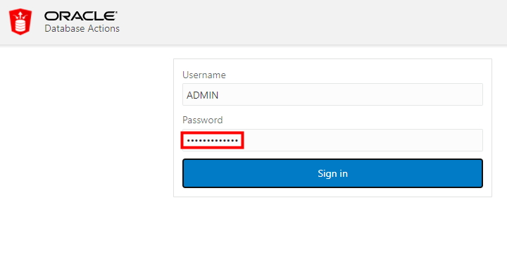
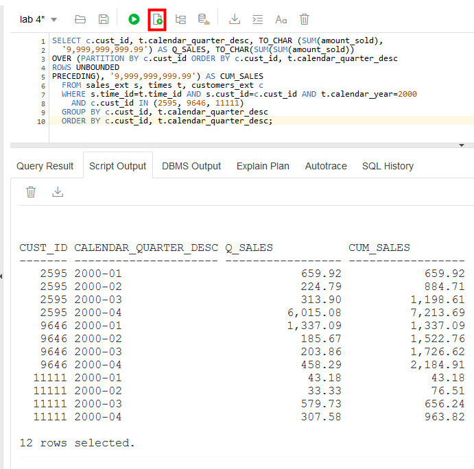

# Query data in external files

## Introduction

In this lab, you will query files on the Oracle Cloud Infrastructure (OCI) Object Storage directly without loading them to your database.

Estimated Time: 10 minutes

### Objectives

-   Learn how to create external tables on top of files residing on the object store
-   Learn how to query external data by the external tables

### Prerequisites

- This lab requires completion of the Load Data lab in the Contents menu on the left.

## Task 1: Create external tables with DBMS_CLOUD

1.  If you are not already logged in to Oracle Cloud Console, log in and select Autonomous Data Warehouse from the navigation menu and navigate into your ADW Finance Mart instance.

    

    

2.  If you are not already logged in to SQL Worksheet, in your ADW Finance Mart Database Details page, click the **Tools** tab and then click **Open Database Actions**.

    

3.  A sign-in page opens for Database Actions. For this lab, simply use your database instance's default administrator account, **Username - ADMIN** and click **Next**.

    

4.  Enter the ADMIN **Password** you specified when creating the database and click **Sign in**.

    

5.  The Database Actions page opens. In the **Development** box, click **SQL**.

    

6.  The SQL Worksheet appears. Before you proceed with the SQL Worksheet, perform the next two steps.

7.  Download <a href="./files/create_external_tables_without_base_url_v2.txt" target="\_blank">this code snippet</a> to a text editor.

8.  Replace `<bucket URI>` in the code with the base URL you copied in Loading Data Lab, Task 6.

    This code uses the **create\_external\_table** procedure of the **DBMS\_CLOUD** package to create external tables on the files staged in your object store. Note that you are still using the same credential and URLs of files on OCI Object Storage you used when loading data in Loading Data Lab.

9.  Run the script in SQL Worksheet. In the Substitutions Variables dialog, paste the base URL you copied in Loading Data Lab, Task 6, and click **OK**.

    

    Now you have **external tables** for the sample data pointing to files in the object store. Any query on the external tables will return the same result as on the original tables.

## Task 2: Query external data

1.  Copy and paste <a href="./files/query_external_data.txt" target="\_blank">this code snippet</a> to a SQL Worksheet. Compared to the query in the previous lab, we only replaced the original table names **table\_name** with **table\_name\_ext** in the sample query.

2.  Run the script. You will now see the same query result as in the previous lab, but from data pulled directly from the Object Store.

    

You may now [proceed to the next lab](#next).

## Want to learn more?

For more information about querying external data, see the documentation [Querying External Data with Autonomous Data Warehouse](https://docs.oracle.com/en/cloud/paas/autonomous-data-warehouse-cloud/user/query-external.html#GUID-ABF95242-3E04-42FF-9361-52707D14E833).

## **Acknowledgements**

- **Author** - Nilay Panchal, Oracle Autonomous Database Product Management
- **Adapted for Cloud by** - Richard Green, Principal Developer, Database User Assistance
- **Last Updated By/Date** - Richard Green, September 2021
