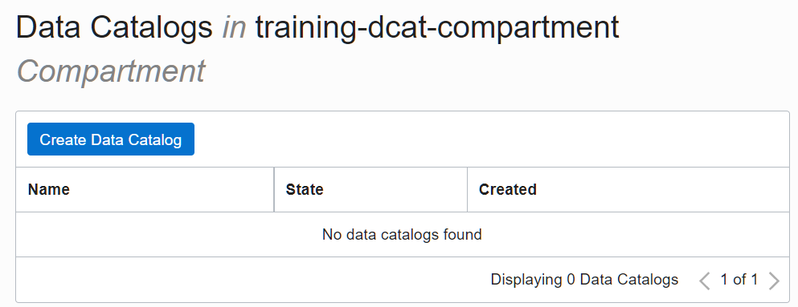
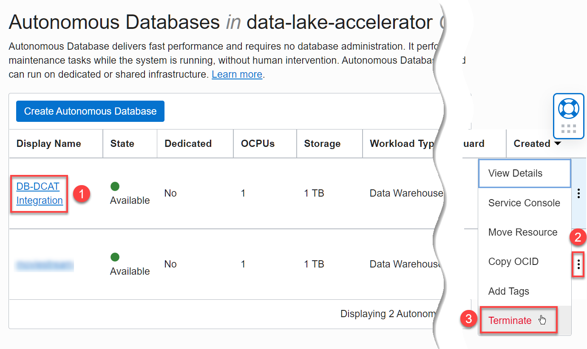
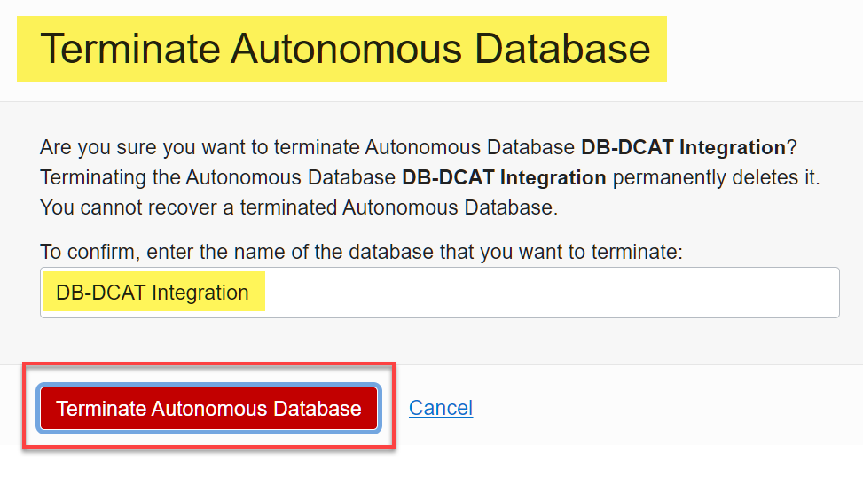
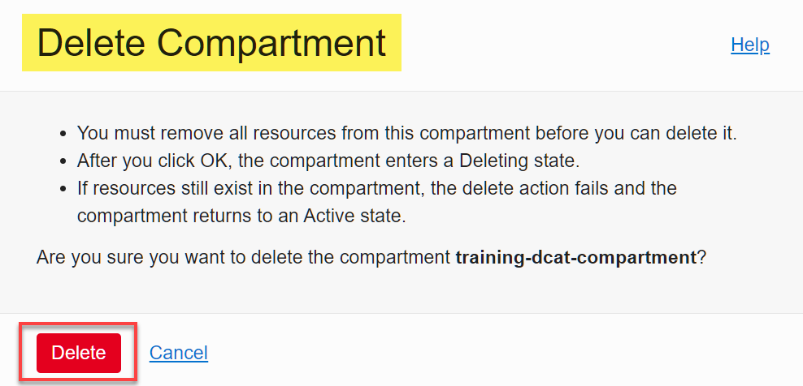

# Clean up Resources Used in this Workshop (Optional)

## Introduction

In this lab, you will learn how to delete some or all of the resources that you created in this workshop that you don't need. If you want to re-run all the labs in this workshop again from the beginning, you can delete the entire compartment.

**Note:**    
If you are using a **Free Trial** account to run this workshop, Oracle recommends that you at delete the Data Catalog instance that you created when you successfully complete this workshop, to avoid unnecessary charges. This deletes the Data Catalog instance and all of the resources in this instance.

Estimated Time: 10 minutes

### Objectives

* Delete the Data Catalog instance. This also deletes all of the resources in this instance.
* Delete the Autonomous Database instance.
* Delete any resources that you created in your **`training-dcat-compartment`** as part of this workshop.
* Delete the entire **`training-dcat-compartment`** compartment.

###Prerequisites  
This lab assumes that you have successfully completed all of the preceding labs in the **Contents** menu.

**Note:**     
If you want to list the resources in your **`training-dcat-compartment`**, you can use the **Tenancy Explorer** page. From the **Navigation** menu, navigate to **Governance & Administration**. In the  **Governance** section, click **Tenancy Explorer**. On the **Tenancy Explorer** page, in the **Search compartments** field, type **`training`**, and then select **`training-dcat-compartment`** from the list of compartments. The resources in this compartment are displayed.

## Task 1: Delete Your Data Catalog Instance

You can terminate your Data Catalog instance that you created in this workshop as follows:

1. Open the **Navigation** menu and click **Analytics & AI**. Under **Data Lake**, click **Data Catalog**. On the **Data Catalog Overview** page, click **Go to Data Catalogs**.

2. On the **Data Catalogs** page, in the row for the **`training-dcat-instance`** Data Catalog instance, click the **Actions** icon (three dots), and then select **Terminate** from the context menu.

   

3. A **Terminate** dialog box is displayed. Enter **delete** in the **TYPE "DELETE" TO CONFIRM DELETE** field, and then click **Terminate**. The Data Catalog instance goes into a **Deleting** state. When the delete is completed, the instance is no longer displayed, and all of the resources in the deleted instance are permanently deleted.

    >**Note:** You might need to refresh your browser to confirm the deletion of the Data Catalog instance.

   

## Task 2: Delete Your Autonomous Database Instance

You can terminate your ADW instance that you created in this workshop as follows:

1. Open the **Navigation** menu and click **Oracle Databases**. Click **Autonomous Database**.

2. On the **Autonomous Databases** page, in the **List Scope** section, select the **`training-dcat-compartment`** compartment from the **Compartment** drop-down list. In the row for the **`DB-DCAT-Integration`** Autonomous Database instance, click the **Actions** icon (three dots), and then select **Terminate** from the context menu.

   

3. A **Terminate** dialog box is displayed. Enter **DB-DCAT Integration** in the **To confirm, enter the name of the database that you want to terminate** field, and then click **Terminate Autonomous Database**.

    

    The **State** of the Autonomous Database instance goes into **Terminating**. When the ADB is deleted, the **State** changes to **Terminated**.

    

## Task 2: Delete Dynamic Group and Access Policies

1. Open the **Navigation** menu and click **Identity & Security**. Under **Identity**, click **Dynamic Groups**.

2. In the **Dynamic Groups** page, search for your **moviestream-dynamic-group** dynamic group. Click the **Actions** button associated with the dynamic group, and then select **Delete** from the context menu. A confirmation message box is displayed, click **Delete**.

3. In the **Dynamic Groups** page, click **Policies** in the **Identity** section on the left. The **Policies** page is displayed. In the **List Scope** section, search for and select your **training-dcat-compartment** from the **Compartment** drop-down list, if not already selected. Click the **Actions** button associated with the **moviestream-object-storage-policy**, and then select **Delete** from the context menu.  A confirmation message box is displayed, click **Delete**.

## Task 3: Delete Your Compartment

To delete a compartment, it must be empty of all resources. Before you initiate deleting a compartment, be sure that all its resources have been moved, deleted, or terminated, including any policies attached to the compartment. In this workshop, you created all of the resources in the **`training-dcat-compartment`**; therefore, if you want to re-run this entire workshop from the beginning, you can must delete all of the resources in the compartment as described in the earlier steps of this lab. Next, you can delete the compartment. See [Managing Compartments](https://docs.oracle.com/en-us/iaas/Content/Identity/Tasks/managingcompartments.htm) in the Oracle Cloud Infrastructure documentation.

1. Click the **Navigation** menu and click **Identity & Security**. Under **Identity**, select **Compartments**. From the list of available compartments, search for your **`training-dcat-compartment`**.

2. On the **Compartments** page, in the row for the **`training-dcat-compartment`** compartment, click the **Actions** button, and then select **Delete** from the context menu.

3. A confirmation message box is displayed. Click **Delete**. The state of the deleted compartment changes from **Active** to **Deleting** until the compartment is successfully deleted. You can click on the compartment name link in the **Name** column to display the status of this operation.

    

This concludes the workshop.

## Want to Learn More?

* [Oracle Cloud Infrastructure Documentation](https://docs.cloud.oracle.com/en-us/iaas/Content/GSG/Concepts/baremetalintro.htm)
* [Overview of Oracle Cloud Infrastructure Identity and Access Management](https://docs.cloud.oracle.com/en-us/iaas/Content/Identity/Concepts/overview.htm)

## Acknowledgements

* **Author:** Lauran Serhal, Principal User Assistance Developer, Oracle Database and Big Data
* **Last Updated By/Date:** Lauran Serhal, October 2021
