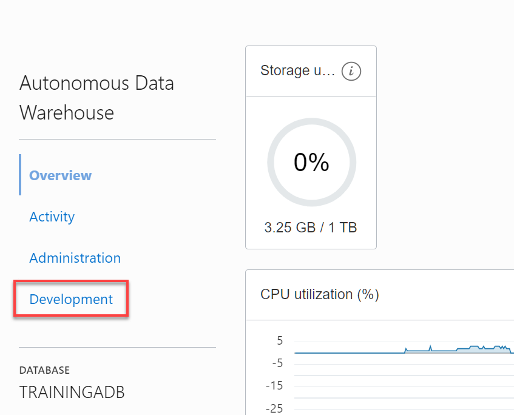
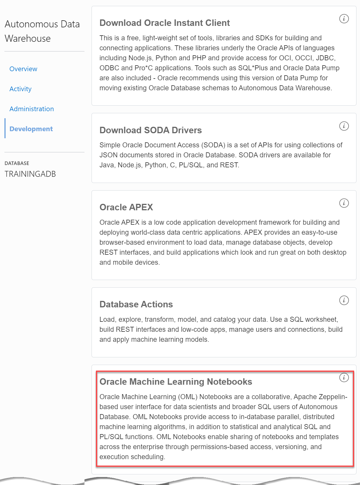
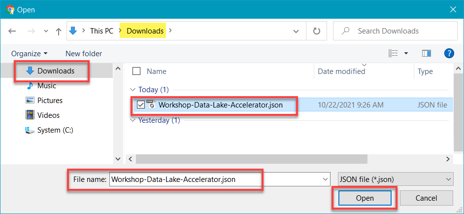

# Query Data Across ADB and the Data Lake Using OML

## Introduction

In this lab, you will use the Oracle Machine Learning Notebooks (OML) to query joined data from both the Data Warehouse and the Data Lake; i.e. the data from the three Oracle Object Storage buckets that you setup in this workshop. See [OML Notebooks documentation](https://docs.oracle.com/en/database/oracle/machine-learning/oml-notebooks/index.html).

Estimated Time: 20 minutes

### Objectives

In this lab, you will:
- Access Oracle Machine Learning Notebooks provided with Oracle Autonomous Database
- Import and review the imported notebook

### Prerequisites

This lab assumes you have:
* An Oracle account
* Completed all previous labs successfully
* Import the required notebook

## Task 1: Access Oracle Machine Learning Notebooks

You can import, create, and work with notebooks in Oracle Machine Learning Notebooks. You can access Oracle Machine Learning Notebooks from Autonomous Database.

1. Log in to the **Oracle Cloud Console** as the Cloud Administrator. You will complete all the labs in this workshop using this Cloud Administrator.
See [Signing In to the Console](https://docs.cloud.oracle.com/en-us/iaas/Content/GSG/Tasks/signingin.htm) in the _Oracle Cloud Infrastructure_ documentation.

2. On the **Sign In** page, select your tenancy, enter your username and password, and then click **Sign In**. The **Oracle Cloud Console** Home page is displayed.

3. Open the **Navigation** menu and click **Oracle Database**. Under **Oracle Database**, click **Autonomous Database**.

4. On the **Autonomous Databases** page, make sure **`training-dcat-compartment`** is selected in the **Compartment** drop-down list in the **List Scope** section, and then click your **DB-DCAT Integration** ADB that you provisioned earlier.

5. On the **Autonomous Database Details** page, click **Service Console**. In the **Database Actions** card, click **Open Database Actions**.

   

6. On the **Service Console** page, click the **Development** on the left.

    

7. On the **Development** page, scroll-down to and click the **Oracle Machine Learning Notebooks** card.

    

8. On the **SIGN IN** page, enter **`moviestream`** in the **Username** field, your assigned password such as **`Training4ADB`** in the **Password** field, and then click **Sign In**.

   

   The **Oracle Machine Learning** Home page is displayed.

   


## Task 2: Import a Notebook

1. On the **Oracle Machine Learning** Home page, in the **Quick Actions** section, click the **Notebooks**. The **Notebooks** page is displayed.    

    

2. Click **Import**. The **Open** dialog box is displayed.

3. Copy following URL to the notebook and paste it in the **File name** field. Make sure that the **JSON file (*.json)** type is selected in the second drop-down field, and then click **Open**.

    ```
    <copy>
    https://objectstorage.us-phoenix-1.oraclecloud.com/p/asZnZNzK6aAz_cTEoRQ9I00x37oyGkhgrv24vd_SGap2joxi3FvuEHdZsux2itTj/n/adwc4pm/b/moviestream_scripts/o/Notebook-Data%20Lake%20Accelerator.json
    </copy>
    ```

    

    The imported notebook is displayed in the **Notebooks** page.

    


## Task 3: Review and Run the Imported Notebook    

1. Open the imported notebook. On the **Notebooks** page, click the **Data Lake Accelerator** notebook. The notebook is displayed in the list of available notebooks.

    

2. The first thing we need to do is to click on the gear icon on the top right, which will open the panel with the Interpreters, and on that panel make sure to select at least one of the interpreters that indicate **%sql (default), %script, %python**. You can move the interpreters to change their order and bring the one you prefer to the top. Ideally move the **MEDIUM** interpreter (the one with "_medium" in the name) to the top, or only select it by clicking on it (it becomes blue) and leave the others unclicked (they stay white).

    

    Click **Save** to save your selected options.

3. Run the entire notebook by clicking at the top of the screen, on the icon that looks like a **play button** next to the notebook name.

    

## Learn More

* [OML Notebooks documentation](https://docs.oracle.com/en/database/oracle/machine-learningoml-notebooks/index.html)
* [Oracle Cloud Infrastructure Documentation](https://docs.cloud.oracle.com/en-us/iaas/Content/GSG/Concepts/baremetalintro.htm)
* [Using Oracle Autonomous Database on Shared Exadata Infrastructure](https://docs.oracle.com/en/cloud/paas/autonomous-database/adbsa/index.html)


## Acknowledgements

* **Author:** Lauran Serhal, Principal User Assistance Developer, Oracle Database and Big Data
* **Contributor:** Marty Gubar, Product Manager, Server Technologies    
* **Last Updated By/Date:** Lauran Serhal, October 2021
