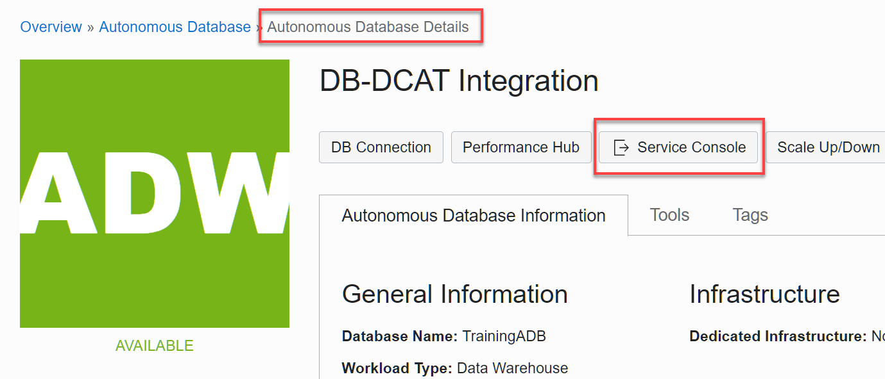
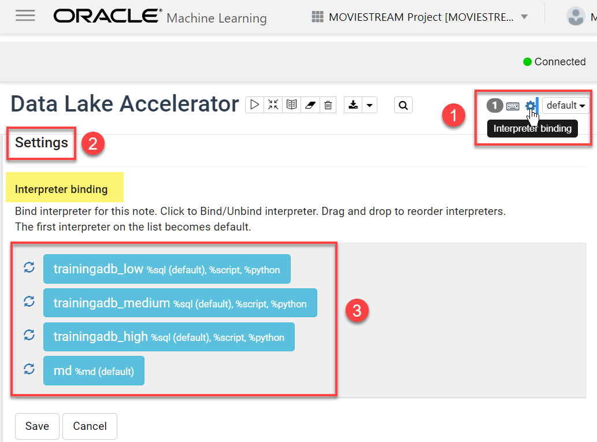
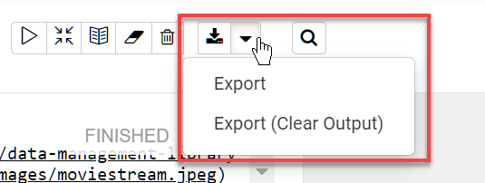
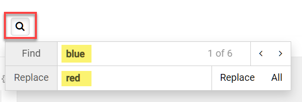
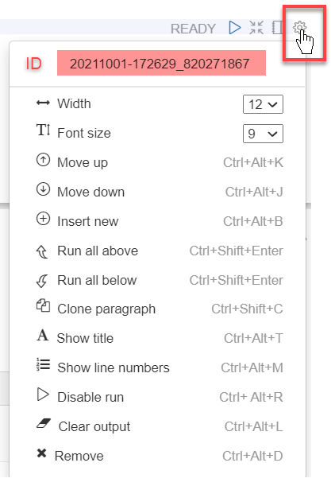
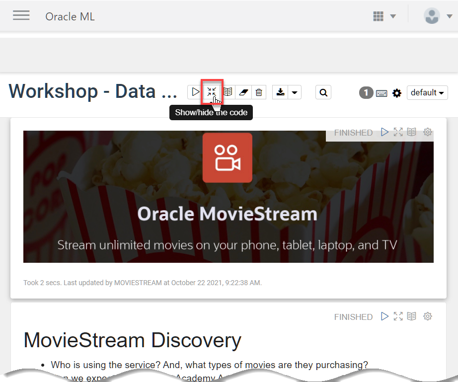
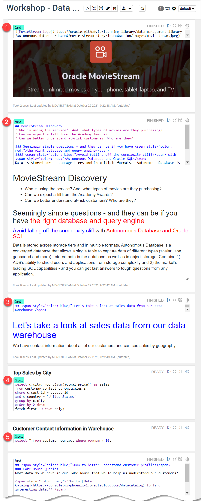
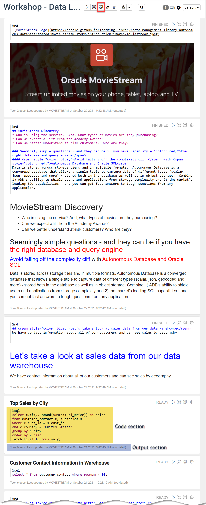
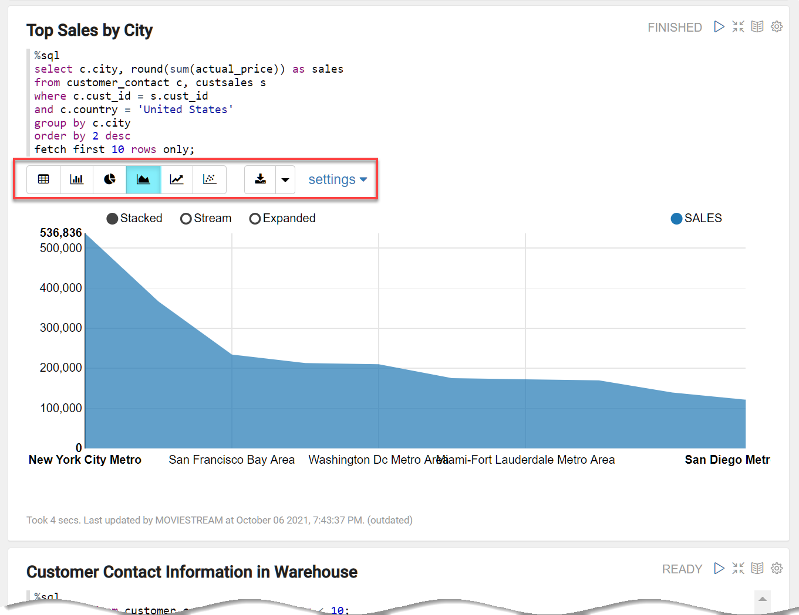
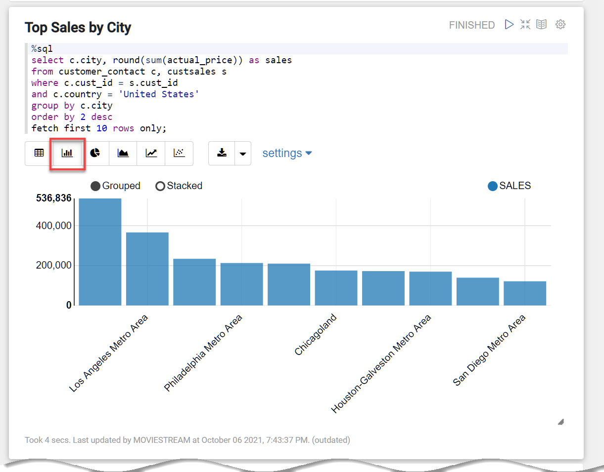

# Query Data Across ADB and the Data Lake Using OML

## Introduction

In this lab, you will use the Oracle Machine Learning Notebooks (OML) to query joined data from both the Data Warehouse and the Data Lake; i.e. the data from the three Oracle Object Storage buckets that you setup in this workshop. See [OML Notebooks documentation](https://docs.oracle.com/en/database/oracle/machine-learning/oml-notebooks/index.html).

Estimated Time: 20 minutes

### Objectives

In this lab, you will:
- Access Oracle Machine Learning Notebooks provided with Oracle Autonomous Database
- Import and review the imported notebook

### Prerequisites

This lab assumes you have:
* An Oracle account
* Completed all previous labs successfully

## Task 1: Access Oracle Machine Learning Notebooks

You can import, create, and work with notebooks in Oracle Machine Learning Notebooks. You can access Oracle Machine Learning Notebooks from Autonomous Database.

1. Log in to the **Oracle Cloud Console** as the Cloud Administrator. See [Signing In to the Console](https://docs.cloud.oracle.com/en-us/iaas/Content/GSG/Tasks/signingin.htm) in the _Oracle Cloud Infrastructure_ documentation.

2. On the **Sign In** page, select your tenancy, enter your username and password, and then click **Sign In**. The **Oracle Cloud Console** Home page is displayed.

3. Open the **Navigation** menu and click **Oracle Database**. Under **Oracle Database**, click **Autonomous Database**.

4. On the **Autonomous Databases** page, make sure that the **`training-dcat-compartment`** is selected in the **Compartment** drop-down list in the **List Scope** section, and then click your **DB-DCAT Integration** ADB that you provisioned earlier.

5. On the **Autonomous Database Details** page, click **Service Console**. In the **Database Actions** card, click **Open Database Actions**.

   

6. On the **Service Console** page, click the **Development** link on the left.

    

7. Scroll-down the **Development** page, and click the **Oracle Machine Learning Notebooks** card.

    

8. On the **SIGN IN** page, enter **`moviestream`** in the **Username** field, your assigned password such as **`Training4ADB`** in the **Password** field, and then click **Sign In**.

    >**Note:** You specified the password for the `moviestream` user that was created when you ran the PL/SQL script in **Lab 3**, **Task 2: Initialize the Lab**.

    

    The **Oracle Machine Learning** Home page is displayed.

    


## Task 2: Import a Notebook

You can import a notebook from a local disk or from a remote location if you provide the URL. In this task, you will import a notebook from an Object Storage bucket using its URL.

1. On the **Oracle Machine Learning** Home page, in the **Quick Actions** section, click the **Notebooks**. The **Notebooks** page is displayed.    

    

2. Click **Import**. The **Open** dialog box is displayed.

3. Copy following URL for the **`Workshop Notebook - Data Lake Accelerator.json`** notebook and paste it in the **File name** field. Make sure that the **JSON file (*.json)** type is selected in the second drop-down field, and then click **Open**.

    ```
    <copy>
    https://objectstorage.us-phoenix-1.oraclecloud.com/p/asZnZNzK6aAz_cTEoRQ9I00x37oyGkhgrv24vd_SGap2joxi3FvuEHdZsux2itTj/n/adwc4pm/b/moviestream_scripts/o/Workshop%20Notebook%20-%20Data%20Lake%20Accelerator.json
    </copy>
    ```

    

    If the import is successful, a notification is displayed at the top of the page and the **`Workshop Notebook - Data Lake Accelerator`** notebook is displayed in the list of available notebooks on **Notebooks** page.

    

4. Open the imported notebook. On the **Notebooks** page, click the **Workshop - Data Lake Accelerator** notebook. The notebook is displayed in the Notebook **Editor**.

    


## Task 3: Set the Interpreter Bindings for the Imported Notebook

An interpreter is a plug-in that allows you to use a specific data processing language backend. To display and visualize data using SQL in a notebook paragraph, that data must be fetched from the database; therefore, you must bind a notebook to an interpreter to fetch data from the database or any data source. A default set of interpreter bindings is available. Paragraphs using the **SQL**  (**`%sql`**) and PL/SQL (**`%script`**) interpreters allow you to invoke Oracle SQL and PL/SQL statements, respectively. The interpreter binding order that is set for a notebook applies to all the paragraphs in that notebook. However, you can override the interpreter binding for SQL and PL/SQL interpreters for any specific paragraph in the notebook.

>**Note:** For the Zeppelin Notebooks in Oracle Machine Learning, you use the sql and pl/sql interpreters within an Oracle Database interpreter group and the md (MarkDown) interpreter for plain text formatting syntax so that it can be converted to HTML.

1. Click on the gear icon on the top right of the notebook. The **Settings** panel is displayed. The list of available interpreters is displayed in the **Interpreter binding** section.

    

2. Select at least one of the interpreters that indicate **%sql (default), %script, %python**. You can move the interpreters to change their order and bring the one you prefer to the top. The first interpreter in the list is the default. Click and drag the **trainingadb_medium %sql (default), %script, %python** interpreter to the top of the list to make it the default. Click **Save** to save your changes. See [About Interpreter Bindings and Notebooks](https://docs.oracle.com/en/database/oracle/machine-learning/oml-notebooks/omlug/interpreters-and-notebooks.html).

    

    The notebook **Editor** is re-displayed.


## Task 4: Explore Oracle Machine Learning Notebooks (Optional)

In this task, you'll review the UI and some of the basic functionality of OML Notebooks. See [Explore Apache Zeppelin UI](https://zeppelin.apache.org/docs/0.10.0/quickstart/explore_ui.html).

>**Note:** If you are already familiar with OML or Zeppelin Notebooks, you may skip this task.  

Oracle Machine Learning Notebooks is a web-based interface for data analysis, data discovery, and data visualization. A notebook is made up of one or more paragraphs. A paragraph is a notebook component where you can write SQL statements, run PL/SQL scripts, and run Python commands. A paragraph has an **code** (input) section and an **output** (result) section. In the input section, specify the interpreter to run along with the text and/or code. This information is sent to the interpreter to be run. In the output section, the results of the interpreter are displayed.
When you create a new notebook, it opens automatically and it contains a single paragraph using the default **`%sql`** interpreter. You can change the interpreter by explicitly specifying other interpreters such as **`%script`**, **`%python`**, or **`%md`** (MarkDown).

###Notebook Toolbar      
At the top of the notebook, you can find a toolbar which contains the following components:

1. A Title.
2. Command icons.
3. Configuration, list of keyboard shortcuts, and display options.


    

On the far left of the toolbar, you can click the Notebook's title to edit it.


In the middle of the toolbar, you can use the following command icons:


>**Note:** You can hover over a toolbar icon to display its tooltip.

1. **Run all paragraphs**: Click this icon to execute all the paragraphs in the Notebook sequentially, in their display order.
2. **Show/hide the code**: Click this toggle icon to hide or show the code section of all paragraphs.
3. **Show/hide the output**: Click this toggle icon to hide or show the result section of all paragraphs in the Notebook.
4. **Clear output**: Click this icon to clear the result section of all paragraphs in the Notebook.
5. **Clear note**: Click this icon to delete the notebook.
6. **Export this note**: export the current note to a JSON file.
>**Note:** When you export a notebook, both the code section and result section of all paragraphs will be exported. If you have heavy data in the result section of some paragraphs, it is recommended to clean them before exporting the notebook.

7. **Drop-down list**: Click this drop-down list to the right of the **Export this note** command to either export the notebook with both the **code** and **result** sections of each paragraph or clear the **output** sections before the exporting the notebook.

    

8. **Search code**: Click this icon to find and replace text in the code sections of each paragraph in the notebook. In this example, we are searching for all any occurrence of the word **blue** and replace those occurrences with the word **red**. You can find and replace one occurrence at a time using the **>** and **<** icons, or click **Replace All** to replace all of the occurrences.

    

On the far right of the notebook toolbar, you can use the following configuration icons and display options:

1. **Connected users**: Hover over this icon to display the currently connected user, **moviestream** in our case.
2. **List of shortcuts**: Click this icon to display all the keyboard shortcuts that you can use.
3. **Interpreter binding**: Click this icon to configure the interpreters' binding to the current notebook.
4. **Display mode**: Click this drop-down list to switch the node display mode between **default**, **simple**, and **report**.

    


###Paragraph    

Each paragraph contains the following components:
1. **Title**: Click the title to edit it.
2. **Code section**: This is where you enter your source code.
3. **Result section**: This is where you can see the result (output) of the code execution.      
4. **Paragraph Commands**: Contains command icons that are described below.

    

You can configure and run each paragraph individually. You can move and reposition a paragraph in the notebook. You can also adjust a paragraph's width and you can also display line numbers in a paragraph.

###Paragraph commands
On the top-right corner of each paragraph, you can use the command icons to:

1. **Run this paragraph (Shift+Enter)**: Click this icon to execute the paragraph code.
2. **Show/Hide editor (Ctrl+Alt+E)**: Click this toggle icon to show or hide the Editor.
3. **Show/Hide output (Ctrl+Alt+O)**: Click this toggle icon to show or hide the result section.
4. **Configure the paragraph**: Click this icon to configure the paragraph (described below).


The status of each paragraph is displayed next to the command icons. If you already ran the paragraph like in our example, it status is **FINISHED**. If you have not run a paragraph yet, its status is **READY**.

To configure a paragraph, click the gear icon. A drop-down list is displayed.



You can use this drop-down list to do the following:

+ Find the paragraph id
+ Control the paragraph width from 1 to 12
+ Move the paragraph 1 level up
+ Move the paragraph 1 level down
+ Create a new paragraph
+ Run all paragraphs above this paragraph
+ Run all paragraphs below this paragraph
+ Clone (duplicate) this paragraph
+ Show/Hide the paragraph title  
+ Change the paragraph title
+ Show/Hide line numbers in the code section
+ Disable the run icon for this paragraph
+ Clear the result section
+ Delete the paragraph


## Task 5: Review and Run the Imported Notebook    

1. Display the code sections of all paragraphs in the notebook. On the notebook toolbar, click the **Show/hide the code** toggle icon.

    

    The code section of each paragraph is displayed. The first three paragraphs in the notebook use the **`%md`** (MarkDown) interpreter while the last two use **`%sql`** interpreter.

    

    In this notebook, the **`%md`** (MarkDown) paragraphs provide useful information about the paragraph(s) that follows. The **`%md`** Markdown interpreter generates static html from plain Markdown text. In this lab, you will review the code in each paragraph one at a time, run that paragraph, and review the results as desired.

    >**Note:** To hide the code sections of all paragraphs, click the **Show/hide the code** toggle icon again. Keep the code sections displayed in this lab.

2. Display the result (output) sections of all paragraphs in the notebook. On the notebook toolbar, click the **Show/hide the output** icon.

    

    The output section of each paragraph is displayed.

    

3. Start at the top of the notebook, review the first **`%md`** paragraph, and then click **Run this paragraph**.  

    

    The output of the **`%md`** code is displayed in the result section. It is the **Oracle Moviestream** logo. Note how the status of the paragraph changed from **READY** to **FINISHED**.

    

    >**Note:** In general, you can run the entire notebook by clicking the **Run all paragraphs** icon on the Notebook toolbar at the top of the page next to the notebook's name; however, we won't do that in this lab.

4. Hide the code section for the first **`%md`** paragraph that you just ran. Click **Hide editor**.

      

    The code section is hidden. It is a good practice to hide the code section of a **`%md`** paragraph since you are only intertested in looking at the formatted output.

      

5. Run the next two **%md** paragraphs and hide the editor in each paragraph.

      

6. Run the **Top Sales by City** paragraph. Click **Run this paragraph**.  

      

    The output is displayed in the result section of the paragraph using the **Area Chart** graph format. You can change the output display format to **Table**, **Bar Chart**, **Pie Chart**, **Line Chart**, **Scatter Chart** formats. You can also use the **Download Data** command icon to download the output using **CSV** and **TSV** formats. Finally, you can use the **settings** link to change the layout of the displayed outut.   

    

7. Click **Bar Chart** on the toolbar to change the output display format.

    

    You may now proceed to the next lab.


## Learn More

* [OML Notebooks documentation](https://docs.oracle.com/en/database/oracle/machine-learning/oml-notebooks/index.html)
* [Oracle Database documentation](https://docs.oracle.com/en/database/oracle/index.html)
* [Oracle Cloud Infrastructure Documentation](https://docs.cloud.oracle.com/en-us/iaas/Content/GSG/Concepts/baremetalintro.htm)
* [Using Oracle Autonomous Database on Shared Exadata Infrastructure](https://docs.oracle.com/en/cloud/paas/autonomous-database/adbsa/index.html)


## Acknowledgements

* **Author:** Lauran Serhal, Principal User Assistance Developer, Oracle Database and Big Data
* **Contributor:** Marty Gubar, Product Manager, Server Technologies    
* **Last Updated By/Date:** Lauran Serhal, October 2021
