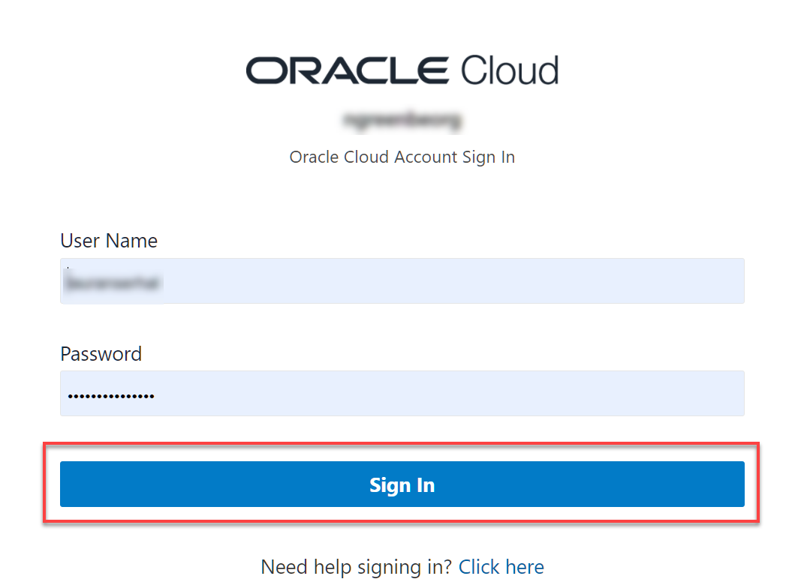
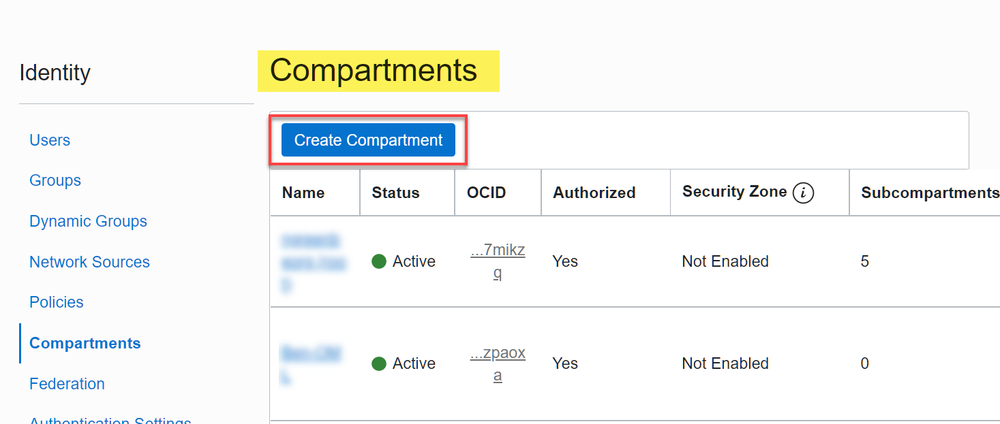
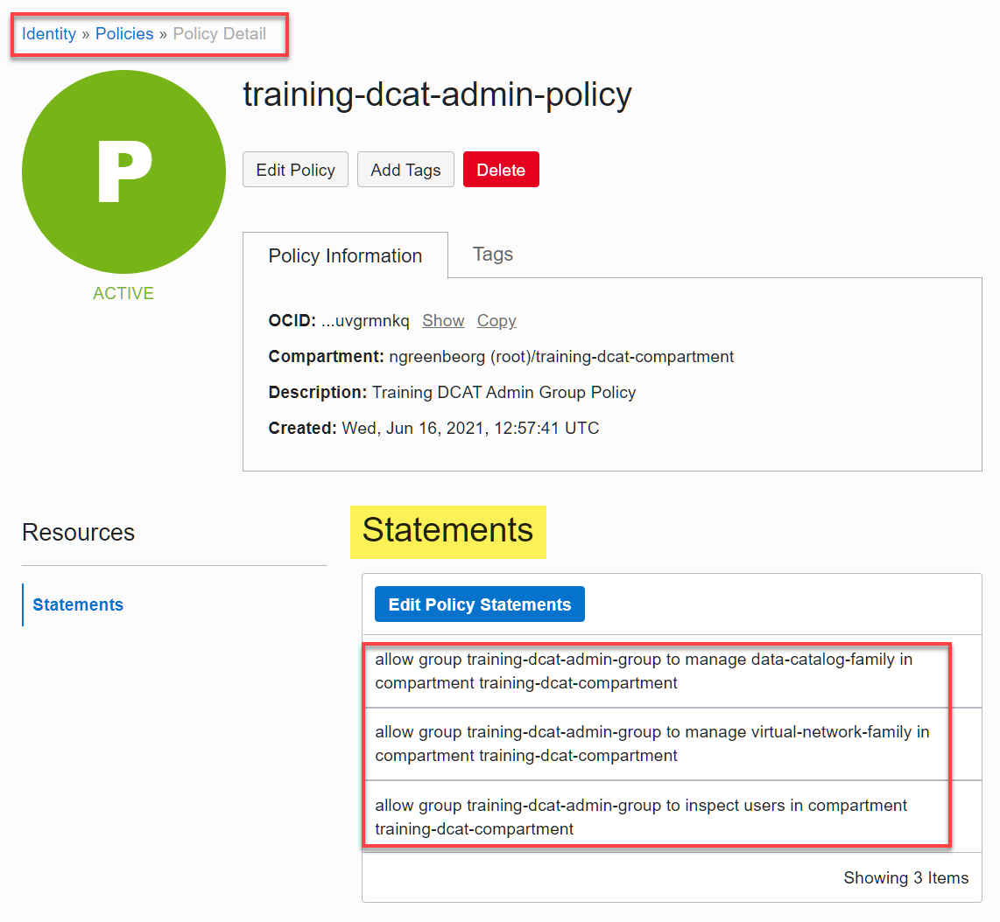
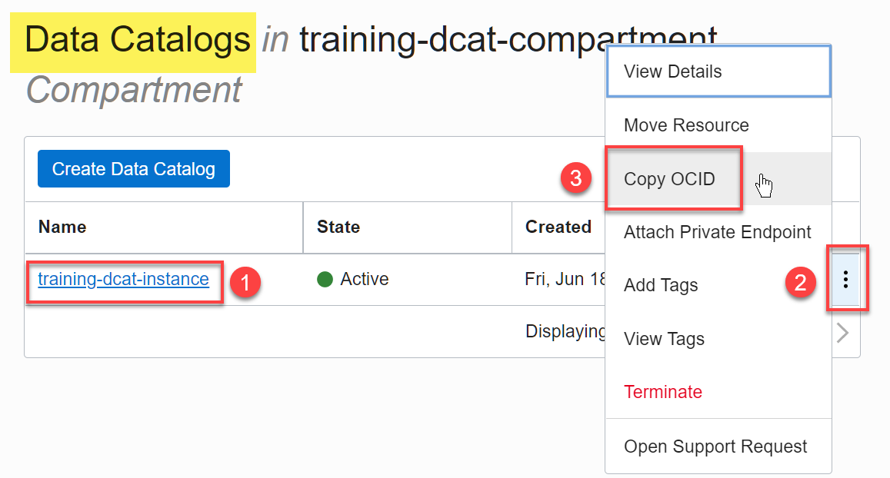
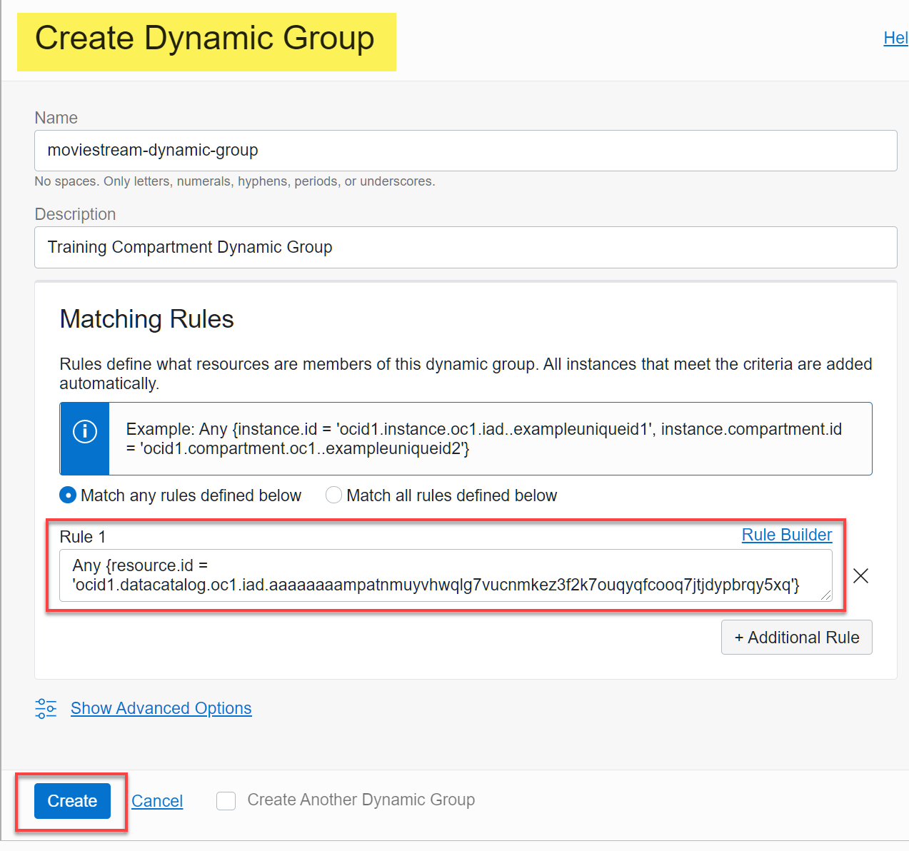
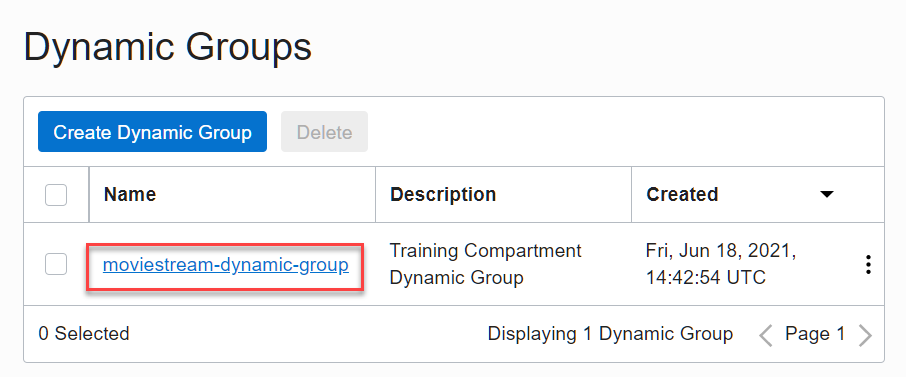
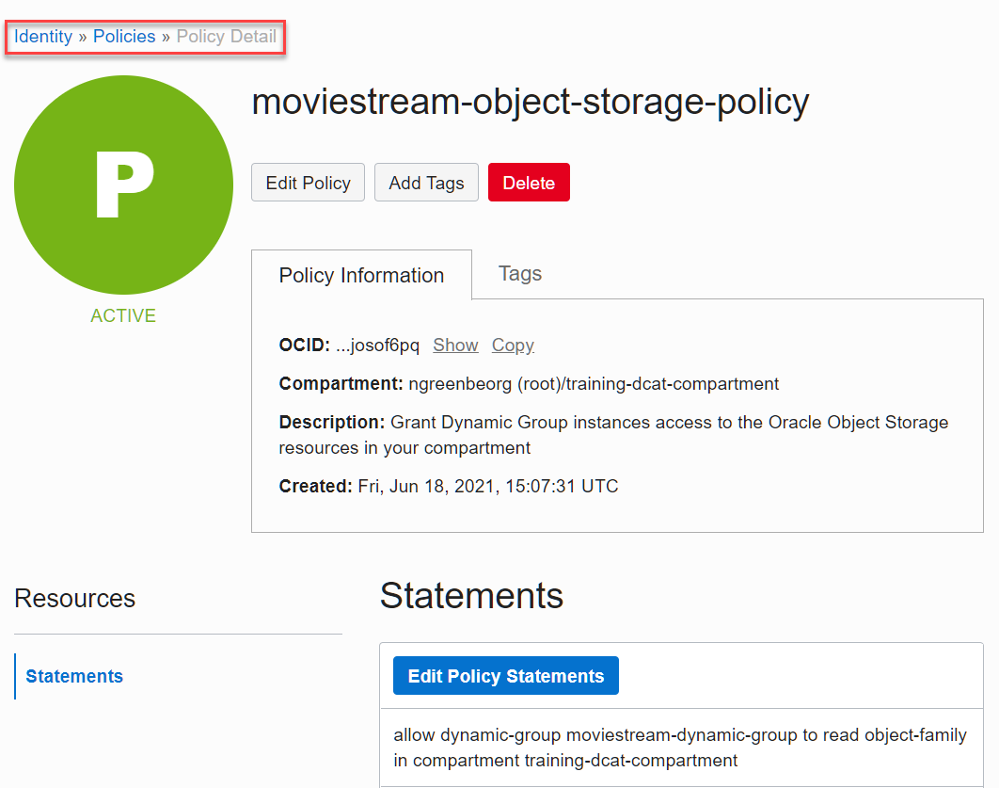

# Get Started with OCI Data Catalog

## Introduction

This lab walks you through the steps to get started with Oracle Cloud Infrastructure Data Catalog. First, you create the Data Catalog administrator group and an optional user group and then add the Data Catalog users to the respective groups. Next, you create the user policies that are required to create a data catalog.

This tutorial is directed at administrator users because they are granted the required access permissions.

Estimated Lab Time: 30 minutes

### Objectives

In this lab, you will:
* (Optional) Create a compartment for your data catalog objects.
* (Optional) Create a user group for data catalog administrators.
* Create policies to give your data catalog admins and other user groups access to use data catalog resources.
* Create a Dynamic Group policy to allow Data Catalog to access your Object Storage resources.
* Create a data catalog instance.


### Prerequisites

* An Oracle Cloud Account - Please view this workshop's LiveLabs landing page to see which environments are supported
* At least one user in your tenancy who wants to work with Data Catalog. This user must be created in the Identity service[URL Text](https://www.oracle.com).

*Note: If you have a **Free Trial** account, when your Free Trial expires your account will be converted to an **Always Free** account. You will not be able to conduct Free Tier workshops unless the Always Free environment is available. **[Click here for the Free Tier FAQ page.](https://www.oracle.com/cloud/free/faq.html)***

## **STEP 1:** Log in to the Oracle Cloud Console

1. Log in to the **Oracle Cloud Console** as the Cloud Administrator. You will complete all the labs in this workshop using this Cloud Administrator.
See [Signing In to the Console](https://docs.cloud.oracle.com/en-us/iaas/Content/GSG/Tasks/signingin.htm) in the _Oracle Cloud Infrastructure_ documentation.

2. On the **Sign In** page, select your tenancy, enter your username and password, and then click **Sign In**.

   

   The **Oracle Cloud Console** Home page is displayed.

   

## **STEP 2**: (Optional) Create a Compartment

A Cloud Administrator can optionally create a compartment in your tenancy to help organize the Data Catalog resources. In this lab, as a Cloud Administrator, you will create a new compartment that will group all of your Data Catalog resources that you will use in the workshop.

1. Open the **Navigation** menu and click **Identity & Security**. Under **Identity**, click **Compartments**.

	 

   **Note:** For faster navigation, you can pin items to make them appear in the **Pinned Links** section of the **Home** tab. To pin an item, hover over the menu item and then click the pin to the left of the item name. The **Recent** section of the **Home** tab shows recently used navigation items. To quickly find navigation menu items, use the **Search** box.

   

2. On the **Compartments** page, click **Create Compartment**.

   

3. In the **Create Compartment** dialog box, enter **`training-dcat-compartment`** in the **Name** field and **`Training Data Catalog Compartment`** in the **Description** field.

4. In the **Parent Compartment** drop-down list, select your parent compartment, and then click **Create Compartment**.

   

   The **Compartments** page is re-displayed and the newly created compartment is displayed in the list of available compartments.

   


## **STEP 3:** Create an IAM User to Be the Data Catalog Administrator

A Cloud Administrator has complete control over all of the Data Catalog resources in the tenancy; however, it's a good practice to delegate cluster administration tasks to one or more Data Catalog administrators. To create a new Data Catalog administrator for a service, a Cloud Administrator must create a user and then add that user to a Data Catalog administrators group. You create Identity and Access Management (IAM) groups with access privileges that are appropriate to your needs.

Create a new **Administrator** group that will have full access rights to the new compartment that you created earlier as follows:

1. If you are still on the **Compartments** page from the previous step, click the **Users** link in the **Identity** section on the left; otherwise, click the **Navigation** menu and navigate to **Identity & Security > Users**.

2. On the **Users** page, click **Create User**.

   

3. In the **Create User** dialog box, enter **`training-dcat-admin-user`** in the **Name** field, **`Training DCAT Admin User`** in the  **Description** field, an optional email address for the user in the **Email** field, and then click **Create**.

  **Note:**
  An email address can be used as the user name, but it isn't required.

   

4. The **User Details** page is displayed. Click **Users** in the breadcrumbs to return to the **Users** page.

   

   The new user is displayed in the list of available users.

   

   **Note:** In this workshop, you will not login to OCI using the new **`training-dcat-admin-user`** user that you just created in this step; instead, you will continue your work using the same Cloud Administrator user that you used so far in this workshop. As a Cloud Administrator, you can create a one-time password for the new **`training-dcat-admin-user`** user. The user must change the password during the first sign in to the Console. For additional information, see [Managing User Credentials](https://docs.cloud.oracle.com/en-us/iaas/Content/Identity/Tasks/managingcredentials.htm) in the OCI documentation.

## **STEP 4:** Create an IAM Data Catalog Administrators Group and Add the New User to the Group

Create a Data Catalog group whose members will be granted permissions to manage the Data Catalog.

1. If you are still on the **Users** page from the previous step, click the **Groups** link in the **Identity** section on the left; otherwise, click the **Navigation** menu and  navigate to **Identity & Security > Groups**.

2. On the **Groups** Page, click **Create Group**.

   

3. In the **Create Group** dialog box, enter **`training-dcat-admin-group`** in the **Name** field, **`Training Data Catalog Admin. Group`** in the **Description** field, and then click **Create**.

   

4. The **Group Details** page is displayed. In the **Group Members** section, click **Add User to Group**.   

   

5. In the **Add User to Group** dialog box, select the **`training-dcat-admin-user`** user that you created earlier from the **USERS** drop-down list, and then click **Add**.

   

6. The **Group Details** page is re-displayed and the newly added user to this group is displayed in the **Group Members** section.

   

7. Click **Groups** in the breadcrumbs to re-display the **Groups** page. The newly created group is displayed in the list of available groups.

   


## **STEP 5:** Create IAM Policies for Administering Your Service
Create Oracle Cloud Infrastructure Identity and Access Management (IAM) policies to grant privileges to users and groups to use and manage Data Catalog resources. Before you can create and access a data catalog, you must also create a policy that grants the system access to networking resources.

1. In the **Identity** section on the left, select **Policies**. Alternatively, click the **Navigation** menu and navigate to **Identity & Security > Policies**.

2. On the **Policies** page, if your compartment is not selected, use the **Compartment** drop-down list in the **List Scope** section to search for and select the **`training-dcat-compartment`** where the new policies will reside.  

   

   Type part of the compartment's name in the **Search compartments** text box. When the compartment is displayed in the list, select it.  

   

3.  Click **Create Policy**.  

    

    The **Create Policy** dialog box is displayed.

    


4. In the **Create Policy** dialog box, provide the following information:
    * Enter **`training-dcat-admin-policy`** in the **Name** field.
    - Enter **`Training DCAT Admin Group Policy`** in the **Description** field.
    - Select **`training-dcat-compartment`** from the **Compartment** drop-down list, if it's not already selected.
    - In the **Policy Builder** section, click and slide the **Show manual editor** slider to enable it. An empty text box is displayed in this section.

     

    + Click the **Copy** button in the following code box to copy the policy statement to allow the admin users to perform all operations on all data catalog resources in the `training-dcat-compartment`, and then paste it in the **Policy Builder** text box.

        ```
        <copy>allow group training-dcat-admin-group to manage data-catalog-family in compartment training-dcat-compartment</copy>
        ```
        **Note:**
        Data Catalog offers both aggregate and individual resource-types for writing policies. You can use aggregate resource-types to write fewer policies. For example, instead of allowing a group to manage **`data-catalogs`** and **`data-catalog-data-assets`**, you can have a policy that allows the group to manage the aggregate resource-type, **`data-catalog-family`**. See [Data Catalog Policies](https://docs.oracle.com/en-us/iaas/data-catalog/using/policies.htm) in the Oracle Cloud Infrastructure documentation.
    + Click the **Copy** button in the following code box to copy the policy statement, and then paste it in the **Policy Builder** text box. This policy statement allows Data Catalog service, **`datacatalog`**, to access the network, create instances, and more.

        ```
        <copy>allow group training-dcat-admin-group to manage virtual-network-family in compartment training-dcat-compartment</copy>
        ```
         

    + Click the **Copy** button in the following code box to copy the policy statement, and then paste it in the **Policy Builder** text box. This policy statement allows the admin users to view Oracle Cloud Infrastructure users who performed various actions in Data Catalog.

        ```
        <copy>allow group training-dcat-admin-group to inspect users in compartment training-dcat-compartment</copy>
        ```
        

5. Click **Create**. A confirmation message is displayed. The **Policy Detail** page is displayed. The three statements are displayed in the **Statements** section.  

  

6. Click **Policies** in the breadcrumbs to re-display the **Policies** page. The newly created policy is displayed in the list of available policies.

     

      **Note:** You can click the name of a policy on this page to view and edit it.

## **STEP 6:** Create a Dynamic Group
Dynamic groups allow you to group Oracle Cloud Infrastructure compute instances as "principal" actors (similar to user groups). You can then create policies to permit instances to make API calls against Oracle Cloud Infrastructure services. When you create a dynamic group, rather than adding members explicitly to the group, you instead define a set of matching rules to define the group members. For example, a rule could specify that all instances in a particular compartment are members of the dynamic group. The members can change dynamically as instances are launched and terminated in that compartment.

In this step, you will first gather the Data Catalog instance's OCID which you will use when you create the Dynamic Group. Next, you create a Dynamic Group that includes the specific data catalog instance OCID as a resource in the group.

1. Open the **Navigation** menu and click **Analytics & AI**. Under **Data Lake**, select **Data Catalog**.

2. On the **Data Catalogs** page, in the row for your **training-dcat-instance**, click the **Action** button to display the context menu. Select **Copy OCID** from the context menu to copy the OCID for the **training-dcat-instance** Data Catalog instance. Next, paste that OCID to an editor or a file, so that you can retrieve it later in this lab.

  

3. Open the **Navigation** menu and click **Identity & Security**. Under **Identity**, click **Dynamic Groups**.

4. On the **Dynamic Groups** page, click **Create Dynamic Group**.

  

5. In the **Create Dynamic Group** dialog box, specify the following:

    + Enter **`moviestream-dynamic-group`** in the **Name** field.
    + Enter **`Training Compartment Dynamic Group`** in the **Description** field.
    + In the **Matching Group** section, accept the default **Match any rules defined below** option.
    + Click the **Copy** button in the following code box to copy the dynamic rule, and then paste it in the **Rule 1** text box. This statement allows Data Catalog service, **`datacatalog`**, to .... Substitute the _your-data-catalog-instance-ocid_ with your **training-dcat-instance** Data Catalog instance OCID that you copied earlier.

        ```
        <copy>Any {resource.id = 'your-data-catalog-instance-ocid'}</copy>
        ```

        In our example, the dynamic rule is as follows:

        ```
        Any {resource.id = 'ocid1.datacatalog.oc1.iad.aaaaaaaampatnmuyvhwqlg7vucnmkez3f2k7ouqyqfcooq7jtjdypbrqy5xq'}
        ```

  

    + Click **Create**. The **Dynamic Group Details** page is displayed. Click **Dynamic Groups** in the breadcrumbs to re-display the **Dynamic Groups** page.

         

         The newly created dynamic group is displayed.

         


## **STEP 7:** Create an Object Storage Resources Access Policy         
After you have created a dynamic group, you need to create policies to permit the dynamic group to access Oracle Cloud Infrastructure services. In this step, you create a policy to allow Data Catalog in your `training-dcat-compartment` to access any object in your **Oracle Object Storage**, in any bucket. At a minimum, you must have `READ` permissions to all the individual resource types such as `objectstorage-namespaces`, `buckets`, and `objects`, or to the Object Storage aggregate resource type `object-family`.

Create an access policy to grant ``READ`` permission to the **Object Storage** aggregate resource type ``object-family`` as follows:

1. Open the **Navigation** menu and click **Identity & Security**. Under **Identity**, select **Policies**.

2. On the **Policies** page, make sure that your **`training-dcat-compartment`** compartment is selected, and then click **Create Policy**.  

    

    The **Create Policy** dialog box is displayed.

3. In the **Create Policy** dialog box, provide the following information:
    + Enter **`moviestream-object-storage-policy`** in the **Name** field.
    + Enter **`Grant Dynamic Group instances access to the Oracle Object Storage resources in your compartment`** in the **Description** field.
    + Select **`training-dcat-compartment`** from the **Compartment** drop-down list, if it's not already selected.
    + In the **Policy Builder** section, click and slide the **Show manual editor** slider to enable it. An empty text box is displayed in this section.
    + Allow Data Catalog to access any object in your Oracle Object Storage, in any bucket, in the `training-dcat-compartment` compartment. Click the **Copy** button in the following code box, and then paste it in the **Policy Builder** text box.  

        ```
        <copy>allow dynamic-group moviestream-dynamic-group to read object-family in compartment training-dcat-compartment</copy>
        ```
     

     This policy allows access to any object, in any bucket, within the `training-dcat-compartment` compartment where the policy is created.

    + Click **Create**. The **Policy Detail** page is displayed. Click **Policies** in the breadcrumbs to return to the **Dynamic Groups** page.

          

          The newly created policy is displayed in the **Policies** page.

          

You may now [proceed to the next lab](#next).

## Learn More

* [Managing Dynamic Groups](https://docs.oracle.com/en-us/iaas/Content/Identity/Tasks/managingdynamicgroups.htm#Managing_Dynamic_Groups)
* [Writing Policies for Dynamic Groups](https://docs.oracle.com/en-us/iaas/Content/Identity/Tasks/callingservicesfrominstances.htm#Writing)
* [Oracle Cloud Infrastructure Documentation](https://docs.cloud.oracle.com/en-us/iaas/Content/GSG/Concepts/baremetalintro.htm)

## Acknowledgements
* **Author:** Lauran Serhal, Principal UA Developer, Oracle Database and Big Data User Assistance
* **Contributor:** Martin Gubar, Director, Oracle Big Data Product Management    
* **Last Updated By/Date:** Lauran Serhal, July 2021
