<!-- September 29, 2021: Per Marty's comments on September 29, I am removing tasks 3 and 4 and replacing then with notes about the privileges required for the current user if the user is not an admin like they are in this workshop. -->
<!-- comments -->

# Setup the Workshop Environment

## Introduction

This lab walks you through the steps to get started with Oracle Cloud Infrastructure Data Catalog. First, you create a compartment for your Data Catalog instance. You create a Dynamic group. Dynamic groups allow you to group Oracle Cloud Infrastructure compute instances as "principal" actors (similar to user groups). Next, you need to create policies to permit the dynamic group to access Oracle Cloud Infrastructure services such as Data Catalog, ADB, and Oracle Object Storage buckets. You then create a Data Catalog instance, create a new business glossary, and then import a glossary into the new glossary. When you create a data catalog, you get a single collaborative environment to manage technical, business, and operational metadata. You can collect, organize, find, access, understand, enrich, and activate this metadata. Finally, you create an Autonomous Database instance. Finally, you create an Autonomous Database instance.

> **Note:** This workshop is directed at administrator users because they are granted the required access permissions. In real life scenarios, you would create a new administrator user and a Data Catalog administrator group, and then add the new user to the new group. Next, you create the Oracle Cloud Infrastructure Identity and Access Management (IAM) policies that are required to create and manage a Data Catalog and Autonomous Database instances.

Estimated Time: 30 minutes

### Objectives

In this lab, you will:
* (Optional) Create a compartment for your Data Catalog objects.
* Create a Dynamic Group policy to allow Data Catalog to access your Object Storage resources.
* Create the
* Create a Data Catalog instance.
* Import a Glossary into your Data Catalog instance.
* Create and Autonomous Database instance.


### Prerequisites

* An Oracle Cloud Account - Please view this workshop's LiveLabs landing page to see which environments are supported
* At least one user in your tenancy who wants to work with Data Catalog. This user must be created in the Identity service[URL Text](https://www.oracle.com).

> **Note:** If you have a **Free Trial** account, when your Free Trial expires your account will be converted to an **Always Free** account. You will not be able to conduct Free Tier workshops unless the Always Free environment is available. [Click here for the Free Tier FAQ page.](https://www.oracle.com/cloud/free/faq.html)

## Task 1: Log in to the Oracle Cloud Console

1. Log in to the **Oracle Cloud Console** as the Cloud Administrator. You will complete all the labs in this workshop using this Cloud Administrator.
See [Signing In to the Console](https://docs.cloud.oracle.com/en-us/iaas/Content/GSG/Tasks/signingin.htm) in the _Oracle Cloud Infrastructure_ documentation.

2. On the **Sign In** page, select your tenancy, enter your username and password, and then click **Sign In**.

   

   The **Oracle Cloud Console** Home page is displayed.

   

## Task 2: (Optional) Create a Compartment

A Cloud Administrator can optionally create a compartment in your tenancy to help organize the Data Catalog resources. In this lab, as a Cloud Administrator, you will create a new compartment that will group all of your Data Catalog resources that you will use in the workshop.

1. Open the **Navigation** menu and click **Identity & Security**. Under **Identity**, click **Compartments**.

	 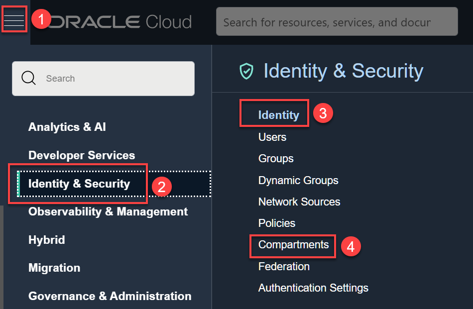

    >**Note:** For faster navigation, you can pin items to make them appear in the **Pinned Links** section of the **Home** tab. To pin an item, hover over the menu item and then click the pin to the left of the item name. The **Recent** section of the **Home** tab shows recently used navigation items. To quickly find navigation menu items, use the **Search** box.

   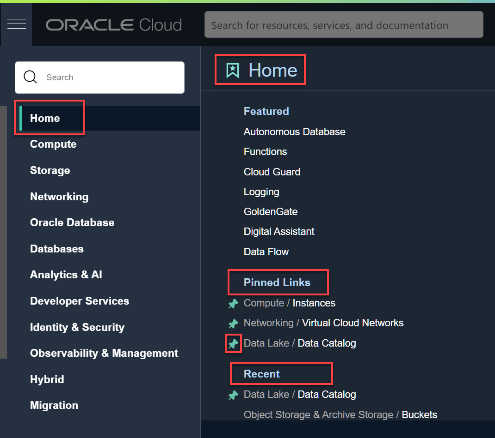

2. On the **Compartments** page, click **Create Compartment**.

   

3. In the **Create Compartment** dialog box, enter **`training-dcat-compartment`** in the **Name** field and **`Training Data Catalog Compartment`** in the **Description** field.

4. In the **Parent Compartment** drop-down list, select your parent compartment, and then click **Create Compartment**.

   

   The **Compartments** page is re-displayed and the newly created compartment is displayed in the list of available compartments.

   

<!-- Commenting out Tasks 3, 4, and original 7 per Marty's feedback.

Task 3: Create an IAM User to Be the Data Catalog Administrator

A Cloud Administrator has complete control over all of the Data Catalog resources in the tenancy; however, it's a good practice to delegate administration tasks to one or more Data Catalog administrators. To create a new Data Catalog administrator for a service, a Cloud Administrator must create a user and then add that user to a Data Catalog administrators group. You create Identity and Access Management (IAM) groups with access privileges that are appropriate to your needs.

Create a new **Administrator** group that will have full access rights to the new compartment that you created earlier as follows:

1. If you are still on the **Compartments** page from the previous task, click the **Users** link in the **Identity** section on the left; otherwise, open the **Navigation** menu and click **Identity & Security**. Under **Identity**, click **Users**.

2. On the **Users** page, click **Create User**.

   

3. In the **Create User** dialog box, enter **`training-dcat-admin-user`** in the **Name** field, **`Training DCAT Admin User`** in the  **Description** field, an optional email address for the user in the **Email** field, and then click **Create**.

   

4. The **User Details** page is displayed. Click **Users** in the breadcrumbs to return to the **Users** page.

   

   The new user is displayed in the list of available users.

   

    >**Note:** In this workshop, you will not login to OCI using the new **`training-dcat-admin-user`** user that you just created in this task; instead, you will continue your work using the same Cloud Administrator user that you used so far in this workshop. As a Cloud Administrator, you can create a one-time password for the new **`training-dcat-admin-user`** user. The user must change the password during the first sign in to the Console. For additional information, see [Managing User Credentials](https://docs.cloud.oracle.com/en-us/iaas/Content/Identity/Tasks/managingcredentials.htm) in the OCI documentation.

Task 4: Create an IAM Data Catalog Administrators Group and Add the New User to the Group

Create a Data Catalog group whose members will be granted permissions to manage the Data Catalog.

1. If you are still on the **Users** page from the previous task, click the **Groups** link in the **Identity** section on the left; otherwise, open the **Navigation** menu and click **Identity & Security**. Under **Identity**, click **Groups**.

2. On the **Groups** page, click **Create Group**.

   

3. In the **Create Group** dialog box, enter **`training-dcat-admin-group`** in the **Name** field, **`Training Data Catalog Admin. Group`** in the **Description** field, and then click **Create**.

   

4. The **Group Details** page is displayed. In the **Group Members** section, click **Add User to Group**.   

   

5. In the **Add User to Group** dialog box, select the **`training-dcat-admin-user`** user that you created earlier from the **Users** drop-down list, and then click **Add**.

   

6. The **Group Details** page is re-displayed and the newly added user to this group is displayed in the **Group Members** section.

   

7. Click **Groups** in the breadcrumbs to re-display the **Groups** page. The newly created group is displayed in the list of available groups.

   
-->

## Task 3: Create a Data Catalog Instance

To control who has access to Data Catalog, and the type of access for each group of users, you must create policies. By default, only the users in the Administrators group have access to all Data Catalog resources. For everyone else who's involved with Data Catalog, you must create policies that give them proper rights to Data Catalog resources. In this workshop, it is assumed that you are an administrator performing the steps in this workshop such as creating the Data Catalog and ADB instances. If you are not an administrator user, then your administrator user much grant you the policies listed below.

Let's say you are not an Administrator but you do need to use and manage Data Catalog. Your Administrator can create a Data Catalog Group and add you and other non-Administrator users to this group. Assume that all of the resources that you will need to perform your job are in compartment named `training-dcat-compartment`. The following policy statements are required for the `training-dcat-users-group` group.

The following statement allows the `training-dcat-users-group` group to perform all operations on all data catalog resources in the `training-dcat-compartment`.

```
allow group training-dcat-users-group to manage data-catalog-family in compartment training-dcat-compartment
```

The following policy statement grants the specified group to access the virtual network resources:

```
allow group training-dcat-users-group to manage virtual-network-family in compartment training-dcat-compartment
```

The following policy statement allows the specified group to view Oracle Cloud Infrastructure users who performed various actions in Data Catalog:

```
allow group training-dcat-users-group to inspect users in compartment training-dcat-compartment
```

>**Note:**
Data Catalog offers both aggregate and individual resource-types for writing policies. You can use aggregate resource-types to write fewer policies. For example, instead of allowing a group to manage **`data-catalogs`** and **`data-catalog-data-assets`**, you can have a policy that allows the group to manage the aggregate resource-type, **`data-catalog-family`**. See [Data Catalog Policies](https://docs.oracle.com/en-us/iaas/data-catalog/using/policies.htm) in the Oracle Cloud Infrastructure documentation.

Create a Data Catalog instance using the following steps.

1. Open the **Navigation** menu and click **Analytics & AI**. Under **Data Lake**, click **Data Catalog**.

   

2. On the **Data Catalogs** page, click **Create Data Catalog**.

   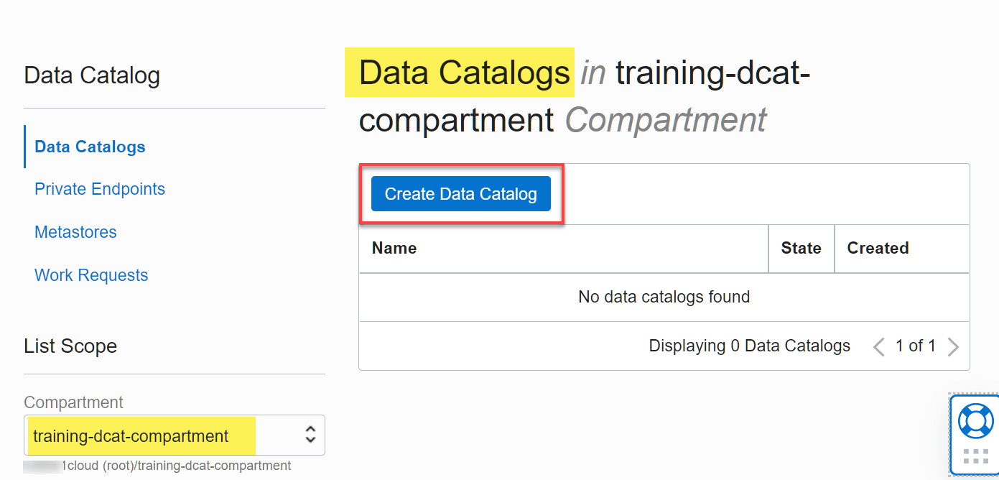

3. Select the **`training-dcat-compartment`** compartment from the **Create In Compartment** drop-down list, if not already selected.

4. Enter **`training-dcat-instance`** in the **Name** field.

   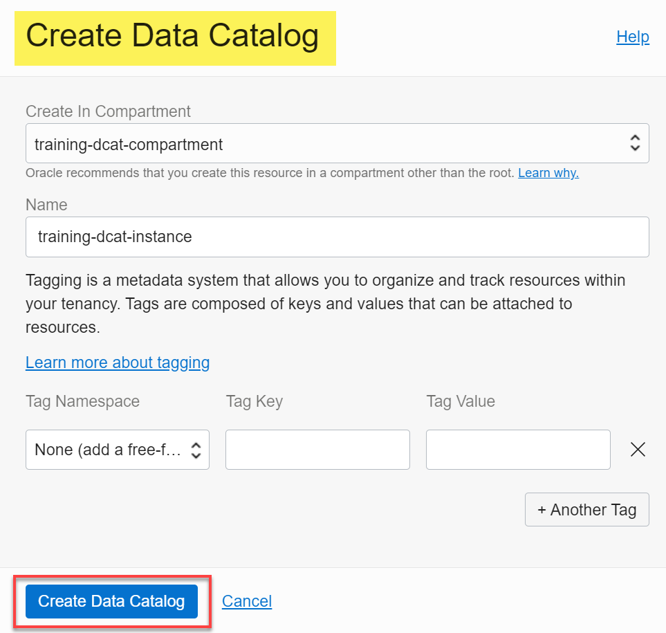

5. Click **Create Data Catalog**. The Data Catalog instance is created and displayed in the **Data Catalogs** page.

   

<!-- End of commenting out tasks 3 and 4. -->

## Task 4: Create, Import, and Edit a Glossary

In this task, you create a new and empty business glossary in the newly created Data Catalog instance. Next, you  import an existing glossary from your local file system into the new glossary. You use a business glossary to define your concepts across your business domain. Creating a business glossary brings common understanding of the vocabulary used throughout your organization. In Data Catalog, you create categories and terms in a glossary to manage and organize your business concepts. Terms are the actual definitions of business concepts as agreed upon by different business stakeholders in your company. You use terms to organize your data entities and attributes. You can edit a glossary, category, or term to modify their default properties such as name, owner, status, and description, or any custom property that is associated with a glossary, category, or term. For detailed information on managing glossaries, see [Managing a Business Glossary](https://docs.oracle.com/en-us/iaas/data-catalog/using/manage-glossary.htm#create-glossary) in the _Oracle Cloud Infrastructure_ documentation.

1. Open the **Navigation** menu and click **Analytics & AI**. Under **Data Lake**, click **Data Catalog**.

2. On the **Data Catalogs** page, click the **`training-dcat-instance`** Data Catalog in the **Name** column.

   

3. The Data Catalog **Home** page is displayed. Click the **Glossaries** link.

   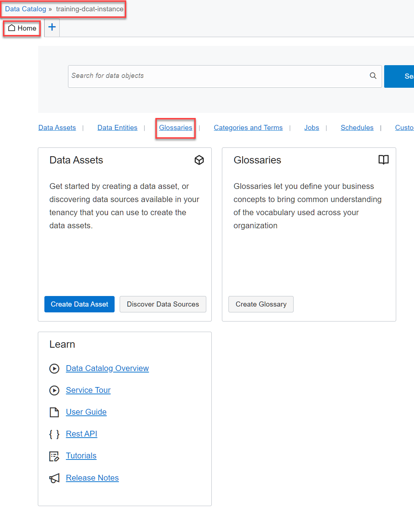

   The **Glossaries** tab is displayed.

   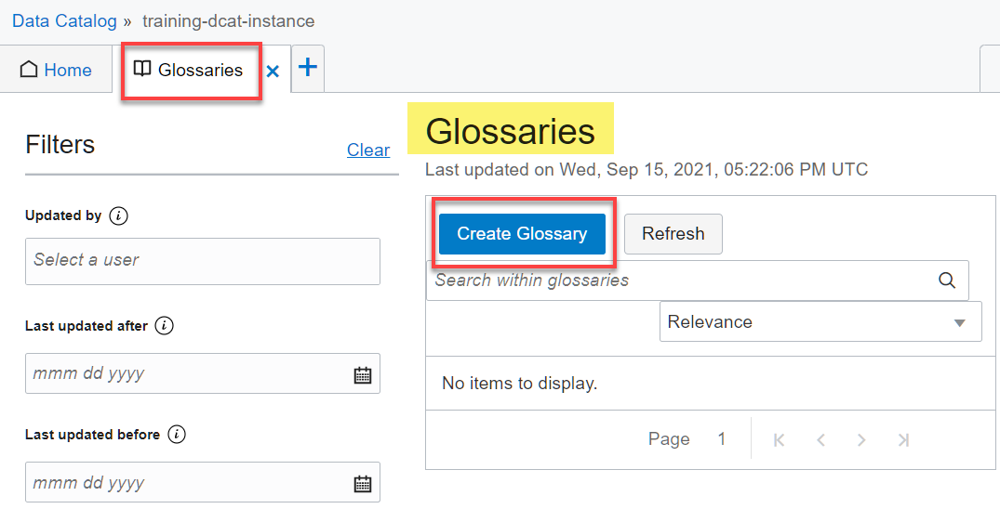


4. Click **Create Glossary**. The **Create Glossary** panel is displayed. Enter **`MovieStream Application`** in the **Name** field, and then click **Create**.

   

   The **MovieStream Application** glossary tab is displayed.

   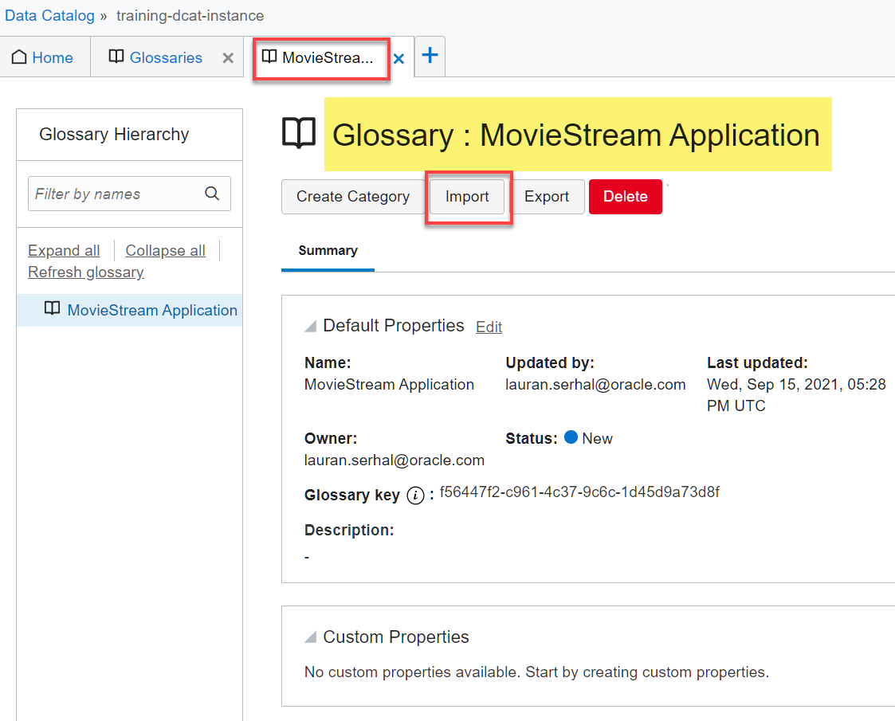

5. Click **Import**. A **Note** message box is displayed indicating that some rich text formatting might be modified or lost on import. Click **Proceed**.

   

6. In the **Open** dialog box for your local system, copy and enter the following pre-authenticated request (PAR) URL that represents a glossary that was exported from a different Data Catalog instance in the **File name** text box. Select **All Files** from the second drop-down list, and then click **Open**. See [Pre-Authenticated requests](https://docs.oracle.com/en-us/iaas/Content/Object/Tasks/usingpreauthenticatedrequests.htm).


    ```
    <copy>https://objectstorage.us-phoenix-1.oraclecloud.com/p/asZnZNzK6aAz_cTEoRQ9I00x37oyGkhgrv24vd_SGap2joxi3FvuEHdZsux2itTj/n/adwc4pm/b/moviestream_scripts/o/MovieStream-Glossary.xlsx</copy>
    ```

    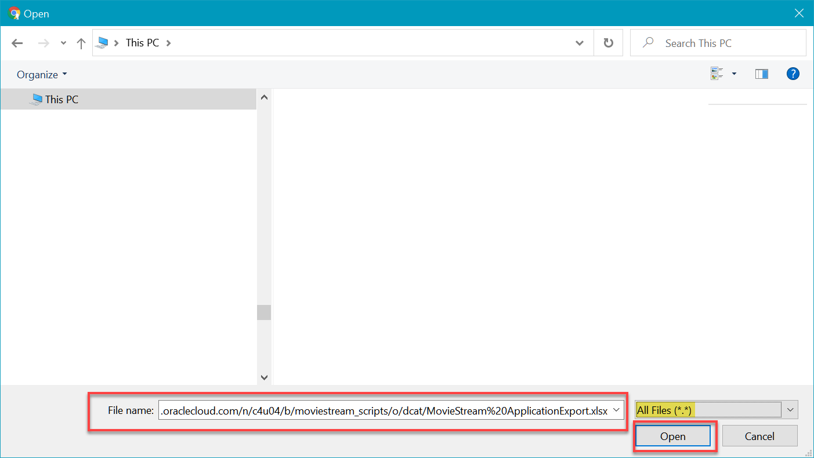

7. An import job is triggered and a message is displayed.

   

   The import file is small; therefore, the job finishes instantly and the imported glossary is displayed. If the import file is large, you can monitor the status of the job from the Jobs tab. When the job is completed successfully, the contents of the Excel file are imported into your glossary.

   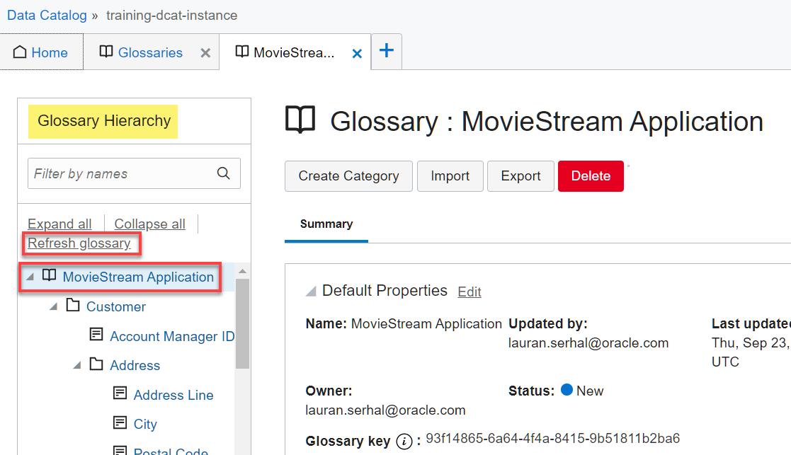

8. The imported glossary is displayed in the **Glossary Hierarchy** pane on the left. You can also click **Expand all** to view all of the details. The children of the **MovieStream Application** glossary are displayed. If the glossary details are not displayed, click **Refresh glossary**.

   

    >**Note:** The categories and terms created within a glossary are displayed in the **Glossary Hierarchy** tree navigation list. Expand each category to view terms created within that category. The summary information changes as you click different nodes in the glossary tree. You can use Expand All or Collapse All to expand or collapse all the nodes available in the glossary respectively. You can also use the search bar to search for categories and terms. If the glossary children are not displayed, click **Refresh glossary**.

9. Edit the default properties for your **MovieStream Application** glossary to include a description which you didn't specify when you created the glossary. In the **Glossary Hierarchy** pane, click the **MovieStream Application** glossary. In the **Default Properties** section on the right, click **Edit**.

   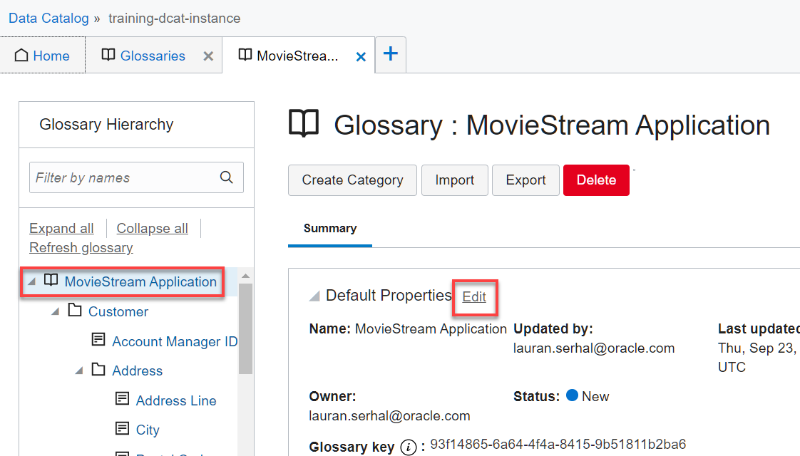

   The **Edit Default Properties** panel opens as an overlay.

10. Enter "`Describes the assets related to the MovieStream data`" in the **Description** field. Click **Save Changes**.

   

   The updated description is displayed in the **Default Properties** section.

   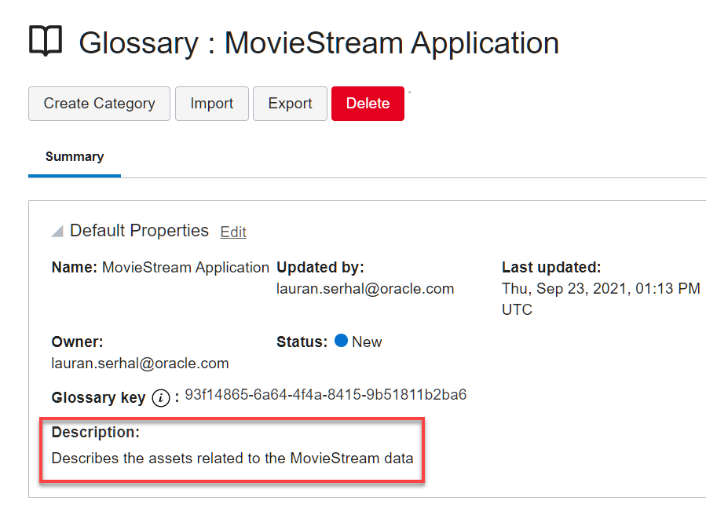

<!-- commented out this task
Task 7: Create IAM Policies for Administering Your Service
Create Oracle Cloud Infrastructure Identity and Access Management (IAM) policies to grant privileges to users and groups to use and manage Data Catalog resources. Before you can create and access a data catalog, you must also create a policy that grants the system access to networking resources.

1. Open the **Navigation** menu and click **Identity & Security**. Under **Identity**, click **Policies**.

2. On the **Policies** page, if your compartment is not selected, use the **Compartment** drop-down list in the **List Scope** section to search for and select the **`training-dcat-compartment`** where the new policies will reside.  

   

    >**Note:** Type part of the compartment's name in the **Search compartments** text box. When your compartment is displayed in the list, select it.  

   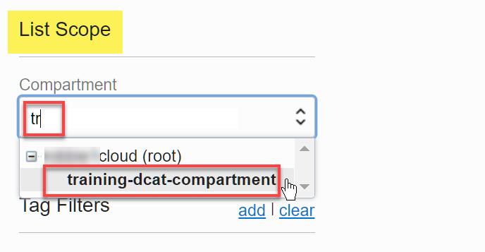

3.  Click **Create Policy**.  

    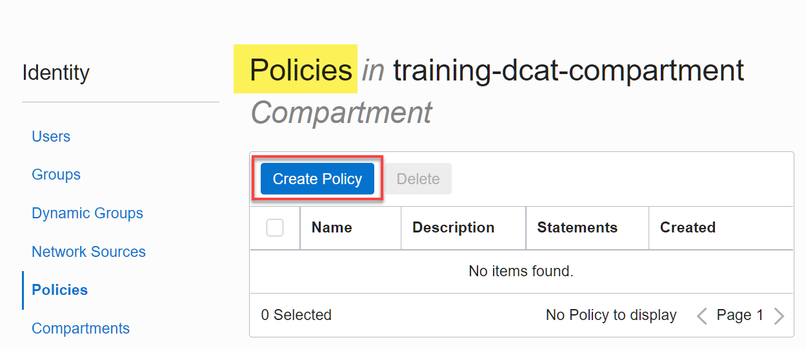

    The **Create Policy** dialog box is displayed.

    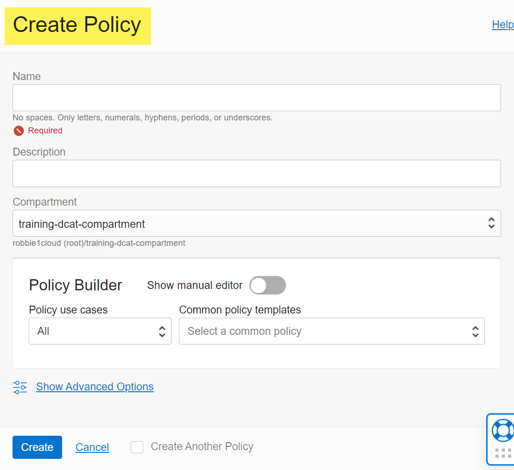


4. In the **Create Policy** dialog box, provide the following information:
    * **Name:** Enter **`training-dcat-admin-policy`**.
    - **Description:** Enter **`Training DCAT Admin Group Policy`**.
    - **Compartment:** Select **`training-dcat-compartment`** from the drop-down list, if it's not already selected.
    - In the **Policy Builder** section, click and slide the **Show manual editor** slider to enable it. An empty text box is displayed in this section.

     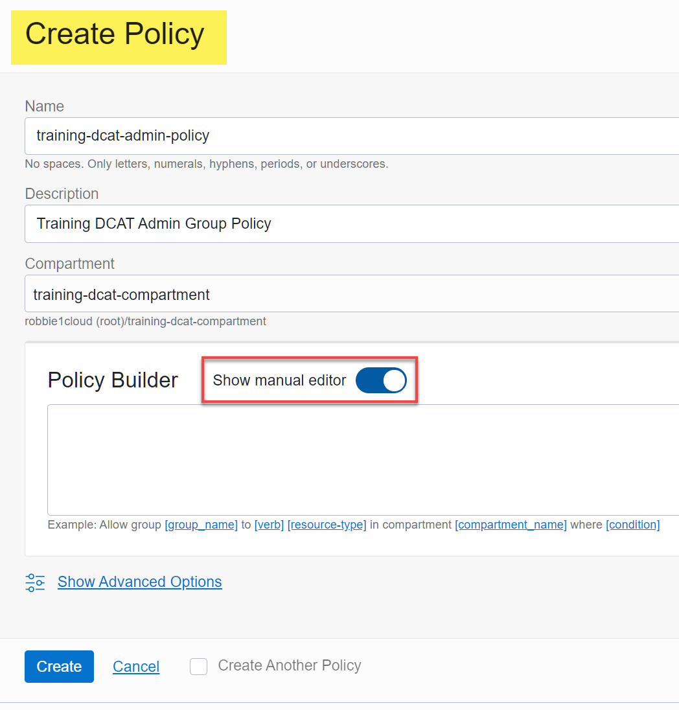

    + Click the **Copy** button in the following code box to copy the policy statement to allow the admin users to perform all operations on all data catalog resources in the `training-dcat-compartment`, and then paste it in the **Policy Builder** text box.

        ```
        <copy>allow group training-dcat-admin-group to manage data-catalog-family in compartment training-dcat-compartment</copy>
        ```
        >**Note:**
        Data Catalog offers both aggregate and individual resource-types for writing policies. You can use aggregate resource-types to write fewer policies. For example, instead of allowing a group to manage **`data-catalogs`** and **`data-catalog-data-assets`**, you can have a policy that allows the group to manage the aggregate resource-type, **`data-catalog-family`**. See [Data Catalog Policies](https://docs.oracle.com/en-us/iaas/data-catalog/using/policies.htm) in the Oracle Cloud Infrastructure documentation.

    + Click the **Copy** button in the following code box to copy the policy statement, and then paste it in the **Policy Builder** text box. This policy statement allows Data Catalog service, **`datacatalog`**, to access the network, create instances, and more. Before you can create a private network in your compartment in a later lab in this workshop, you must have the required networking permissions. The following statement allows you to perform all networking operations in any your **training-dcat-compartment** compartment.

        ```
        <copy>allow group training-dcat-admin-group to manage virtual-network-family in compartment training-dcat-compartment</copy>
        ```    

    + Click the **Copy** button in the following code box to copy the policy statement, and then paste it in the **Policy Builder** text box. This policy statement allows the admin users to view Oracle Cloud Infrastructure users who performed various actions in Data Catalog.

        ```
        <copy>allow group training-dcat-admin-group to inspect users in compartment training-dcat-compartment</copy>
        ```
        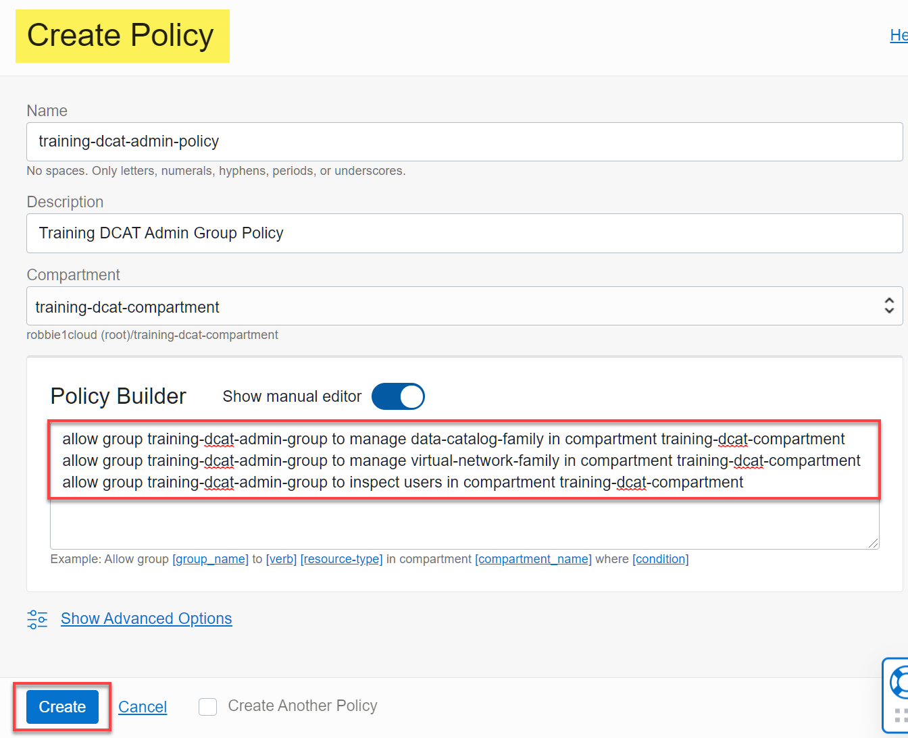

5. Click **Create**. The **Policy Detail** page is displayed. Scroll-down the page to the **Statements** section. The three statements that you added to the policy are displayed.  

  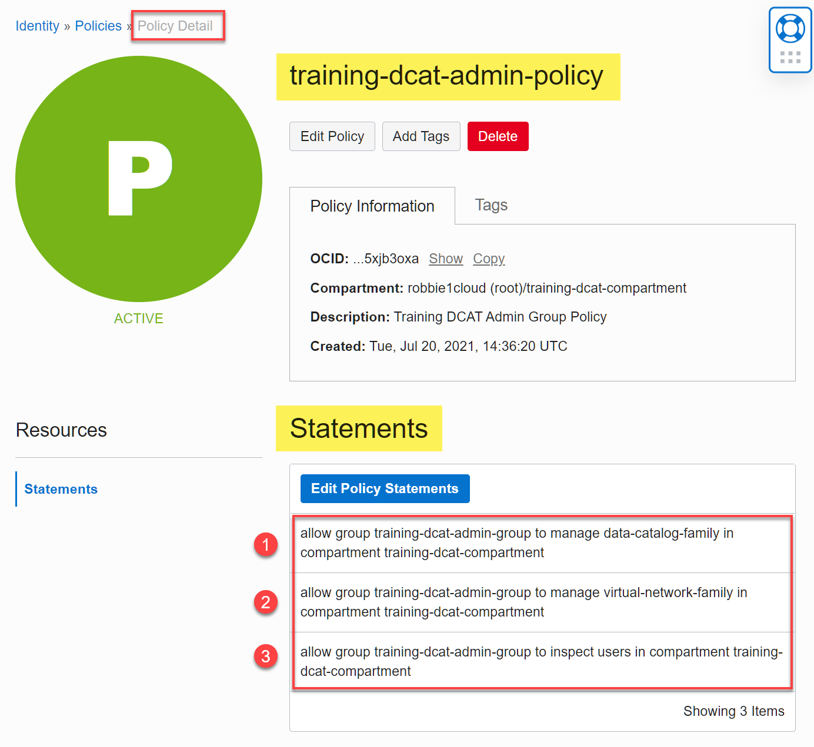

6. Click **Policies** in the breadcrumbs to re-display the **Policies** page. The newly created policy is displayed in the list of available policies.

     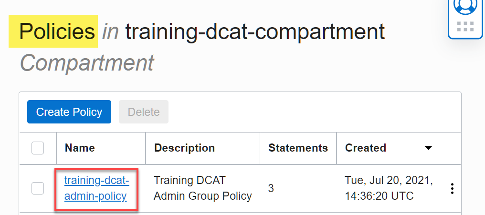

    >**Note:** You can click the name of a policy on this page to view and edit it.
    -->

## Task 5: Create a Dynamic Group
Dynamic groups allow you to group Oracle Cloud Infrastructure compute instances as "principal" actors (similar to user groups). You can then create policies to permit instances to make API calls against Oracle Cloud Infrastructure services. When you create a dynamic group, rather than adding members explicitly to the group, you instead define a set of matching rules to define the group members. For example, a rule could specify that all instances in a particular compartment are members of the dynamic group. The members can change dynamically as instances are launched and terminated in that compartment.

In this task, you will first gather your compartment's OCID which you will use when you create the dynamic group. Next, you create a dynamic group that includes the specific compartment OCID as a resource in the group.

1. Open the **Navigation** menu and click **Identity & Security**. Under **Identity**, select **Compartments**.

2. On the **Compartments** page, in the row for your **training-dcat-compartment**, hover over the OCID link in the **OCID** column, and then click **Copy** to copy the OCID for the **training-dcat-compartment**. Next, paste that OCID to an editor or a file of your choice, so that you can retrieve it when you create the dynamic group.

  

3. Open the **Navigation** menu and click **Identity & Security**. Under **Identity**, click **Dynamic Groups**.

4. On the **Dynamic Groups** page, click **Create Dynamic Group**.

  

5. In the **Create Dynamic Group** dialog box, specify the following:

    + **Name:** Enter **`moviestream-dynamic-group`**.
    + **Description:** Enter **`Training Compartment Dynamic Group`**.
    + In the **Matching Group** section, accept the default **Match any rules defined below** option.
    + Click the **Copy** button in the following code box to copy the dynamic rule, and then paste it in the **Rule 1** text box. This dynamic group will be used in a policy that allows the **`datacatalog`** Data Catalog to access the Object Storage buckets. Substitute the _your-compartment-ocid_ with your **training-dcat-instance** compartment OCID that you copied earlier but make sure you don't delete the single quotation marks around the ocid.

        ```
        <copy>resource.compartment.id='your-compartment-ocid'</copy>
        ```

        > **Note:** Substitute the 'your-compartment-ocid' placeholder above with your own compartment's OCID.

        

    + Click **Create**. The **Dynamic Group Details** page is displayed. Click **Dynamic Groups** in the breadcrumbs to re-display the **Dynamic Groups** page.

         

         The newly created dynamic group is displayed.

         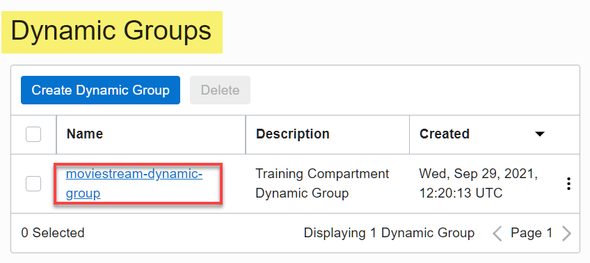


## Task 6: Create Access Policy for Dynamic Group         
After you have created a dynamic group, you need to create a policy to permit the dynamic group to access Oracle Cloud Infrastructure services. In this task, you create a policy to allow Data Catalog in your `training-dcat-compartment` to manage the aggregate resource-type **`data-catalog-family`** as follows:

1. Open the **Navigation** menu and click **Identity & Security**. Under **Identity**, select **Policies**.

2. On the **Policies** page, make sure that your **`training-dcat-compartment`** compartment is selected, and then click **Create Policy**.  

    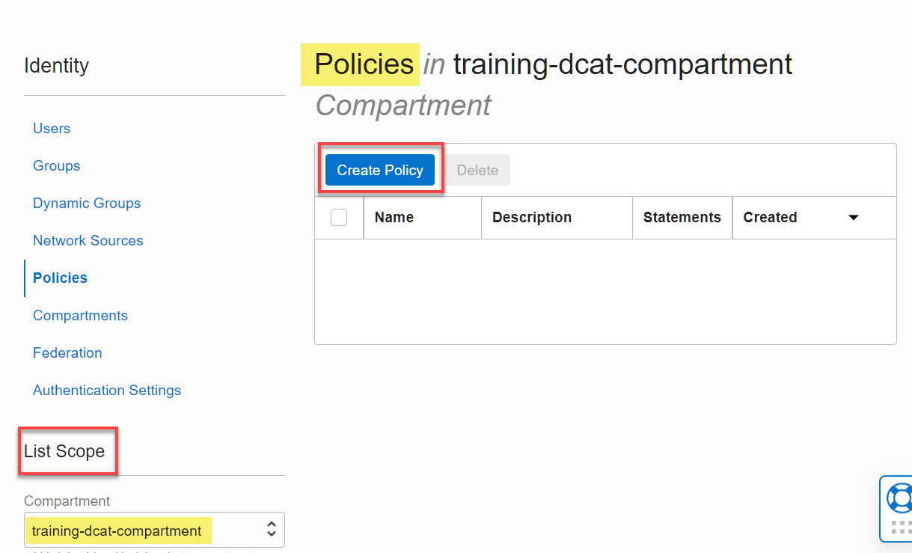

    The **Create Policy** dialog box is displayed.

3. In the **Create Policy** dialog box, provide the following information:
    + Enter **`moviestream-object-storage-policy`** in the **Name** field.
    + Enter **`Grant Dynamic Group instances access to the Data Catalog resources in your compartment`** in the **Description** field.
    + Select **`training-dcat-compartment`** from the **Compartment** drop-down list, if it's not already selected.
    + In the **Policy Builder** section, click and slide the **Show manual editor** slider to enable it. An empty text box is displayed in this section.
    + Allow Data Catalog to access any object in your Oracle Object Storage, in any bucket, in the `training-dcat-compartment` compartment. Click the **Copy** button in the following code box, and then paste it in the **Policy Builder** text box. This policy statement allows any resource in the `moveistream-dynamic-group` to run any catalog operation on any catalog in the `training-dcat-compartment` compartment.  

        ```
        <copy>allow dynamic-group moviestream-dynamic-group to manage data-catalog-family in compartment training-dcat-compartment</copy>
        ```

        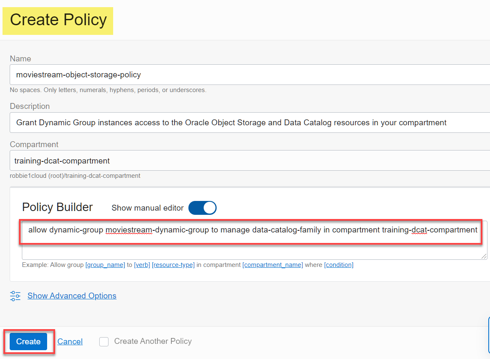

    + Click **Create**. The **Policy Detail** page is displayed. Click **Policies** in the breadcrumbs to return to the **Dynamic Groups** page.

          

          The newly created policy is displayed in the **Policies** page.

          

    > **Note:** In this workshop, you will access public Oracle Object Storage buckets using specific public Pre-authenticated requests (PARs); therefore, you don't need to provide a policy statement to allow Data Catalog in your `training-dcat-compartment` to access any object in your **Oracle Object Storage** (since the public pars are not in this compartment); however, if you were not using public PARs, then in order to access your Oracle Object Storage buckets in your compartment (such as the training-dcat-compartment in this example), you would need the following policy statement:

    ```
    allow dynamic-group moviestream-dynamic-group to manage object-family in compartment training-dcat-compartment
    ```

## Task 7: Create an Autonomous Database Instance

1. Log in to the **Oracle Cloud Console** as the Cloud Administrator. You will complete all the labs in this workshop using this Cloud Administrator.
See [Signing In to the Console](https://docs.cloud.oracle.com/en-us/iaas/Content/GSG/Tasks/signingin.htm) in the _Oracle Cloud Infrastructure_ documentation.

2. On the **Sign In** page, select your tenancy, enter your username and password, and then click **Sign In**. The **Oracle Cloud Console** Home page is displayed.

3. Open the **Navigation** menu and click **Oracle Database**. Under **Oracle Database**, click **Autonomous Database**.

4. On the **Autonomous Databases** page, make sure **`training-dcat-compartment`** is selected in the **Compartment** drop-down list in the **List Scope** section. click **Create Autonomous Database**. The **Create Autonomous Database** page is displayed.

5. In the **Provide basic information for the Autonomous Database** section, specify the following:
       * **Compartment:** **`training-dcat-compartment`**.
       * **Display Name:** **`DB-DCAT Integration`**.
       * **Database Name:** **`TrainingADB`**.

       

6. In the **Choose a workload type** section, accept the **Data Warehouse** default selection.

       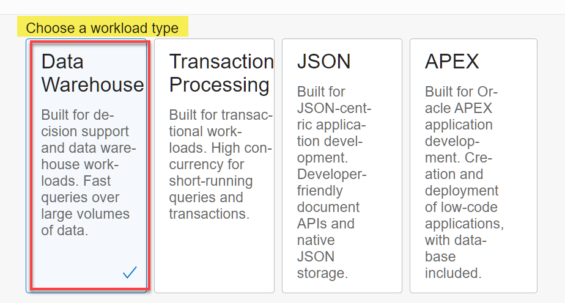

7. In the **Choose a deployment type** section, accept the **Shared Infrastructure** default selection.

       

8. In the **Configure the database** section, specify the following:

       * **Always Free:** Disabled. If your Cloud Account is an Always Free account, you can select this option to create an Always Free autonomous database.
       * **Choose Database version:** **`19c`**.
       * **OCPU count:** **`1`**.   
       * **Auto scaling:** Select this checkbox. This allows the system to automatically use up to three times more CPU and IO resources to meet the workload demand.
       * **Storage:** **`1`** (TB).

       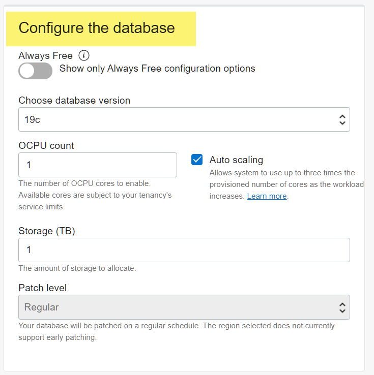

       >**Note:** If you are using a Free Trial or Always Free account, and you want to use Always Free Resources, you need to be in a region where Always Free Resources are available. You can see your current default **region** in the top, right hand corner of the page.

9. In the **Create administrator credentials** section, specify the following:

       * **Username _Read-Only_:** This read-only field displays the default username, **`ADMIN`**.     
       **Important:** Make a note of this _username_ as you will need it to perform later tasks.
       * **Password:** Enter a password for the **`ADMIN`** user of your choice such as **`Training4ADB`**.        
       **Important:** Make a note of this _password_ as you will need it to perform later tasks.
       * **Confirm password:** Confirm your password.

       >**Note:** The password that you choose must meet the following requirements:
       - The password must be between 12 and 30 characters long and must include at least one uppercase letter, one lowercase letter, and one numeric character.
       - The password cannot contain the username.
       - The password cannot contain the double quote (") character.
       - The password must be different from the last 4 passwords used.
       - The password must not be the same password that is set less than 24 hours ago.

       

10. In the **Choose network access** section, select the **Allow secure access from everywhere** access type.     

    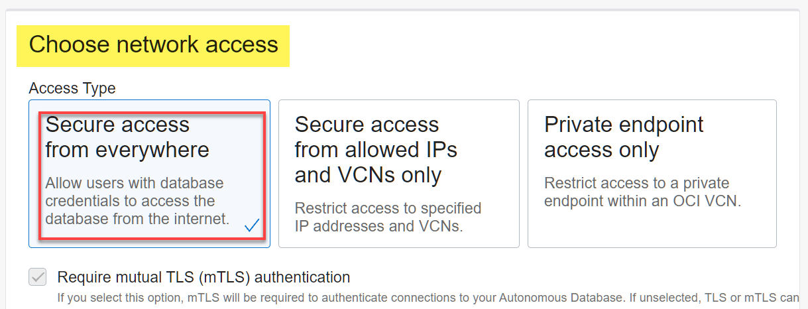

11. In the **Choose a license type** section, accept the default __Bring Your Own License (BYOL)__. Select this type when your organization has existing database licenses.

    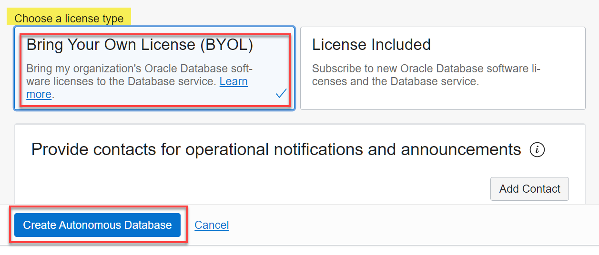

12. Click __Create Autonomous Database__.

13.  The **Autonomous Database Details** page is displayed. The status of your ADB instance is **PROVISIONING**.

    

    In a few minutes, the instance status changes to **AVAILABLE**. At this point, your Autonomous Data Warehouse database instance is ready to use! Review your instance's details including its name, database version, OCPU count, and storage size.

    

14. Click the **Autonomous Database** link in the breadcrumbs. The **Autonomous Database** page is displayed. The new Autonomous Database instance is displayed.

    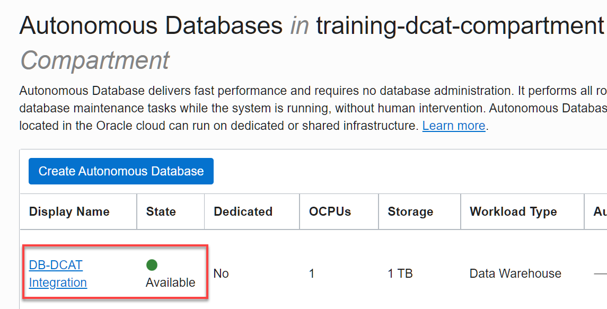


You may now proceed to the next lab.

## Learn More

* [Oracle Cloud Infrastructure Documentation](https://docs.cloud.oracle.com/en-us/iaas/Content/GSG/Concepts/baremetalintro.htm)
* [Data Catalog Overview](https://docs.oracle.com/en-us/iaas/data-catalog/using/overview.htm)
* [What Is a Data Catalog and Why Do You Need One?](https://www.oracle.com/big-data/what-is-a-data-catalog/)
* [Get Started with Data Catalog](https://docs.oracle.com/en-us/iaas/data-catalog/using/index.htm)
* [Managing a Business Glossary](https://docs.oracle.com/en-us/iaas/data-catalog/using/manage-glossary.htm#create-glossary)
* [Managing Dynamic Groups](https://docs.oracle.com/en-us/iaas/Content/Identity/Tasks/managingdynamicgroups.htm#Managing_Dynamic_Groups)
* [Writing Policies for Dynamic Groups](https://docs.oracle.com/en-us/iaas/Content/Identity/Tasks/callingservicesfrominstances.htm#Writing)
* [Using Oracle Autonomous Database on Shared Exadata Infrastructure](https://docs.oracle.com/en/cloud/paas/autonomous-database/adbsa/index.html)

## Acknowledgements
* **Author:** Lauran Serhal, Principal User Assistance Developer, Oracle Database and Big Data
* **Contributor:** Marty Gubar, Product Manager, Server Technologies    
* **Last Updated By/Date:** Lauran Serhal, October 2021
