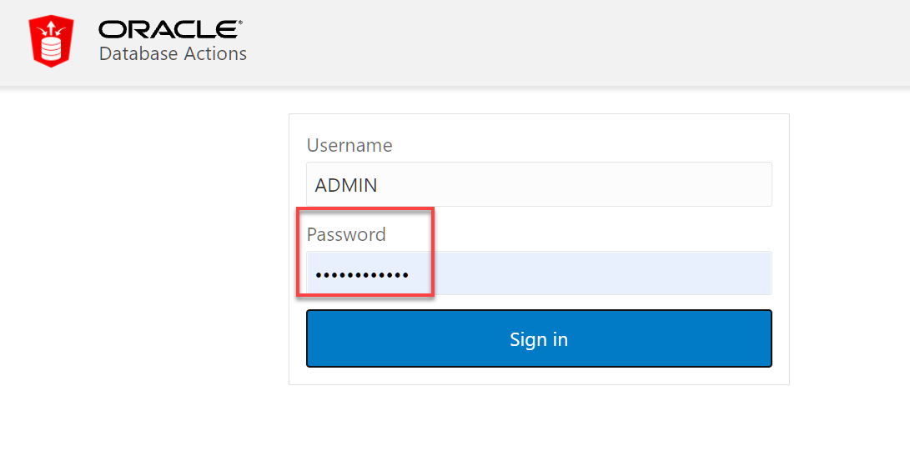
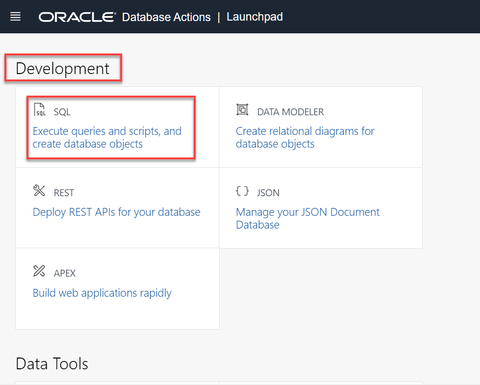
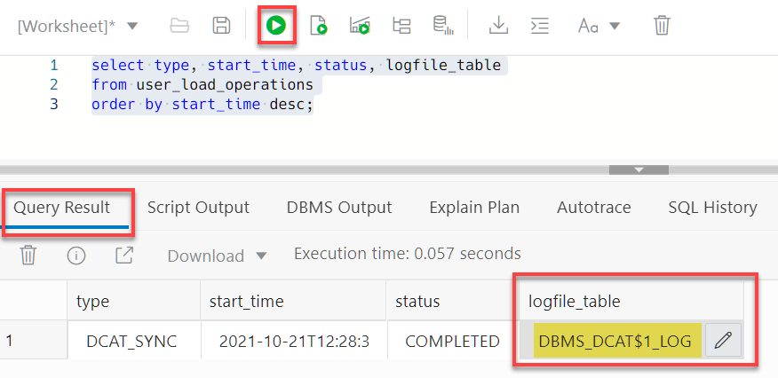

# Synchronize Autonomous Database with Data Catalog

## Introduction

Autonomous Database can leverage the Data Catalog metadata to dramatically simplify management for access to your data lake's object storage. By synchronizing with Data Catalog metadata, Autonomous Database automatically creates external tables for each logical entity harvested by Data Catalog. These external tables are defined in database schemas that are fully managed by the metadata synchronization process. Users can immediately query data without having to manually derive the schema for external data sources and manually create external tables.

Estimated Time: 45 minutes

### Objectives

In this lab, you will:
* Access the ADB SQL Worksheet and run the appropriate scripts
* Connect to your Data Catalog instance and query its objects
* Synchronize Autonomous Database with Data Catalog
* Query the generated log, schemas, and external tables


### Prerequisites

This lab assumes you have:
* An Oracle account
* Completed all previous labs successfully

## **Task 1:** Gather Information About your Data Catalog Instance

In this task, you'll gather information about the Data Catalog instance which you will need in the next task. Save this information in a text editor of your choice such as Notepad in Windows so that you can easily copy and paste this information.

1. Log in to the **Oracle Cloud Console** as the Cloud Administrator that you already used in this workshop, if you are not already logged in. On the **Sign In** page, select your tenancy if needed, enter your username and password, and then click **Sign In**. The Oracle **Cloud Console** Home page is displayed.

2. Open the **Navigation** menu and click **Analytics & AI**. Under **Data Lake**, click **Data Catalog**. In the list of Data Catalog instances, search for your **training-dcat-instance**. In the row for the instance, click the **Actions** button, and then select **Copy OCID** from the context menu. Next, paste that OCID to an editor or a file, so that you can easily retrieve it later in this task.

    

3.   To find your own _region-identifier_, from the **Console**, click the **Region** drop-down list, and then click **Manage Regions**.

    

    The **Infrastructure Regions** page is displayed. In the **Region** section, your Home Region to which you are subscribed is displayed along with your **Region Identifier**, `ca-montreal-1`, in our example:

   

3. On the **Data Catalogs** page, click the **training-dcat-instance** link in **Name** column to display your Data Catalog instance. In the **Home** tab, click the **Data Assets** link.

    

4. On the **Data Assets** page, click the **Oracle Object Storage Data Asset** link.

    

5. On the **Oracle Object Storage: Oracle Object Storage Data Asset**, copy the **Data asset key** value, and then paste it to an editor or a file, so that you can easily retrieve it later in this task.

    


4. Open the **Navigation** menu and click **Identity & Security**. Under **Identity**, click **Compartments**. In the list of compartments, search for your **training-dcat-compartment**. In the row for the compartment, in the **OCID** column, hover over the **OCID** link and then click **Copy**. The status changes from **Copy** to **Copied**. Next, paste that OCID to an editor or a file, so that you can retrieve it later in this task.

    


## **Task 2:** Access the Autonomous Database SQL Worksheet

1. Log in to the **Oracle Cloud Console** as the Cloud Administrator. You will complete all the labs in this workshop using this Cloud Administrator.
See [Signing In to the Console](https://docs.cloud.oracle.com/en-us/iaas/Content/GSG/Tasks/signingin.htm) in the _Oracle Cloud Infrastructure_ documentation.

2. On the **Sign In** page, select your tenancy, enter your username and password, and then click **Sign In**. The **Oracle Cloud Console** Home page is displayed.

3. Open the **Navigation** menu and click **Oracle Database**. Under **Oracle Database**, click **Autonomous Database**.

4. On the **Autonomous Databases** page, click your **DB-DCAT Integration** ADB that you provisioned earlier.

5. On the **Autonomous Database Details** page, click the **Tools** tab. In the **Database Actions** card, click **Open Database Actions**.

   

6. On the **Database Actions** Sign in page, enter **`admin`** in the **Username** field, and then click **Next**.

   

    > **Note:** The **`admin`** username is not case sensitive.  

7. Enter **`Training4ADB`** in the **Password** field, and then click **Sign in**.

    > **Note:** The password is case sensitive. If you chose a different password for the **`admin`** user in the **Setup the Workshop Environment** lab, use that password instead of **`TrainingADB`**.

   

   The **Database Actions Launchpad** Home page is displayed.

   

8. In the **Development** section, click the **SQL** card. The **SQL Worksheet** is displayed.   

    

    > **Note:** In the remaining tasks in this lab, you will use the SQL Worksheet to run the necessary SQL statements to:
    * Connect to your Data Catalog instance and query its objects.
    * Synchronize your ADB instance with your Data Catalog instance.
    * Query the generated schemas and external tables.


## **Task 3:** Connect to Data Catalog

1. Define the following substitution variables, for repeated use in this task by using the SQL\*Plus **`DEFINE`** command. The variables will hold the necessary details for the Data Catalog connection such as the Data Catalog credential name, Data Catalog OCID, Compartment OCID, Home Region, and Data Asset key. Click **Copy** to copy the following code, and then paste it into the SQL Worksheet. **_Don't run the code yet_**.

    ```
    <copy>
    define dcat_credential = 'CRED_OCI'
    define dcat_ocid = 'enter-your-dcat-ocid-here'
    define dcat_region='enter-your-region-identifier-here'
    define dcat_asset_key='enter-your-dcat-asset-key-here'  
    define dcat_compartment = 'enter-your-dcat-compartment-ocid-here'
    </copy>
    ```

    

2. Replace the values of the **`dcat_ocid`**, **`dcat_region`**, **`dcat_asset-key`**, and **`dcat_compartment`** with the values that you have identified in **Task 1: Gather Information About your Data Catalog Instance** in this lab. Place the cursor on any line of code, and then click the **Run Statement**  icon in the Worksheet toolbar. The result is displayed in the **Script Output** tab at the bottom of the worksheet.

    


3. Display all current Data Catalog connections. Click **Copy** to copy the following code, and then paste it into the SQL Worksheet. Click the **Run Statement** icon in the Worksheet toolbar. The result is displayed in the **Query Result** tab at the bottom of the worksheet. In this example, you have not connected to Data Catalog yet; therefore, the result of the query is **`No items to display`**. For detailed information, see [Managing the Data Catalog Connection](https://docs-uat.us.oracle.com/en/cloud/paas/exadata-express-cloud/adbst/ref-managing-data-catalog-connection.html#GUID-BC3357A1-6F0E-4AEC-814E-71DB3E7BB63D).

    ```
    <copy>
    select *
    from dcat_connections;
    </copy>
    ```

    

    >**Note:** To disconnect from Data Catalog, use the **`dbms_dcat.unset_data_catalog_conn`** PL/SQL package procedure. This procedure removes an existing Data Catalog connection. It drops all of the protected schemas and external tables that were created as part of your previous synchronizations; however, it does not remove the metadata in Data Catalog. You should perform this action only when you no longer plan on using Data Catalog and the external tables that are derived, or if you want to start the entire process from the beginning.

    ```
    <copy>
    exec dbms_dcat.unset_data_catalog_conn;
    </copy>
    ```

4. Review the credentials that you will use in this task using the **`all_credentials`** view. Click **Copy** to copy the following code, paste it into the SQL Worksheet, and then and then click **Run Statement** in the Worksheet toolbar.

    ```
    <copy>
    select * from all_credentials;
    </copy>
    ```

    

5. Create a connection to your Data Catalog instance using the `dbms_dcat.set_data_catalog_conn` PL/SQL package procedure. This is required to synchronize the metadata with Data Catalog. An Autonomous Database instance can connect to a single Data Catalog instance. You only need to call this procedure once to set the connection. See [SET\_DATA\_CATALOG\_CONN Procedure](https://docs-uat.us.oracle.com/en/cloud/paas/exadata-express-cloud/adbst/ref-managing-data-catalog-connection.html#GUID-7734C568-076C-4BC5-A157-6DE11F548D2B). The credentials must have access to your Data Catalog Asset and the data in the **`moviestream_landing`** and **`moviestream_gold`** Oracle Object Storage buckets that you use in this workshop. Click **Copy** to copy the following code, paste it into the SQL Worksheet, and then click the **Run Statement** icon in the Worksheet toolbar.

    ```
    <copy>
    exec dbms_dcat.set_data_catalog_conn(-
    region => '&dcat_region', -
    endpoint => NULL, -
    catalog_ocid => '&dcat_ocid', -
    oci_credential => '&dcat_credential');
    end;
    /
    </copy>
    ```

    

    >**Note:** The above code references the substitution variables that you defined in step 1 by preceding the name of the variables by one **_`&`_**. When SQL*Plus encounters a substitution variable in a command, it executes the command as though it contained the value of the substitution variable, rather than the variable itself.

5. Display all of your current Data Catalog connections. Click **Copy** to copy the following code, paste it into the SQL Worksheet, and then click the **Run Statement** icon in the Worksheet toolbar. At this time, you should see your new Data Catalog connection from the previous step.

    ```
    <copy>
    select *
    from dcat_connections;
    </copy>
    ```

    


## **Task 4:** Display Data Assets, Folders, and Entities     

1. Display the available Data Assets in the connected Data Catalog instance. The result should include the **Asset Type** which provides the ability to filter to only Oracle Object Storage sources in this example.

    ```
    <copy>
    select asset_key,
           asset_name,
           description,
           decode(type, '3ea65bc5-f60d-477a-a591-f063665339f9', 'object storage','autonomous database') as type,
           namespace,
           url,
           tags,
           last_updated,
           oracle_schema_prefix
    from all_dcat_assets;
    </copy>
    ```

    


2. Display the Data Assets folders that were harvested from the **`phoenixObjStore`** Oracle Object Storage.

    ```
    <copy>
    select asset_name,
           folder_name,
           tags,
           last_updated,
           oracle_schema
    from all_dcat_folders
    where asset_name = 'phoenixObjStore';
    </copy>
    ```

    

3. Display the entities in the folders coming from the **`phoenixObjStore`** Oracle Object Storage.

    ```
    <copy>
    select folder_name,
           entity_name,
           pattern,
           tags,
           oracle_schema,
           oracle_name
    from all_dcat_entities
    where asset_name = 'phoenixObjStore';
    </copy>
    ```

    


## **Task 5:** Synchronize Autonomous Database with Data Catalog    

1. Synchronize Data Catalog with Autonomous Database using the **`dbms_dcat.run_sync`** PL/SQL package procedure. Synchronize all of the available Data Assets.

    ```
    <copy>
    exec dbms_dcat.run_sync('{"asset_list":["*"]}');
    </copy>
    ```

    

2. If the synchronization is successful, view the generated log to see if there were any errors.

    ```
    <copy>
    select * from dcat_log order by start_time desc;
    </copy>
    ```

    

3. Display the created schemas and tables.

    ```
    <copy>
    select *
    from dcat_schemas;
    </copy>
    ```

    

    > **Note:** By default, the names of the generated schemas start with **`OCI$`**, followed by the Data Asset name, followed by the Bucket name. Those names can be long; however, you can update those long names in Data Catalog. Display the appropriate **Data Asset** and click **Edit**. In the **Edit Data Asset** panel, update the **Name** and **Description** fields as desired, and then click **Save Changes**.

4. The generated table and column names are derived from the respective Logical Entity and its attributes. You can update the Business Name which also updates the names in ADB. In addition, you can use the Oracle Database custom properties in Data Catalog to update data types and names.

    ```
    <copy>
    select oracle_schema_name,
           oracle_table_name
    from dcat_entities;
    </copy>
    ```

    


5. Query the **`genre`** and **`movie`** external tables.

    ```
    <copy>
    select *
    from oci$phx_gold.genre;
    /
    select *
    from oci$phx_gold.movie;
    </copy>
    ```

6. Load the **`oci$phx_gold.genre`** data that will be queried frequently into a new database table named **`genre`**.

    ```
    <copy>
    create table genre as
    select *
    from oci$phx_gold.genre;
    </copy>
    ```

7.  Load the **`oci$phx_gold.movie`** data that will be queried frequently into a new database table named **`movie`**. The **`oci$phx_gold.movie`** data is in JSON format.

    ```
    <copy>
    create table movie as
        select
            cast(m.doc.movie_id as number) as movie_id,
            cast(m.doc.title as varchar2(200 byte)) as title,   
            cast(m.doc.budget as number) as budget,
            cast(m.doc.gross as number) gross,
            cast(m.doc.list_price as number) as list_price,
            cast(m.doc.genre as varchar2(4000)) as genres,
            cast(m.doc.sku as varchar2(30 byte)) as sku,   
            cast(m.doc.year as number) as year,
            to_date(m.doc.opening_date, ''YYYY-MM-DD'') as opening_date,
            cast(m.doc.views as number) as views,
            cast(m.doc.cast as varchar2(4000 byte)) as cast,
            cast(m.doc.crew as varchar2(4000 byte)) as crew,
            cast(m.doc.studio as varchar2(4000 byte)) as studio,
            cast(m.doc.main_subject as varchar2(4000 byte)) as main_subject,
            cast(m.doc.awards as varchar2(4000 byte)) as awards,
            cast(m.doc.nominations as varchar2(4000 byte)) as nominations,
            cast(m.doc.runtime as number) as runtime,
            substr(cast(m.doc.summary as varchar2(4000 byte)),1, 4000) as summary
        from oci$phx_gold.movie m;
        </copy>
    ```

You may now proceed to the next lab.

## Learn More

* [Using Oracle Autonomous Database on Shared Exadata Infrastructure](https://docs.oracle.com/en/cloud/paas/autonomous-database/adbsa/index.html)
* [Connect with Built-in Oracle Database Actions](https://docs.oracle.com/en/cloud/paas/autonomous-database/adbsa/sql-developer-web.html#GUID-102845D9-6855-4944-8937-5C688939610F)
* [DBMS_DCAT Package](https://docs-uat.us.oracle.com/en/cloud/paas/exadata-express-cloud/adbst/ref-dbms_dcat-package.html#GUID-4D927F21-E856-437B-B42F-727A2C02BE8D)
* [Oracle Cloud Infrastructure Documentation](https://docs.cloud.oracle.com/en-us/iaas/Content/GSG/Concepts/baremetalintro.htm)
* [Get Started with Data Catalog](https://docs.oracle.com/en-us/iaas/data-catalog/using/index.htm)
* [Data Catalog Overview](https://docs.oracle.com/en-us/iaas/data-catalog/using/overview.htm)


## Acknowledgements
* **Author:** Lauran Serhal, Principal UA Developer, Oracle Database and Big Data User Assistance
* **Contributor:** Martin Gubar, Director, Product Management Autonomous Database / Cloud SQL    
* **Last Updated By/Date:** Lauran Serhal, September 2021
