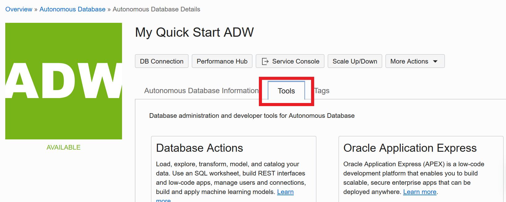
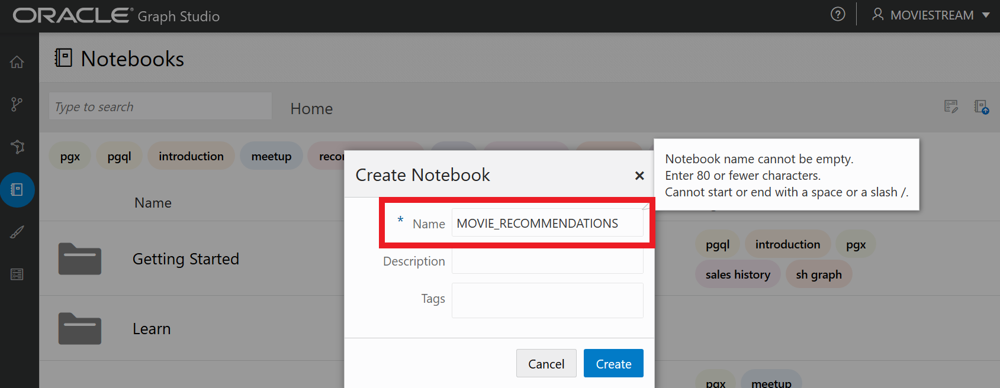

# Use Graph analytics to recommend movies

## Introduction

In this lab you will use graph analytics to identify movies to recommend to customers.

Estimated Time: 30 minutes

### About Graph
When you model your data as a graph, you can run graph algorithms on your data.  Graph algorithms analyze your data based on the connections and relationships in your data.  Graph queries find patterns in your data, such as cycles, paths between vertices, anomalous patterns, and so on.  Graph algorithms are invoked using a Java or Python API, and graph queries are run using PGQL (Property Graph Query Language, see pgql-lang.org).

In this lab you will create a graph from three tables in your data: MOVIE, CUSTOMERS, and CUSTSALES.  You have the choice of over 60 pre-built algorithms to use to analyze this graph.  This lab will use the WhomToFollow algorithm that clusters users based on the movies they have watched.  A customer in a cluster is likely to like movies liked by other customers in the same cluster.  WhomToFollow is used in social network analysis to identify who you should follow in your social network, here we use it to identify movie recommendations that will most interest a customer.  

### Objectives

In this lab, you will use the Graph Studio feature of Autonomous Database to:
* Create a graph
* Start a notebook
* Run a few PGQL graph queries
* Run WhomToFollow from the algorithm library
* Query the results


*This is the "fold" - below items are collapsed by default*

## Task 1: Log into Graph Studio

Graph Studio is a feature of Autonomous Database.   It is available as an option under the **Tools** tab.   You need a graph-enabled user to log into Graph Studio.  In this workshop, user MOVIESTREAM has already been graph-enabled.

1. In your Autonomous Database console, click on the **Tools** tab and then **Graph Studio**
		a.  Click on **Tools**
	 

	  b. Scroll down and click on **Graph Studio**
	 


  To create a link to local file you want the reader to download, use this format:

  Download the [starter file](files/starter-file.sql) SQL code.

  *Note: do not include zip files, CSV, PDF, PSD, JAR, WAR, EAR, bin or exe files - you must have those objects stored somewhere else. We highly recommend using Oracle Cloud Object Store and creating a PAR URL instead. See [Using Pre-Authenticated Requests](https://docs.cloud.oracle.com/en-us/iaas/Content/Object/Tasks/usingpreauthenticatedrequests.htm)*

2. Log in to Graph Studio.  Use the credentials for the database user MOVIESTREAM.

    


## Task 2: Create a GRAPH

3. Click on **Expand** and then on **Start Modeling**
   

	 

4. Expand **MOVIESTREAM** to see the list of tables available for creating a graph.
   

	 

5. Select the tables **CUSTOMER**, **CUSTSALES**, **MOVIE** to create a graph.   For each table, highlight the table, and click on the right arrow.

   

   

   

	 

	 

	 


6. Click **Next**.   The modeler examines the tables, the primary keys, and the foreign key constraints, and proposes the vertex tables and edge tables for the graph.

  


7. Click on **Source** to view the CREATE PROPERTY GRAPH statement.  It is good practice to always confirm that the graph created is the one you want.   Note the following features:
   - Primary key column of vertex tables becomes the KEY
   - Foreign key constraints between vertex tables becomes the edge between the two vertices, with the source vertex from one vertex table, and the destination vertex from the other vertex table.
	 - The direction of the edge is from **movie_id** to **cust_id**

  

	


8. Click on **Designer**.   We will do two things here.
  - Change the edge label name.  By default, the edge label name is the name of the edge table (CUSTSALES).   We will change that to RENTED.   This is just to make the graph visually more tailored to the use case.
  - Change the direction of the edge to be from **cust_id** to **movie_id**.  You can do this by clicking on the two arrows icon. <Explanation will be added later.>

	

	

	

9. Click on **Source** again to confirm that the edge direction is now from **cust_id** to **movie_id**.

  

10. Click **Next**

  

11. Click **Create Graph**

  

12. Select a Graph name.  Ensure that **Load into Memory** radio button is on, and click **Create**.

  

	This step will take about 18 minutes to create a graph with 181k vertices and 25 million edges.

	

## Task 3: Create a notebook
Create a notebook by clicking on the notebook icon on the left, and clicking on **create**.

  

Type in a notebook name and click **create**.




You will now have a notebook to use to run graph queries and graph analytics.  You have three interpreters available: %md for markdown, %pgql-pgx to run PGQL graph queries, and %java-pgx to run graph analytics using the Java API.


You can create a new paragraph by hovering on the bottom of a paragraph and clicking on the + button.


## Task 4: Run Graph Queries and Analytics

You can copy the PGQL queries and Java code snippets and run them in the Notebook.

PGQL is the Property Graph Query Language, a SQL-like language for running graph queries.   PGQL queries run in the interpreter %pgql-pgx.

Over 60 pre-built algorithms can be run using a Java API in the interpreter %java-pgx.

You can use either of these interpreters (or the %md interpreter for text) in this notebook.

14.  The first query is a simple PGQL query that selects all movies that two customers rented.  The two customers are specified in the WHERE clause with specific cust_id values.
  ```
   <copy>
	 %pgql-pgx
   select c1, e, m, e1, c2 from match (c1)-[e]->(m)<-[e1]-(c2) on MOVIE_RECOMMENDATIONS
   where c1.CUST_ID=1236812 and c2.CUST_ID=1002487
   limit 100
	 </copy>
  ```
   


15.  The second PGQL query selects a few edges of a customer and the movies this customer rented.  The query limits the result to limited to 10 edges, where each edge represents a movie this customer rented.

As explained earlier, hover your mouse over the bottom boundary of the paragraph to get the + sign to create a new paragraph.


  ```
  <copy>
	%pgql-pgx
	select c, e, m from match (c)-[e]->(m) on MOVIE_RECOMMENDATIONS
  limit 10
	</copy>
  ```


16. Get a handle to the graph in memory.
  ```
    <copy>
		%java-pgx
    PgxGraph cpGraph = session.getGraph("MOVIE_RECOMMENDATIONS");
    cpGraph;
		</copy>
  ```
	

17. Select a vertex and run the algorithm WhomToFollow.   This algorithm is used in social network analysis.   In this application it clusters customers into communities based on the movies they have rented.  Then, based on the community the vertex belongs to, the algorithm identifies the movies they should recommend for this customer.
  ```
     <copy>
		 %java-pgx
     var queryResult = cpGraph.queryPgql("select v from match (v) where id(v)=991742692410220134");
     out.println("Num rows: " + queryResult.getNumResults());
     queryResult.first();
     PgxVertex<Long> cust = queryResult.getVertex("v");
     out.println(" " + cust.getProperty("FIRST_NAME"));
    var cust_id = cust.getProperty("CUST_ID");
    double cust_id_d = (Double) cust_id;
    int cust_id_i = (int) cust_id_d;
    out.println(" " + cust_id_i);
    Pair<VertexSequence<Long>, VertexSequence<Long>> rmovies = analyst.whomToFollow(cpGraph, cust);
    </copy>
  ```
	


18. Retrieve the customers that customer *Amal* belongs to, and suggested movies for *Amal*.
  ```
     <copy>
		 %java-pgx
     var similarCustomers = rmovies.getFirst();
     var suggestedProducts = rmovies.getSecond();
     out.println("Num similar:" + similarCustomers.size());
     out.println("Num recommended: " + suggestedProducts.size());
		 </copy>
  ```
	

19. List the customers in the cluster *Amal* belongs to.
  ```
    <copy>
		%java-pgx
    for (var v: similarCustomers){
      out.println(""+v.getProperty("FIRST_NAME")+ " " + v.getProperty("LAST_NAME"));
    }
		</copy>
  ```
	


20. List the movies recommended for *Amal*.
  ```
    <copy>
		%java-pgx
    for (var v: suggestedProducts){
       out.println("" + cust_id_i + "\t" + v.getProperty("MOVIE_ID") + "\t" + v.getProperty("TITLE"));
    }
  ```
	

21. Let us verify that there is a path between *Amal* and one of the movies recommended.  We will do that with a PGQL query.
  ```
     <copy>
		 %pgql-pgx
     select v, m.title from match (v)-/:CUSTSALES*/->(m) on MOVIE_RECOMMENDATIONS where id(v)=991742692410220134 and m.title='The Lion King'
		 </copy>
  ```
    

## Learn More

* [LiveLabs](https://apexapps.oracle.com/pls/apex/dbpm/r/livelabs/home) (search for graph)
* [Documentation](https://docs.oracle.com/en/cloud/paas/autonomous-database/graph-studio.html)

## Acknowledgements
* **Author** - Melli Annamalai
* **Contributors** -  Jayant Sharma
* **Last Updated By/Date** - Melli Annamalai, July 2021
