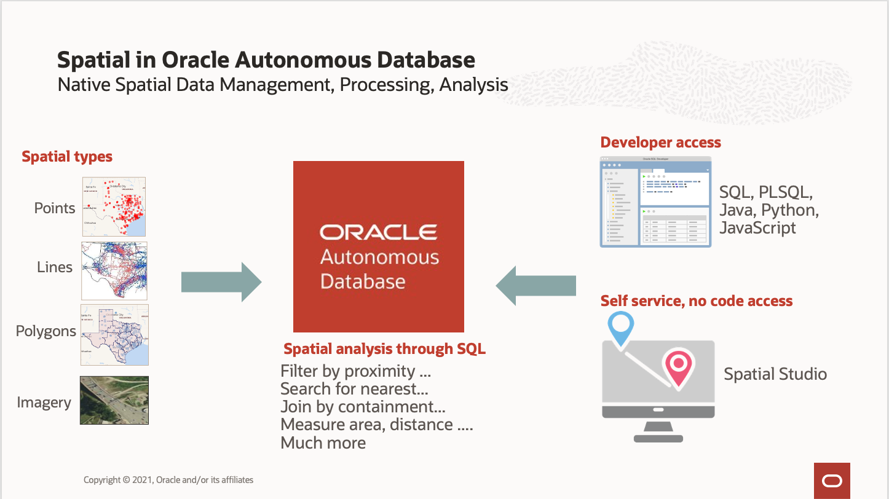
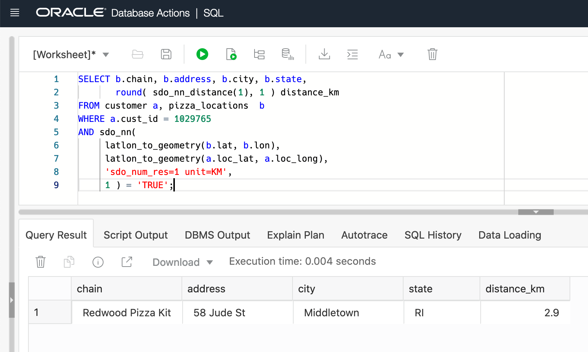
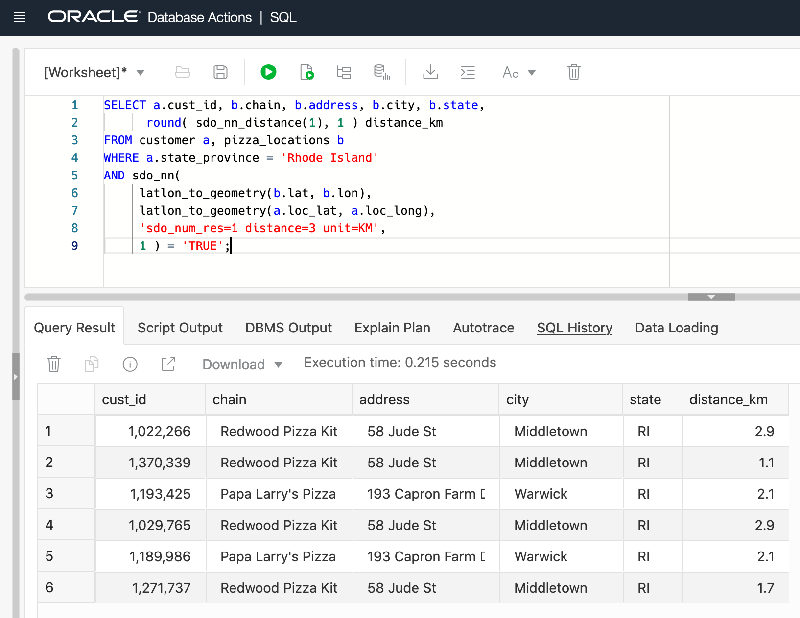
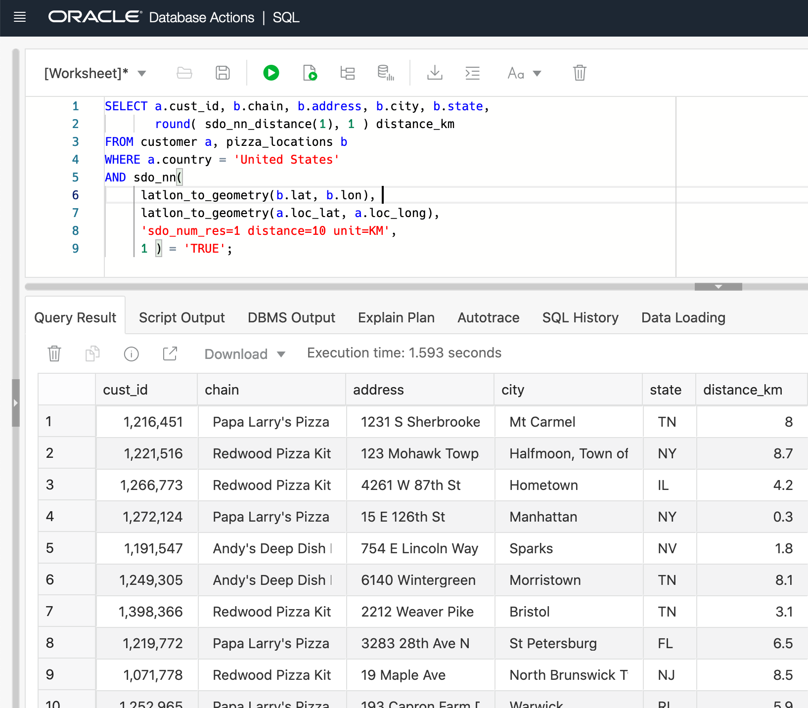

# Find Closest Pizza Shops with Spatial

## Introduction

To reduce customer churn, our business has partnered with a pizza chain to offer coupons for free pizza. The promotion will be offered to customers identified as both likely to churn and within reasonable proximity to a pizza chain location. Likelihood to churn is covered in Lab 6 (Using Oracle Machine Learning AutoML UI to Predict Churn). In this lab you determine which customers are near one or more pizza chain locations, and for those customers, which location is the closest. Specifically, we will answer the following question: "For customers that are within 10km of pizza chain location(s), which is the closest and what is the distance?"

Estimated Lab Time: 20 minutes

### About Product/Technology

Oracle Database, including Oracle Autonomous Database, provides native support for spatial data management, analysis, and processing. Oracle Database stores spatial data (points, lines, polygons) in a native data type called SDO_GEOMETRY. Oracle Database also provides a native spatial index for high performance spatial queries. This spatial index relies on spatial metadata that is entered for each geometry column storing spatial data. Once spatial data is populated and indexed, robust APIs are available to perform spatial analysis, calculations, and processing.  A self-service web application, Spatial Studio, is also available for no-code access to the Spatial features of Oracle Database.



To add spatial capability to a table, we can add and populate a column of type SDO_GEOMETRY and then create a spatial index. In the case of large tables, it would be preferable to enable spatial capability without having to create a new column. Fortunately, Spatial is a first-class feature of Oracle Database and, as such, is able to leverage many powerful mainstream Oracle features.  One such feature is **[function-based indexes](https://docs.oracle.com/en/database/oracle/oracle-database/19/cncpt/indexes-and-index-organized-tables.html#GUID-9AD7651D-0F0D-4FC6-A984-5845F0224EE6)**, which allows creating an index on the result of a SQL function. This is perfect for Spatial: we create a function that accepts coordinates and returns SDO\_GEOMETRY, and then create a spatial index on the output of that function. Using a function-based spatial index, our table is enabled for spatial analysis without the need to add a geometry column.

For a hands-on general introduction, you are encouraged to review **[Introduction to Oracle Spatial Workshop] (https://apexapps.oracle.com/pls/apex/dbpm/r/livelabs/view-workshop?wid=736)**


### Objectives

In this lab, you will:
- Create function-based spatial indexes for tables with latitude, longitude columns
- Perform spatial queries to identify the nearest pizza location to customers


### Prerequisites

- This lab requires completion of Labs 1-4 in the Contents menu on the left.
- You can complete the prerequisite labs in two ways:

    a. Manually run through the labs.

    b. Provision your Autonomous Database and then go to the **Initialize Labs** section in the contents menu on the left. Initialize Labs will create the MOVIESTREAM user plus the required database objects.

**Note:** If you have a **Free Trial** account, when your Free Trial expires your account will be converted to an **Always Free** account. You will not be able to conduct Free Tier workshops unless the Always Free environment is available. **[Click here for the Free Tier FAQ page.](https://www.oracle.com/cloud/free/faq.html)**

## Task 1: Prepare the Data

To prepare your data for spatial analyses, you create function-based spatial indexes on the CUSTOMER\_CONTACT and PIZZA\_LOCATION tables. Function-based spatial indexes enable tables for spatial analysis without the need to create geometry columns. Tables with coordinate columns are always good candidates for a function-based spatial index.


1. As described in the Lab entitled "Create a Database User", Task 3, navigate to a SQL Worksheet as user MOVIESTREAM.

2. Begin by creating a function that accepts coordinates and returns a geometry. In order to use a function for a function-based index, it must be declared DETERMINISTIC. This means that a given input will always return the same output.  Our case of returning a geometry from latitude, longitude input meets this requirement. Run the following command to create the function.

    ```
	<copy>
    CREATE OR REPLACE FUNCTION latlon_to_geometry (
       latitude   IN  NUMBER,
       longitude  IN  NUMBER
    ) RETURN sdo_geometry
       DETERMINISTIC
   IS
   BEGIN
       --first ensure valid lat/lon input
       IF latitude IS NULL OR longitude IS NULL
       OR latitude NOT BETWEEN -90 AND 90
       OR longitude NOT BETWEEN -180 AND 180 THEN
         RETURN NULL;
       ELSE
       --return point geometry
        RETURN sdo_geometry(
                2001, --identifier for a point geometry
                4326, --identifier for lat/lon coordinate system
                sdo_point_type(
                 longitude, latitude, NULL),
                NULL, NULL);
       END IF;
   END;
   </copy>
    ```

3. Next, test the function. Since the function returns a point geometry, you can perform a basic distance calculation using function calls to create the input geometries. Operations that do not involve spatial search or filtering, such as distance between 2 points, do not require a spatial index. Therefore you are able to perform this operation now, before spatial metadata and indexes are created. Run the following query to test the function by calculating the distance between a pair of coordinates.

    ```
    <copy>
    SELECT sdo_geom.sdo_distance(
            latlon_to_geometry(22, -90),
            latlon_to_geometry(23, -91),
            0.05, --tolerance (coordinate precision in meters)
           'unit=KM') as distance_km
      FROM dual;
    </copy>
    ```

    

4. Before creating a spatial index, you must insert a row of metadata for the geometry being indexed. This metadata is stored in a centralized spatial metadata table exposed to users through the view USER\_SDO\_GEOM\_METADATA available to all users. Instead of creating a spatial index on a geometry column, you will be creating function-based spatial indexes. Therefore, you insert spatial metadata specifying the function instead of a column. It is required that the function name be prefixed with the owner name. Run the following commands to insert spatial metadata for the CUSTOMER\_CONTACT and PIZZA\_LOCATION tables.

    ```
    <copy>
    INSERT INTO user_sdo_geom_metadata VALUES (
     'CUSTOMER_CONTACT',
     user||'.LATLON_TO_GEOMETRY(loc_lat,loc_long)',
      sdo_dim_array(
          sdo_dim_element('X', -180, 180, 0.05), --longitude bounds and tolerance in meters
          sdo_dim_element('Y', -90, 90, 0.05)),  --latitude bounds and tolerance in meters
      4326 --identifier for lat/lon coordinate system
        );

    INSERT INTO user_sdo_geom_metadata VALUES (
     'PIZZA_LOCATION',
     user||'.LATLON_TO_GEOMETRY(lat,lon)',
      sdo_dim_array(
          sdo_dim_element('X', -180, 180, 0.05),
          sdo_dim_element('Y', -90, 90, 0.05)),
      4326
       );
    </copy>
    ```

5. Now that spatial metadata has been added, spatial indexes can be created. Spatial indexes are typically created on geometry columns. However here you are creating function-based spatial indexes, or in other words spatial indexes on geometries returned from a function. Run the following commands to create function-based spatial indexes for the CUSTOMER\_CONTACT and PIZZA\_LOCATION tables.

    ```
    <copy>
    CREATE INDEX customer_sidx
    ON customer_contact (latlon_to_geometry(loc_lat,loc_long))
    INDEXTYPE IS mdsys.spatial_index_v2
       PARAMETERS ('layer_gtype=POINT');

    CREATE INDEX pizza_location_sidx
    ON pizza_location (latlon_to_geometry(lat,lon))
    INDEXTYPE IS mdsys.spatial_index_v2
       PARAMETERS ('layer_gtype=POINT');
    </copy>
    ```

## Task 2: Run Spatial Queries

Oracle Autonomous Database provides an extensive SQL API for spatial analysis. This includes spatial relationships, measurements, aggregations, transformations, and more. In this lab you focus on one of those spatial analysis operations, "nearest neighbor" analysis. Nearest neighbor analysis refers to identifying which item(s) are nearest to a location.

The nearest neighbor SQL operator is called ```sdo_nn( )``` and it has the general form:

```
sdo_nn(
geometry1, --geometry in a table
geometry2, --geometry in a table or dynamically defined
parameters --how many nearest neighbors to return
)
```
and returns the item(s) in ```geometry1``` that are nearest to ```geometry2```.

In this lab, instead of creating geometry columns you are using your ```latlon_to_geometry( )``` function to return geometries, so that function will be used to feed geometry to the ```sdo_nn( )``` operator.

There are 2 scenarios for a nearest neighbor query: search all items for nearest neighbor(s), or search only a subset of items. Using pizza locations as an example for these scenarios:

- Scenario 1: Search for nearest pizza location where every pizza location is a candidate for the result.

- Scenario 2: Search for nearest pizza location that offers gluten-free, where availability of gluten-free at pizza locations is identified using a SQL predicate such as gluten\_free\_available='yes'.

This lab is based on scenario 1.  Scenario 2 requires a slightly different syntax for the nearest neighbor SQL operator and adds some complexity to queries at the end of this section. For details on the distinction between these scenarios and the associated syntax, please see the **[nearest neighbor documentation](https://docs.oracle.com/en/database/oracle/oracle-database/19/spatl/spatial-operators-reference.html#GUID-41E6B1FA-1A03-480B-996F-830E8566661D)**.


1. Begin with a **nearest neighbor query**, which returns item(s) nearest to a specific location. Run the following query to identify the pizza location nearest to customer 1029765.

    ```
    <copy>
    SELECT b.chain, b.address, b.city, b.state
    FROM customer_contact a, pizza_location b
    WHERE a.cust_id = 1029765
    AND sdo_nn(
         latlon_to_geometry(b.lat, b.lon),
         latlon_to_geometry(a.loc_lat, a.loc_long),
         'sdo_num_res=1') = 'TRUE';
    </copy>
    ```

    

2. To return the 5 nearest pizza locations, update the sdo\_num\_res parameter from 1 to 5 and re-run.

    ```
    <copy>
    SELECT b.chain, b.address, b.city, b.state
    FROM customer_contact a, pizza_location b
    WHERE a.cust_id = 1029765
    AND sdo_nn(
         latlon_to_geometry(b.lat, b.lon),
         latlon_to_geometry(a.loc_lat, a.loc_long),
         'sdo_num_res=5') = 'TRUE';
    </copy>
    ```

    

3. A **nearest neighbor with distance** query augments the nearest locations with their distance. A numeric placeholder value is added as a final parameter to sdo\_nn, and the same placeholder value is used as the parameter to sdo\_nn\_distance( ) in the select list. Run the following query to identify the pizza location nearest to customer 1029765 along with its distance (rounded to 1 decimal place).

    ```
    <copy>
    SELECT b.chain, b.address, b.city, b.state,
           round( sdo_nn_distance(1), 1 ) distance_km
    FROM customer_contact a, pizza_location  b
    WHERE a.cust_id = 1029765
    AND sdo_nn(
         latlon_to_geometry(b.lat, b.lon),
         latlon_to_geometry(a.loc_lat, a.loc_long),
         'sdo_num_res=1 unit=KM',
         1 ) = 'TRUE';
    </copy>
    ```

    

4. To return the 5 nearest pizza locations with distance, update the sdo\_num\_res parameter from 1 to 5 and re-run. Notice the addition of ORDER BY to order results by distance.

    ```
    <copy>
    SELECT b.chain, b.address, b.city, b.state,
           round( sdo_nn_distance(1), 1 ) distance_km
    FROM customer_contact a, pizza_location  b
    WHERE a.cust_id = 1029765
    AND sdo_nn(
         latlon_to_geometry(b.lat, b.lon),
         latlon_to_geometry(a.loc_lat, a.loc_long),
         'sdo_num_res=5 unit=KM',
         1 ) = 'TRUE'
    ORDER BY distance_km;
    </copy>
    ```

    


5. The previous queries identified pizza locations nearest to a single customer location (i.e. customer 1019429). You can also use the sdo_nn( ) operator to identify the nearest pizza location for a set of customer locations. This is a **nearest neighbor join**, where pizza and customer locations are joined based on the nearest neighbor relationship. Run the following query to identify the nearest pizza location for all customers in Rhode Island.

    ```
    <copy>
    SELECT a.cust_id, b.chain, b.address, b.city, b.state,
           round( sdo_nn_distance(1), 1 ) distance_km
    FROM customer_contact a, pizza_location b
    WHERE a.state_province = 'Rhode Island'
    AND sdo_nn(
         latlon_to_geometry(b.lat, b.lon),
         latlon_to_geometry(a.loc_lat, a.loc_long),
         'sdo_num_res=1 unit=KM',
         1 ) = 'TRUE';
    </copy>
    ```

    

6. An important feature of the sdo\_nn( ) operator is the ability to set a maximum distance threshold. Nearest neighbors are not computed if they are beyond the distance threshold. With customers located across the globe and pizza partner locations only in the eastern United States, it is important to avoid unnecessary computations for customers too far from the nearest pizza location. Run the following query which sets a maximum distance threshold of 3km.

    ```
    <copy>
    SELECT a.cust_id, b.chain, b.address, b.city, b.state,
          round( sdo_nn_distance(1), 1
          ) distance_km
    FROM customer_contact a, pizza_location b
    WHERE a.state_province = 'Rhode Island'
    AND sdo_nn(
         latlon_to_geometry(b.lat, b.lon),
         latlon_to_geometry(a.loc_lat, a.loc_long),
         'sdo_num_res=1 distance=3 unit=KM',
         1 ) = 'TRUE';
    </copy>
    ```

    

    In the above query, supplying a maximum distance parameter is preferred over adding a predicate on ```distance_km```. This is because the distance parameter specifies no search for nearest items beyond the distance threshold, while a distance predicate searches all for nearest items, calculates distances, and then filters.

7. Adjust the maximum distance threshold from 3km to 10km and observe the results change.

    ```
    <copy>
    SELECT a.cust_id, b.chain, b.address, b.city, b.state,
           round( sdo_nn_distance(1), 1 ) distance_km
    FROM customer_contact a, pizza_location b
    WHERE a.state_province = 'Rhode Island'
    AND sdo_nn(
         latlon_to_geometry(b.lat, b.lon),
         latlon_to_geometry(a.loc_lat, a.loc_long),
         'sdo_num_res=1 distance=10 unit=KM',
         1 ) = 'TRUE';
    </copy>
    ```

    

8. You are now ready to identify the nearest pizza partner location for all customers. This promotion is designed to be run as a national campaign in the United States, so the pizza locations we're using in this exercise are restricted to that market. Run the following query to identify the nearest pizza locations using a maximum search distance of 10km.

    ```
    <copy>
    SELECT a.cust_id, b.chain, b.address, b.city, b.state,
           round( sdo_nn_distance(1), 1 ) distance_km
    FROM customer_contact a, pizza_location b
    WHERE a.country = 'United States'
    AND sdo_nn(
         latlon_to_geometry(b.lat, b.lon),
         latlon_to_geometry(a.loc_lat, a.loc_long),
         'sdo_num_res=1 distance=10 unit=KM',
         1 ) = 'TRUE';
    </copy>
    ```

    

9. Create a table from this result so that it can be joined with Machine Learning churn predictions. From this combination of results, a promotion can be created.

    ```
    <copy>
    CREATE TABLE customer_nearest_pizza
    AS
    SELECT a.cust_id, b.chain, b.address, b.city, b.state,
           round( sdo_nn_distance(1), 1 ) distance_km
    FROM customer_contact a, pizza_location b
    WHERE a.country = 'United States'
    AND sdo_nn(
         latlon_to_geometry(b.lat, b.lon),
         latlon_to_geometry(a.loc_lat, a.loc_long),
         'sdo_num_res=1 distance=10 unit=KM',
         1 ) = 'TRUE';
    </copy>
    ```

###Performance and Scaling
Parallel processing is a powerful capability of Oracle Database for high performance and scalability. Parallelized operations are spread across database server processors, where performance generally increases linearly with the "degree of parallelism" (DOP). DOP can be thought of as the number of processors that the operation is spread over. Many spatial operations of Oracle database support parallel processing, including nearest neighbor.

In customer-managed (non-Autonomous) Oracle Database, the degree of parallelism is set using optimizer hints. In Oracle Autonomous Database, parallelism is ... you guessed it... autonomous.  A feature called "auto-DOP" controls parallelism based on available processing resources for the database session. Those available processing resources are in turn based on; 1) the service used for the current session: (service)\_LOW, (service)\_MEDIUM, or (service)\_HIGH, and 2) the shape (total OCPUs) of the Autonomous Database. Changing your connection from LOW to MEDIUM to HIGH  will increase the degree of parallelism and consume more of the overall processing resources for other operations.  So a balance must be reached between optimal performance and sufficient resources for all workloads. Details can be found in the documentation [here](https://docs.oracle.com/en/cloud/paas/autonomous-database/adbsa/manage-priorities.html#GUID-19175472-D200-445F-897A-F39801B0E953).

## Task 3: Purge Changes (Optional)

If you would like to purge all changes made in this lab, run the following commands in order.

    <copy>
    DROP INDEX customer_sidx;

    DROP INDEX pizza_location_sidx;

    DELETE FROM user_sdo_geom_metadata
    WHERE TABLE_NAME in ('CUSTOMER_CONTACT','PIZZA_LOCATION');

    DROP TABLE customer_nearest_pizza ;

    DROP FUNCTION latlon_to_geometry;
    </copy>

You may now [proceed to the next lab](#next).

## Learn More
* [Spatial product portal](https://www.oracle.com/database/spatial/)
* [Spatial documention](https://docs.oracle.com/en/database/oracle/oracle-database/21/spatl/index.html)
* [Spatial blogs](https://blogs.oracle.com/oraclespatial/)

## Acknowledgements
* **Author** - David Lapp, Database Product Management, Oracle
* **Contributors** -  Marty Gubar, Patrick Wheeler, Keith Laker, Rick Green
* **Last Updated By/Date** - David Lapp, July 2021
