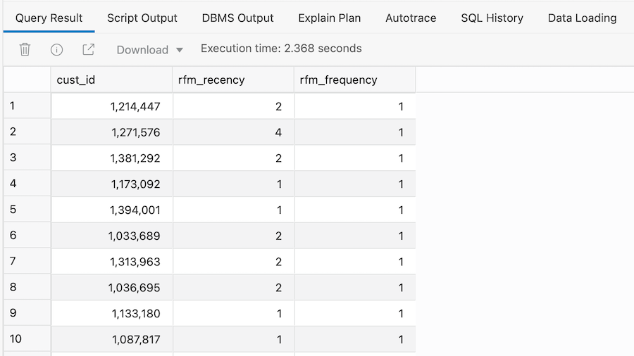

# Finding Our Most Important Customers

## Introduction

In this lab we are going to create a Recency Frequency Monetary (RFM) query to analyze our sales data. This commonly used customer metric will combine some of the SQL analytic functions used in previous queries to create a more complex query using the **`WITH`** clause.

**NOTE:** For more information about RFM, see **[this page](https://en.wikipedia.org/wiki/RFM_(market_research)** on Wikipedia:

Estimated time: 10 minutes

### Objectives

- Understand the importance of Recency Frequency Monetary queries

- Learn how to combine queries using **`WITH`** clause

- Learn about binning as an analytical technique

### Prerequisites
- This lab requires completion of the previous labs in the Contents menu on the left.
- You can complete the prerequisite labs in two ways:

    a. Manually run through the labs.

    b. Provision your Autonomous Database and then go to the **Initialize Labs** section in the contents menu on the left. Initialize Labs will create the MOVIESTREAM user plus the required database objects.

### Overview Of Business Problem

This next example will enrich our existing understanding of customer behavior by utilizing an RFM analysis. RFM is a very commonly used method for analyzing customer value. It is commonly used in general customer marketing, direct marketing, and retail sectors.

In the following steps, the scripts will build a SQL query that will identify:

- Recency: when was the last time the customer accessed the site?

- Frequency: what is the level of activity for that customer on the site?

- Monetary: how much money has the customer spent?

Customers will be categorized into 5 buckets measured (using the NTILE function) in increasing importance. For example, an RFM combined score of 551 indicates that the customer is in the highest tier of customers in terms of recent visits (R=5) and activity on the site (F=5), however the customer is in the lowest tier in terms of spend (M=1). Perhaps this is a customer that performs research on the site, but then decides to buy movies elsewhere!

## Task 1:  Binning Customers Sales By Value

1. Use the following query to segment customers into 5 distinct bins based on the value of their purchases:

    ```
    <copy>SELECT
    m.cust_id,
    c.first_name||' '||c.last_name as cust_name,
    c.country,
    c.gender,
    c.age,
    c.income_level,
    NTILE (5) OVER (ORDER BY SUM(m.actual_price)) AS rfm_monetary
    FROM custsales m
    INNER JOIN customer c ON c.cust_id = m.cust_id
    GROUP BY m.cust_id,
    c.first_name||' '||c.last_name,
    c.country,
    c.gender,
    c.age,
    c.income_level
    ORDER BY m.cust_id,
    c.first_name||' '||c.last_name,
    c.country,
    c.gender,
    c.age,
    c.income_level;</copy>
    ```

2. This should return the following result.

    

    The last column in the report shows the "Bin" value. A value of 1 in this column indicates that a customer is a low spending customer and a value of 5 indicates that a customer is a high spending customer. To see more information about using the `NTILE` function in the SQL documentation, click [here](https://docs.oracle.com/en/database/oracle/oracle-database/19/sqlrf/NTILE.html#GUID-FAD7A986-AEBD-4A03-B0D2-F7F2148BA5E9).

## Task 2:  Binning Customer Sales By Frequency

1. The next step is to determine how frequently customers are watching movies on our platform. To do this, we simply calculate the number of movies watched by each customer and then bin that calculation across 5 buckets.

    ```
    <copy>SELECT
    cust_id,
    NTILE (5) OVER (ORDER BY max(day_ID)) AS rfm_recency,
    NTILE (5) OVER (ORDER BY count(1)) AS rfm_frequency
    FROM custsales
    GROUP BY cust_id;</copy>
    ```

2. This should return the following result.

    

    Now we can identify those customers, based on when they last watched a movie, that watch the fewest number of movies, where the rfm\_frequency is 1, versus those customers that watch the most number of movies, where the rfm\_frequency is 5.

## Task 3:  Creating an RFM Query

1. Now we use the **`WITH`** clause to combine these two queries to create an RFM query:

    ```
    <copy>WITH rfm AS (
    SELECT
    m.cust_id,
    NTILE (5) OVER (ORDER BY max(day_id)) AS rfm_recency,
    NTILE (5) OVER (ORDER BY count(1)) AS rfm_frequency,
    NTILE (5) OVER (ORDER BY SUM(m.actual_price)) AS rfm_monetary
    FROM custsales m
    GROUP BY m.cust_id
    )
    SELECT
    r.cust_id,
    c.first_name||' '||c.last_name AS cust_name,
    r.rfm_recency,
    r.rfm_frequency,
    r.rfm_monetary,
    c.country,
    c.gender,
    c.age,
    c.income_level
    FROM rfm r
    INNER JOIN customer c ON c.cust_id = r.cust_id
    WHERE r.rfm_monetary >= 4
    AND r.rfm_recency <= 2
    ORDER BY r.rfm_monetary desc, r.rfm_recency desc;</copy>
    ```

2. The result only shows customers who have significant spend (>= 4) but have not visited the site recently (<= 2).

    

You may now [proceed to the next lab](#next).

## Recap

Let's quickly recap what has been covered in this lab:

- How to use `NTILE` function to "bin" your sales data

- How to use the `WITH` clause to combine SQL queries

- How to create a Recency Frequency Monetary query

## **Acknowledgements**

- **Author** - Keith Laker, ADB Product Management
- **Adapted for Cloud by** - Richard Green, Principal Developer, Database User Assistance
- **Last Updated By/Date** - Keith Laker, August 2021
