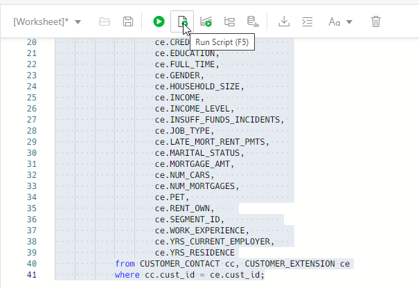
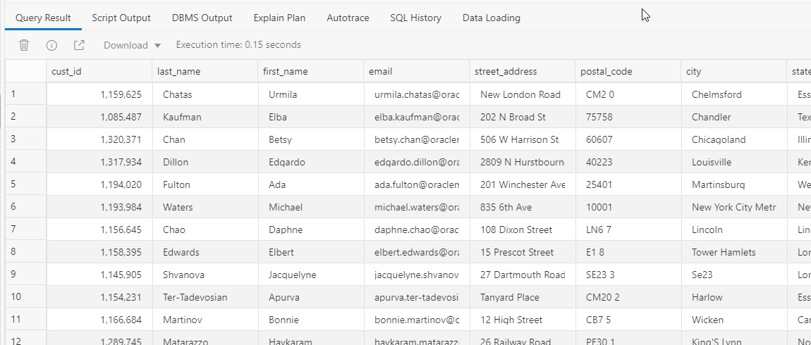
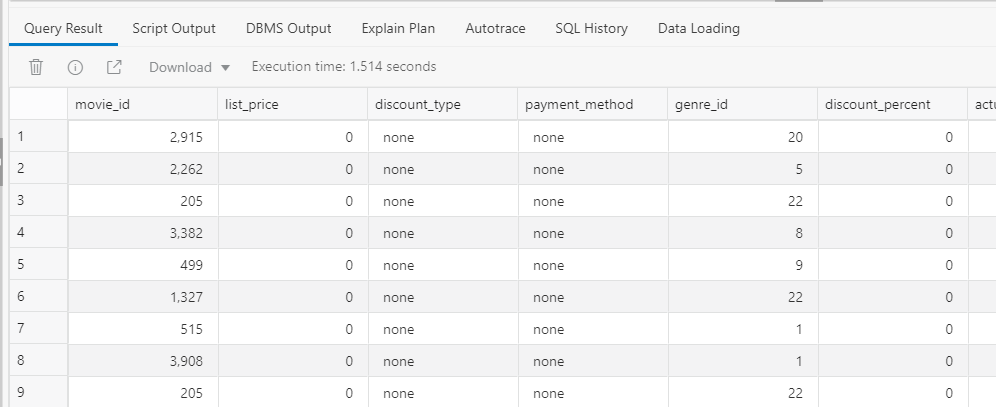
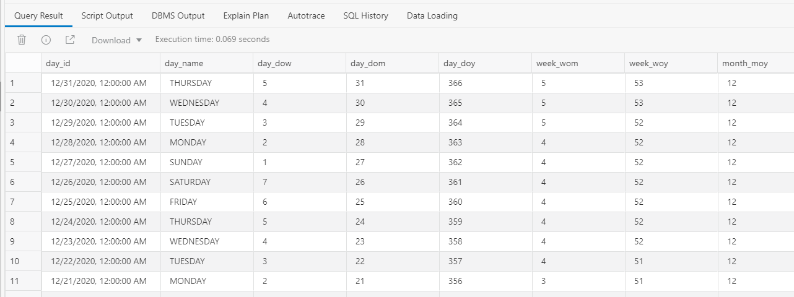

# Load data from object storage using Data Tools and scripting

## Introduction

This lab takes you through the steps needed to load and link data from the MovieStream data lake on [Oracle Cloud Infrastructure Object Storage](https://www.oracle.com/cloud/storage/object-storage.html) into an Oracle Autonomous Database instance in preparation for exploration and analysis.

You can load data into your Autonomous Database (either Oracle Autonomous Data Warehouse or Oracle Autonomous Transaction Processing) using the built-in tools as in this lab, or you can use other Oracle and third party data integration tools. With the built-in tools, you can load data:

+ from files in your local device,
+ from tables in remote databases, or
+ from files stored in cloud-based object storage (Oracle Cloud Infrastructure Object Storage, Amazon S3, Microsoft Azure Blob Storage, Google Cloud Storage).

You can also leave data in place in cloud object storage, and link to it from your Autonomous Database.

> **Note:** While this lab uses Oracle Autonomous Data Warehouse, the steps are identical for loading data into an Oracle Autonomous Transaction Processing database.

Estimated Time: 30 minutes

### About Product

In this lab, we will learn more about the autonomous database's built-in Data Load tool - see the [documentation](https://docs.oracle.com/en/cloud/paas/autonomous-database/adbsa/data-load.html#GUID-E810061A-42B3-485F-92B8-3B872D790D85) for more information.

We will also learn how to exercise features of the DBMS\_CLOUD package to link and load data into the autonomous database using SQL scripts. For more information about DBMS_CLOUD, see its [documentation](https://docs.oracle.com/en/cloud/paas/autonomous-database/adbsa/dbms-cloud-package.html).


### Objectives


+ Learn how to define object storage credentials for your autonomous database
+ Learn how to load data from object storage using Data Tools
+ Learn how to load data from object storage using the DBMS\_CLOUD APIs executed from SQL
+ Learn how to enforce data integrity in newly loaded tables


### Prerequisites

+ This lab requires you to have access to an autonomous database instance; either Oracle Autonomous Data Warehouse (ADW) or Oracle Autonomous Transaction Processing (ATP).

+ The MOVIESTREAM user must have been set up. If the user is not set up, please complete Lab 3 in this series (Create a Database User) before proceeding.

## Task 1: Configure the Object Storage Connections

In this step, you will set up access to the two buckets on Oracle Cloud Infrastructure Object Storage that contain data that we want to load - the landing area, and the 'gold' area. 

1. In your database's details page, click the Tools tab. Click **Open Database Actions**

	  

2. On the login screen, enter the username MOVIESTREAM, then click the blue **Next** button.

3. Enter the password for the MOVIESTREAM user you set up in the earlier lab.

4. Under **Data Tools**, click on **DATA LOAD**

    

5. In the **Explore and Connect** section, click on **CLOUD LOCATIONS** to set up the connection from your autonomous database to object storage.

    

6. To add access to the Moviestream landing area, click on **+Add Cloud Storage** in the top right of your screen.

-   In the **Name** field, enter 'MovieStreamLanding'

> **Note:** Take care not to use spaces in the name.

-   Leave Cloud Store selected as **Oracle**
-   Copy and paste the following URI into the URI + Bucket field:
```
<copy>
https://objectstorage.us-ashburn-1.oraclecloud.com/n/adwc4pm/b/moviestream_landing/o
</copy>
```
-   Select **No Credential** as this is a public bucket
-   Click on the **Test** button to test the connection. Then click **Create**.

7. The page now invites us to load data from this area. In this case, we want to set up access to an additional cloud location first. Click on Data Load in the top left of your screen to go back to the main Data Load page.

    

8. In the **Explore and Connect** section, click on **CLOUD LOCATIONS**, then to add access to the Moviestream gold area, click on **+Add Cloud Storage**.

-   In the **Name** field, enter 'MovieStreamGold'

> **Note:** Take care not to use spaces in the name.

-   Leave Cloud Store selected as **Oracle**
-   Copy and paste the following URI into the URI + Bucket field:

```
<copy>
https://objectstorage.us-ashburn-1.oraclecloud.com/n/adwc4pm/b/moviestream_gold/o
</copy>
```

-   Select **No Credential** as this is a public bucket
-   Click on the **Test** button to test the connection. Then click **Create**.

We now have two cloud storage locations set up.


## Task 2: Load data from files in Object Storage using Data Tools

In this step we will perform some simple data loading tasks, to load in CSV files from object storage into tables in our autonomous database.

1. To load or link data from our newly configured cloud storage, click on the **Data Load** link in the top left of your screen.

    

2. Under **What do you want to do with your data?** select **LOAD DATA**, and under **Where is your data?** select **CLOUD STORAGE**, then click **Next**

    

3. From the MOVIESTREAMGOLD location, drag the **customer_contact** folder over to the right hand pane. Note that a dialog box appears asking if we want to load all the files in this folder to a single target table. In this case, we only have a single file, but we do want to load this into a single table. Click **OK**.

4. Next, drag the **genre** folder over to the right hand pane. Again, click **OK** to load all files into a single table.


5. Click on the pencil icon for the **customer_contact** task to view the settings for this load task.

    

6. Here we can see the list of columns and data types that will be created from the csv file. They all look correct, so click **Close** to close the settings viewer.

7. Click on the pencil icon for the **genre** task to view its settings. This should show just two columns to be created - **GENRE_ID** and **NAME**. Click **Close** to close the settings viewer.

8. Now click on the Play button to run the data load job.

    

    The job should take about 20 seconds to run.

9. Check that both data load cards have green tick marks in them, indicating that the data load tasks have completed successfully.

    

10. Now, to load some more data from the MovieStream landing area, click on the **Data Load** link in the top left of your screen.

    

11. Under **What do you want to do with your data?** select **LOAD DATA**, and under **Where is your data?** select **CLOUD STORAGE**, then click **Next**

12. This time, select **MOVIESTREAMLANDING** in the top left of your screen.

    

13. From the MOVIESTREAMLANDING location, drag the **customer_extension** folder over to the right hand pane and click **OK** to load all objects into one table.

14. Drag the **customer_segment** folder over to the right hand pane and click **OK**.

15. Drag the **pizza_location** folder over to the right hand pane and click **OK**.

16. Click on the Play button to run the data load job.

    

    The job should take about 20 seconds to run.

17. Check that all three data load cards have green tick marks in them, indicating that the data load tasks have completed successfully.

    

18. Click on the **Done** button in the bottom right of the screen.

## Task 3: Creating the Customer table

We have now loaded a number of tables, including two main tables containing information about MovieStream customers - CUSTOMER\_CONTACT and CUSTOMER\_EXTENSION. It will be useful to link these tables together to create a joined table of customer information. We can do this with some simple SQL.

1. In the **Development** section, click on **SQL** to open a SQL Worksheet.

2. Copy and paste the following script into the Worksheet. This script will create the table **CUSTOMER**, joining our customer information together.

```
<copy>
create table CUSTOMER
            as
            select  cc.CUST_ID,                
                    cc.LAST_NAME,              
                    cc.FIRST_NAME,             
                    cc.EMAIL,                  
                    cc.STREET_ADDRESS,         
                    cc.POSTAL_CODE,            
                    cc.CITY,                   
                    cc.STATE_PROVINCE,         
                    cc.COUNTRY,                
                    cc.COUNTRY_CODE,           
                    cc.CONTINENT,              
                    cc.YRS_CUSTOMER,           
                    cc.PROMOTION_RESPONSE,     
                    cc.LOC_LAT,                
                    cc.LOC_LONG,               
                    ce.AGE,                    
                    ce.COMMUTE_DISTANCE,       
                    ce.CREDIT_BALANCE,         
                    ce.EDUCATION,              
                    ce.FULL_TIME,              
                    ce.GENDER,                 
                    ce.HOUSEHOLD_SIZE,         
                    ce.INCOME,                 
                    ce.INCOME_LEVEL,           
                    ce.INSUFF_FUNDS_INCIDENTS, 
                    ce.JOB_TYPE,               
                    ce.LATE_MORT_RENT_PMTS,    
                    ce.MARITAL_STATUS,         
                    ce.MORTGAGE_AMT,           
                    ce.NUM_CARS,               
                    ce.NUM_MORTGAGES,          
                    ce.PET,                    
                    ce.RENT_OWN,    
                    ce.SEGMENT_ID,           
                    ce.WORK_EXPERIENCE,        
                    ce.YRS_CURRENT_EMPLOYER,   
                    ce.YRS_RESIDENCE
            from CUSTOMER_CONTACT cc, CUSTOMER_EXTENSION ce
            where cc.cust_id = ce.cust_id;
</copy>
```
3. Click on the **Run Script** button (or use the F5 key) to run the script.

    

4. To check that the table has been created correctly, click on the bin icon to clear the worksheet and copy and paste the following statement:

```
<copy>
select * from customer;
</copy>
```

5. Click on the Run button to run the statement. You should see customer information, like this:

    

If you scroll to the right, you can see the columns that have been joined from the **customer\_extension** table, such as **age**, and **commute\_distance**.

## Task 4: Using database APIs to load richer data files

The DBMS\_CLOUD package is a feature of the autonomous database that enables us to extend the database to load from, and link to, cloud data storage systems such as Oracle Cloud Infrastructure Object Storage, Amazon S3, and Microsoft Azure Blob Storage. This package is used by the Data Load tool, but can also be exercised using SQL. For more information see the [DBMS\_CLOUD documentation](https://docs.oracle.com/en/cloud/paas/autonomous-database/adbsa/dbms-cloud-package.html).

In this step, we will use some additional features of the DBMS\_CLOUD APIs to load in some Parquet and JSON files with differently structured data.

>**Note** [Parquet](https://parquet.apache.org/documentation/latest/) is a common big data file format, where often many parquet files are used to store large volumes of data with a common type and with a common set of columns; in this case, the customer sales data for Moviestream. 

1.  Still in the SQL Worksheet viewer, click on the bin icon on the top toolbar to clear the worksheet.

    

2.  Now, copy and paste the following script into the worksheet. This script will create the table **ext_custsales**, linking to the parquet files in the **custsales** folder in Object Store.

```
<copy>
define uri_gold = 'https://objectstorage.us-ashburn-1.oraclecloud.com/n/adwc4pm/b/moviestream_gold/o'
define parquet_format = '{"type":"parquet",  "schema": "all"}'
 
begin
    dbms_cloud.create_external_table(
        table_name => 'ext_custsales',
        file_uri_list => '&uri_gold/custsales/*.parquet',
        format => '&parquet_format',
        column_list => 'MOVIE_ID NUMBER(20,0),
                        LIST_PRICE BINARY_DOUBLE,
                        DISCOUNT_TYPE VARCHAR2(4000 BYTE),
                        PAYMENT_METHOD VARCHAR2(4000 BYTE),
                        GENRE_ID NUMBER(20,0),
                        DISCOUNT_PERCENT BINARY_DOUBLE,
                        ACTUAL_PRICE BINARY_DOUBLE,
                        DEVICE VARCHAR2(4000 BYTE),
                        CUST_ID NUMBER(20,0),
                        OS VARCHAR2(4000 BYTE),
                        DAY_ID date,
                        APP VARCHAR2(4000 BYTE)'
    ); 
end;
</copy>
```

3.  Click on the **Run Script** button (or use the F5 key) to run the script.

    

    We now have a new **ext_custsales** table that links to all of the parquet files in the **custsales** folder of our data lake on object storage. 
    
4.  To check that the data has been linked correctly, click on the bin icon to clear the worksheet and copy and paste the following statement:

```
<copy>
select * from ext_custsales;
</copy>
```

5.  Click on the Run button to run the statement. You should see transactional data representing customer movie purchases and rentals, like this:

    


6.  For the purposes of later labs, it is useful for us to copy the data from **ext_custsales** over to a **custsales** table. To do this, click on the bin icon to clear the worksheet. Then, copy and paste the following statement into the worksheet, and click on the Run (or Run Script) button to run the statement:

```
<copy>
create table custsales as select * from ext_custsales;
</copy>
```

> **Note:** This may take a minute or two, since it will be copying over 25m rows.

7. Next, we will create an external table to link to the **movies.json** file. To do this, click on the bin icon in the top toolbar to clear the worksheet, and then the bin icon in the lower window to clear the output, then copy and paste the following script:

```
<copy>
define uri_gold = 'https://objectstorage.us-ashburn-1.oraclecloud.com/n/adwc4pm/b/moviestream_gold/o'
define json_format = '{"skipheaders":"0", "delimiter":"\n", "ignoreblanklines":"true"}'
begin
    dbms_cloud.create_external_table(
        table_name => 'ext_movie',
        file_uri_list => '&uri_gold/movie/movies.json',
        format => '&json_format',
        column_list => 'doc varchar2(30000)'
        );
end;
/
</copy>  
```

8. This has created a simple external table (**ext_movie**) with the whole JSON structure in a single column. It will be useful to create a more structured table from this data. To do this, click on the bin icon in the top toolbar to clear the worksheet, and then the bin icon in the lower window to clear the output, then copy and paste the following script:

```
<copy>
create table movie as
select
    cast(m.doc.movie_id as number) as movie_id,
    cast(m.doc.title as varchar2(200 byte)) as title,   
    cast(m.doc.budget as number) as budget,
    cast(m.doc.gross as number) gross,
    cast(m.doc.list_price as number) as list_price,
    cast(m.doc.genre as varchar2(4000)) as genres,
    cast(m.doc.sku as varchar2(30 byte)) as sku,   
    cast(m.doc.year as number) as year,
    to_date(m.doc.opening_date, 'YYYY-MM-DD') as opening_date,
    cast(m.doc.views as number) as views,
    cast(m.doc.cast as varchar2(4000 byte)) as cast,
    cast(m.doc.crew as varchar2(4000 byte)) as crew,
    cast(m.doc.studio as varchar2(4000 byte)) as studio,
    cast(m.doc.main_subject as varchar2(4000 byte)) as main_subject,
    cast(m.doc.awards as varchar2(4000 byte)) as awards,
    cast(m.doc.nominations as varchar2(4000 byte)) as nominations,
    cast(m.doc.runtime as number) as runtime,
    substr(cast(m.doc.summary as varchar2(4000 byte)),1, 4000) as summary
from ext_movie m;
</copy>
```

9.  Click on the **Run Script** button to run the script.

10. Part of our later data analysis will require us to have a TIME table in the autonomous database. Adding this table will simplify analytic queries that need to do time-series analyses. We can create this table with a few lines of SQL. Click on the bin icon to clear the worksheet, and then the bin icon in the lower window to clear the output, then copy and paste the following lines:

```
<copy>
create table TIME as
SELECT TRUNC (to_date('2021-01-01','YYYY-MM-DD') - ROWNUM) as day_id
FROM DUAL CONNECT BY ROWNUM < 732;
</copy>  
```

11. Click on the **Run Script** button to run the script.

12. It is useful for us to add some additional 'virtual' columns for different time dimensions that we can use in later analysis. To do this, click on the bin icon to clear the worksheet, then copy and paste the following script:

```
<copy>
alter table time
add (
    day_name as (to_char(day_id, 'DAY')),
    day_dow as (to_char(day_id, 'D')),
    day_dom as (to_char(day_id, 'DD')),
    day_doy as (to_char(day_id, 'DDD')),
    week_wom as (to_char(day_id, 'W')),
    week_woy as (to_char(day_id, 'WW')),
    month_moy as (to_char(day_id, 'MM')),
    month_name as (to_char(day_id, 'MONTH')),
    month_aname as (to_char(day_id, 'MON')),
    quarter_name as ('Q'||to_char(day_id, 'Q')||'-'||to_char(day_id, 'YYYY')),
    quarter_qoy as (to_char(day_id, 'Q')),
    year_name as (to_char(day_id, 'YYYY'))
);
</copy>
```
13. Click on the **Run Script** button to run the script.

14. To ensure the table has been created correctly, click on the bin icon to clear the worksheet, then copy and paste and Run the following query:

```
<copy>
select * from time;
</copy>  
```

15. You should see a number of columns with different date dimensions, for all the dates in the years 2020 and 2019:

    

## Task 4: Enforcing data integrity

In this task, we will use the database's ability to define and enforce constraints to ensure that the data in the newly loaded tables remains valid. This will be important in later labs.

In this example, we will define primary key constraints for a number of tables, to ensure that all records in each table have a populated and unique value for the key identifying column.

We will also add constraints on the **movie** table to ensure that all the columns that contain JSON data must contain valid JSON, to ensure no bad data can exist in the table.

1. Still in the SQL Worksheet viewer, click on the bin icon to clear the worksheet, then copy and paste and Run the following script:

```
<copy>
alter table genre add constraint pk_genre_id primary key("GENRE_ID");

alter table customer add constraint pk_customer_cust_id primary key("CUST_ID");
alter table customer_extension add constraint pk_custextension_cust_id primary key("CUST_ID");
alter table customer_contact add constraint pk_custcontact_cust_id primary key("CUST_ID");
alter table customer_segment add constraint pk_custsegment_id primary key("SEGMENT_ID");

alter table movie add constraint pk_movie_id primary key("MOVIE_ID");
alter table movie add CONSTRAINT movie_cast_json CHECK (cast IS JSON);
alter table movie add CONSTRAINT movie_genre_json CHECK (genres IS JSON);
alter table movie add CONSTRAINT movie_crew_json CHECK (crew IS JSON);
alter table movie add CONSTRAINT movie_studio_json CHECK (studio IS JSON);
alter table movie add CONSTRAINT movie_awards_json CHECK (awards IS JSON);
alter table movie add CONSTRAINT movie_nominations_json CHECK (nominations IS JSON);

alter table pizza_location add constraint pk_pizza_loc_id primary key("PIZZA_LOC_ID");

alter table time add constraint pk_day primary key("DAY_ID");


-- foreign keys
alter table custsales add constraint fk_custsales_movie_id foreign key("MOVIE_ID") references movie("MOVIE_ID");
alter table custsales add constraint fk_custsales_cust_id foreign key("CUST_ID") references customer("CUST_ID");
alter table custsales add constraint fk_custsales_day_id foreign key("DAY_ID") references time("DAY_ID");
alter table custsales add constraint fk_custsales_genre_id foreign key("GENRE_ID") references genre("GENRE_ID");
</copy>
```

2.  To check one example of how the unique constraints work, we can now try to reload into the **pizza\_location** table the same data we have already loaded. This should return an error as the data already exists in the table and we do not want to duplicate it. To do this, click on the bin icon to clear the worksheet, then copy and paste and Run the following statement to check the number of rows in the **pizza\_location** table:

```
<copy>
select count (*) from pizza_location;
</copy>
```

This should return a count of 104 rows in the table.

3. Now, copy and paste then Run the following script, which tries to reload the data from the **pizza_location.csv** file into the same table:

```
<copy>
define csv_format = '{"dateformat":"YYYY-MM-DD", "skipheaders":"1", "delimiter":",", "ignoreblanklines":"true", "removequotes":"true", "blankasnull":"true", "trimspaces":"lrtrim", "truncatecol":"true", "ignoremissingcolumns":"true"}'
BEGIN
DBMS_CLOUD.COPY_DATA (
table_name => 'pizza_location',
file_uri_list => 'https://objectstorage.us-ashburn-1.oraclecloud.com/n/adwc4pm/b/moviestream_landing/o/pizza_location/pizza_location.csv',
format => '&csv_format'
);
END;
/
</copy>
```

4. Due to the primary key constraint on the **pizza_location** table, we can see that the database returns an error attempting to copy over the same data.

    

5. To prove that the **pizza_location** table has been unaffected by this rogue data loading attempt, copy and paste then Run the command to count the rows again:

```
<copy>
select count (*) from pizza_location;
</copy>
```

The count remains at 104 rows as there were no new rows to copy from the file.


This completes the Data Load lab. We now have a full set of structured tables loaded into the Autonomous Database from the MovieStream data lake, with suitable constraints set up on the tables to avoid errors in attempting to load duplicate rows or invalid data. We will be working with these tables in later labs.


## Acknowledgements

* **Author** - Mike Matthews, Autonomous Database Product Management
* **Contributors** -  Marty Gubar, Autonomous Database Product Management
* **Last Updated By/Date** - Mike Matthews, Autonomous Database Product Management, September 2021
