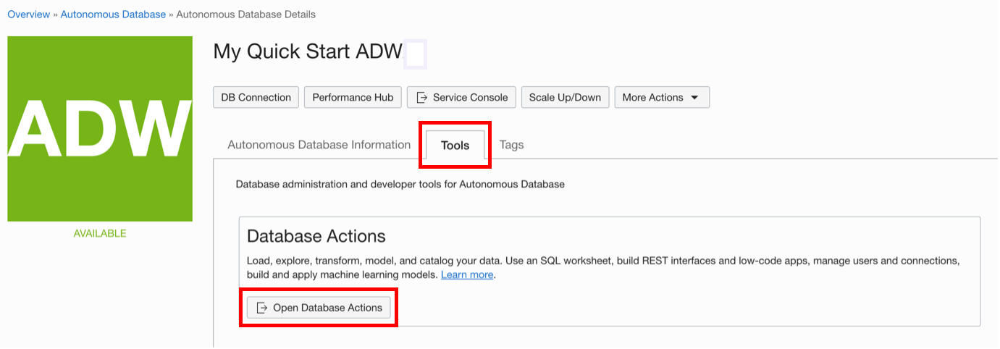
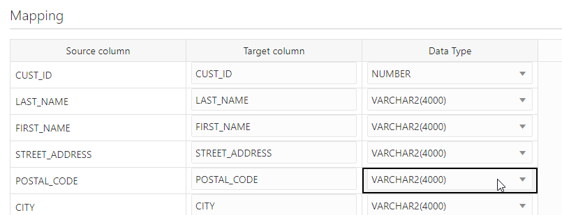

# Loading data from object storage using Data Tools (& API)

## Introduction

This lab takes you through the steps needed to link to, and load, data from the MovieStream data lake on Oracle Object Store into an Oracle autonomous database instance in preparation for exploration and analysis.

You can load data into your autonomous database (Autonomous Data Warehouse [ADW] or Autonomous Transaction Processing [ATP]) using Oracle Database tools, as well as Oracle and 3rd party data integration tools. You can load data:

+ from files in your local device,
+ from tables in remote databases, or
+ from files stored in cloud-based object storage (Oracle, S3, Azure, Google)

> **Note:** While this lab uses ADW, the steps are identical for loading data into an ATP database.

Estimated Time: 30 minutes

### Objectives <optional>


-   Learn how to define Object Store credentials for your autonomous database
-   Learn how to load data from the Object Store
-   Learn how to troubleshoot data loads


## **Step 1**: Configure the Object Storage Connection

1. In your ADW database's details page, click the Tools tab. Click **Open Database Actions**

	  

2. On the login screen, enter the username MOVIEWORK, then click the blue **Next** button.

3. Enter the password for the MOVIEWORK user you set up in the previous lab.

4. Under **Data Tools**, click on **DATA LOAD**

    

5. In the **Explore and Connect** section, click on **CLOUD LOCATIONS** to set up the connection from your autonomous database to Object Store.

    

5. Click on **+Add Cloud Storage** in the top right of your screen.

-   In the **Name** field, enter 'MovieStreamDataLake'

> **Note:** Take care not to use spaces in the name.

-   Leave the Cloud Store selected as **Oracle**
-   Copy and paste the following URI into the URI + Bucket field:

> https://objectstorage.us-ashburn-1.oraclecloud.com/n/adwc4pm/b/moviestream_gold/o

-   Select **No Credential** as this is a public bucket
-   Click on the **Test** button to test the connection. Then click **Save**.


## **Step 2:** Load data from files in Object Storage

1. Now, to load or link data from this newly configured cloud storage, click on the **Data Load** link in the top left of your screen.

    

2. Under **What do you want to do with your data?** select **LOAD DATA**, and under **Where is your data?** select **CLOUD STORAGE**, then click **Next**

    

3. Expand the **customer**, **customer_segment**, and **genre** folders in the tree view on the left hand side and drag the following three files to the right hand pane:

-   customer.csv
-   customer_segment.csv
-   genre.csv

> **Note:** We will be loading files from the movie **custsales** folder in later steps.

4. You will notice the target table names are derived from the folder and file names, but in this case we want to name the tables using simple names. First, click on the pencil icon to edit the settings for the customer/customer.csv load task.

    

5. Rename the target table to **CUSTOMER**

    

6. In the Mapping section, we can see that the Data Load tool has guessed the target data types for the table. In this case, we want to change the target column type for the **POSTAL_CODE** column from NUMBER to VARCHAR2(4000).

    

7. Click **Close** to close the settings editor.

8. Click on the pencil icon to edit the settings for the customer_segment/customer_segment.csv load task.

9. Rename the target table to **CUSTOMER_SEGMENT**. Then click **Close**.

10. Click on the pencil icon to edit the settings for the genre/genre.csv load task.

11. Rename the target table to **GENRE**. Then click **Close**.

12. Click on the Play button to run the data load job.

    
    

----------------------------------
N. Code examples that include variables

	```
  <copy>ssh -i <ssh-key-file></copy>
  ```

## Learn More

*(optional - include links to docs, white papers, blogs, etc)*

* [URL text 1](http://docs.oracle.com)
* [URL text 2](http://docs.oracle.com)

## Acknowledgements
* **Author** - <Name, Title, Group>
* **Contributors** -  <Name, Group> -- optional
* **Last Updated By/Date** - <Name, Group, Month Year>
