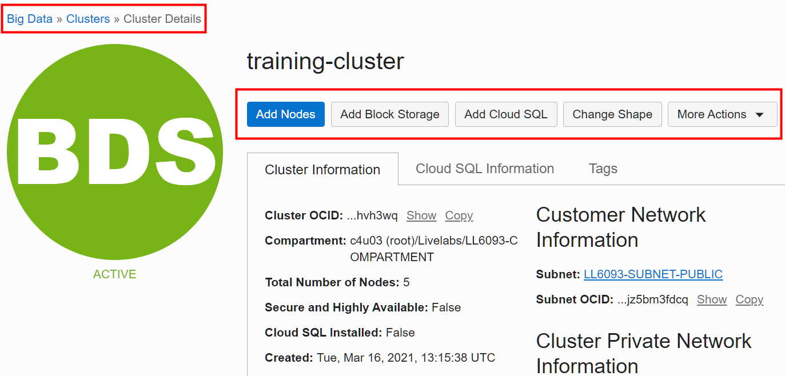
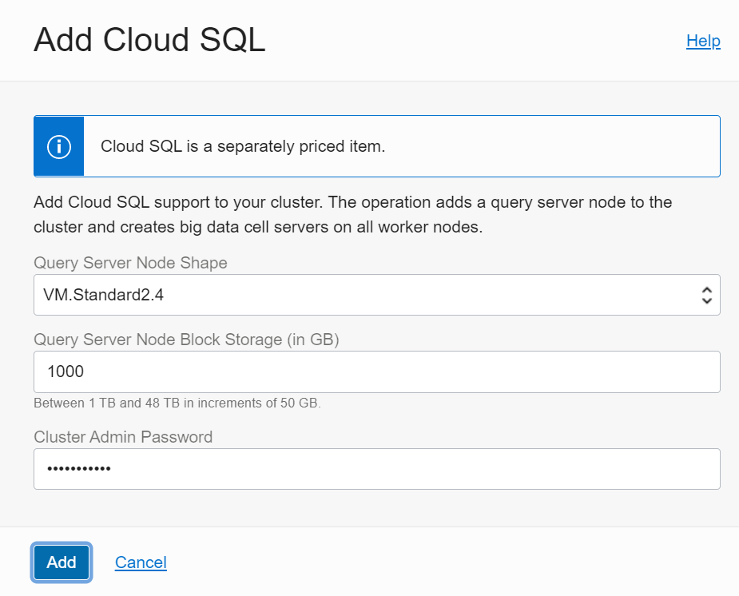
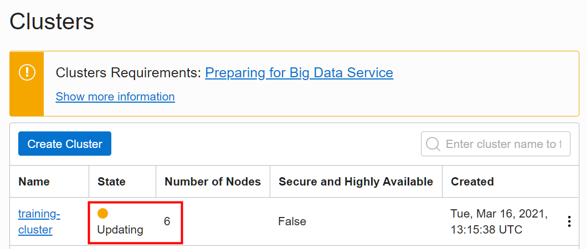
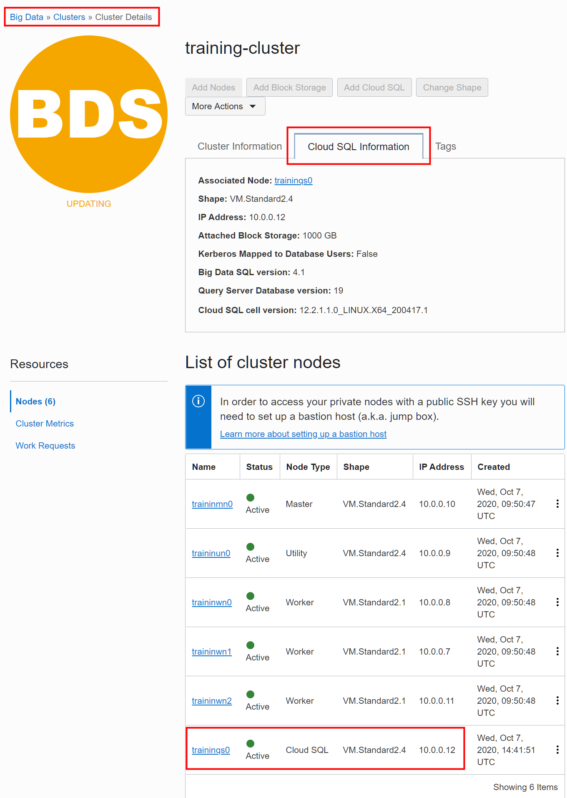
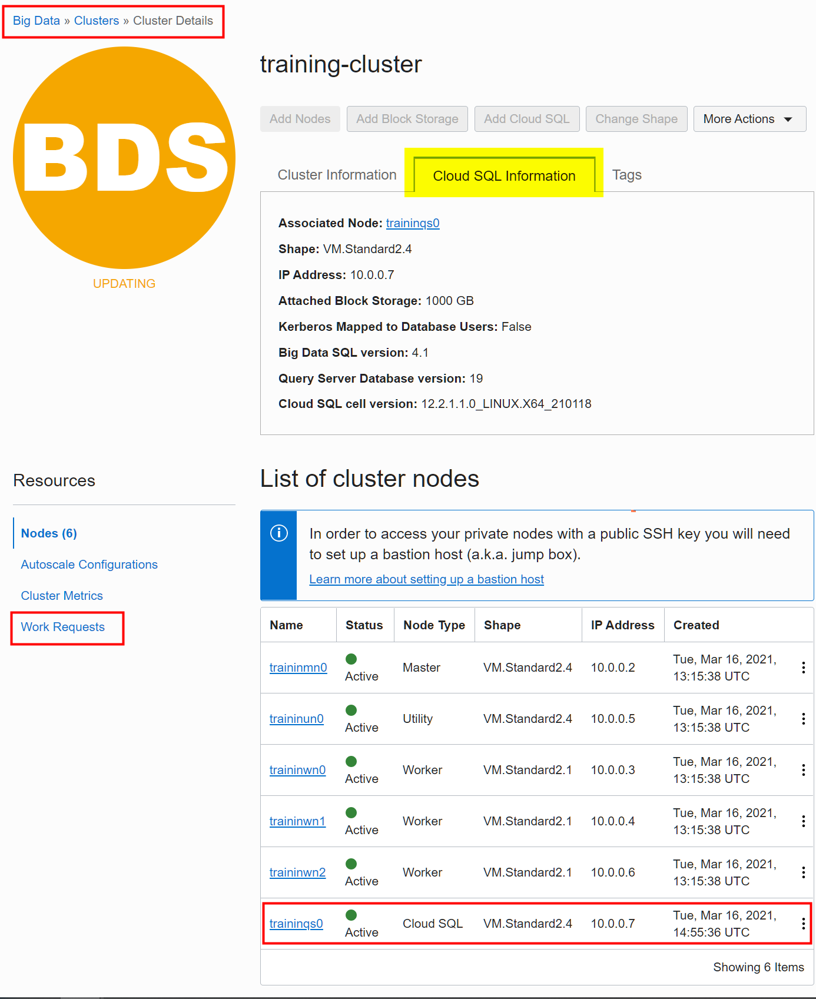
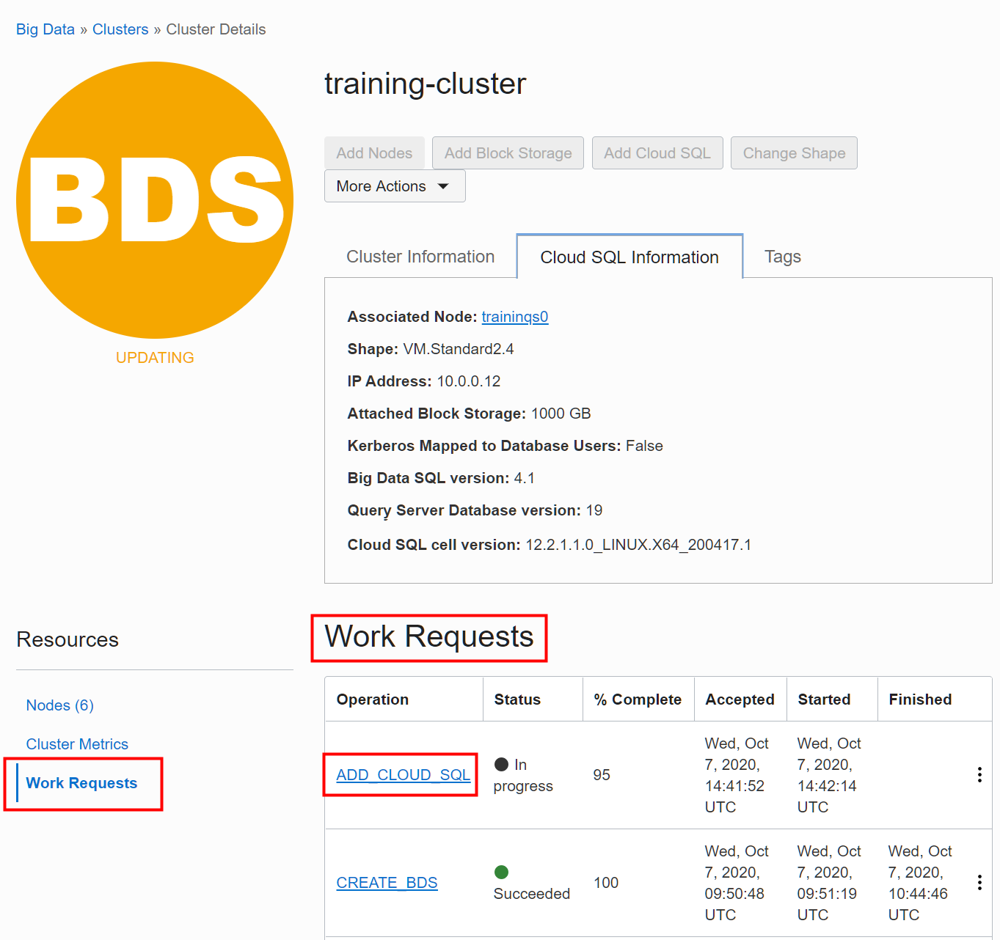
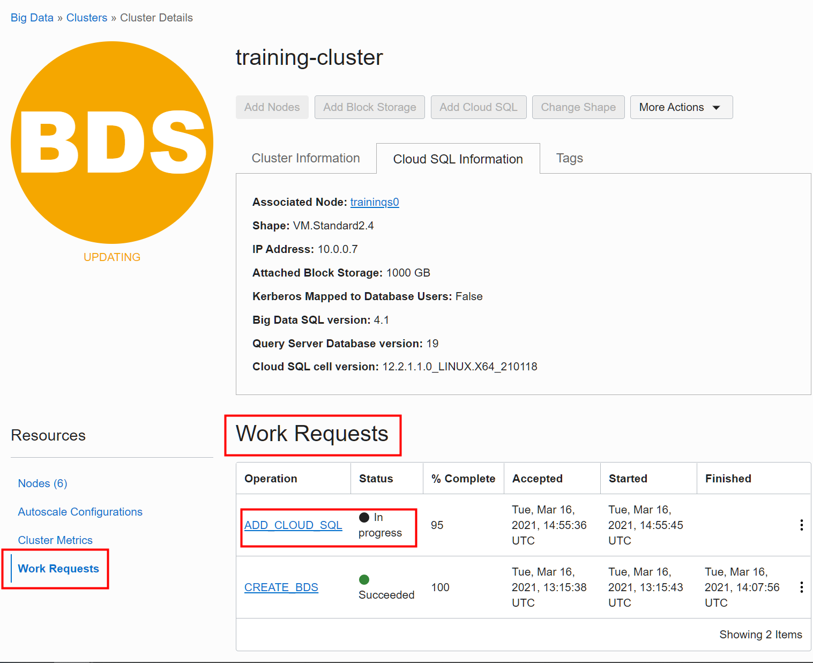
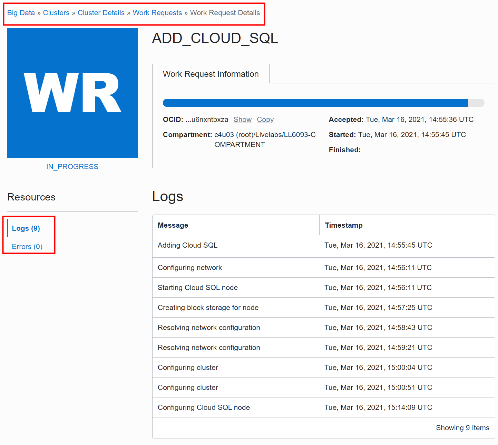

# Add Oracle Cloud SQL to the Cluster

## Introduction

In this lab, you will learn how to maintain the new cluster that you created in the previous lab. You will also learn how to add Oracle Cloud SQL to your cluster.

Estimated Lab Time: 15 minutes

### Objectives

* Maintain your cluster.
* Add Oracle Cloud SQL to your cluster.

### What Do You Need?

This lab assumes that you have successfully completed the following labs in the **Contents** menu:
<if type="freetier">
+ **Lab 1: Setup the BDS Environment**
</if>
<if type="livelabs">
+ **Lab 1: Review Creating BDS Environment Resources (Optional)**
</if>
+ **Lab 2: Create a BDS Hadoop Cluster**

## **STEP 1:** Maintain the Cluster

You can use the **Clusters** and **Cluster Details** pages to maintain your clusters.

<if type="livelabs">
1. Log in to the **Oracle Cloud Console**, if you are not already logged in, using your LiveLabs credentials and instructions. The **Oracle Cloud Console** Home page is displayed.
</if>

<if type="freetier">
1. Log in to the **Oracle Cloud Console** as the Cloud Administrator, if you are not already logged in. On the **Sign In** page, select your `tenancy`, enter your `username` and `password`, and then click **Sign In**. The **Oracle Cloud Console** Home page is displayed.
</if>

2. Click the **Navigation Menu** in the upper left, navigate to **Analytics & AI**, and select **Big Data**. 
	
	

3. On the **Clusters** page, on the row for **`training-cluster`**, click the **Actions** button to display the context menu.

    

4. You can use the context menu to view the cluster's details, add nodes, add block storage, add Cloud SQL, rename the cluster, remove Cloud SQL (if already added), and terminate the Big Data Cluster.

      

5. Alternatively, you can click the **`training-cluster`** link in the **Name** column to display the **Cluster Details** page. You can use the buttons at the top of the page to do the following:

    + Add Nodes.
    + Add Block Storage.
    + Add Cloud SQL.
    + Change Shape.
    + Use the **More Actions** drop-down list to rename the cluster, move a resource from the current compartment to a different compartment, add tags, remove Cloud SQL, and terminate Big Data Cluster.

    <if type="freetier">
      
    </if>

    <if type="livelabs">
      
    </if>

## **STEP 2:** Add Oracle Cloud SQL to the Cluster

You can add Oracle Cloud SQL to a cluster so that you can use SQL to query your big data sources. When you add Cloud SQL support to a cluster, a query server node is added and big data cell servers are created on all worker nodes. For information about using Cloud SQL with Big Data Service see [Use Cloud SQL with Big Data Service](https://docs.oracle.com/en/cloud/paas/big-data-service/user/use-cloud-sql-big-data-service.html).

**Note:** Cloud SQL is not included with Big Data Service. You must pay an extra fee for using Cloud SQL.

1. On the **Clusters** page, on the row for **`training-cluster`**, click the **Actions** button.

    

2. From the context menu, select **Add Cloud SQL**.

      

3. In the **Add Cloud SQL** dialog box, provide the following information:
    + **Query Server Node Shape:** Select **`VM.Standard2.4`**.
    + **Query Server Node Block Storage (In GB):** Enter **`1000`**.
    + **Cluster Admin Password:** Enter your cluster administration password that you chose when you created the cluster such as **`Training123`**.

      

    **Note:** For information on the supported Query Server node shapes and block storage size, see [Plan Your Cluster](https://docs.oracle.com/en/cloud/paas/big-data-service/user/plan-your-cluster.html#GUID-0A40FB4C-663E-435A-A1D7-0292DBAC9F1D) in the Using Oracle Big Data Service documentation.

4. Click **Add**. The **Clusters** page is re-displayed. The status of the **`training-cluster`** is now **Updating** and the number of nodes in the cluster is now **`6`** instead of **`5`**.

    

5. Click the **training-cluster** name link in the **Name** column to display the **Cluster Details** page. Click the **Cloud SQL Information** tab to display information about the new Cloud SQL node. In addition, the newly added Cloud SQL node, **`traininqs0`**, is displayed in the **List of cluster nodes** section.

    <if type="freetier">
    
    </if>

    <if type="livelabs">
    
    </if>

6. Click **Work Requests** in the **Resources** section. In the **Work Requests** section, the **`ADD_CLOUD_SQL`** operation is displayed along with the status of the operation and percent completed. Click the **`ADD_CLOUD_SQL`** link.

  <if type="freetier">
  
  </if>

  <if type="livelabs">
  
  </if>

7. The **Work Request Details** page displays the status, logs, and errors (if any) of adding the Cloud SQL node to the cluster.

  <if type="freetier">
  
  </if>

  <if type="livelabs">
  
  </if>

8. Click the **Clusters** link in the breadcrumbs at the top of the page to re-display the **Clusters** page. Once the Cloud SQL node is successfully added to the cluster, the cluster's state changes to **Active** and the number of nodes in the cluster is now **`6`**.

        

This concludes this lab. You may now [proceed to the next lab](#next).

## Want to Learn More?

* [Using Oracle Big Data Service](https://docs.oracle.com/en/cloud/paas/big-data-service/user/index.html)
* [Oracle Cloud Infrastructure Documentation](https://docs.cloud.oracle.com/en-us/iaas/Content/GSG/Concepts/baremetalintro.htm)
* [Overview of Oracle Cloud Infrastructure Identity and Access Management](https://docs.cloud.oracle.com/en-us/iaas/Content/Identity/Concepts/overview.htm)

## Acknowledgements

* **Authors:**
    + Lauran Serhal, Principal User Assistance Developer, Oracle Database and Big Data User Assistance
* **Contributor:**
    + Martin Gubar, Director, Oracle Big Data Product Management
* **Last Updated By/Date:** Lauran Serhal, March 2021

