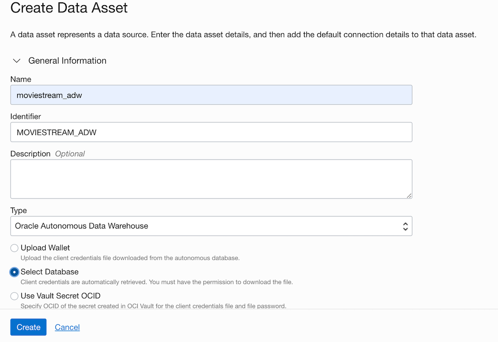
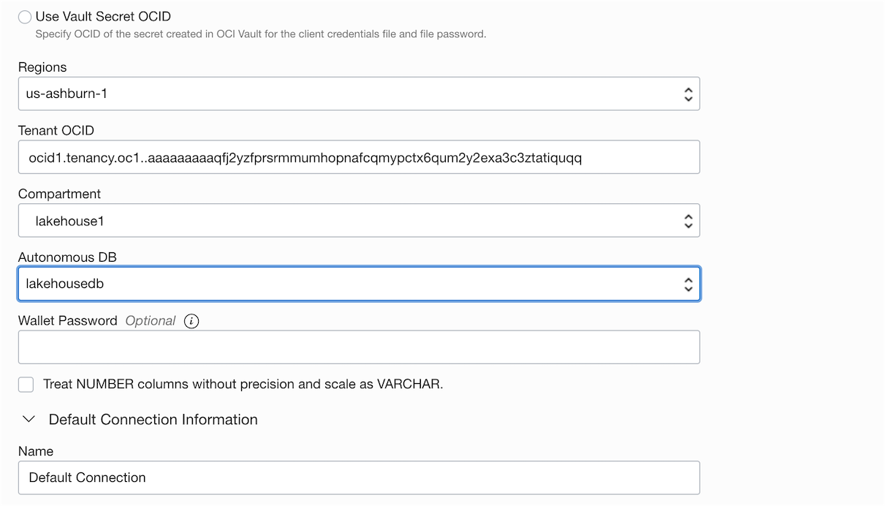
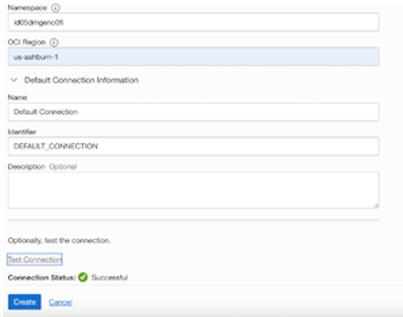
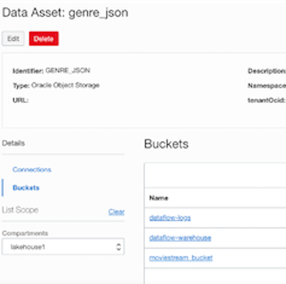
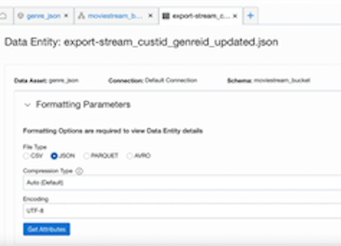
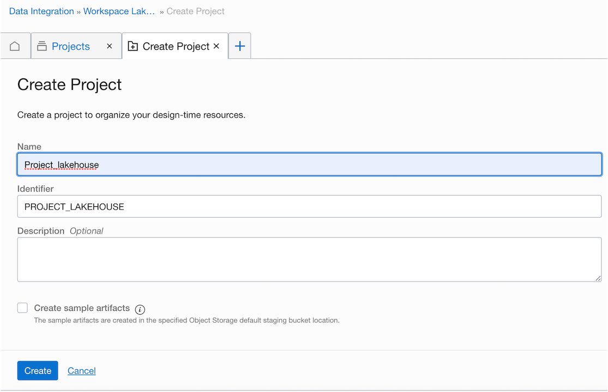

# OCI Data Integration, OCI Data Catalog and Data Assets

## Introduction

Here we will create our OCI Data Catalog and OCI Data Integration workspace first and create a couple of additional data assets along with discovering our ADW database as a data asset.

Estimated Time:15 minutes

### About Product

In this lab, we will learn more about the OCI Data Catalog which is used in enterprises to manage technical, business and operational metadata - see the [documentation](https://docs.oracle.com/en-us/iaas/data-catalog/home.htm) for more information.

We will also discuss OCI Data Integration as part of data asset ETL and you can learn more here - [documentation](https://docs.oracle.com/en-us/iaas/data-integration/home.htm).

### Objectives

- Learn how to create OCI Data Integration Workspace
- Learn how to create OCI Data Catalog
- Learn how to discover and create new data assets

## Task 1: Create the OCI Data Integration workspace

Creation of the OCI Data Integration workspace required the VPN for private endpoints, groups and policies that we configured during the setup of the environment for the Lakehouse. Now it is a matter of navigating to the Data Integration space and creating the workspace which will in turn allow us to create ETL processes.

From the home navigation menu, click Analytics & AI and then click Data Integration.


From the Data Integration Service we will create a Workspace which will allow for diagramming the data flows with filters and create execution plans for data into the data assets. First we must create the workspace and a couple more policies for the workspace to access the object storage and use and update the data in the data lake.

Click on Create Workspace. Name it Workspace Lakehouse and click the Create button.


While that is creating navigate back to Policies. Click on Identity & Security and then Policies.
Select dataintegrationWS policies and clik Edit Policy Statements. From here you can + Another Statement.


Use the follow three allow statements to add into the existing policy, and then Save Changes.
```
<copy>
allow any-user to use buckets in compartment lakehouse1 where ALL {request.principal.type='disworkspace',request.principal.id='ocid1.disworkspace.oc1.iad.anuwcljt2ow634yaaq4pl6jbvhhudjkchsdwrw3q3hkmlpoyfilwyyjqykjq'}

allow any-user to manage objects in compartment lakehouse1 where ALL {request.principal.type='disworkspace',request.principal.id='ocid1.disworkspace.oc1.iad.anuwcljt2ow634yaaq4pl6jbvhhudjkchsdwrw3q3hkmlpoyfilwyyjqykjq'}

allow any-user {PAR_MANAGE} in compartment lakehouse1 where ALL {request.principal.type='disworkspace',requesst.principal.id='ocid1.disworkspace.oc1.iad.anuwcljt2ow634yaaq4pl6jbvhhudjkchsdwrw3q3hkmlpoyfilwyyjqykjq'
}

</copy>
```

Once the workspace has been created (a refresh of the screen might be needed to go from Processing to Active). 

## Task 2: Create the Data Assets in the Workspace

Under Quick Actions, you want to click on Create Data Asset


The first data asset is going to be our ADW database we already created. Fill in moviestream_adw and select type to Oracle Autonomous Data Warehouse.



Continue to fill with Select Database, regions, Tenant OCID that we saved off or you can go to your profile and click on Tenancy to get that information again. Make sure the compartment is lakehouse1 and DB is lakehousedb.



Using the default connection you can put in User Name ADMIN and the password you configured for your database, and select the TNS Alias from the the dropdown.


Test Connection to make sure you can connect to the this data asset.


Next we are going to create a data asset for our json file that will be part of our application and scheduled load of files coming into the data lake.

Select Create Data Asset again, and fill in the name genre_json and choose the Type to be Oracle Object Storage.


Continue to fill with Select Database, regions, Tenant OCID that we saved off or you can go to your profile and click on Tenancy to get that information again. You need the object storage bucket Namespace, and the OCI-Region. Select the Default Connection and Test Connection.



You need to make sure the Compartment is set to lakehouse1 and then click Buckets. You will see the dataflow-logs, dataflow-warehouse and moviestream_bucket. Click on moviestream_bucket.



Click on the file under Data Entities (export-stream_custid_updated.json). Select the file type as JSON, and click Get Attributes to see the names and data types for this file.



## Task 3: Create a Project in the Workspace

- Click on the Workspace Lakehouse. 
- Click on Create a Project.
- Enter Name Project_lakehouse
- Click Create



We have now configured our Data Lakehouse by creating a database, data sources in object storage and setup up our services ready to use.

## Task 4: Create the OCI Data Catalog

In this task, you will create the OCI Data Catalog. Review options for creating business term to sync with the metadata for the data assets


Click on Create Data Catalog. Create in Compartment, lakehouse1, and name the catalog, lakehousecatalog. Click on Create.


Explore the Data Catalog:
- Data Assets, some we will discover and others we will just create to use with this data lake.
- Data Entities, these come from the data assets as there can multiple entities in each data asset
- Glossaries, these are business terms for mappings of the data and definitions with columns and data assets.
- Catagories and Terms, more business terms can be defined here to maintain consistent groupings of data.
- Jobs, refresh and harvest data jobs that will be run and scheduled to keep data current.


## Task 5: Discover Data Assets and Configure Connections

In this step, you will discover the data assets already available in the ADW and Object Storage. We will also create new data assets that we might get from another source or API.
From the Quick Menu on the Home tab, click Discover Data Sources.


As you can we have our data warehouse database available and our object storage buckets. Click the box and then click Create Data Asset. The name and description and type will automatically be filled in and you can adjust and make changes as needed. Do these steps for both the ADW Database and object storage buckets.


The data asset will then be added to this data catalog, now we caan use these data assets to set up processes for data loading and ETL with OCI Data Flow.

## Task 6: New table for Spark Application Data Loads

In this step, you will simply be creating a new table to be used in the data loading process that uses the application in the next lab. You will also verify that the table is now part of the discovered entities in the OCI Data Catalog.

Navigate from the main menu to Autonomous Data Warehouse. Select the lakehousedb. If the database is not listed, double check the compartment is set to lakehouse1.


Click on the database and then proced to click on the Tools Tab and click on Open Database Actions.


Click on SQL to execute the query to create the table.


You are going to copy and paste the following code to build the MOVIE_GENRE table that we will use later in our data feed process and end queries.

```
<copy>
CREATE TABLE MOVIE_GENRE
(ENTERED_TIME       DATE,
PRICE               NUMBER,
CUSTID              NUMBER,
GENREID             NUMBER,
MOVIEID             NUMBER,
ACTIVITY            NUMBER,
RECOMMENDED         VARCHAR2(10));
</copy>
```

After the query executes, you can close Database Actions tab to get back to the Oracle Cloud menu .

Now you can verify that the entity is available as part of the OCI Data Catalog. Navigate to the menu Cloud Menu. Click on Analytics & AI and click on Data Catalog under the Data Lake header.

Click on DataCatalogLakehouse1 from the Data Catalogs. Verify compartment if you do not see it listed.


Click on Data Assets and click on Harvest using the dropdown menu for the database Data Asset. This harvesting for the Data Catalog should be scheduled to automatically pull the entity informaiton into the Data Asset, but for now in the lab you can run this manually.

Now if you go back to the Home Tab fro the Data Catalog, you will discover that there are now 7 Data Entities are being kept up to data in the Data Catalog.


Click on Entities just to verify that all of the tables are now here.


Now you are ready to work with the Data Flows and applications.

You may now [proceed to the next lab](#next).

## Acknowledgements

* **Author** - Michelle Malcher, Database Product Management
* **Contributors** -  
* **Last Updated By/Date** - Michelle Malcher, Database Product Management, September 2021
