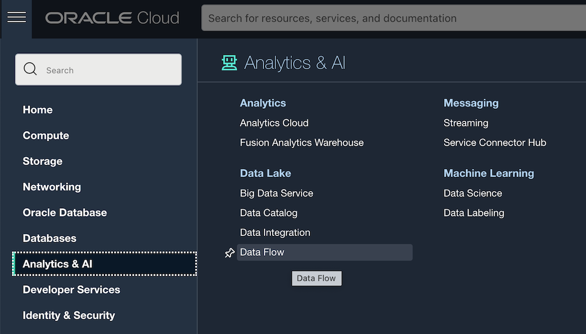
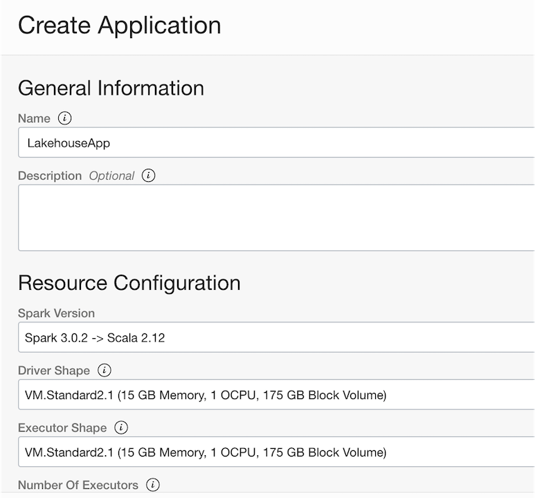
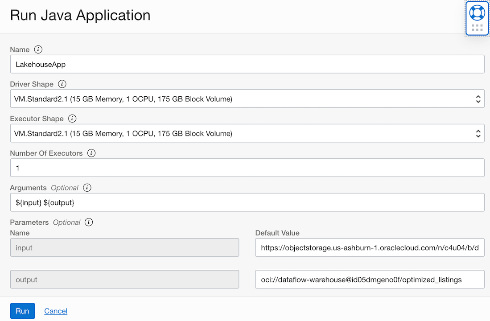
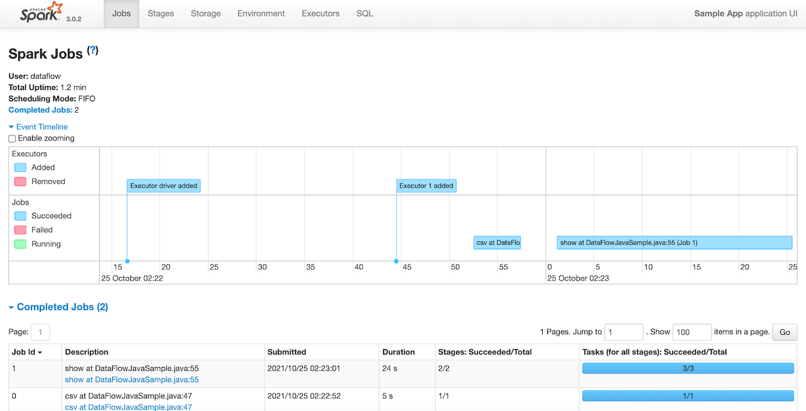
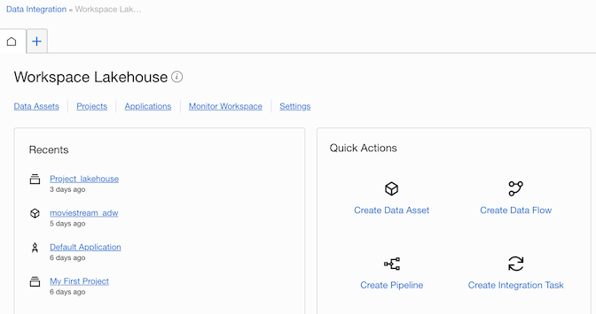
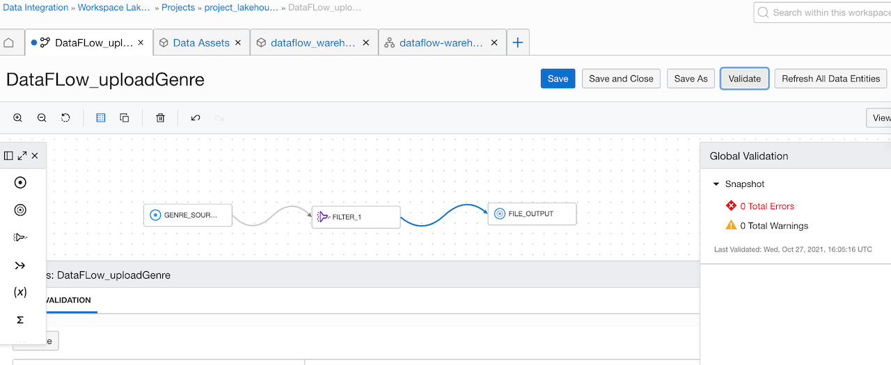
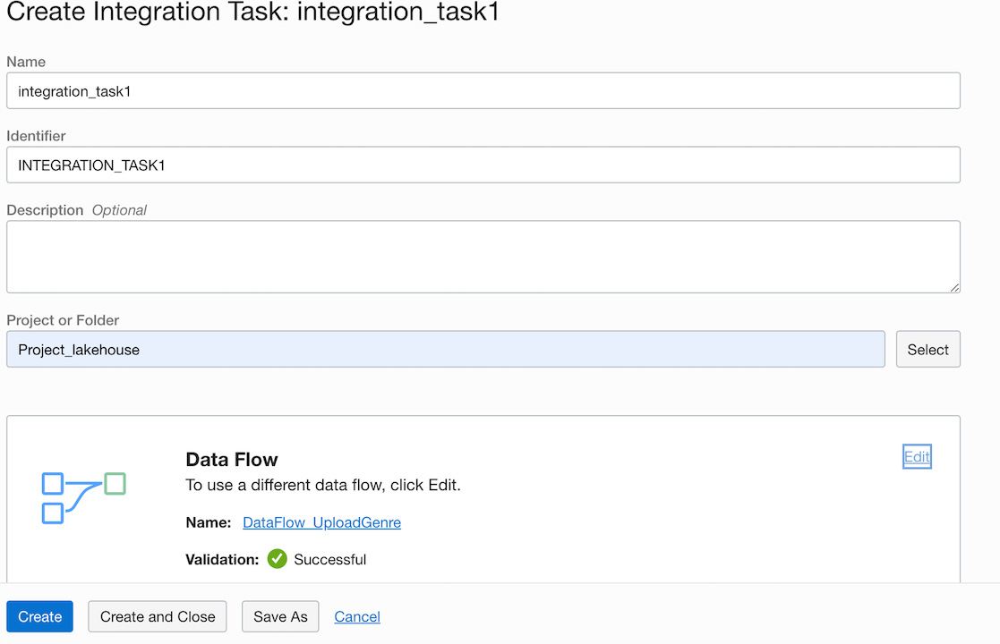
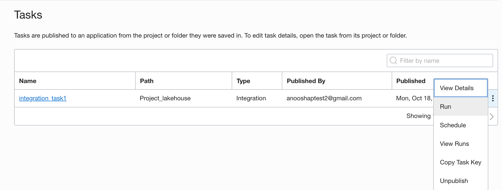

# OCI Data Flow in the Data Lake

## Introduction

Data is constantly growing being enhanced, validated and updated. That is why once you have the data assets you need to make sure that processing continues to manage the data assets and provide updated values you data lake.

OCI Data Flows handles these processes by loading new data or updating.

### Objectives

* Learn how to create an OCI Data Flow App
* Learn how to create OCI Data Flow from OCI Data Integration
* Learn how to schedule to automate OCI Data Flow Apps

## Task 1: Create an OCI Data Flow App

You have several choices on how to create applications and languages. You can choose something that makes sense for your environment. First, we are going to take a look at the OCI Data Flow and create an application to read through files in the object storage or data lake.

First navigate to the OCI Data Flow and click on Create Application.



For creating the application, you need to have the java jar file and we are providing an example one. Also you will need to have access to the data files. Enter a name for the application and if you would like a description. Take the other defaults for the first part of the form.


For this example, choose Java, and check the box for entering the URL manually. Copy and paste from the following into the form. 



```
<copy>
oci://dataflow_sample_apps@bigdatadatasciencelarge/dataflow-java-sample-1.0-SNAPSHOT.jar
</copy>
```
```
<copy>
com.oracle.oci.dataflow.samples.DataFlowJavaSample
</copy>
```
And for the arguments:
```
<copy>
${input} ${output}
</copy>
```
Click on Create Application.


Now we can run the application. Copy and paste the following into the input and output arguments and click run.
Input
```
<copy>
https://objectstorage.us-ashburn-1.oraclecloud.com/n/c4u04/b/data_lakehouse/o/custsales_custsales-2020-01.csv
</copy>
```
Output
```
<copy>
oci://dataflow-warehouse@id05dmgeno0f/optimized_listings
</copy>
```



It of course depends on how big your data file is but this sample takes about a minute to return successfully.


You can also monitor your applications in the Spark UI. Click on the application name and click on the Spark UI button.


And there are additional views to see the details about the jobs and applications running and completed.



Now let's go back to OCI Data Integrations because we export our data flows from here into an application to run for OCI Data Flows.

## Task 2: Create OCI Data Flow from Data Integration

In this step, we are going to use again Quick Actions to click on Create Data Flow and then use the designer to setup the source and target along with any other filters we would like.



By default, at the bottom of the designer,  you want to enter the name for the New Data Flow, DataFlow_UploadGenre, and Select the Project that was created in the last lab.


Then click Create. This way you can save as you go along to in order not to lose any changes.

From the toolbar, there are sources, targets, filters, joins and other options. You are going to drag the source icon over to the design area. Then start to fill out the details for the source by clicking on Select, and then choose the ADW asset that was created in the first lab. Select the Default Connection, and in Schema, ADMIN. For the Entiy choose the MOVIE_GENRE table. 


Now you are going to drag the Target icon over to the designer area. Target is going to be defined as the Object Storage that was created for the dataflow-warehouse. You can insert, overwrite or merge data with the existing data, and even create a new file or table here. This lab, you are just going to insert data, and choose one file which will overwrite the file each time.


Then click on the Data Entity and in the next menu type the name of the folder **File_output**. Choose JSON file. This will put the file based on the data and joins that you create into the data lake and allow other processes to use the data.


Save at this step, since you now have your source and target. Now you need to connect the source to the target. Drag the icon onto the designer area between the source and the target.


After Saving the dataflow, click on Validate, and the Snapshot should show 0s for Errors and Warnings.



## Task 2: Create an Application for Automation

Now you are going to navigate back to the data integration workspace, and click on Application. Click on create application.


Click on Save and Close. It is just a shell of an application where you can now publish tasks to be scheduled and run through the application.


## Task 3: Create and Schedule OCI Data Flow Apps for Automation

Now you are going to navigate back to the project. Click on Task under Details and click on Create Task and choose Integration Task. This task is going to be included in the application.


Under Data Flow, you are going to click Select and add the Data Flow that you just finished creating in the previous task. Then click Save and Close.



Click on the menu for the task and select Publish to Application.


Choose the application that was just created in Task 2.


After the task has been added you will see run task or schedule, and you can navigate to the application. For regular loads of this data and automation, you are going to want to schedule the job to run. Again, to see how this is working now, click on Run.



You may now [proceed to the next lab](#next).

## Acknowledgements

* **Author** - Michelle Malcher, Database Product Management, Massimo Castelli, Senior Director Product Management
* **Contributors** - 
* **Last Updated By/Date** - Michelle Malcher, Database Product Management, September 2021
