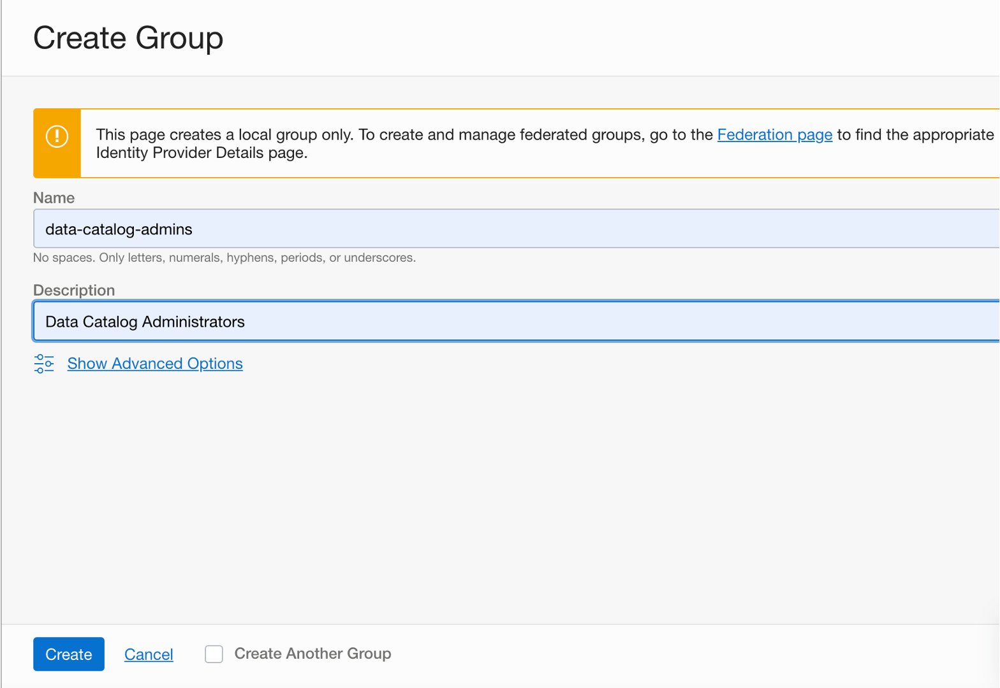
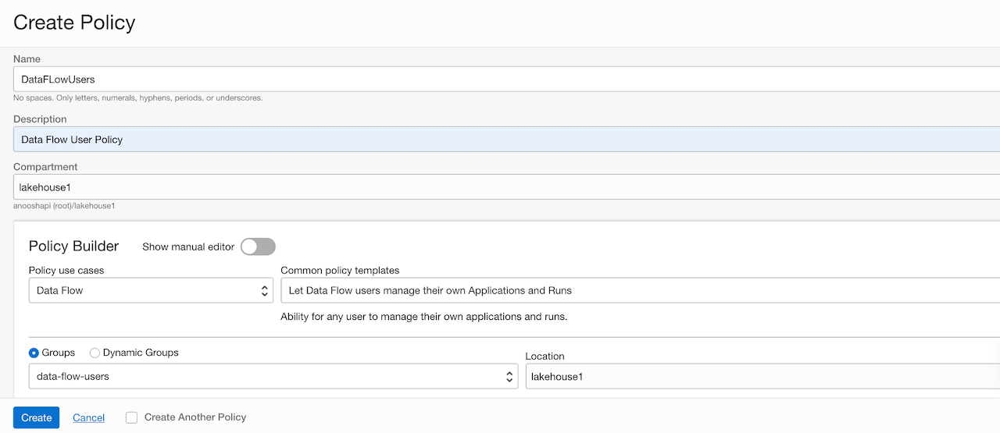
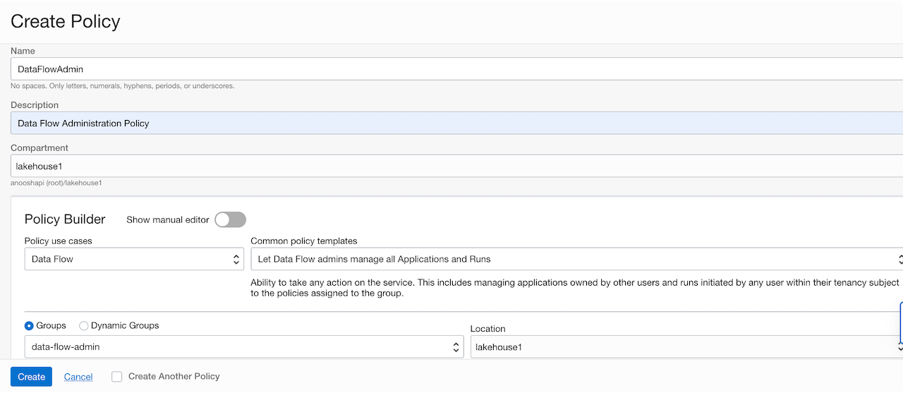
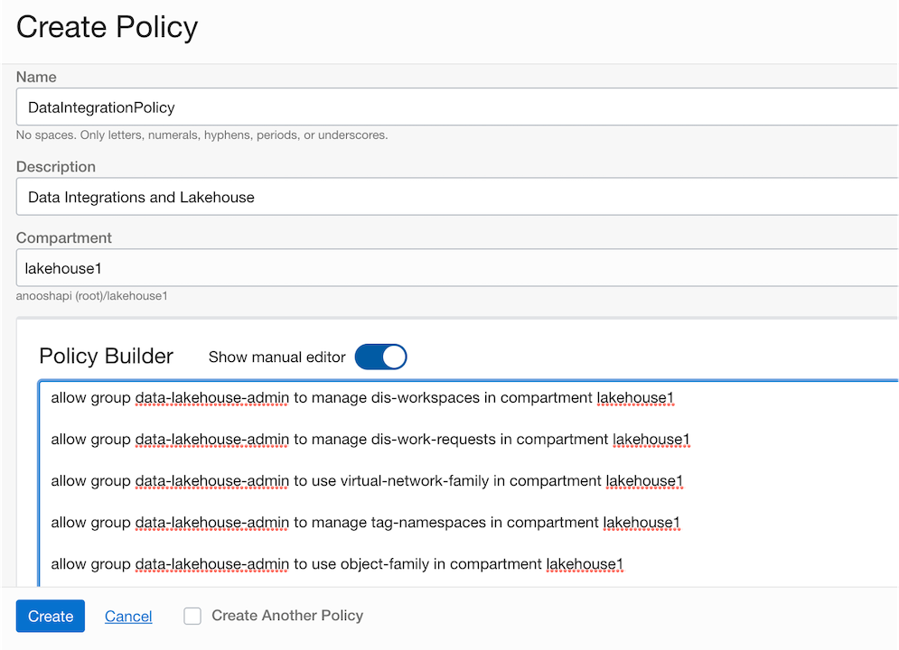
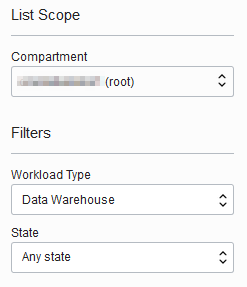
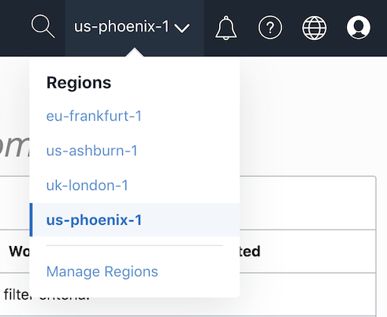
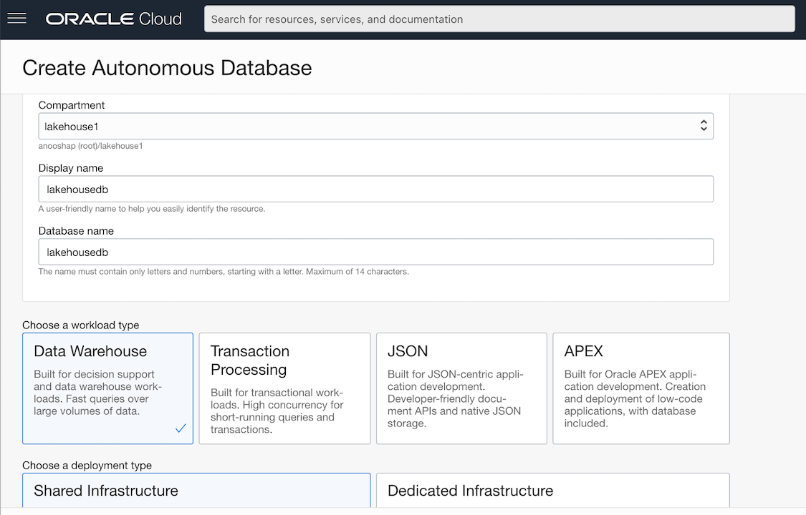
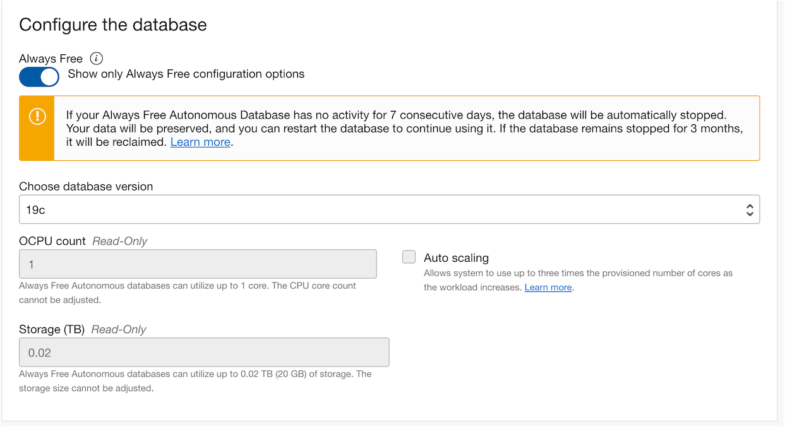
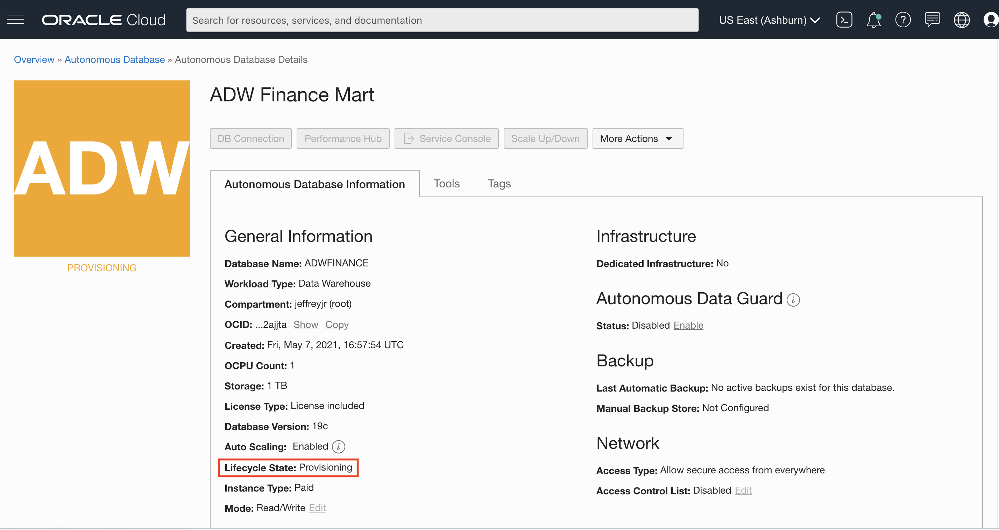

# Create Groups, Users, Polices and Autonomous Data Warehouse (ADW)

## Introduction

In planning the Oracle Lake House, we know that there are several components that are needed to support the data lake and continue to maintain it. This first lab will allow us to combine these steps together for consistent polices, users and configurations for the Oracle Cloud Infrastructure tools that we will be using throughout this workshop.

Estimated Lab Time: 15 minutes

### Objectives

In this lab, you will:
* Create users and policies to be administering and using the OCI Data Catalog, OCI Data Flow and ADW 
* Create ADW for use as one of the data assets in the data lake
* Configure the OCI Object Storage Connections
* Load from OCI Object Storage a data set into ADW as part of the data lake

> **Note:** While this lab uses ADW, the steps are identical for loading data into an ATP database.

Estimated Time:20 minutes

### About Product

In this lab, we will learn more about the Autonomous Database's built-in Data Load tool - see the [documentation](https://docs.oracle.com/en/cloud/paas/autonomous-database/adbsa/data-load.html#GUID-E810061A-42B3-485F-92B8-3B872D790D85) for more information.

## Task 1: Configure Groups, Users and Polices for the Lake House

It is important to create separate groups and policies to keep the data lake and catalog secure. As data assets are discovered and use, the proper authorizations can be granted to users based on these groups. Having access to data in the lake is critical for business processes and you will see how to grant this access and use this as a security plan for a data lake. In this step, you will set up users and policies for using the OCI Data Catalog, OCI Data Lake and ADW.

First we are going to create an compartment. This allows for separation as well as grouping all of the items together in this area. Sometimes you may have been already assigned a compartment to use but it is a quick step and throughout the lab you will want to make sure that you are always in this compartment.

1. Once you are logged in you are at the cloud services dashboard. Click the navigation menu in the upper left to show top level navigation choices.


2. Continue down to the Identity & Security menu and from there to Compartments.


3. There is a Create Compartment button to click on, and then the screen will come up for you to give the compartment a name, which we will be using lakehouse1 for this lab.


4. Select from the side menu Groups. Verify that you are in the lakehouse1 Compartment. There are going to be a few groups that are needed to administer and use the data catalog, integrations and flows. For the interest of this lab we are just going to add your user to each of these groups but in reality, administrators will only have the privileges to manage these areas of the data lake and other accounts will be added as users to have access to the data.





Additional groups to create:
- data-catalog-admin
- data-catalog-users
- data-integration-admin
- data-integration-users

After these groups are added. Click on a group and click on Add User. You will add your account you signed into the cloud with to each of the groups for the purpose of the lab.

5. After creating the groups and adding your user name to each of the groups we need to create the policies that will allow for the access to object storage and creation of the data assets. Take note of the policies and the areas they are allowed to access and how they are divided by what the user and administrator can do. Later on the lab we will have to create a couple more policies based on the workspace for data integration, but having all of the policies and groups in this step of the lab combines the authorization part for the data lake and brings together what is needed to consider the security around the data lake process.

Select Policies on the side menu and click on the button Create Policy.
 


Name each policy for to match the group so they are easy to recognize what they are used for. 
- Name this first on DataFlowUsers (Notice no spaces, underscores or dashes are allowed here). 
- Add the description.
- Select under Policy use cases Data Flow. This will bring up common policy templates for this area in OCI. 
- Select Let Data Flow users manage their own Applications and Runs. 
- Add the group dataflow-users and the location is the compartment lakehouse1



Next create the policy for dataflow-admins. These are the same steps as above, selecting Let Data Flow admins manage all Applications and Runs. Make sure to select the group dataflow-admin and location of lakehouse1



Policies can be added based on the common templates or added by manually adding the policy. These are the additional policies that are needed for the different groups. Notice when you use manual editor, the group disappears because these will be part of the policy statement being added. You can copy the following commands and paste into the manual edit. We are going to name this policy DataLakehousePolicy to cover the rest of the policies needed for the groups.


    ```
    <copy>
allow group data-lakehouse-admin to manage dis-workspaces in compartment lakehouse1

allow group data-lakehouse-admin to manage dis-work-requests in compartment lakehouse1

allow group data-lakehouse-admin to use virtual-network-family in compartment lakehouse1

allow group data-lakehouse-admin to manage tag-namespaces in compartment lakehouse1

allow group data-lakehouse-admin to use object-family in compartment lakehouse1

    </copy>
    ```

## Task 2: Create Object Storage Buckets

Creating Object Storage Buckets allows for various types of data to be stored. For this lab, we are using a couple of buckets. Two are created for our data flow process which includes a place for the data and another one for the logs. Also we will create a moviestream bucket for placing the JSON file in that we will read later.

From the Home Menu click on Storage and then click on Buckets.


Enter a Bucket Name, dataflow-warehouse and use the rest of the defaults and click Create.


Next Bucket, click on Create Bucket, Bucket Name, dataflow-logs and use the rest of the defaults and click Create.
And one more Create Bucket, Bucket Name, moviestream and again use the defaults and click Create.


## Task 3: Create ADW

In this step, you will create an Oracle Autonomous Data Warehouse.

1. Once you are logged in, you are taken to the cloud services dashboard where you can see all the services available to you. Click the navigation menu in the upper left to show top level navigation choices.

    __Note:__ You can also directly access your Autonomous Data Warehouse or Autonomous Transaction Processing service in the __Quick Actions__ section of the dashboard.

    

2. The following steps apply similarly to either Autonomous Data Warehouse or Autonomous Transaction Processing. This lab shows provisioning of an Autonomous Data Warehouse database use with data assets for the data lake, so click **Autonomous Data Warehouse**.

    

3. Make sure your workload type is __Data Warehouse__ or __All__ to see your Autonomous Data Warehouse instances. Use the __List Scope__ drop-down menu to select the compartment that was created in Task 1.

    

   *Note: Avoid the use of the ManagedCompartmentforPaaS compartment as this is an Oracle default used for Oracle Platform Services.*

4. This console shows that no databases yet exist. If there were a long list of databases, you could filter the list by the **State** of the databases (Available, Stopped, Terminated, and so on). You can also sort by __Workload Type__. Here, the __Data Warehouse__ workload type is selected.

    

5. If you are using a Free Trial or Always Free account, and you want to use Always Free Resources, you need to be in a region where Always Free Resources are available. You can see your current default **region** in the top, right hand corner of the page.

    

6. Click **Create Autonomous Database** to start the instance creation process.

    

7.  This brings up the __Create Autonomous Database__ screen where you will specify the configuration of the instance.

    

8. Provide basic information for the autonomous database:

    - __Choose a compartment__ - Select a compartment for the database from the drop-down list (lakehouse1).
    - __Display Name__ - Enter a memorable name for the database for display purposes. For this lab, use Lakehousedb.
    - __Database Name__ - Use letters and numbers only, starting with a letter. Maximum length is 14 characters. (Underscores not initially supported.) For this lab, use Lakehousedb.

9. Choose a workload type. Select the workload type for your database from the choices:

    - __Data Warehouse__ - For this lab, choose __Data Warehouse__ as the workload type.
    - __Transaction Processing__ - Alternatively, you could have chosen Transaction Processing as the workload type.

    

10. Choose a deployment type. Select the deployment type for your database from the choices:

    - __Shared Infrastructure__ - For this lab, choose __Shared Infrastructure__ as the deployment type.
    - __Dedicated Infrastructure__ - Alternatively, you could have chosen Dedicated Infrastructure as the deployment type.

    

11. Configure the database:

    - __Always Free__ - If your Cloud Account is an Always Free account, you can select this option to create an always free autonomous database. An always free database comes with 1 CPU and 20 GB of storage. For this lab, we recommend you leave Always Free unchecked.
    - __Choose database version__ - Select a database version from the available versions.
    - __OCPU count__ - Number of CPUs for your service. For this lab, specify __1 CPU__. If you choose an Always Free database, it comes with 1 CPU.
    - __Storage (TB)__ - Select your storage capacity in terabytes. For this lab, specify __1 TB__ of storage. Or, if you choose an Always Free database, it comes with 20 GB of storage.
    - __Auto Scaling__ - For this lab, keep auto scaling enabled, to allow the system to automatically use up to three times more CPU and IO resources to meet workload demand.
    - __New Database Preview__ - If a checkbox is available to preview a new database version, do NOT select it.

    *Note: You cannot scale up/down an Always Free autonomous database.*

      

12. Create administrator credentials:

    - __Password and Confirm Password__ - Specify the password for ADMIN user of the service instance. The password must meet the following requirements:
    - The password must be between 12 and 30 characters long and must include at least one uppercase letter, one lowercase letter, and one numeric character.
    - The password cannot contain the username.
    - The password cannot contain the double quote (") character.
    - The password must be different from the last 4 passwords used.
    - The password must not be the same password that is set less than 24 hours ago.
    - Re-enter the password to confirm it. Make a note of this password.

    
13. Choose network access:
    - For this lab, accept the default, "Allow secure access from everywhere".
    - If you want a private endpoint, to allow traffic only from the VCN you specify - where access to the database from all public IPs or VCNs is blocked, then select "Virtual cloud network" in the Choose network access area.
    - You can control and restrict access to your Autonomous Database by setting network access control lists (ACLs). You can select from 4 IP notation types: IP Address, CIDR Block, Virtual Cloud Network, Virtual Cloud Network OCID).

    

14. Choose a license type. For this lab, choose __License Included__. The two license types are:

    - __Bring Your Own License (BYOL)__ - Select this type when your organization has existing database licenses.
    - __License Included__ - Select this type when you want to subscribe to new database software licenses and the database cloud service.

    

15. Click __Create Autonomous Database__.

    

16.  Your instance will begin provisioning. In a few minutes, the state will turn from Provisioning to Available. At this point, your Autonomous Data Warehouse database is ready to use! Have a look at your instance's details here including its name, database version, OCPU count, and storage size.

    

    > **Note:** Take care not to use spaces in the name.

This completes the. We now have a full set of structured tables loaded into the Autonomous Database from the MovieStream Data Lake, with suitable constraints set up on the tables to avoid errors in attempting to load duplicate rows or invalid data. We will be working with these tables in later labs.

You may now [proceed to the next lab](#next).

## Acknowledgements

* **Author** - Michelle Malcher, Database Product Management
* **Contributors** -  Massimo Castelli, Niay Panchal, Mike Matthew and Marty Gubar, Autonomous Database Product Management
* **Last Updated By/Date** - Michelle Malcher, Database Product Management, September 2021
