# Initialize Environment

## Introduction
This lab will show you how to access your EDQ instance and create a new project.

*Estimated Lab Time*: 30 minutes

### Objectives
* Access an EDQ Instance through Apache Guacamole
* Start EDQ Director
* Create New Project
* Create a Data Store and a Snapshot in EDQ

### Prerequisites
This lab assumes you have:
- A Free Tier, Paid or LiveLabs Oracle Cloud account
- SSH Private Key to access the host via SSH
- You have completed:
    - Lab: Generate SSH Keys (*Free-tier* and *Paid Tenants* only)
    - Lab: Prepare Setup (*Free-tier* and *Paid Tenants* only)
    - Lab: Environment Setup

## **Step 0**: Running your Lab
### Access the graphical desktop
For ease of execution of this workshop, your instance has been pre-configured for remote graphical desktop accessible using any modern browser on your laptop or workstation. Proceed as detailed below to login.

1. Launch your browser to the following URL

    ```
    URL: <copy>http://[your instance public-ip address]:8080/guacamole</copy>
    ```

2. Provide login credentials

    ```
    Username: <copy>oracle</copy>
    ```
    ```
    Password: <copy>Guac.LiveLabs_</copy>
    ```

  

  *Note*: There is an underscore `_` character at the end of the password.

### Login to Host using SSH Key based authentication
While all command line tasks included in this workshop can be performed from a terminal session from the remote desktop session as shown above, you can optionally use your preferred SSH client.

Refer to *Lab Environment Setup* for detailed instructions relevant to your SSH client type (e.g. Putty on Windows or Native such as terminal on Mac OS):
  - Authentication OS User - “*opc*”
  - Authentication method - *SSH RSA Key*
  - OS User – “*oracle*”.

1. First login as “*opc*” using your SSH Private Key

2. Then sudo to “*oracle*”. E.g.

    ```
    <copy>sudo su - oracle</copy>
    ```

## **Step 1**: Review EDQ Instance

1. From the remote desktop session, Click on the "*Firefox*" icon to launch the browser.

    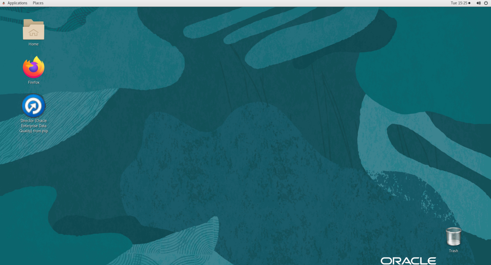    

2. Switch to the second tab preloaded with *"Weblogic Server Administration Console"*. Refresh the tab if needed and provide the login credentials as specified below.

    ```
    URL: <copy>http://localhost:7001/console</copy>
    ```
    ```
    Username: <copy>weblogic</copy>
    ```
    ```
    Password: <copy>oraedq123</copy>
    ```

    

    **Note:** It takes about 10 minutes post instance startup for Weblogic Admin Console be active, if the page is still not up after 10 minutes, refer to the optional step below for manual startup.

3.	In the landing home page, click on *servers*.

    

4.  Confirm that EDQ server and Admin server are running.

    

## **Step 2**: Create New Project in EDQ

1.	On the desktop, double click on *Director* icon.

    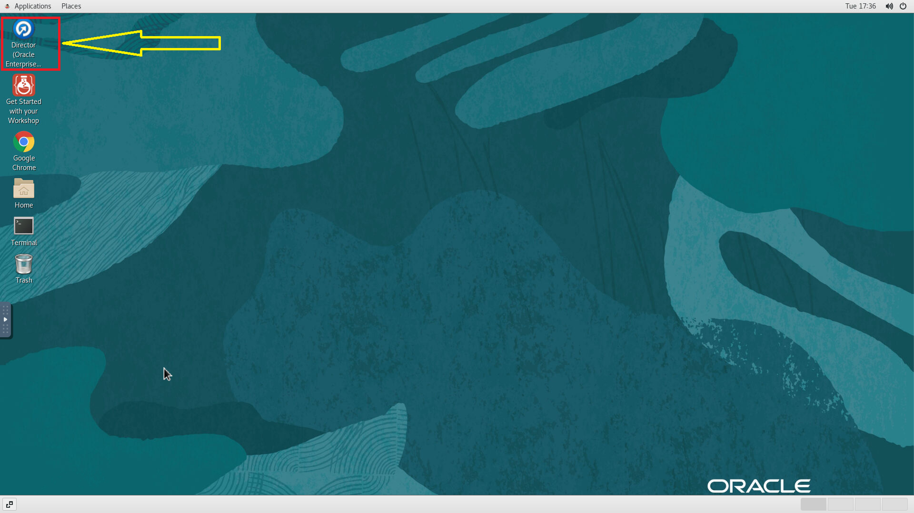

2.	Select "Later" if prompted for the java update option.

    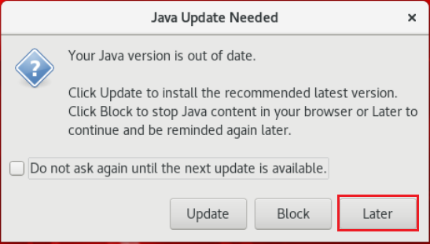

3.	Wait a few minutes, you will receive a new message, click on *“Run”*.

    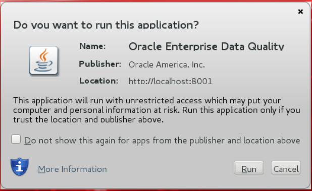

4.	EDQ director will appear on your screen. Provide the Director login credentials.

    ```
    Username: <copy>weblogic</copy>
    ```
    ```
    Password: <copy>oraedq123</copy>
    ```

    

5. Take a moment to familiarize yourself with the Terminology of each of the four different areas of the Director application.

    

6.	In the "Project Browser", right-click "Projects" and select "New Project…" to start the wizard.

    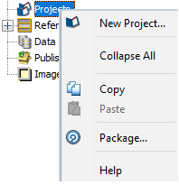

7.	Provide the following information:

    ```
    Name: <copy>Exploring Customer Data</copy>
    ```
    ```
    Description: <copy>Data Quality Project to Profile, Standardize, Match and Merge customer data</copy>
    ```

8.	Click on “Next >” button located at the bottom right corner.

    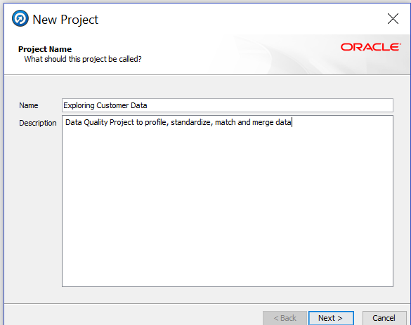

9.	Ensure the “All Groups” checkbox is selected in “Project Permissions”; then click “Finish” button located at the bottom right.

    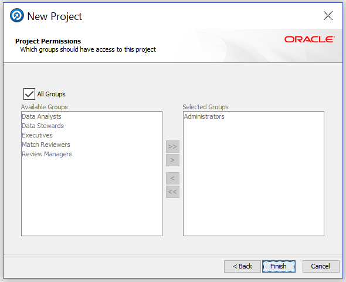

The “Exploring Customer Data” project now appears in the Projects list!

## **Step 3**: Create Data Store and Snapshot
Now that we have created a project, the next step is creating a Data Store. A Data Store is a connection to a source of data, whether the data is stored in a database or in one or more files.

1.	Expand the newly created project “Exploring Customer Data”, right click “Data Stores”, and select “New Data Store” to launch the wizard.

    

2.	Select "Server" on “Data is accessed from” field.
3.	Select “Database” on “Category” field.
4.	Select “Oracle” on the “Type” list and click “Next >” to continue.

    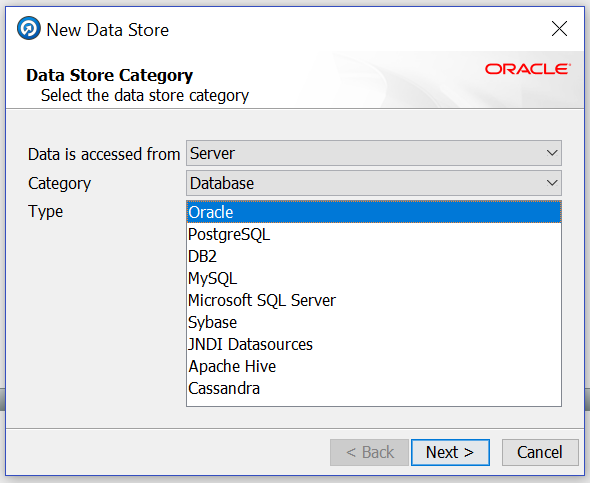

5.	Provide the following data:
    ```
    Database host: localhost
    Port: 1521
    Database name: orcl
    Name type: Service
    User name: EDQ_SRC
    Password: oraedq
    Schema:
    ```

6.	Click on “Test…” button located on the bottom right corner.

    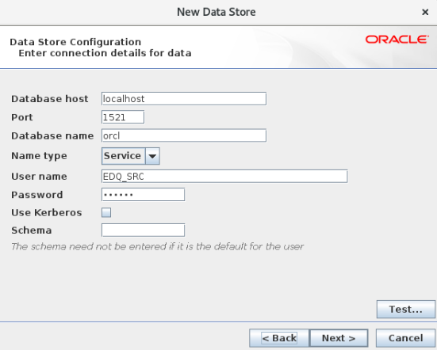

7.	When all information is correct, you will receive a message about connection success, click “OK”.

    

8.	Click on “Next > ” button located on the bottom right corner.
9.	Provide the following information as given below.
    ```
    Name: <copy>Connection to Oracle Database</copy>
    ```
    ```
    Description: <copy>Connection to US Custom Data</copy>
    ```

10.	Click on “Finish” button located on the bottom right corner.

    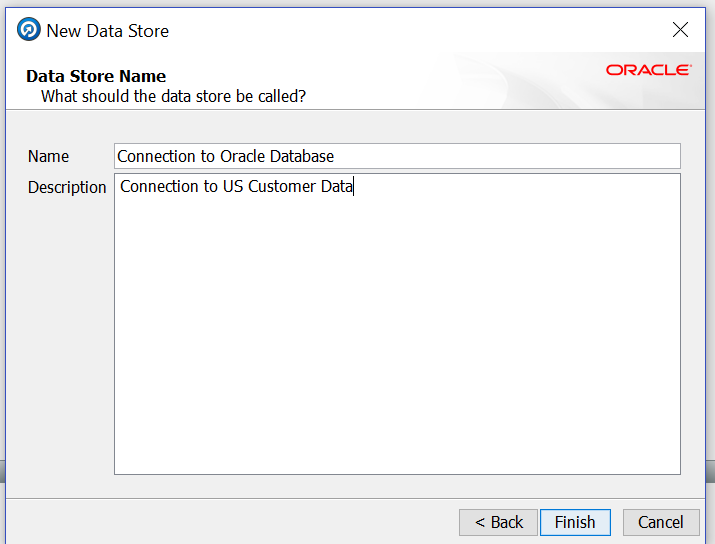

11.	Now we will use this new connection and select a table for profiling and cleansing; the goal is to stage some of the data so we can begin to understand it. Right click “Staged Data” under your project and select “New Snapshot…”.

    

12.	Select the newly created database connection, then click “Next >” to continue.

    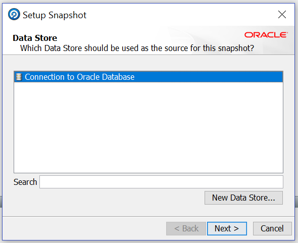

13.	In “Table Selection”, select "`US_Customers`" from the list.  Click “Next >” to continue.

    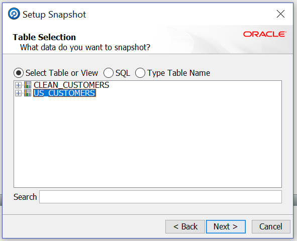

14.	In “Column Selection”, ensure all columns are selected, then click “Next >” to continue.

    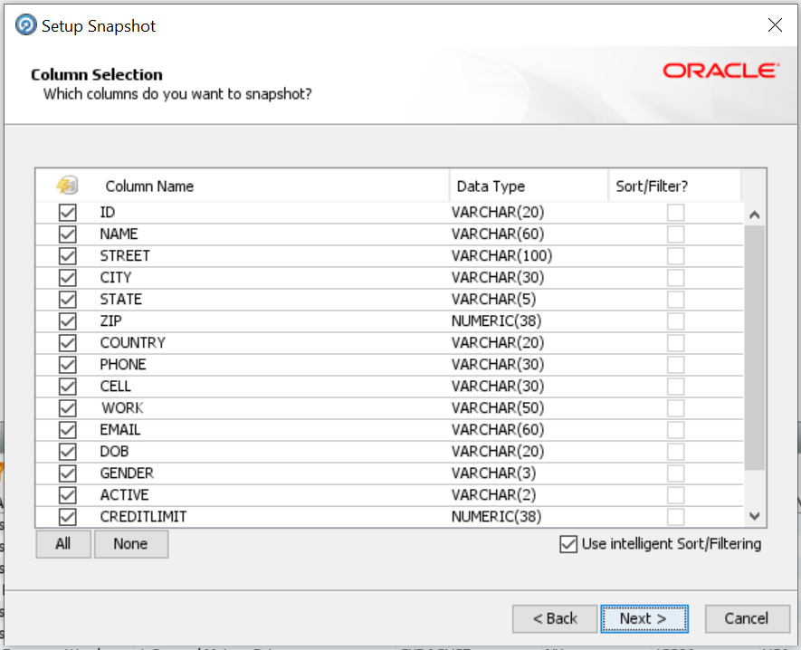

15.	In “Filter Options”, leave the default value of Simple and click “Next >” to continue.

    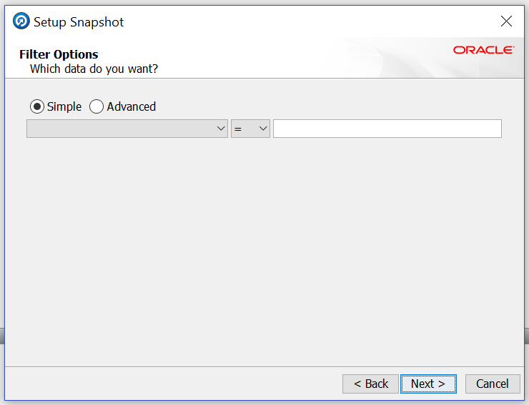

16.	Sampling Options allows to specify the amount of data brought to the snapshot. If needed, it is possible to specify a certain “Count” or “Percentage” of data to be read for the snapshot. Leave the default and click “Next >“.

    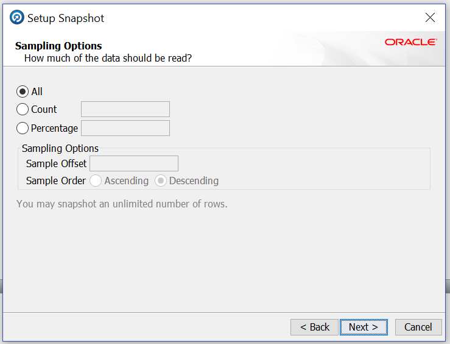

17.	Leave the default empty value for the ‘No Data’ Reference Data field, click on “Next >“.

    

18.	Provide the following data:
    ```
    Name: <copy>US Customer Data</copy>
    ```
    ```
    Description: <copy>Connection to Oracle Database.US_CUSTOMERS</copy>
    ```

19.	Verify that checkbox “Run Now?” is checked and click on “Finish”.

    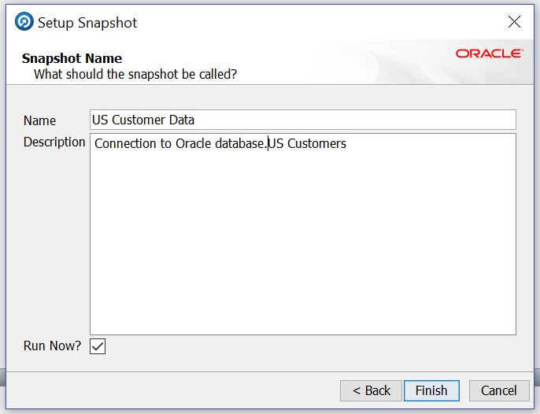

After a short delay, the Results Browser panel is populated. Taking the Snapshot causes EDQ to stage the data from the database into the EDQ data repository. From now on we will be working with the data residing in the "`US_Customer`" Data Snapshot and we will not be modifying or in any way accessing the source data.

**This concludes this lab. You may now [proceed to the next lab](#next).**

## Appendix 1: Troubleshooting
### **Optional:** If EDQ is not running, use EDQ Start Script to start the Services

1. From the remote desktop session, Click on the *Terminal* Desktop icon to open a terminal session

2. Run the *`edq_start_up.sh`* script to start the EDQ application.

    ```
   <copy>
    sh /home/oracle/scripts/edq_start_up.sh
   </copy>
    ```

    This script will approximately take 10 minutes to start the Node Manager, Weblogic and EDQ Services.

3. After about 10 minutes, go back to the browser tab and check if the page is working.

4. If the page is still not working, run the following to check if all required services are running.

    ```
    <copy>
    systemctl status edq
    systemctl status oracle-database
    </copy>
    ```

    

5. For any service failure, login as user *"opc"* from an SSH client using the private SSH key from the key pair you used while requesting your instance, and restart the problematic services accordingly

    ```
    <copy>
    sudo systemctl start edq
    sudo systemctl start oracle-database
    </copy>
    ```

## Learn More
- [Oracle Enterprise Data Quality](https://docs.oracle.com/en/middleware/fusion-middleware/enterprise-data-quality/index.html)

## Acknowledgements
* **Author** - Ravi Lingam, Sri Vishnu Gullapalli, Data Integration Team, Oracle, August 2020
* **Contributors** - Meghana Banka, Narayanan Ramakrishnan, Rene Fontcha
* **Last Updated By/Date** - Rene Fontcha, LiveLabs Platform Lead, NA Technology, February 2021

## Need Help?
Please submit feedback or ask for help using our [LiveLabs Support Forum](https://community.oracle.com/tech/developers/categories/livelabsdiscussions). Please click the **Log In** button and login using your Oracle Account. Click the **Ask A Question** button to the left to start a *New Discussion* or *Ask a Question*.  Please include your workshop name and lab name.  You can also include screenshots and attach files.  Engage directly with the author of the workshop.

If you do not have an Oracle Account, click [here](https://profile.oracle.com/myprofile/account/create-account.jspx) to create one.
