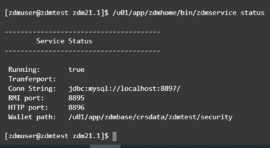
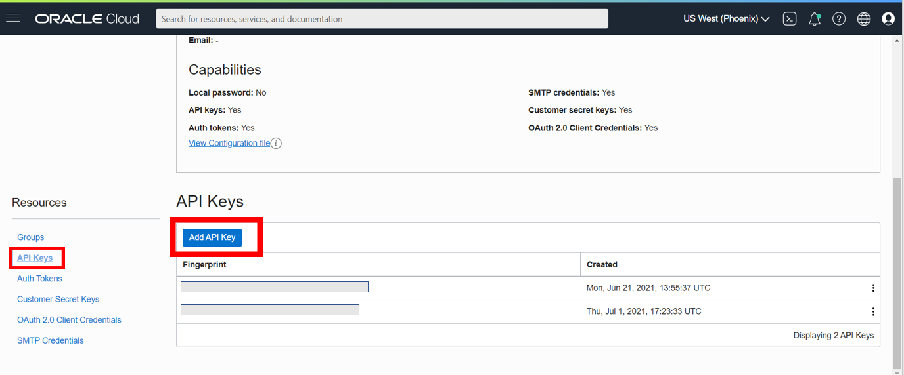
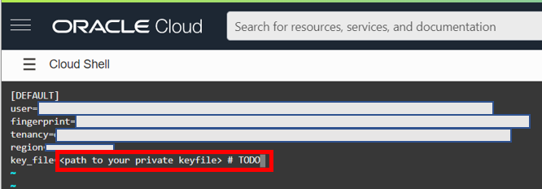

# Configure Your Host Environment

## Introduction
In this lab on your host instance, you will:
* Install Oracle Cloud Infrastructure Command Line Interface (OCI CLI)
* Create a Zero Downtime Migration (ZDM) group and user
* Add directories for ZDM  
* Install and Start ZDM
* Generate API keys
* Create your OCI directories and configuration files under all 3 users: 'zdmuser', 'oracle', and 'opc'
* Create RSA keys


The CLI is a small-footprint tool that you can use on its own or with the Console to complete Oracle Cloud Infrastructure tasks. The CLI provides the same core functionality as the Console, plus additional commands. Some of these, such as the ability to run scripts, extend Console functionality.

The API keys you are generating are to allow the OCI CLI you installed on your host instance to connect to your OCI user profile to run commands. The RSA keys will allow you to SSH connect directly to 'oci' from 'zdmuser' which will be needed when running the Zero Downtime Migration.

The reason your OCI directory is being copied to 'zdmuser', 'oracle', and 'opc' is so that each of these 3 users can utilize the OCI CLI.

Estimate Lab Time: 20 minutes

## **Task 1: Install OCI CLI**
1. Return to your compute instance command prompt as 'opc'. If you navigated away while creating your target database, you can reconnect through your command prompt with the following command. Replace < sshkeyname > and < Your Compute Instance Public IP Address > with the key file name and IP address of your source compute instance:

    ```
    <copy>
    ssh -i ~/.ssh/<sshkeyname> opc@<Your Compute Instance Public IP Address>
    </copy>
    ```


2. Install OCI CLI. Respond y at the prompt.

    ```
    <copy>
    sudo yum install python36-oci-cli
    </copy>
    ```

## **Task 2: Set ZDM Group and User and Create Directories**
1. Run code below to add the group zdm, create the user zdmuser, and add directories for the ZDM.

    ```
    <copy>
    sudo groupadd zdm
    sudo useradd -g zdm zdmuser
    sudo mkdir /u01/app/zdmhome
    sudo mkdir /u01/app/zdmbase
    sudo mkdir /u01/app/zdmdownload
    sudo chown zdmuser:zdm /u01/app/zdmhome
    sudo chown zdmuser:zdm /u01/app/zdmbase
    sudo chown zdmuser:zdm /u01/app/zdmdownload
    </copy>
    ```

## **Task 3: Install Zero Downtime Migration**
1. As 'opc' check that the following packages are installed:
    * expect
    * glib-devel
    * oraclelinux-developer-release-el7

    Run the below command to check each of the 3 packages above:

    ```
    <copy>
    rpm -qa | grep expect
    rpm -qa | grep glib-devel
    rpm -qa | grep oraclelinux-developer-release-el7
    </copy>
    ```

    If any of the packages are missing run the following command replacing `<package>` with the missing package name:

    ```
    <copy>
    sudo yum install <package>
    </copy>
    ```

2. Switch to the newly created 'zdmuser' and go to the directory 'zdmdownload'.

    ```
    <copy>
    sudo su - zdmuser
    cd /u01/app/zdmdownload
    </copy>
    ```

3. Retrieve the ZDM install file, unzip it, and go to the directory.

    ```
    <copy>
    wget https://objectstorage.us-ashburn-1.oraclecloud.com/p/mvN0sYf5aYnY5Skvy8gCB2gbHgvJ-1Hcwbx2sNgH7lPjSgm46v-PvevSOvV1u4lt/n/frwachlef5nd/b/MV2ADB/o/zdm21.1.zip
    unzip zdm*.zip
    cd zdm21.1
    </copy>
    ```

4. Run the install and start the service.

    Install ZDM:

    ```
    <copy>
    ./zdminstall.sh setup oraclehome=/u01/app/zdmhome oraclebase=/u01/app/zdmbase ziploc=/u01/app/zdmdownload/zdm21.1/zdm_home.zip -zdm
    </copy>
    ```

    Start ZDM service:

    ```
    <copy>
    /u01/app/zdmhome/bin/zdmservice start
    </copy>
    ```

    Check its status:

    ```
    <copy>
    /u01/app/zdmhome/bin/zdmservice status
    </copy>
    ```

    

## **Task 4: Generating API Keys**
1. As 'zdmuser' go to 'zdmhome' directory.

    ```
    <copy>
    cd /u01/app/zdmhome
    </copy>
    ```

2. Create your .oci directory and generate your API keys. Copy the catted 'oci\_api\_key\_public.pem' file to your clipboard. During the copy, include the "Begin Public Key" and "End Public Key" lines.

    ```
    <copy>
    mkdir .oci
    cd .oci
    openssl genrsa -out /u01/app/zdmhome/.oci/oci_api_key.pem 2048                        
    openssl rsa -pubout -in /u01/app/zdmhome/.oci/oci_api_key.pem -out /u01/app/zdmhome/.oci/oci_api_key_public.pem
    cat oci_api_key_public.pem
    </copy>
    ```

3. On your OCI Dashboard navigate to and click on your user profile in the top right. Select the top option, your user.
    

4. Select 'API Keys' and 'Add API Key'.
    

5. Paste your public OCI API key file you catted and copied to clipboard from above.
    

6. You will see a configuration file preview. Copy its contents to clipboard. You will be using it to populate your configuration file in the following step.
    

## **Task 5: Creating Your Configuration File and Copying Your Directory**
1. Back in your command prompt create your config file.

    ```
    <copy>
    vi config
    </copy>
    ```

2. 'i' command lets you insert text into the file.

    ```
    <copy>
    i
    </copy>
    ```

3. Paste the config file preview contents that were copied to clipboard into the file.

4. Replace < path to your private keyfile > # TODO with:

    ```
    <copy>
    /u01/app/zdmhome/.oci/oci_api_key.pem
    </copy>
    ```

    

5. Press the escape key to escape insert.

6. To save and quit vi editor.

    ```
    <copy>
    :wq!
    </copy>
    ```

    If you need to leave vi editor without saving.

    ```
    <copy>
    :q!
    </copy>
    ```

7. Copy ''.oci' to 'opc'. Start by switching from 'zdmuser' to 'opc'.

    ```
    <copy>
    exit
    </copy>
    ```

8. Go to root directory and make .oci directory.

    ```
    <copy>
    cd ~
    mkdir .oci
    cp /u01/app/zdmhome/.oci/config /home/opc/.oci
    cp /u01/app/zdmhome/.oci/oci_api_key.pem /home/opc/.oci
    cp /u01/app/zdmhome/.oci/oci_api_key_public.pem /home/opc/.oci
    </copy>
    ```

9. Update the config file.

    ```
    <copy>
    cd .oci
    vi config
    </copy>
    ```

10. Update key_file path to ~/.oci/oci\_api\_key.pem and then save and quit the vi editor.

    ```
    <copy>
    ~/.oci/oci_api_key.pem
    </copy>
    ```

11. Lock the private key file.

    ```
    <copy>
    chmod go-rwx ~/.oci/oci_api_key.pem
    </copy>
    ```

12. Test OCI CLI as 'opc'. Ignore any warnings. If the output is similar to the image below the test was successful.

    ```
    <copy>
    oci iam region list
    </copy>
    ```

    

13. Repeat the steps for 'oracle'.

    ```
    <copy>
    sudo su - oracle
    cd ~
    mkdir .oci
    mkdir /u01/app/oracle/export
    cd .oci
    cp /u01/app/zdmhome/.oci/config /home/oracle/.oci
    cp /u01/app/zdmhome/.oci/oci_api_key.pem /home/oracle/.oci
    cp /u01/app/zdmhome/.oci/oci_api_key_public.pem /home/oracle/.oci
    vi config		
    </copy>
    ```

14. Update the key\_file path to ~/.oci/oci\_api\_key.pem and save and quit vi editor.

    ```
    <copy>
    ~/.oci/oci_api_key.pem
    </copy>
    ```

15. Lock private key file.

    ```
    <copy>
    chmod go-rwx ~/.oci/oci_api_key.pem
    </copy>
    ```

16. Test OCI CLI with 'oracle'.

    ```
    <copy>
    oci iam region list
    </copy>
    ```

17. Lock 'zdmuser' private key file.

    ```
    <copy>
    exit
    sudo su - zdmuser
    cd /u01/app/zdmhome/.oci
    chmod go-rwx /u01/app/zdmhome/.oci/oci_api_key.pem
    </copy>
    ```

## **Task 6: Creating RSA Keys**

1. As 'zdmuser' go to root directory and generate RSA keys. Hit enter key 3 times for no password and to save to /home/zdmuser/.ssh/id_rsa.

    ```
    <copy>
    cd ~
    ssh-keygen
    </copy>
    ```

2. Switch from 'zdmuser' to 'opc'.

    ```
    <copy>
    exit
    </copy>
    ```

3. Create a copy of the public key file under 'opc'.

    ```
    <copy>
    cd ~/.ssh
    sudo cat /home/zdmuser/.ssh/id_rsa.pub >> /home/opc/.ssh/authorized_keys
    </copy>
    ```

4. There should now be two keys under authorized_keys:

    ```
    <copy>
    cat authorized_keys
    </copy>
    ```

        

5. Switch back to 'zdmuser':

    ```
    <copy>
    sudo su - zdmuser
    </copy>
    ```

## Acknowledgements
* **Author** - Zachary Talke, Solutions Engineer, NA Tech Solution Engineering
* **Last Updated By/Date** - Zachary Talke, July 2021
