# Configuring the GoldenGate Hub

## Introduction

#### Logical Online Migration with Backup Location
ZDM's Logical Online Migration requires a GoldenGate Hub with two GoldenGate Microservices, one Extract and One Replicat. These two microservices's task is to keep both Source and Target in Sync during the migration and during the graceful switchover. The overall logical workflow architecture, as discussed in this workshop's introduction, is as follows:

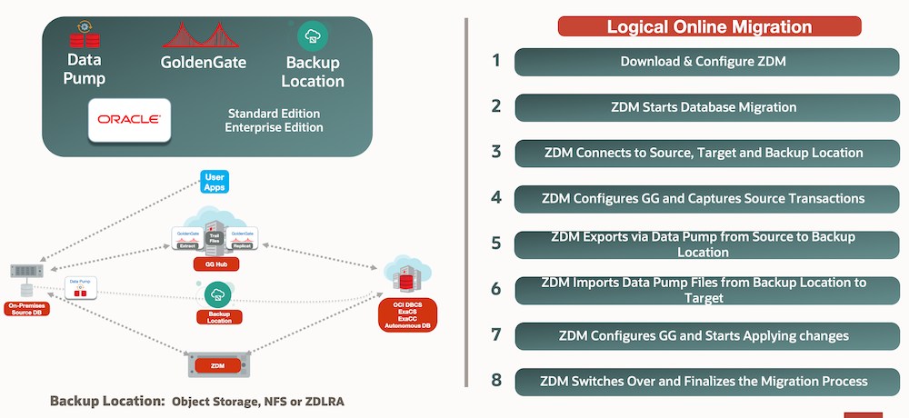


## Prerequiste: Verify VCN Correct Configuration

1. Login to the Oracle Cloud.

2. Once you are logged in, you are taken to the cloud services dashboard where you can see all the services available to you. Click the navigation menu in the upper left to show top level navigation choices. Click __Networking__ and Click __Virtual Cloud Networks__

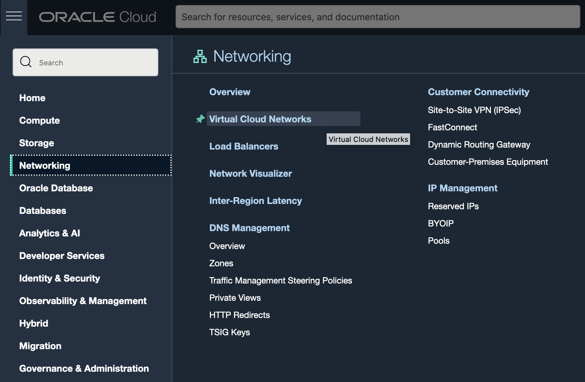

2.  Click on the Name of the only available VCN in your compartment


3.  Scroll down to the __Subnets__ section and click on the only available subnet in your compartment

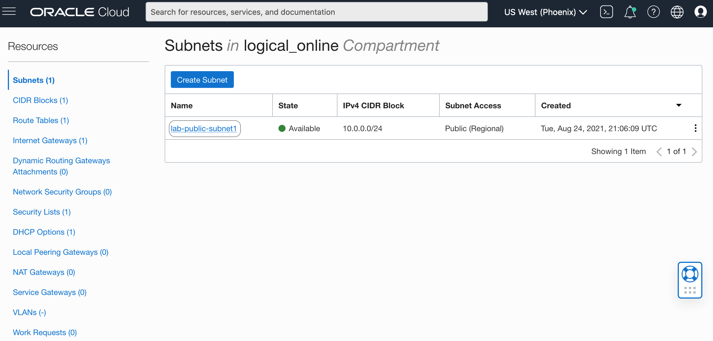

4.  Scroll down to the __Security Lists__ section and click on the only available Security List in your compartment


4.  Scroll down to the __Ingress Rules__ section. If there are no rules for __Port 443__ and __Port 1521__, they must be added. The absence of rules would look like this:

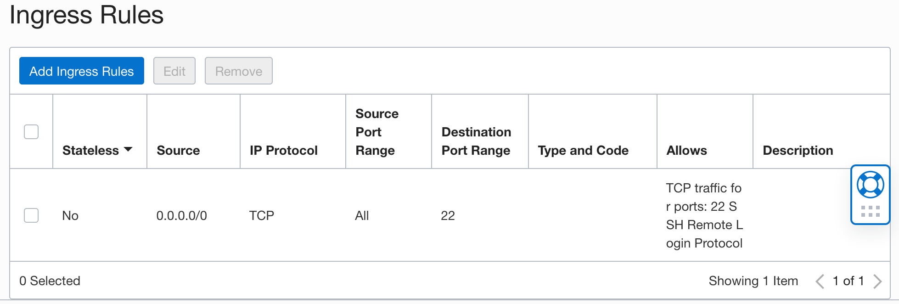

4.  If there are no rules present, click on the __Add Ingress Rules__ button. Otherwise, you may proceed to __Task 1__.

5. An __Add Ingress Rules__ pane will pop up. Enter the following parameters. 

- Stateless - __Left Unchecked__
- Source Type - __CIDR__
- Source CIDR - __0.0.0.0/0__
- IP Protocol - __TCP__
- Source Port Range - __Left as is__
- Destination Port Range - __443__
- Description - __OGG HTTPS__

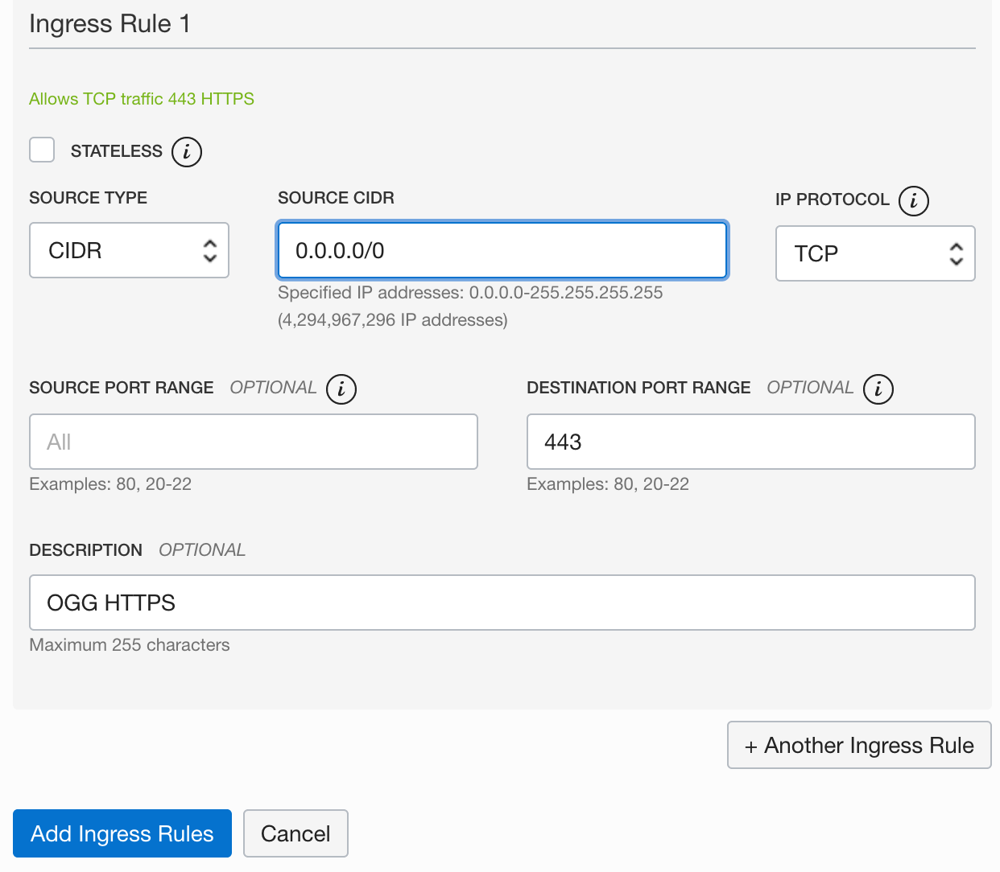

6. Click on the __Add Ingress Rules__ button on the bottom:

7. Once you have added a rule for __Port 443__, proceed with a rule for __Port 1521__. Click on the __Add Ingress Rules__ button, an __Add Ingress Rules__ pane will pop up. Enter the following parameters. 

- Stateless - __Left Unchecked__
- Source Type - __CIDR__
- Source CIDR - __0.0.0.0/0__
- IP Protocol - __TCP__
- Source Port Range - __Left as is__
- Destination Port Range - __1521__
- Description - __Oracle DB__

8. Click on the __Add Ingress Rules__ button on the bottom:

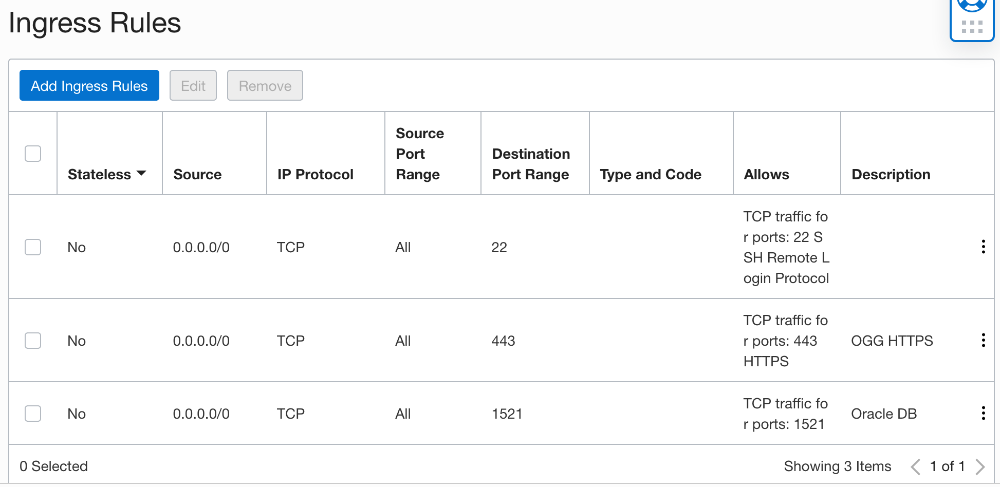


## Task 1: Setting up the GoldenGate Image from the Oracle Cloud Infrastructure Market Place

1. Click the navigation menu in the upper left to show top level navigation choices. On the Search bar, type "Marketplace" and click on the __All Applications__ result on the right hand side.


3. On the Market Place search bar enter __GoldenGate Migration__ and select the __Oracle GoldenGate for Oracle - Database Migrations__ Image.


4. Accept the Terms & Conditions and Click on __Launch Stack__.

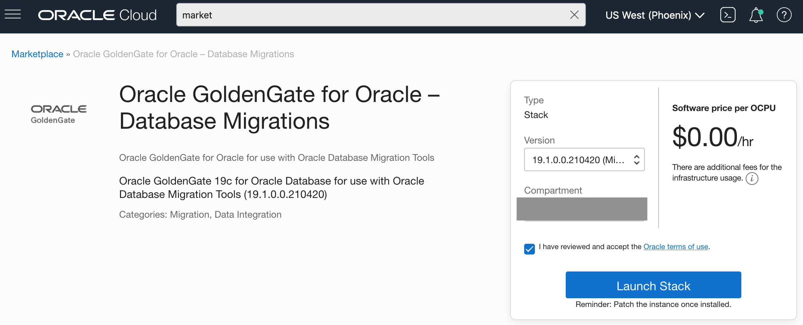

5. Creating the stack is divided in three stages, Stack Information, Configurable Variables and Final Review. For the first stage, Stack Information, scroll down to the bottom and click on __Next__.

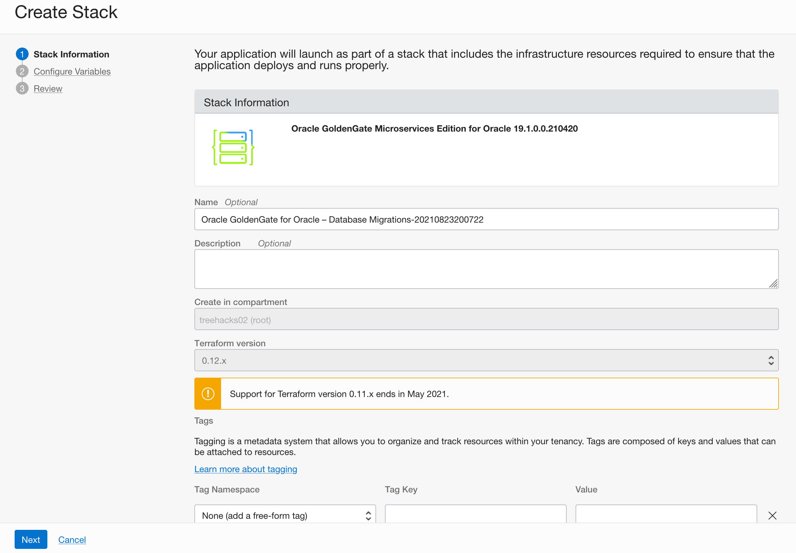

6. Configure the following variables for section __Name for New Resources__:

- Display Name (As is)
- Host DNS Name, enter __oggzdm__

 

7. Configure the following variables for section __Network Settings__:

- VCN Network Compartment
- VCN
- Subnet Network Compartment
- Subnet

All variables must be from the compartment where all your resources are deployed.

 


8. Configure the following variables for section __Instance Settings__:

- Availability Domain
- Compute Shape
- Assign Public IP (Check)
- Custom Volume Sizes (Left Unchecked)

The Availability Domain must be the same as the rest of your resources. The Compute Shape of choice is VM.Standard2.4

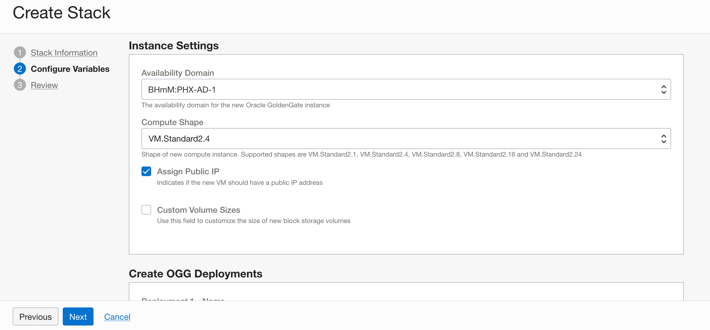 

9. Configure the following variables for section __Create OGG Deployments__:

- Deployment 1 - Name, enter __Source__
- Deployment 1 - Database,  select __Oracle 19c (19.x)__
- Deployment 2 - Name, enter __Target__ 
- Deployment 2 - Database, select __Oracle 19c (19.x)__
- Deployment 2 - Automomous Database (__Check__)
- Deployment 2 - Autonomous Database Compartment, select appropriate compartment as the rest of your deployment
- Deployment 2 - Autonomous Database Instance, select the target database created earlier 

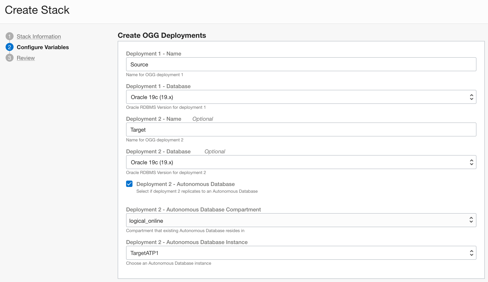 

10. Configure the following variable for section __Shell Access__:

- SSH Public Key, enter the key saved for the opc user in Lab 1.

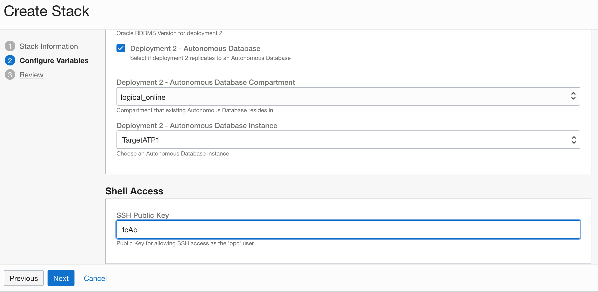

11. Review your entries & Click __Next__

12. Proceed to do a final review & Click __Create__ when ready. 

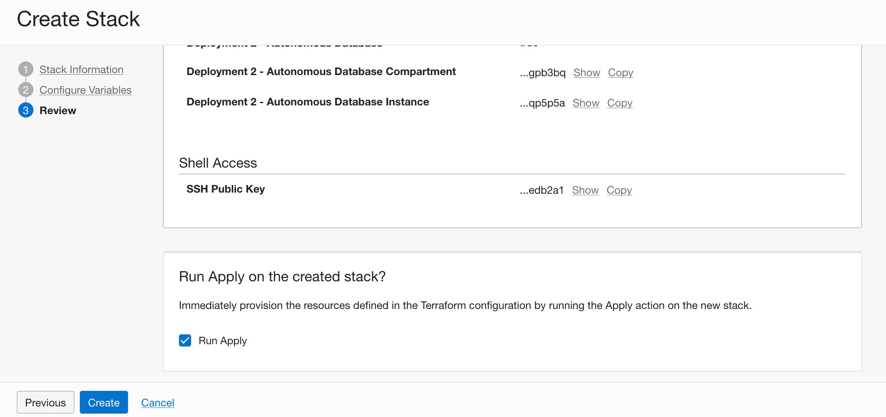

13. Upon creation, scroll down to the bottom of the logs and copy the ogg_instance_id OCID and the ogg_public_ip. Save them for later use, you will require it during the migration

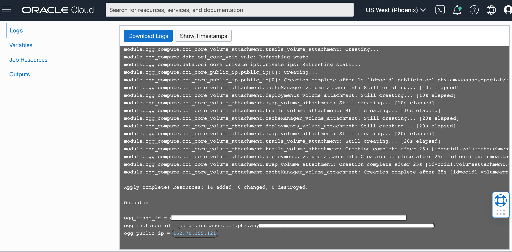

## Task 2: Connecting to the GoldenGate Hub

1. Open CloudShell

2. Connect to the GoldenGate Hub, replace __<ogg_public_ip>__ with the GoldenGate Hub public ip copied above. Enter yes at the prompt

    ```
    <copy>
    ssh -i ~/.ssh/sshlabkeys opc@<ogg_public_ip>
    </copy>
    ```

3. Copy the output of the following command, it will be required in the following steps
    
    ```
    <copy>
    cat ./ogg-credentials.json
    </copy>
    ```


4. In a separate browser tab, open the OGG Service Manager home page using the __GoldenGate Hub Public ip__ please do not use the __<>__: https://<ogg_public_ip> 
The browser will show warnings that the page is insecure because it uses a self-signed certificate. Ignore those warnings and proceed

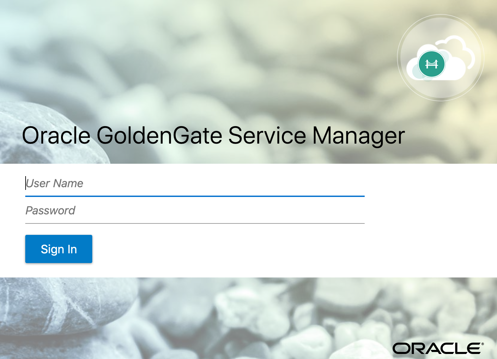

5. Enter the username and password (labeled credential) from the out copied from the ogg-credentials.json file from above. Click __Sign In__

6. Click on the top left "Hamburguer" menu

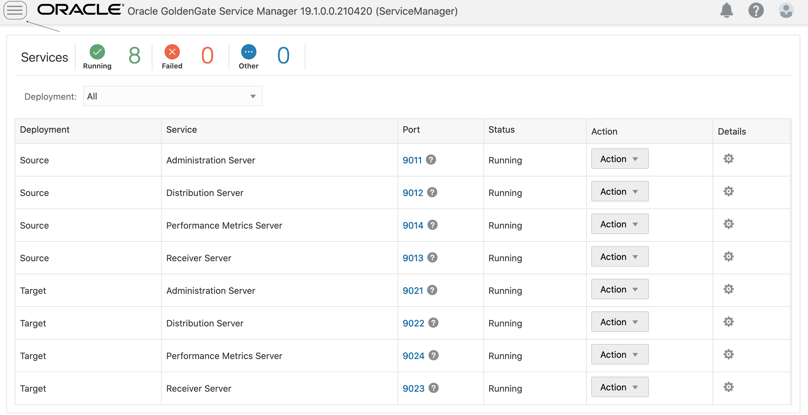

7. Click on __Administrator__

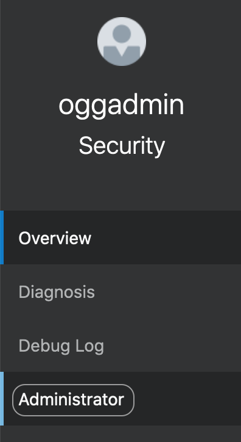

8. Click on the Edit Pen on the right to edit the oggadmin user


9. Enter the following information:

- Type: Basic
- Info: admin
- Password: __WELcome##1234__
- Verify Password: __WELcome##1234__

Upon review, click __Submit__


10. You will be logged out of the Oracle GoldenGate Service Manager, sign in again with oggadmin and the recently updated password from the step above (#9)

11. In the Services table, click on the __port__ of the Source Administration Server (typically __9011__), this will open a new Sign In page for the __Oracle GoldenGate Administrator Server__


12. Enter the username and password (labeled credential) from the out copied from the ogg-credentials.json file from step 3 above. Do not enter the newly updated password.

13. Click on the top left "Hamburguer" menu


14. Click on __Administrator__


15. Click on the Edit Pen on the right to edit the oggadmin user


16. Enter the following information:

- Type: Basic
- Info: admin
- Password: __WELcome##1234__
- Verify Password: __WELcome##1234__

Upon review, click __Submit__


17. You will be logged out of the Oracle GoldenGate Service Manager, sign in again with oggadmin and the recently updated password from the step above (#9)

18. In the Services table, click on the __port__ of the Tabe Administration Server (typically __9021__), this will open a new Sign In page for the __Oracle GoldenGate Administrator Server__


19. Enter the username and password (labeled credential) from the out copied from the ogg-credentials.json file from step 3 above. Do not enter the newly updated password.

20. Click on the top left "Hamburguer" menu


21. Click on __Administrator__


22. Click on the Edit Pen on the right to edit the oggadmin user


23. Enter the following information:

- Type: Basic
- Info: admin
- Password: __WELcome##1234__
- Verify Password: __WELcome##1234__

Upon review, click __Submit__


You may now close any Oracle GoldenGate Service Manager leftover tab and [proceed to the next lab](#next).

## Learn More About ZDM's Oracle GoldenGate Hub

* [Oracle Zero Downtime Migration - Product Page](http://www.oracle.com/goto/zdm)
* [Oracle GoldenGate MicroService Documentation](https://docs.oracle.com/en/middleware/goldengate/core/19.1/oggmp/oracle-goldengate-microservices-oracle-cloud-marketplace.html)


## Acknowledgements
* **Authors** - Ricardo Gonzalez, Senior Principal Product Manager, Oracle Cloud Database Migration
* **Authors** - Ameet Kumar Nihalani, Senior Principal Support Engineer, Oracle Cloud Database Migration
* **Contributors** - LiveLabs Team, ZDM Development Team
* **Last Updated By/Date** - Ricardo Gonzalez, August 2021
