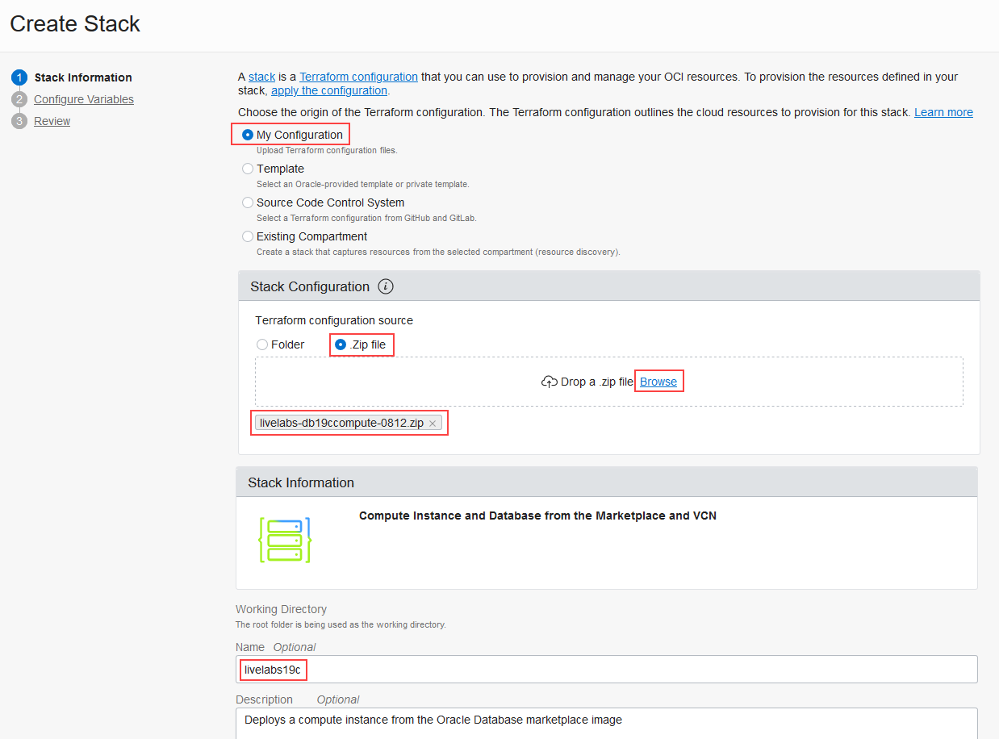
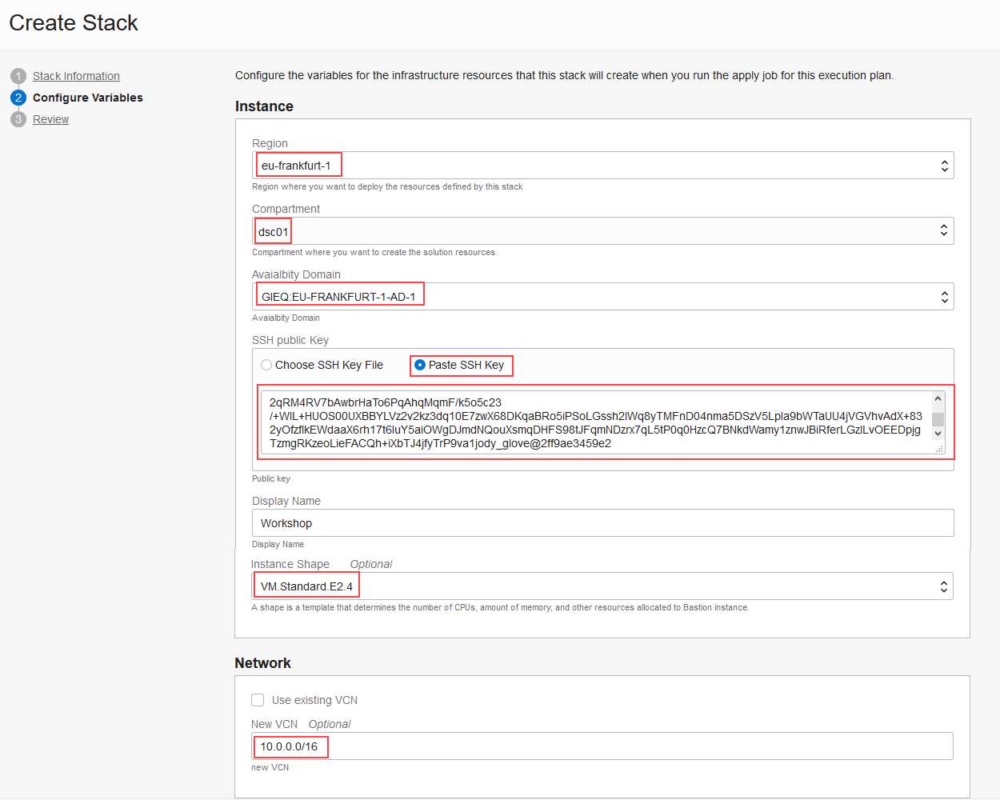
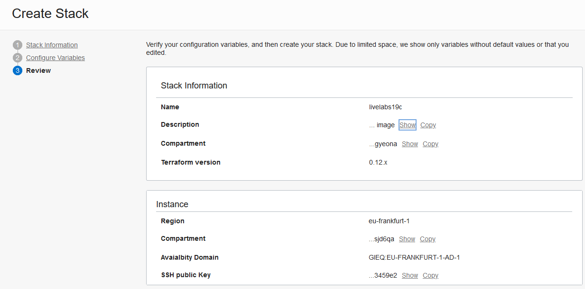
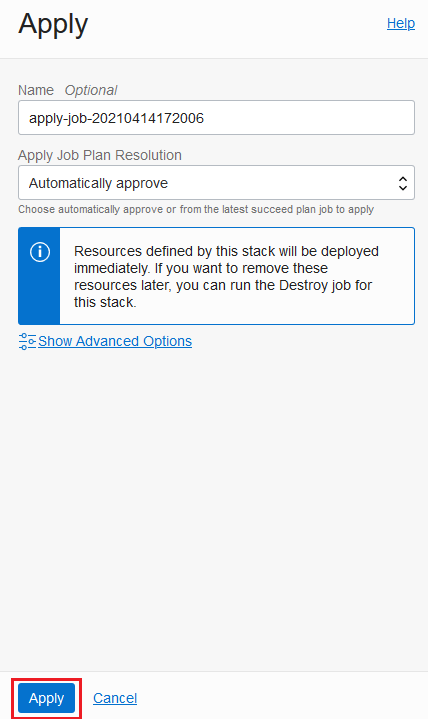

# Deploy a Compute Image with Oracle Database 19c Installed

## Introduction

In this lab, you use Resource Manager in Oracle Cloud Infrastructure (OCI) to quickly deploy a compute image that has Oracle Database 19c installed on it. Guacamole is also installed to provide a friendly user interface.

You begin in Resource Manager by creating a stack, which is a collection of Oracle Cloud Infrastructure resources corresponding to a given Terraform configuration. A Terraform configuration is a set of one or more TF files written in HashiCorp Configuration Language (HCL) that specify the Oracle Cloud Infrastructure resources to create. The Terraform configuration that you use in this lab is provided by LiveLabs as a downloadable ZIP file and loads a custom image stored in Oracle Cloud Marketplace. After you create the stack, you apply it to start a provisioning job. When the job is completed, you verify that you can connect to your compute instance via a browser and Cloud Shell.


### Objectives

In this lab, you learn how to do the following:

- Create and apply a stack in Resource Manager
- Obtain the public IP address of your compute instance
- Connect to your compute instance via a browser
- Connect to your compute instance via Cloud Shell
- Discover the container database (CDB) and pluggable database (PDB) on your compute instance

### Prerequisites

- You have an Oracle account. You can obtain a free account by using Oracle Free Tier or you can use a paid account provided to you by your own organization.
- You have created SSH keys.

### Assumptions

- You are signed in to Oracle Cloud Infrastructure.

## **STEP 1**: Create and apply a stack in Resource Manager

1. Download [livelabs-db19compute-0812.zip](https://objectstorage.us-ashburn-1.oraclecloud.com/p/R_vJuMUIrsFofKYcTuJOsDiXl2xdSjHNQU7yjQPtnh4/n/c4u03/b/labfiles/o/livelabs-db19ccompute-0812.zip) to a directory on your local computer. This ZIP file contains the terraform script.

2. On the home page in Oracle Cloud Infrastructure, click **Create a stack**. The **Create Stack** page is displayed. The **Create Stack** page is displayed.

  

3. For **Stack Information**, do the following:

  a) Select **My Configuration**.

  b) In the **Stack Configuration** area, select **.ZIP file**, click **Browse**, select the ZIP file that you just downloaded (`livelabs-db19ccompute-0812.zip`), and then click **Open**.

  c) Scroll down, and in the **NAME** box, enter a name of your choice, for example, **livelabs19c**.

  

  d) Click **Next**.

4. For **Configure Variables**, do the following:

  a) Leave **Region** as is.

  b) Select the compartment in which you want to create the compute instance.

  c) Select an availability domain.

  d) Select **Paste SSH Key**, and paste the contents of your public key into the box.

  e) Leave **VMStandard.E2.4** selected as the instance shape. This shape meets the memory requirements for installing Oracle Database 19c.

  f) Leave the network settings as is.

  

  g) Click **Next**.

5. On the **Review** page, verify that the information is correct.

  

6. Click **Create**. Your stack is created and the **Stack Details** page is displayed.

  

6. From the **Terraform Actions** drop-down, select **Apply**. The **Apply** window is displayed.

7. In the **Apply** window, leave the name as is and the **APPLY JOB PLAN RESOLUTION** set to **Automatically approve**, and click **Apply**. Resource Manager starts a job to deploy your resources.

  

8. When the job is finished, inspect the log. The last line should read `Apply complete!`.

## **STEP 2**: Obtain the public IP address of your compute instance

1. From the navigation menu in the Oracle Cloud Infrastructure Console, select **Compute**, and then **Instances**.

2. Select your compartment.

3. Find the public IP address of the compute instance called **workshop-installed** in the table and jot it down.

4. (Optional) Click the **workshop-installed** compute instance to view all of its details.


## **STEP 3**: Connect to your compute instance via a browser

1. On your local computer, open a browser, and enter the following url. Replace `compute-public-ip` with the public IP address of your compute instance.

    ```nohighlighting
    <copy>compute-public-ip:8080/guacamole</copy>
    ```

2. Enter `oracle` as the username and `Guac.LiveLabs_` as the password, and then click Login. Don't forget the underscore at the end of the password!
    (guacamole-login-page.png)

   You are presented with a Guacamole desktop. The desktop provides shortcuts to Firefox and a terminal window.

## **STEP 4**: Connect to your compute instance via Cloud Shell

1. On the toolbar in Oracle Cloud Infrastructure, click the Cloud Shell icon to launch Cloud Shell.

  

  A terminal window opens at the bottom of the page.

2. Enter the following `ssh` command to connect to your compute instance. Replace `public-ip-address` with the public IP address of your compute instance.

  `cloudshellkey` is the name of the private key file that you created in the [Generate SSH Keys - Cloud Shell](?lab=https://raw.githubusercontent.com/oracle/learning-library/master/common/labs/generate-ssh-key-cloud-shell/generate-ssh-keys-cloud-shell.md) lab. If your private key has a different name, then replace `cloudshellkey` with it.

    ```nohighlighting
    $ <copy>ssh -i ~/.ssh/cloudshellkey opc@public-ip-address</copy>
    ```

    A message states that the authenticity of your compute instance can't be established. Do you want to continue connecting?

3. Enter **yes** to continue. The public IP address of your compute instance is added to the list of known hosts on your Cloud Shell machine.

  You are now connected to your new compute instance via Cloud Shell.


## **STEP 5**: Discover the container database (CDB) and pluggable database (PDB)

1. Switch to the `oracle` user.

    ```nohighlighting
    [opc@workshop ~]$ <copy>sudo su - oracle</copy>
    ```

2. Track the database installation and configuration by viewing the `dbsingle.log` file.

    ```nohighlighting
    [oracle@workshop ~]$ <copy>tail -f /u01/ocidb/buildsingle.log</copy>
    ```
    ...
    INFO (node:workshop): Creating database (ORCL) (Single Instance)
    ...
    Prepare for db operation
    8% complete
    Copying database files
    31% complete
    Creating and starting Oracle instance
    32% complete
    36% complete
    ...
    ```

3. Wait for the log to state the following information. It takes *approximately 20-30 minutes* for the database to be configured and ready for use.

    ```nohighlighting
    ...
    21-04-18 22:29:38:[buildsingle:Done :workshop] Building 19c Single Instance
    2021-04-18 22:29:38:[buildsingle:Time :workshop] Completed successfully in 2367 seconds (0h:39m:27s)
    ```

4. Run the following command to verify the database is running.

    ```nohighlighting
    $ <copy>ps -ef | grep ORCL</copy>

    ...
    oracle   12100     1  0 22:40 ?        00:00:00 ora_w00e_ORCL
    oracle   12104     1  0 22:40 ?        00:00:00 ora_w00f_ORCL
    opc      12412 10323  0 22:44 pts/1    00:00:00 grep --color=auto ORCL
    ```

5. Verify the listener is running.

    ```nohighlighting
    $ <copy>ps -ef | grep tns</copy>

    root        61     2  0 21:49 ?        00:00:00 [netns]
    oracle    4574     1  0 21:50 ?        00:00:00 /u01/app/oracle/product/19c/dbhome_1/bin/tnslsnr LISTENER -inherit
    opc      12602 10323  0 22:46 pts/1    00:00:00 grep --color=auto tns
    ```

6. Set the environment variables to point to the Oracle binaries. When prompted for the SID (Oracle Database System Identifier), enter **ORCL**.

    ```nohighlighting
    $ <copy>. oraenv</copy>
    ORACLE_SID = [oracle] ? ORCL
    The Oracle base has been set to /u01/app/oracle
    [oracle@workshop ~]$
    ```

7. Using SQLPlus, connect to the `root` container of your database. SQL*Plus is an interactive and batch query tool that is installed with every Oracle Database installation.

    ```nohighlighting
    $ <copy>sqlplus / as sysdba</copy>

    SQL*Plus: Release 19.0.0.0.0 - Production on Wed Apr 14 22:52:11 2021
    Version 19.10.0.0.0

    Copyright (c) 1982, 2020, Oracle.  All rights reserved.


    Connected to:
    Oracle Database 19c Enterprise Edition Release 19.0.0.0.0 - Production
    Version 19.10.0.0.0

    SQL>
    ```

8. Verify that you are logged in to the `root` container as the `SYS` user.

    ```nohighlighting
    SQL> <copy>SHOW user</copy>

    USER is "SYS"
    SQL>
    ```

9. Find the current container name. Because you're currently connected to the `root` container, the name is `CDB$ROOT`.

    ```nohighlighting
    SQL> <copy>SHOW con_name</copy>

    CON_NAME
    -------------------
    CDB$ROOT
    SQL>
    ```

10. List all of the containers in the CDB by querying the `V$CONTAINERS` view. The results list three containers - the `root` container (`CDB$ROOT`), the seed PDB (`PDB$SEED`), and the pluggable database (`ORCLPDB`).

    ```nohighlighting
    SQL> <copy>COLUMN name FORMAT A8</copy>
    SQL> <copy>SELECT name, con_id FROM v$containers ORDER BY con_id;</copy>

    NAME         CON_ID
    -------- ----------
    CDB$ROOT          1
    PDB$SEED          2
    ORCLPDB           3
    SQL>
    ```

11. Exit SQL*Plus.

    ```nohighlighting
    SQL> <copy>EXIT</copy>

    $
    ```
12. Using SQL*Plus, connect to the pluggable database `orclpdb` as the `oracle` user.

  *REVIEWER: Why do we say connect as the oracle user? Isn't this the SYSTEM user?*

    ```nohighlighting
    $ <copy>sqlplus system/Ora_DB4U@localhost:1521/orclpdb</copy>      
    ```
13. Exit SQL*Plus.

    ```nohighlighting
    SQL> <copy>EXIT</copy>
    Disconnected from Oracle Database 19c Enterprise Edition Release 19.0.0.0.0 - Production
    Version 19.10.0.0.0

    $
    ```
Congratulations! You have a fully functional Oracle Database 19c instance running on a compute instance in Oracle Cloud Infrastructure.

You may now [proceed to the next lab](#next).


## Learn More

- [Resource Manager Video](hhttps://youtu.be/udJdVCz5HYs)

## Acknowledgements

- **Author**- Jody Glover, Principal User Assistance Developer, Database Development
- **Last Updated By/Date** - Jody Glover, Database team, April 22 2021
