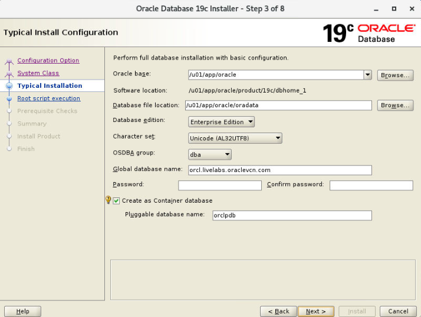
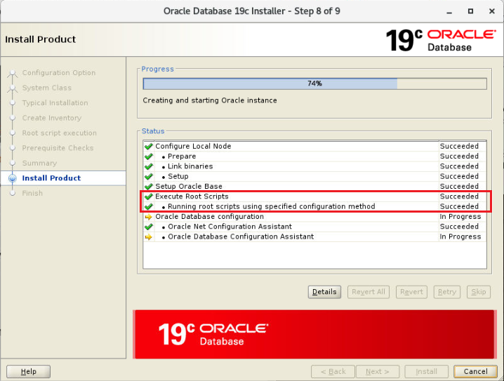

# Install Oracle Database 19c with Automatic Root Script Execution

## Introduction

Oracle Database 19c installer has a new feature that automatically runs `root` configuration scripts for you. This feature simplifies the installation process and helps you to avoid inadvertent permission errors. The installer lets you configure the `root` user or a sudoer user to run the configuration scripts. Both options require the user's password. Here you configure the `oracle` user to run the scripts. The `oracle` user has already been configured as a sudoer on your compute instance.

After you install the database, you examine the response file as well as the container database (CDB) and pluggable database (PDB) that get created.

Estimated Lab Time: 30 minutes

### Objectives

Learn how to do the following:

- Install Oracle Database 19c using the new automatic root script execution feature
- Review the response file
- Discover the container database (CDB) and pluggable database (PDB)


### Prerequisites

Before you start, be sure that you have obtained and signed in to your `workshop-staged` compute instance. If not, see the lab called **Obtain a Compute Image with Staged Oracle Database 19c Installer Files**.


## Task 1: Install Oracle Database 19c using the new automatic root script execution feature

1. On your desktop, double-click the **Terminal** icon to open a terminal window. Notice that you are signed in to the Linux operating system as the `oracle` user. It's important that you run the Oracle Database 19c installer as the `oracle` user.

2. Change to the Oracle home directory.

    ```
    $ <copy>cd /u01/app/oracle/product/19c/dbhome_1</copy>
    ```

3. List the files in the Oracle home directory. Notice that you have a `runInstaller` file and a `32545013` directory, which is the Oracle Database release update for 19.11.0.0.

    ```
    $ <copy>ls</copy>
    ```

4. Launch the Oracle Database 19c installer by executing the `runInstaller` file. Include the `applyRU` parameter to apply the Oracle Database release update for 19.11.0.0. The installer first applies the patch (this takes about seven minutes), and then it opens the Oracle Universal Installer wizard. If you don't want to patch up to release 19.11.0, you can leave out the -`applyRU` parameter and value, and Oracle Database release 19.3 will get installed.

  *Important! Enter the command carefully and check that it is correct before you run it.*

    ```
    $ <copy>./runInstaller -applyRU 32545013</copy>
    ```

5. On the **Configuration Option** page, leave **Create and configure a single instance database** selected, and click **Next**. This option creates a starter database with one container database (CDB) and one pluggable database (PDB).

  

6. On the **System Class** page, leave **Desktop Class** selected, and click **Next**.

  

7. On the **Typical Installation** page, leave all the default values as is. Enter **Ora4U_1234** in the **Password** and **Confirm password** boxes. The following values will be configured:

    - Oracle base: `/u01/app/oracle`
    - Database file location: `/u01/app/oracle/oradata`
    - Database edition: Enterprise Edition
    - Character set: Unicode (AL32UTF8)
    - OSDBA group: `dba`
    - Global database name: `orcl.livelabs.oraclevcn.com`
    - Password: `Ora4U_1234`
    - Create as Container database (selected)
    - Pluggable database name: `orclpdb`

  


8. On the **Create Inventory** page, leave the default settings as is, and click **Next**. The following values will be configured:

    - Inventory Directory: `/u01/app/oraInventory`
    - oraInventory Group Name: `oinstall`

  

9. On the **Root script execution** page, do the following, and then click **Next**.

    - Select the **Automatically run configuration scripts** check box. *This is the new feature!*

    - Select **Use sudo**. The `oracle` user is automatically configured as the sudo user. The sudo user name must be the username of the user installing the database.

    - Enter the password for the `oracle` user, which is `Ora4U_1234`.


  

10. On the **Perform Prerequisite Checks** page, wait for the installer to verify that your environment meets the minimum installation and configuration requirements. If everything is fine, the **Summary** page is displayed.

  

  

11. On the **Summary** page, click **Save Response File**. The **Save Response File** dialog box is displayed. Browse to and select the `/tmp` directory. Leave **db.rsp** as the name, and click **Save**.

12. Click **Install** to begin installing the software.

13. On the **Install Product** page, monitor the progress of the steps being executed.

  

14. When prompted to run the configuration scripts as the privileged user, click **Yes** to continue. The installation takes between 15 to 20 minutes to complete.

  

15. On the **Finish** page, click **Close**. The installation is finished.

    


## Task 2: Review the response file

You can continue to use your PuTTY connection for this step.

1. Change to the `/tmp` directory where you saved the response file.

    ```
    $ <copy>cd /tmp</copy>
    ```
2. Review the response file (`db.rsp`).

    ```
    $ <copy>cat db.rsp</copy>

    ####################################################################
    ## Copyright(c) Oracle Corporation 1998,2019. All rights reserved.##
    ##                                                                ##
    ## Specify values for the variables listed below to customize     ##
    ## your installation.                                             ##
    ##                                                                ##
    ## Each variable is associated with a comment. The comment        ##
    ## can help to populate the variables with the appropriate        ##
    ## values.                                                        ##
    ##                                                                ##
    ## IMPORTANT NOTE: This file contains plain text passwords and    ##
    ## should be secured to have read permission only by oracle user  ##
    ## or db administrator who owns this installation.                ##
    ##                                                                ##
    ####################################################################
    ...
    ```


## Task 3: Discover the container database (CDB) and pluggable database (PDB)

1. Set the Oracle environment variables. You need to set these each time you open a new terminal window and want to access your database.

  For the `ORACLE_SID` value, enter `ORCL`.

    ```
    $ <copy>. oraenv</copy>

    ORACLE_SID = [oracle] ? ORCL
    The Oracle base has been set to /u01/app/oracle
    $
    ```

2. View the environment variables set by the `. oraenv` command that you just ran.

    ```
    $ <copy>set | grep ORACLE</copy>

    OLD_ORACLE_BASE=
    ORACLE_BASE=/u01/app/oracle
    ORACLE_HOME=/u01/app/oracle/product/19c/dbhome_1
    ORACLE_SID=orcl
    $
    ```


3. Using SQL\*Plus, connect to the `root` container of your database. SQL\*Plus is an interactive and batch query tool that is installed with every Oracle Database installation.

    ```
    $ <copy>sqlplus / as sysdba</copy>

    SQL*Plus: Release 19.0.0.0.0 - Production on Wed Jul 7 14:58:59 2021
    Version 19.11.0.0.0

    Copyright (c) 1982, 2020, Oracle.  All rights reserved.

    Connected to:
    Oracle Database 19c Enterprise Edition Release 19.0.0.0.0 - Production
    Version 19.11.0.0.0

    SQL>
    ```

4. Check the version of the database.

    ```
    SQL> <copy>SELECT banner_full FROM v$version;</copy>

    BANNER_FULL
    --------------------------------------------------------------------------------
    Oracle Database 19c Enterprise Edition Release 19.0.0.0.0 - Production
    Version 19.11.0.0.0
    ```

5. Verify that you are logged in to the `root` container as the `SYS` user.

    ```
    SQL> <copy>SHOW user</copy>

    USER is "SYS"
    SQL>
    ```

6. Find the current container name. Because you're currently connected to the `root` container, the name is `CDB$ROOT`.

    ```
    SQL> <copy>SHOW con_name</copy>

    CON_NAME
    -------------------
    CDB$ROOT
    SQL>
    ```

7. List all of the containers in the CDB by querying the `V$CONTAINERS` view. The results list three containers - the `root` container (`CDB$ROOT`), the seed PDB (`PDB$SEED`), and the pluggable database (`ORCLPDB`).

    ```
    SQL> <copy>COLUMN name FORMAT A8</copy>
    SQL> <copy>SELECT name, con_id FROM v$containers ORDER BY con_id;</copy>

    NAME         CON_ID
    -------- ----------
    CDB$ROOT          1
    PDB$SEED          2
    ORCLPDB           3
    SQL>
    ```


8. Exit SQL*Plus.

    ```
    SQL> <copy>EXIT</copy>

    $
    ```

Congratulations! You successfully installed Oracle Database 19c using the automatic root script execution feature.

## Learn More

- [Get Started with Oracle Database 19c](https://docs.oracle.com/en/database/oracle/oracle-database/19/)
- [Install and Upgrade to Oracle Database 19c](https://docs.oracle.com/en/database/oracle/oracle-database/19/install-and-upgrade.html)

## Acknowledgements

- **Author**- Jody Glover, Principal User Assistance Developer, Database Development
- **Technical Contributors**
    - James Spiller, Principal User Assistance Developer, Database Development
    - Jean-Francois Verrier, User Assistance Director, Database Development
    - S. Matt Taylor Jr., Document Engineering (DocEng) Consulting Member of Technical Staff
    - Rene Fontcha, Master Principal Solutions Architect
- **Last Updated By/Date** - Jody Glover, Database team, August 13 2021
