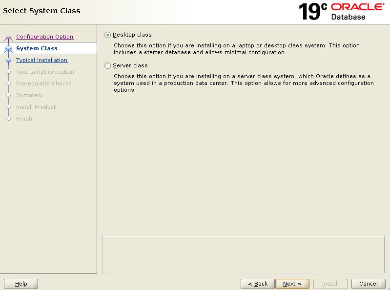
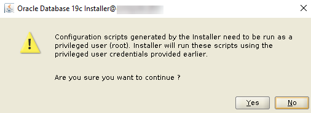
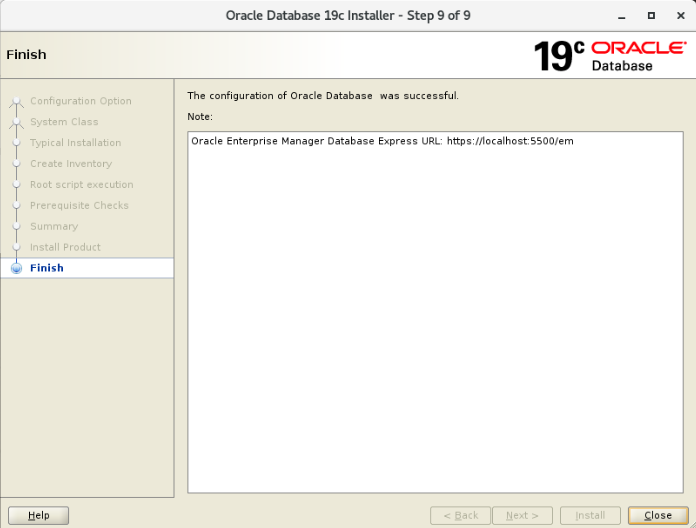

# Install Oracle Database 19c with Automatic Root Script Execution

## Introduction

In this lab, you learn how to use a new feature in the Oracle Database 19c installer that automatically runs `root` configuration scripts for you. This feature simplifies the installation process and helps you avoid inadvertent permission errors. Note that manual script execution is still available, if you prefer that method instead.

In the Oracle Database 19c Installation Wizard, you can configure the `root` user or a sudoer user to run the configuration scripts. Both options require the user's password.

After the database is installed, you examine the response file as well as the container database (CDB) and pluggable database (PDB) that get created.

Estimated Lab Time: 45 minutes

### Objectives

In this lab, you learn how to do the following:

- Install Oracle Database 19c using the new automatic root script execution feature
- Review the response file
- Discover the container database (CDB) and pluggable database (PDB)
- Terminate your compute instance


### Prerequisites

- You have an Oracle account. You can obtain a free account by using Oracle Free Tier or you can use a paid account provided to you by your own organization.
- You have a compartment in Oracle Cloud Infrastructure.
- All prerequisite tasks are completed on your compute instance. If you are working in the LiveLabs tenancy or using a compute instance created in the previous lab, then you have completed the prerequisite tasks.


### Assumptions

- You are signed in to your compute instance as the `oracle` user.

## **STEP 1**: Install Oracle Database 19c using the new automatic root script execution feature


1. In a terminal window, switch to the `oracle` user, if needed, and enter the password.

    ```nohighlighting
    $ <copy>su - oracle</copy>
    ```
2. Change to the Oracle home directory.

    ```nohighlighting
    $ <copy>cd /u01/app/oracle/product/19.0.0/dbhome_1</copy>
    ```
3. Launch the Oracle Database 19c installer. It's important that you run the `runInstaller` command from the Oracle home directory and as the `oracle` user.

    ```nohighlighting
    <copy>./runInstaller</copy>
    ```

4. On the **Select Configuration Option** page, leave **Create and configure a single instance database** selected, and click **Next**. This option creates a starter database with one container database (CDB) and one pluggable database (PDB).

  

5. On the **Select System Class** page, leave **Desktop Class** selected, and click **Next**.

  

6. On the **Typical Installation** page, leave all the default values as is, except for the following:

  a) In the **Global database name** box, change `orcl` to 'ORCL'. The name should be similar to ORCL.subnet2.vcn.oraclevcn.com.
  b) For the **Password** and **Confirm password** boxes, enter a password of your choice for the database `admin` user. Make note of this password as you will need it later.
  c) In the **Pluggable database name** box, replace `orclpdb` with `PDB1`.
  d) Click **Next**.

  

7. On the **Create Inventory** page, leave the default settings as is, and click **Next**.

  

8. On the **Root script execution configuration** page, do the following:

  a) Select the **Automatically run configuration scripts** check box.
  b) Select **Use sudo**, and enter the password for the `oracle` user. The sudo user name must be the username of the user installing the database.
  c) Click **Next**.

  *This is the new feature that this lab is all about! The `oracle` user has been configured as a sudoer on your compute instance already.*

  

9. On the **Perform Prerequisite Checks** page, wait for the installer to verify that your environment meets the minimum installation and configuration requirements. If everything is fine, the **Summary** page is displayed.

  

  

10. On the **Summary** page, save the response file.

  a) Click **Save Response File**. The **Save Response File** dialog box is displayed.

  b) Browse to and select the `/tmp` directory.

  c) Leave **db.rsp** as the name, and click **Save**.

11. Click **Install** to begin installing the software.

12. On the **Install Product** page, monitor the progress of the steps being executed.

  

13. When prompted to run the configuration scripts as the privileged user, click **Yes** to continue. The installation takes between 15 to 20 minutes to complete.

  

14. On the **Finish** page, click **Close**. The installation is finished.

    


## **STEP 2**: Review the response file

You can continue to use your PuTTY connection for this step.

1. Change to the `/tmp` directory where you saved the response file.

    ```nohighlighting
    $ <copy>cd /tmp</copy>
    ```
2. Review the response file (`db.rsp`).

    ```nohighlighting
    $ <copy>cat db.rsp</copy>

    ####################################################################
    ## Copyright(c) Oracle Corporation 1998,2019. All rights reserved.##
    ##                                                                ##
    ## Specify values for the variables listed below to customize     ##
    ## your installation.                                             ##
    ##                                                                ##
    ## Each variable is associated with a comment. The comment        ##
    ## can help to populate the variables with the appropriate        ##
    ## values.                                                        ##
    ##                                                                ##
    ## IMPORTANT NOTE: This file contains plain text passwords and    ##
    ## should be secured to have read permission only by oracle user  ##
    ## or db administrator who owns this installation.                ##
    ##                                                                ##
    ####################################################################

    ...
    ```


## **STEP 3**: Discover the container database (CDB) and pluggable database (PDB)

1. Set the Oracle environment variables. You need to set these each time you open a new terminal window and want to access your database.

  For the `ORACLE_SID` value, enter `ORCL` (in uppercase).

    ```nohighlighting
    $ <copy>. oraenv</copy>

    ORACLE_SID = [oracle] ? ORCL
    The Oracle base has been set to /u01/app/oracle
    $
    ```

2. View the environment variables set by the `. oraenv` command that you just ran.

    ```nohighlighting
    $ <copy>set | grep ORACLE</copy>

    OLD_ORACLE_BASE=
    ORACLE_BASE=/u01/app/oracle
    ORACLE_HOME=/u01/app/oracle/product/19.0.0/dbhome_1
    ORACLE_SID=ORCL
    $
    ```


3. Using SQL*Plus, connect to the `root` container of your database. SQL*Plus is an interactive and batch query tool that is installed with every Oracle Database installation.

    ```nohighlighting
    $ <copy>sqlplus / as sysdba</copy>

    SQL*Plus: Release 19.0.0.0.0 - Production on Thu Apr 8 21:08:02 2021
    Version 19.3.0.0.0

    Copyright (c) 1982, 2019, Oracle. All rights reserved.

    Connected to an idle instance.

    SQL>
    ```


4. Verify that you are logged in to the `root` container as the `SYS` user.

    ```nohighlighting
    SQL> <copy>SHOW user</copy>

    USER is "SYS"
    SQL>
    ```

5. Find the current container name. Because you're currently connected to the `root` container, the name is `CDB$ROOT`.

    ```nohighlighting
    SQL> <copy>SHOW con_name</copy>

    CON_NAME
    -------------------
    CDB$ROOT
    SQL>
    ```

6. List all of the containers in the CDB by querying the `V$CONTAINERS` view. The results list three containers - the `root` container (`CDB$ROOT`), the seed PDB (`PDB$SEED`), and the pluggable database (`ORCLPDB`).

    ```nohighlighting
    SQL> <copy>COLUMN name FORMAT A8</copy>
    SQL> <copy>SELECT name, con_id FROM v$containers ORDER BY con_id;</copy>

    NAME         CON_ID
    -------- ----------
    CDB$ROOT          1
    PDB$SEED          2
    ORCLPDB           3
    SQL>
    ```

7. Exit SQL*Plus.

    ```nohighlighting
    SQL> <copy>EXIT</copy>

    $
    ```

Congratulations! You have a fully functional Oracle Database 19c instance running on a compute instance in Oracle Cloud Infrastructure.

You may now [proceed to the next lab](#next).


## Learn More

- [Get Started with Oracle Database 19c](https://docs.oracle.com/en/database/oracle/oracle-database/19/)
- [Install and Upgrade to Oracle Database 19c](https://docs.oracle.com/en/database/oracle/oracle-database/19/install-and-upgrade.html)

## Acknowledgements

- **Author**- Jody Glover, Principal User Assistance Developer, Database Development
- **Technical Contributors**
    - James Spiller, Principal User Assistance Developer, Database Development
    - Jean-Francois Verrier, User Assistance Director, Database Development
- **Last Updated By/Date** - Jody Glover, Database team, April 20 2021
