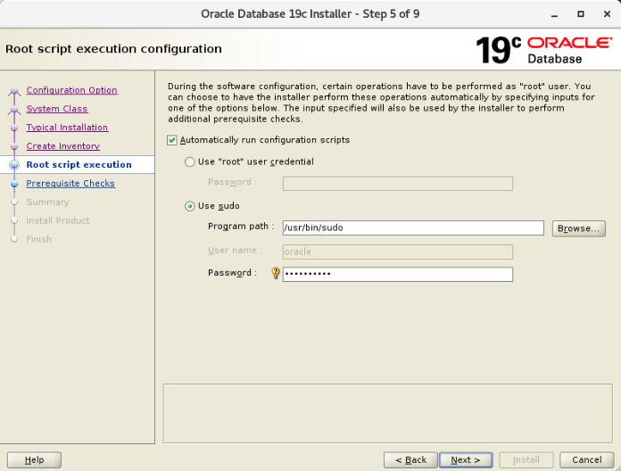
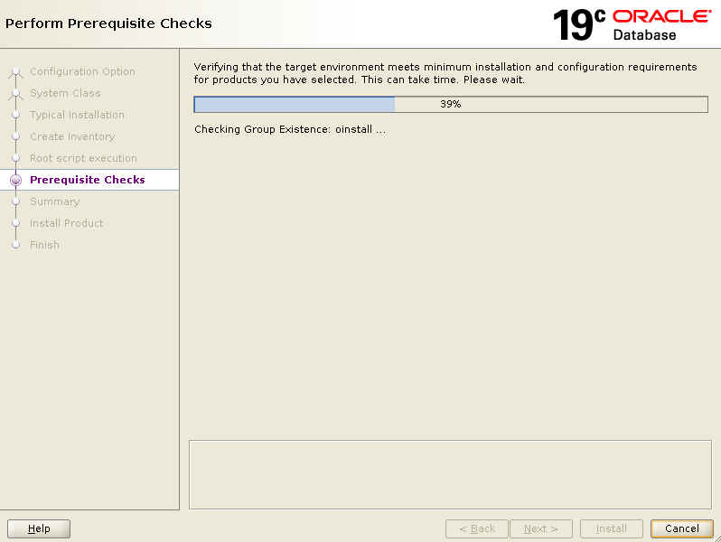

# Install Oracle Database 19c with Automatic Root Script Execution

## Introduction

In this lab, you learn how to use a new feature in the Oracle Database 19c installer that automatically runs `root` configuration scripts for you. This feature simplifies the installation process and helps you avoid inadvertent permission errors. The installer lets you configure the `root` user or a sudoer user to run the configuration scripts. Both options require the user's password. In this lab, you configure the `oracle` user to run the scripts, which has already been configured as a sudoer on your compute instance. After the database is installed, you examine the response file as well as the container database (CDB) and pluggable database (PDB) that get created.

Because you install release 19.3 and upgrade to 19.11 at the same time in this lab, you create the CDB and PDB after you complete the installation. This avoids any post-installation tasks.

Estimated Lab Time: 30 minutes

### Objectives

In this lab, you learn how to do the following:

- Install Oracle Database 19c using the new automatic root script execution feature
- Review the response file
- Discover the container database (CDB) and pluggable database (PDB)


### Prerequisites

- You have an Oracle account. You can obtain a free account by using Oracle Free Tier or you can use a paid account provided to you by your own organization.
- You have a compartment in Oracle Cloud Infrastructure.

### Assumptions

You obtained a compute instance one of the following ways:
  - You completed the [Obtain a Compute Image with Staged Oracle Database 19c Installer Files](?lab=obtain-compute-image-19c-staged.md) lab.
  - You created your own compute instance in Oracle Cloud Infrastructure by following the steps in [Appendix A: Create a Compute Instance with X11 Forwarding](?lab="create-compute-instance-x11") and [Appendix B: Perform Oracle Database 19c Prerequisite Tasks](?lab="perform-db19c-prerequisite-tasks").

### Tip
To copy and paste text from your local machine into an application on your Guacamole desktop, you can do the following:
1.  On your compute instance, enter **CTRL+ALT+SHIFT** (Windows) or **CTRL+CMD+SHIFT** (Mac).

2. Select **Text Input**.

  A black Text Input field is displayed at the bottom of the Guacamole desktop.

3. Position your cursor where you want to paste the text.

4. Copy text from your local machine.

5. Paste the copied text into the black Text Input field.


## **STEP 1**: Install Oracle Database 19c using the new automatic root script execution feature

1. Open a terminal window.

  - If you are using the Guacamole desktop provided for this lab, you can double-click the **Terminal Window** shortcut on the desktop.
  - If you created your own custom compute instance, then open a terminal window on your local machine and connect to your compute instance.

2. Switch to the `oracle` user, and enter the password `WElcome123##`.

  *If you are using the Guacamole desktop, you can skip this step because you are automatically signed in as the `oracle` user in the terminal window.*

    ```nohighlighting
    $ <copy>su - oracle</copy>
    ```

3. Change to the Oracle home directory.

    ```nohighlighting
    $ <copy>cd /u01/app/oracle/product/19c/dbhome_1</copy>
    ```

4. List the files in the Oracle home directory. Notice that you have a `runInstaller` file and a `32545013` directory, which is the Oracle Database release update for 19.11.0.0.

    ```nohighlighting
    <copy>ls</copy>
    ```

5. Launch the Oracle Database 19c installer by executing the `runInstaller` file. Include the `applyRU` parameter to apply the Oracle Database release update for 19.11.0.0. The installer first applies the patch (this takes up about seven minutes), and then it opens the Oracle Universal Installer wizard. If you don't want to patch up to release 19.11.0, you can leave out the -`applyRU` parameter and value.

  It's important that you run the `runInstaller` command from the Oracle home directory and as the `oracle` user.

    ```nohighlighting
    <copy>./runInstaller -applyRU 32545013</copy>
    ```

6. On the **Select Configuration Option** page, leave **Create and configure a single instance database** selected, and click **Next**. This option creates a starter database with one container database (CDB) and one pluggable database (PDB).

  

7. On the **Select System Class** page, leave **Desktop Class** selected, and click **Next**.

  

8. On the **Typical Installation** page, leave all the default values as is, except for the following:

  a) In the **Global database name** box, enter the following name. Make sure to capitalize `ORCL`.

    ```nohighlighting
    <copy>ORCL.livelabs.oraclevcn.com</copy>
    ```

    *If you are using your own custom compute instance, be sure that you properly configured the `/etc/hosts` file as outlined in [Appendix B: Perform Oracle Database 19c Prerequisite Tasks](?lab="perform-db19c-prerequisite-tasks") for this workshop. The `hosts` file needs to contain the following line, otherwise the installation will fail. Replace `private-ip-address` and `compute-instance-name` with your own values.*

    ```nohighlighting
    private-ip-address   compute-instance-name.livelabs.oraclevcn.com    compute-instance-name
    ```

  b) In the **Password** and **Confirm Password** boxes, enter `WElcome123##`. This will be the password for the `admin` database user.

  c) In the **Pluggable database name** box, enter **PDB1**.

    

9. On the **Create Inventory** page, leave the default settings as is, and click **Next**.

  

10. On the **Root script execution configuration** page, do the following:

  a) Select the **Automatically run configuration scripts** check box. *This is the new feature!*

  b) Select **Use sudo**. The `oracle` user is automatically configured as the sudo user. The sudo user name must be the username of the user installing the database.

  c) Enter the password for the `oracle` user (`WElcome123##`).

  c) Click **Next**.

  

11. On the **Perform Prerequisite Checks** page, wait for the installer to verify that your environment meets the minimum installation and configuration requirements. If everything is fine, the **Summary** page is displayed.

  

  

12. On the **Summary** page, save the response file.

  a) Click **Save Response File**. The **Save Response File** dialog box is displayed.

  b) Browse to and select the `/tmp` directory.

  c) Leave **db.rsp** as the name, and click **Save**.

13. Click **Install** to begin installing the software.

14. On the **Install Product** page, monitor the progress of the steps being executed.

  

15. When prompted to run the configuration scripts as the privileged user, click **Yes** to continue. The installation takes between 15 to 20 minutes to complete.

  

16. On the **Finish** page, click **Close**. The installation is finished.

    


## **STEP 2**: Review the response file

You can continue to use your PuTTY connection for this step.

1. Change to the `/tmp` directory where you saved the response file.

    ```nohighlighting
    $ <copy>cd /tmp</copy>
    ```
2. Review the response file (`db.rsp`).

    ```nohighlighting
    $ <copy>cat db.rsp</copy>

    ####################################################################
    ## Copyright(c) Oracle Corporation 1998,2019. All rights reserved.##
    ##                                                                ##
    ## Specify values for the variables listed below to customize     ##
    ## your installation.                                             ##
    ##                                                                ##
    ## Each variable is associated with a comment. The comment        ##
    ## can help to populate the variables with the appropriate        ##
    ## values.                                                        ##
    ##                                                                ##
    ## IMPORTANT NOTE: This file contains plain text passwords and    ##
    ## should be secured to have read permission only by oracle user  ##
    ## or db administrator who owns this installation.                ##
    ##                                                                ##
    ####################################################################

    ...
    ```


## **STEP 3**: Discover the container database (CDB) and pluggable database (PDB)

1. Set the Oracle environment variables. You need to set these each time you open a new terminal window and want to access your database.

  For the `ORACLE_SID` value, enter `ORCL` (in uppercase).

    ```nohighlighting
    $ <copy>. oraenv</copy>

    ORACLE_SID = [oracle] ? ORCL
    The Oracle base has been set to /u01/app/oracle
    $
    ```

2. View the environment variables set by the `. oraenv` command that you just ran.

    ```nohighlighting
    $ <copy>set | grep ORACLE</copy>

    OLD_ORACLE_BASE=
    ORACLE_BASE=/u01/app/oracle
    ORACLE_HOME=/u01/app/oracle/product/19c/dbhome_1
    ORACLE_SID=ORCL
    $
    ```


3. Using SQL\*Plus, connect to the `root` container of your database. SQL\*Plus is an interactive and batch query tool that is installed with every Oracle Database installation.

    ```nohighlighting
    $ <copy>sqlplus / as sysdba</copy>

    SQL*Plus: Release 19.0.0.0.0 - Production on Sun May 2 14:58:59 2021
    Version 19.11.0.0.0

    Copyright (c) 1982, 2020, Oracle.  All rights reserved.

    Connected to:
    Oracle Database 19c Enterprise Edition Release 19.0.0.0.0 - Production
    Version 19.11.0.0.0

    SQL>
    ```

4. Check the version of the database.

    ```nohighlighting
    SQL> <copy>SELECT * FROM v$version;</copy>
    ```

5. Verify that you are logged in to the `root` container as the `SYS` user.

    ```nohighlighting
    SQL> <copy>SHOW user</copy>

    USER is "SYS"
    SQL>
    ```

6. Find the current container name. Because you're currently connected to the `root` container, the name is `CDB$ROOT`.

    ```nohighlighting
    SQL> <copy>SHOW con_name</copy>

    CON_NAME
    -------------------
    CDB$ROOT
    SQL>
    ```

7. List all of the containers in the CDB by querying the `V$CONTAINERS` view. The results list three containers - the `root` container (`CDB$ROOT`), the seed PDB (`PDB$SEED`), and the pluggable database (`PDB1`).

    ```nohighlighting
    SQL> <copy>COLUMN name FORMAT A8</copy>
    SQL> <copy>SELECT name, con_id FROM v$containers ORDER BY con_id;</copy>

    NAME         CON_ID
    -------- ----------
    CDB$ROOT          1
    PDB$SEED          2
    PDB1              3
    SQL>
    ```


8. Exit SQL*Plus.

    ```nohighlighting
    SQL> <copy>EXIT</copy>

    $
    ```

Congratulations! You have a fully functional Oracle Database 19c instance running on a compute instance in Oracle Cloud Infrastructure.

You may now [proceed to the next lab](#next).


## Learn More

- [Get Started with Oracle Database 19c](https://docs.oracle.com/en/database/oracle/oracle-database/19/)
- [Install and Upgrade to Oracle Database 19c](https://docs.oracle.com/en/database/oracle/oracle-database/19/install-and-upgrade.html)

## Acknowledgements

- **Author**- Jody Glover, Principal User Assistance Developer, Database Development
- **Technical Contributors**
    - James Spiller, Principal User Assistance Developer, Database Development
    - Jean-Francois Verrier, User Assistance Director, Database Development
    - S. Matt Taylor Jr., Document Engineering (DocEng) Consulting Member of Technical Staff
- **Last Updated By/Date** - Jody Glover, Database team, April 22 2021
