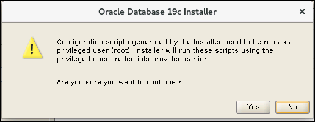

# Install Oracle Database 19c with Automated Root Scripts Execution

## Introduction

Starting with Oracle Database 19c, the database installer, or setup wizard, provides options to set up permissions to run the root configuration scripts automatically, as required, during a database installation. You continue to have the option to run the root configuration scripts manually. Setting up permissions for root configuration scripts to run without user intervention can simplify database installation and help avoid inadvertent permission errors. This lab shows you how to install the Oracle Database 19c with automated root scripts execution.

*In Oracle Database 18c, the installation of the Oracle Database software requires root scripts to be executed manually.*

Estimated Lab Time: 15 minutes

### Objectives

In this lab, you'll:

- Prepare the directory
- Install Oracle Database 19c
- Review the response file
- (optional) Uninstall Oracle Database 19c

### Prerequisites

To complete this lab, you need to have the following:

- Oracle Database 19c software appropriate for your platform that you store in a local directory on your computer

### Assumptions

- Assumption1
- Assumption2

## STEP 1: Prepare the directory

1. Open a new terminal window on your server.

2. Log in to your server as the `root` user.

3. Create a directory dedicated for the Oracle Database 19c software.

    ```
    $ <copy>mkdir -p /u01/app/oracle/product/19.0.0/dbhome_2</copy>
    ```
4. Change to the directory that you just created.

    ```
    $ <copy>cd /u01/app/oracle/product/19.0.0/dbhome_2</copy>
    ```
5. Unzip `db_home.zip` into the directory.

    ```
    $ <copy>unzip /staging/db_home.zip</copy>
    ```
6. Change to the u01 directory.

    ```
    $ <copy>cd /u01</copy>
    ```

7. All files in Linux belong to an owner and a group. Set the owner of the unzipped files to `oracle`.

    ```
    $ <copy>chown -R oracle *</copy>
    ```

8. Set the group ownership of the unzipped files to `oinstall`.

    ```
    $ <copy>chgrp -R oinstall *</copy>
    ```
9. Quit the root session.

    ```
    $ <copy>exit</copy>
    ```


## STEP 2: Install Oracle Database 19c

Install the Oracle Database 19c using the Oracle Universal Installer and the automatic root scripts execution.

1. Log in to your server as `oracle`.

2. Change to the directory dedicated for the Oracle Database 19c software.

    ```
    $ <copy>d /u01/app/oracle/product/19.0.0/dbhome_2</copy>
    ```
3. Launch `runInstaller`.

    ```
    <copy>./runInstaller</copy>
    ```

    The installer is displayed.

4. On the **Select Configuration Option** page, select **Set Up Software Only**.

5. On the **Select Database Installation Option** page, click **Next**.

6. On the **Select Database Edition** page, click **Next**.

7. On the **Specify Installation Location** page, click **Next**.

8. On the **Privileged Operating System Groups** page, click **Next**.

9. On the **Root script execution configuration** page, check **Automatically run configuration scripts**, and provide the password for the `root` user. Click **Next**.

10. On the **Perform Prerequisite Checks** page, check **Ignore All** and click **Next**. If there is a warning message, choose **Yes**.

11. On the **Summary** page, save the response file so that you can later observe how the `root` scripts automatic execution is recorded:

  a) Click **Save Response File**.  

  b) Select the `/tmp` directory to save the `db.rsp` response file.

  c) Click **Save**.

  d) Click **Install**.

12. On the **Install Product** page, monitor the progress of the steps being executed.

13. When the steps are finished, a dialog box is displayed asking if you want to continue and run configuration scripts as the privileged user you provided earlier. Click **Yes** to continue.

  

14. On the **Finish** page, click **Close**. The installation is complete.


## STEP 3: Review the Response File

1. Go to the directory where the response file is created.

    ```
    <copy>cd /tmp</copy>
    ```
2. Open the resulting response file named `db.rsp`.

    ```
    <copy>cat db.rsp</copy>
    ```
3. Read the information that is relevant for the feature.

    ```
    oracle.install.db.rootconfig.executeRootScript=true
    #--------------------------------------------------------------------------------------
    # Specify the configuration method to be used for automatic root script execution.
    #
    # Following are the possible choices:
    #   - ROOT
    #   - SUDO
    #--------------------------------------------------------------------------------------
    oracle.install.db.rootconfig.configMethod=ROOT
    ```

## STEP 4: Uninstall Oracle Database 19c (Optional)

If you need to uninstall the database, follow the steps below. If you plan to continue on with the other labs in this workshop, do not uninstall the database.

1. Change to the directory where the Oracle Database 19c software is installed.

    ```
    <copy>cd /u01/app/oracle/product/19.0.0/dbhome_2/deinstall</copy>
    ```
2. Launch deinstall.

    ```
    <copy>./deinstall</copy>
    ```
3. For the first question, only press **Enter** because you did not create a database after the installation.

    ```
    Specify the list of database names that are configured in this Oracle home []:
    ```
4. Specify the Oracle Home path.

    ```
    Oracle Home selected for deinstall is: <copy>/u01/app/oracle/product/19.0.0/dbhome_2</copy>
    ```
5. Enter the inventory location.

    ```
    Inventory Location where the Oracle home registered is: <copy>/u01/app/oraInventory</copy>
    ```
6. Enter **y** to continue.

    ```
    Do you want to continue (y - yes, n - no)? [n]: <copy>y</copy>
    ```
7. Read the [deinstall_output.txt ](https://docs.oracle.com/en/database/oracle/oracle-database/19/tutorial-install-oracle-database-with-automatic-root-scripts-execution/files/deinstall_output.txt) file to ensure that the deinstallation completed successfully.

    ```
    Oracle Universal Installer cleanup was successful.
    ...
    Oracle deinstall tool successfully cleaned up temporary directories.
    ############# ORACLE DEINSTALL TOOL END #############
    Quit the session.
    ```
8. Quit the session.

    ```
    <copy>exit</copy>
    ```

## Learn More

- [Get Started with Oracle Database 19c](https://docs.oracle.com/en/database/oracle/oracle-database/19/)
- [Install and Upgrade to Oracle Database 19c](https://docs.oracle.com/en/database/oracle/oracle-database/19/install-and-upgrade.html)

## Acknowledgements

- **Author**- Jody Glover, Principal User Assistance Developer, Database Development
- **Last Updated By/Date** - Jody Glover, Database team, March 29 2021
