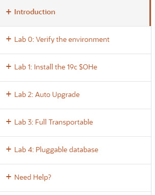

# Upgrade to 19c Hands-On-Lab (HOL) #

## Workshop Overview ##

**19c Database** is the current version Oracle promotes to customers and partners as the best target version for a database upgrade. Oracle 19c is the long-term support version and will be supported for at least four years after the initial release. After this, Extended support and Sustaining support will be available.

 This hands-on workshop focuses on **Upgrading your environment to 19c** demonstrating three scenarios that you can use (both on-premises and in the cloud) to upgrade your environment to 19c in a Container/Multitenant setup.

## Workshop Requirements

- A provisioned LiveLabs Environment
    - On the Attendee Page, you should see the Remote Desktop or NoVNC URL

 The labs have been set up to work with the Remote Desktop or NoVNC environment using an HTML5 compatible browser. Most proxy systems will work with this setup.

 If you want to run (parts) of the workshop using a direct SSH connection, you need direct access to the Internet or a proxy that supports tunneling.

## Agenda

- **Lab 0 :** Verify the environment

 This lab introduces the student lab environment and contains the steps to set up the student desktop for connecting to the virtual lab machine.

- **Lab 1 :** Install 19c software and create a new 19c database

 We need a 19c database and listener as the target for our remaining labs. Also, creating a new 19c Oracle Home and Database has changed since Oracle 12.2. This lab demonstrates how to create a new 19c software home and create a database using this home.

- **Lab 2 :** Upgrade using the new AutoUpgrade tool

 The Auto Upgrade tool is a wrapper around the regular upgrade steps and scripts. But the configuration fail is easy to set up and allows multiple databases to be upgraded at the same time while still keeping track of the status. If things go wrong, you can roll back the upgrade or restart the upgrade after you have solved the blocking issue.

- **Lab 3 :** Upgrade using Full Transportable Tablespaces

 Instead of upgrading your database using scripts, you can migrate the tablespaces containing your data to a new version. The FTTS lab demonstrates how easy and quick it is to upgrade without a lot of downtime.

- **Lab 4 :** Upgrade using unplugging a PDB from the old version and plug it into a new version

 One of the excellent new features of Multitenancy is to unplug and plug a Pluggable Database into a new version. In 19c, you still need to run upgrade scripts, so this lab demonstrates what is required to upgrade using this option.

## Access the labs

- Use **Lab Contents** menu on the left side of the screen to access the labs.
    - If the menu is not displayed, click the menu button  on the top left to make it visible.

- From the menu, click on the lab that you would like to run. For example, if you want to proceed to **Lab 0**, click **Lab 0: Verify the environment**.

 

- You may close the menu by clicking the   again.

## Acknowledgements ##

- **Author** - Robert Pastijn, Database Product Management, PTS EMEA - April 2020
- **Updated** - Adopted to Livelabs - Robert Pastijn - June 2021