# Create Container Database

## Introduction

This lab shows how to create a single instance container database. It does not install the Oracle Database software. You can create container database in the following modes.
- *Typical*  
- *Advanced*  

Estimated Time: 1 hour

### Objectives

Create additional Oracle Databases with typical configuration and advanced configuration using Oracle Database Configuration Assistant (Oracle DBCA).

### Prerequisites

- A Free Tier, Paid or LiveLabs Oracle Cloud account
- You have completed:
    - Lab: Prepare Setup (*Free-tier* and *Paid Tenants* only)
    - Lab: Setup Compute Instance
    - Lab: Install Oracle Database

## Task 1: Start Oracle DBCA

You can run Oracle DBCA only after you install the Oracle Database software using the database installer. For this lab, a starter database already exists on the host.

1. Log in to your host as *oracle*, the user who is authorized to install the Oracle Database software and create Oracle Database.  

2. Open a terminal window and change the current working directory to `$ORACLE_HOME/bin`. This is the directory where Oracle DBCA is located.

	```
	$ <copy>cd /u01/app/oracle/product/21.0.0/dbhome_1/bin</copy>
	```

3. From `$ORACLE_HOME/bin`, run this command to start Oracle DBCA.

	```
	$ <copy>./dbca</copy>
	```

Now, perform the following tasks to create container databases.

## Task 2: Create a Container Database (Typical Mode)

Run Oracle DBCA from `$ORACLE_HOME/bin` as explained in *Task 1*. Oracle DBCA starts with the Database Operation window.

At any point, you can go **Back** to the previous window or **Cancel** database creation. You can click **Help** to view more information on the current window.

1. The Database Operation window opens with the default option **Create a database** selected. Click **Next**.

    

	With Oracle DBCA, you can perform other administrative tasks, such as configure or delete an existing Oracle Database and manage PDBs and templates.

2. Oracle DBCA displays the default creation mode, **Typical configuration**, selected with pre-filled configuration parameters. 

	For this lab, enter the following.  
	* **Global database name** - Specify a unique name, for example, *orcl1.us.oracle.com*  
	* **Administrative password** - Set the password for admin user accounts  
	* **Pluggable database name** - *orclpdb1*  

	The values may differ depending on the system you are using. For the remaining fields, leave the defaults and click **Next**.

    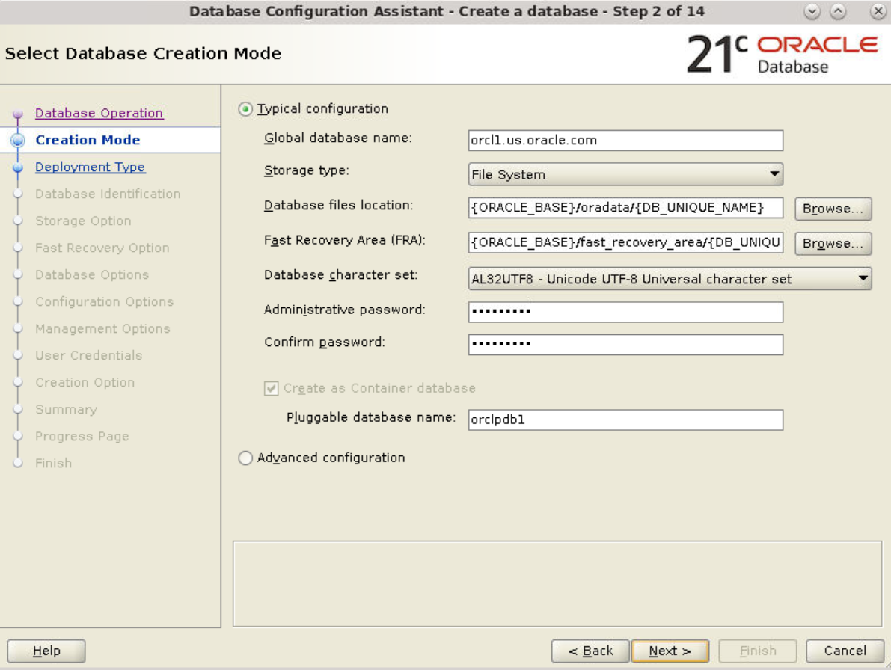

	You cannot create multiple Oracle Databases with the same Global database name. If an Oracle Database with the specified name already exists, enter a different name, for example, *orcl3.us.oracle.com*.  

	The password created in this window is associated with admin user accounts, namely SYS, SYSTEM, and PDBADMIN. After you create Oracle Database, enter the admin username and use this password to connect to the database.

	**Note:** The password must conform to the Oracle recommended standards.

	The default **Database Character set** for Oracle Database is *AL32UTF8 - Unicode UTF-8 Universal character set*.

	*AL32UTF8* is Oracle's name for the standard Unicode encoding UTF-8, which enables universal support for virtually all languages of the world.

	Along with CDB, Oracle DBCA also creates a PDB as per the Pluggable database name.

3. Review the summary and click **Finish** to create your Oracle Database.

	

	The Progress Page window displays the status of Oracle Database creation process.

	

	The confirmation message in the Finish window indicates that you created an Oracle Database successfully.

	**Password Management**

	In the Finish window, click **Password Management** to view the status of Oracle Database user accounts. Except SYS and SYSTEM, all other users are initially in locked state.

	

	To unlock a user, click the **Lock Account** column. You can also change the default password for the users in this window. However, you can do these tasks later.

	Click **OK** to save any changes you made and to close the Password Management window.

Click **Close** to exit Oracle Database Configuration Assistant. You can start Oracle DBCA again to create another container database with advanced configuration.

## Task 3: Create and Configure a Container Database (Advanced Mode)

Run Oracle DBCA from `$ORACLE_HOME/bin` as explained in *Task 1*. Oracle DBCA starts with the Database Operation window.

At any point, you can go **Back** to the previous window or **Cancel** database creation. You can click **Help** to view more information on the current window.

1. The Database Operation window opens with the default option **Create a database** selected. Click **Next**.

   

	With Oracle DBCA, you can perform other administrative tasks, such as configure or delete an existing Oracle Database and manage PDBs and templates.

2. In the Creation Mode window, select **Advanced configuration** and click **Next**.  
	This option allows you to customize Oracle Database configurations, such as storage locations, initialization parameters, management options, database options, passwords for administrator accounts, and so on.

   

3. You can select the database type and a template suitable for your Oracle Database in the Deployment Type window.  
	For this lab, leave the default type *Oracle Single Instance database* and the template *General Purpose or Transaction Processing*. Click **Next**.

   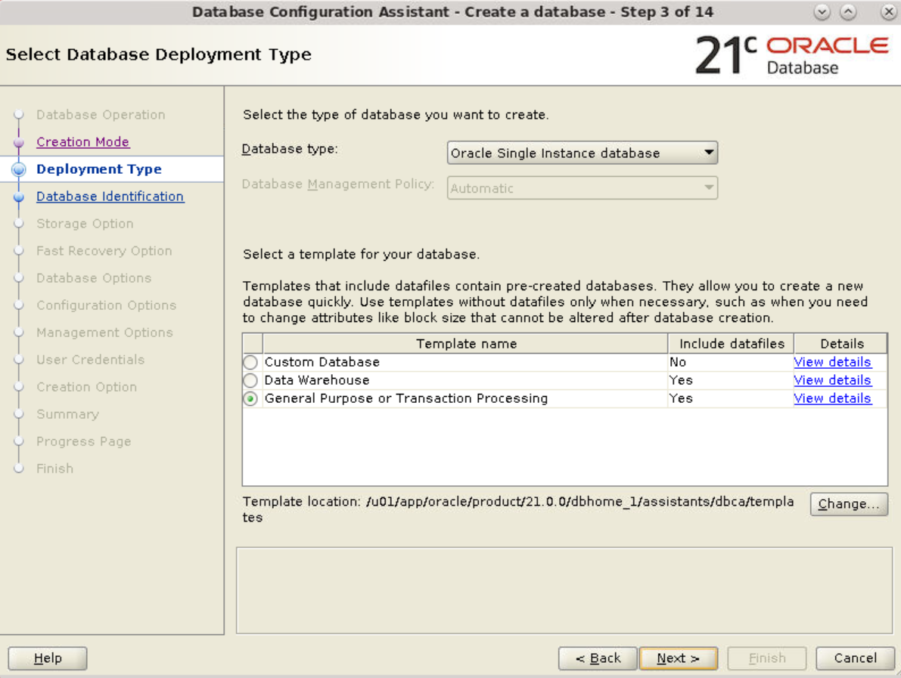

	<!-- Removed this section on RAC from the lab. Will use this information in other relevant documents.

	If your database type is Real Application Cluster, you can select the Database Management Policy as:
	- **Automatic** and allow Oracle clusterware to manage your database automatically, or
	- **Rank**, if you want to define ranks for your database.

	Removed this note as per review comments from Malai Stalin

	**Note:** The General Purpose or Transaction Processing template and the Data Warehouse template create an Oracle Database with the `COMPATIBLE` initialization parameter set to `12.2.0.0.0`. This ensures that the new features in Oracle Database 21c are compatible with older versions of the database up to version 12c Release 2.  
	-->

	For environments that are more complex, you can select the Custom Database option. This option does not use any templates and it usually increases the time taken to create an Oracle Database.
	For this lab, do not select this option.

4. The Database Identification window displays pre-filled names and the System Identifier (SID) for Oracle Database.  

	For this lab, enter the following.  
	* **Global database name** - Specify a unique name, for example, *orcl2.us.oracle.com*  
	* **SID** - *orcl2*  
	* **PDB name** - *orcl2pdb1*  

	The values may differ depending on the system you are using. For the remaining fields, leave the defaults and click **Next**.

	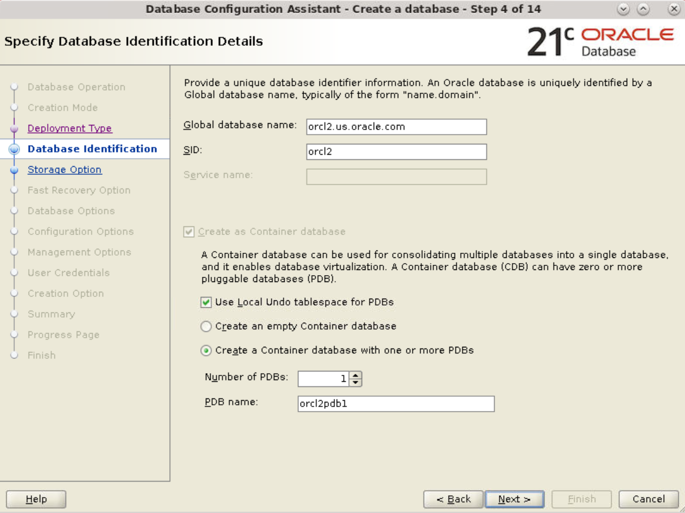

	_**Oracle SID**_ is a unique name given to an Oracle Database. It distinguishes this instance of Oracle Database from other instances on the host.

	You cannot create multiple Oracle Databases on a host with the same SID. If an Oracle Database with the specified SID already exists, enter a different SID, for example, *orcl3*. 

	Similarly, specify a *unique Global database name* for each Oracle Database on the same host.

5. The Storage Option window displays the default option **Use template file for database storage attributes** selected. This option allows Oracle Database to use the directory information specified in the *General Purpose or Transaction Processing* template.

	For this lab, leave the defaults and click **Next**.

    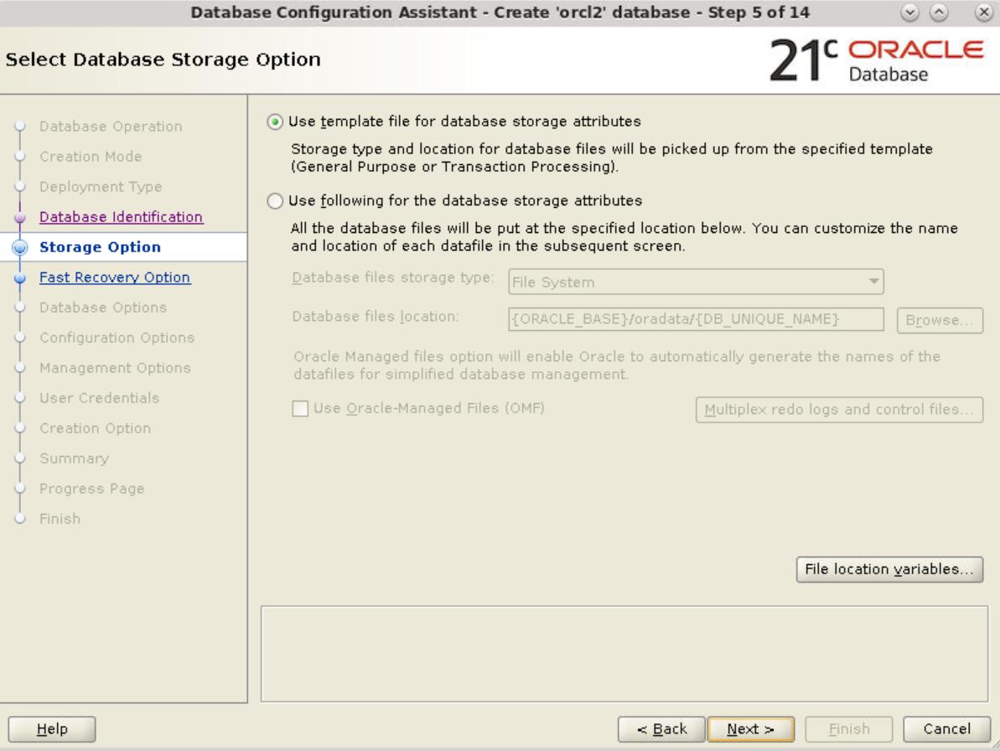

	You can specify another location to store the database files with the **Use following for the database storage attributes** option. With this option, you can select the storage type as File system or Oracle Automatic Storage Management (Oracle ASM).  For this lab, do not select these options.

	<!-- Removed this section on ASM and OMF from the lab as per review comments from Subhash Chandra. Content outside the scope of this workshop.

	- *File system* to manage the database files by the file system of your operating system, or
	- *Automatic Storage Management (ASM)* to store your data files in the ASM disk groups.

	The *Use Oracle-Managed Files (OMF)* option gives complete control of files to the database. It allows the database to create and delete files in the default location. The database directly manages the filenames, their size, and location.  
	For this lab, do not select these options. -->

6. Select **Specify Fast Recovery Area** to set up a backup and recovery area, its directory location, and size.  
	For the remaining fields, leave the defaults and click **Next**.

    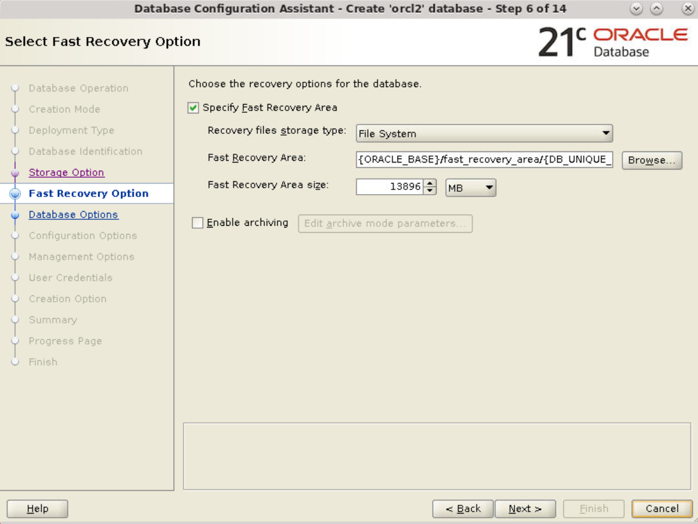

	The Fast Recovery Option window displays the default parameters pre-filled.  
	 * **Recovery files storage type** - *File System*  
	 * **Fast Recovery Area** the directory for recovery-related files  
	 * **Fast Recovery Area size** the size of the recovery area  
	 For this lab, leave the default values.

	The **Enable archiving** checkbox allows archiving the online redo log files. These files are useful during Oracle Database recovery. For this lab, do not select this option.

7. Select the listener for your Oracle Database in the Network Configuration window.  

	For this lab, de-select the existing listener if already selected. Select the checkbox **Create a new listener** and enter the following values:  
	 * **Listener name** - *LISTENER1*  
	 * **Listener port** - *1526*

	 The values may differ depending on the system you are using.

    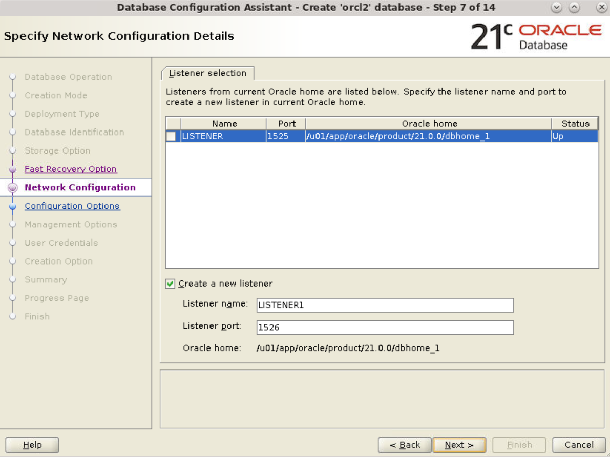

	A _**Listener**_ is a network service that runs on Oracle Database server. It is responsible for receiving incoming connection requests to and from the database and for managing the network traffic.

	If you created an Oracle Database earlier, a listener already exists. You can select the existing listener in this window. On the other hand, if you installed only the Oracle Database software and did not create a database, the listener does not exist. You need to create a new listener from this window. 

	You cannot use the same listener name to create multiple Oracle Databases. If an Oracle Database with the specified listener already exists, enter a different name for the listener, for example, *LISTENER2*.

	Similarly, specify a *unique port number* for each Oracle listener on the same host. 

8. You can configure Oracle Database Vault and Oracle Label Security to control administrative access to your data and to individual table rows.  

	For this lab, do not select these checkboxes and click **Next**.

    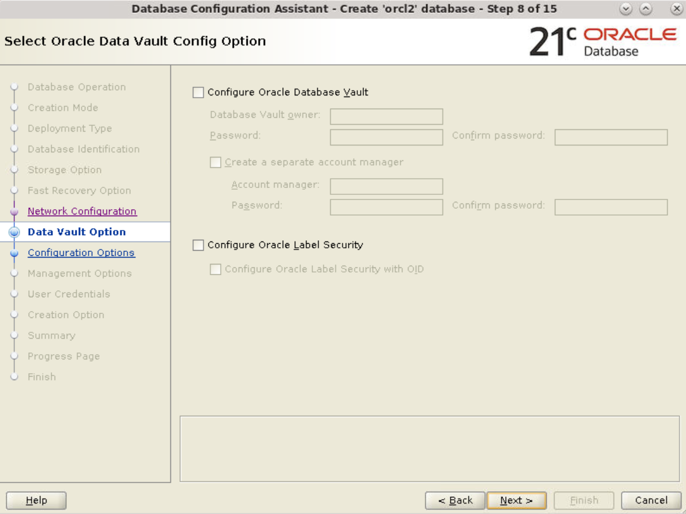

9. You can specify the following configuration options for Oracle Database. For this lab, leave the defaults for each tab and continue.

	- **Memory** - The *Use Automatic Shared Memory Management* method enables you to allocate specific volume of memory to SGA and aggregate PGA. Oracle Database enables automatic shared memory for SGA, and distributes the remaining memory among individual PGAs as needed.  
	For more information on memory management, see [About Automatic Shared Memory Management](https://docs.oracle.com/en/database/oracle/oracle-database/19/admin/managing-memory.html#GUID-B8B8923C-4213-42A9-8ED3-4ABE48C23914).

		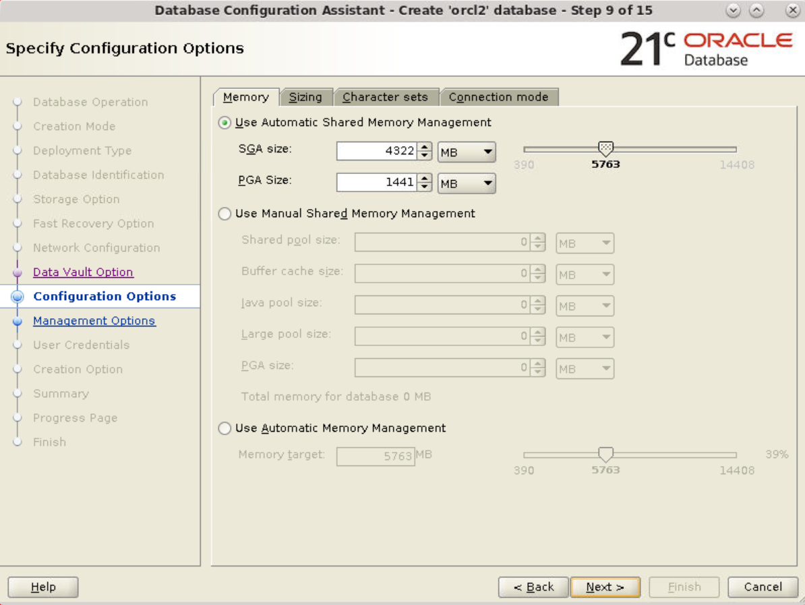

		- *Manual Shared Memory Management* allows you to enter specific values for each SGA component and the aggregate PGA. It is useful for advanced database administration.  

		- *Automatic Memory Management* allows you to set the usable memory in the memory target. The system then dynamically configures the memory components of both SGA and PGA instances.

	    If the total physical memory of your Oracle Database instance is greater than 4 GB, you cannot select the 'Use Automatic Memory Management' option. Instead, *Use Automatic Shared Memory Management* to distribute the available memory among various components as required, thereby allowing the system to maximize the use of all available SGA memory.

	- **Sizing** - Specify the maximum number of processes that can connect simultaneously to your Oracle Database, for example, *320*.   

		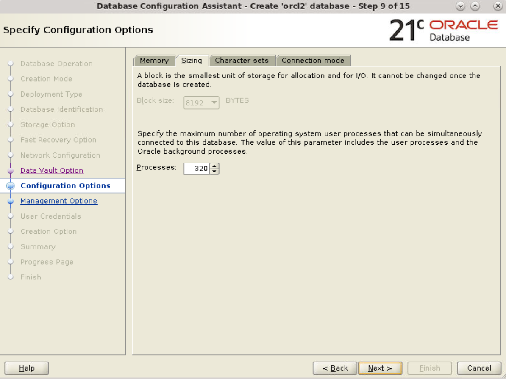

		While using predefined templates, the **Block size** option is not enabled. Oracle DBCA creates an Oracle Database with the default block size of *8 KB*.

	- **Character sets** - The *Use Unicode (AL32UTF8)* option is selected by default.

		

		*AL32UTF8* is Oracle's name for the standard Unicode encoding UTF-8, which enables universal support for virtually all languages of the world.

	- **Connection mode** - *Dedicated server mode* allows a dedicated server process for each user process.

		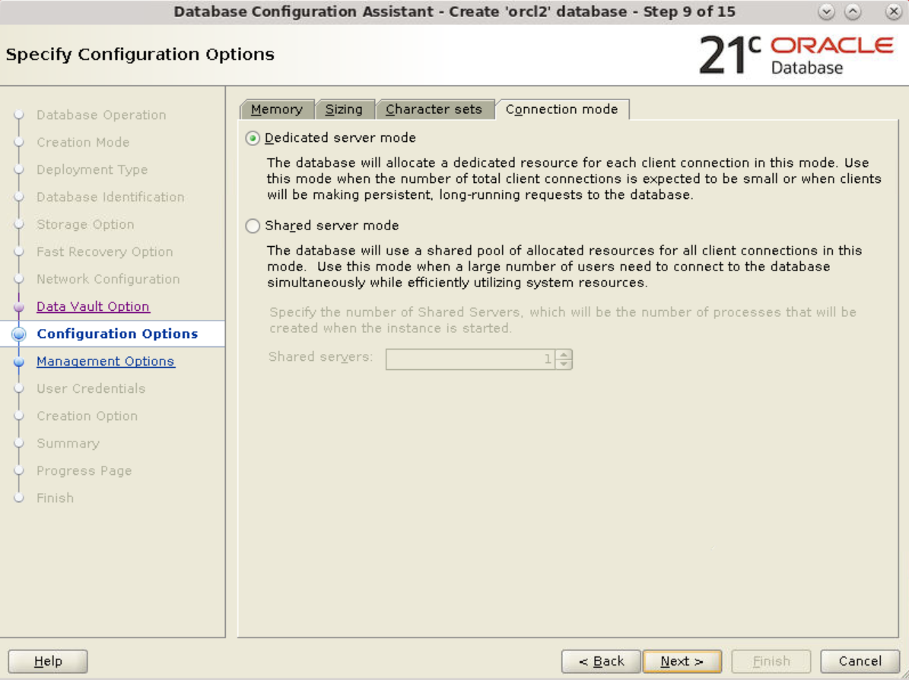

10. The Management Options window allows you to configure EM Express and register your Oracle Database with Oracle EMCC. 

	For this lab, de-select the checkbox **Configure Enterprise Manager (EM) database express** and leave the checkbox **Register with Enterprise Manager (EM) Cloud Control** unselected. Click **Next**.

    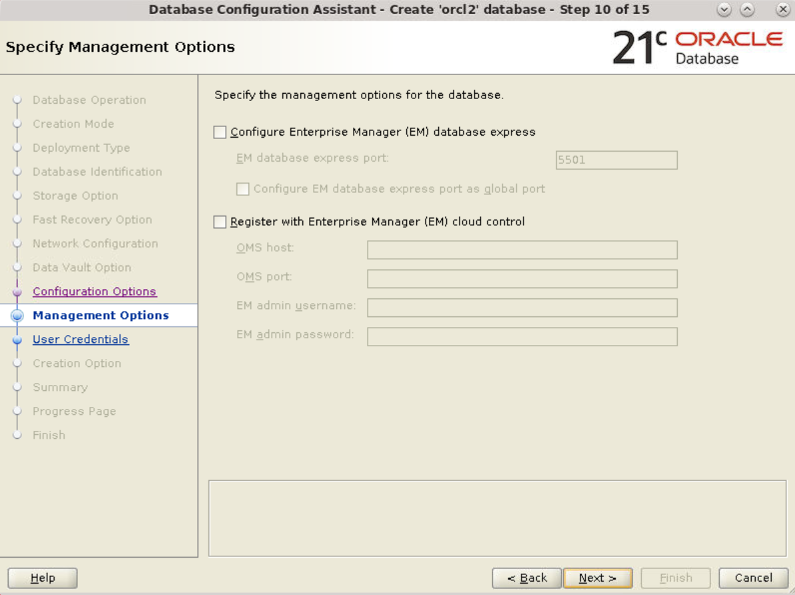

	If you have Oracle EMCC details, such as OMS hostname, port number, and the admin credentials, you can specify in this window and register your Oracle Database.  

	However, instead of registering from this window, it is much easier to use the discovery process from Oracle EMCC and add your Oracle Database 21c as a managed target.

	<!-- Add a link to WS2 lab on how to add managed targets.
	For more information on managed targets, see [Manage your targets in EMCC](?lab=lab-2-manage-your-targets).
	-->

11. Set the password for admin user accounts, namely SYS, SYSTEM, and PDBADMIN, in the User Credentials window.   

	Though you can specify different passwords for each admin user, for this lab, select **Use the same administrative password for all accounts**. Note the **Password** you entered in this window and click **Next**.

	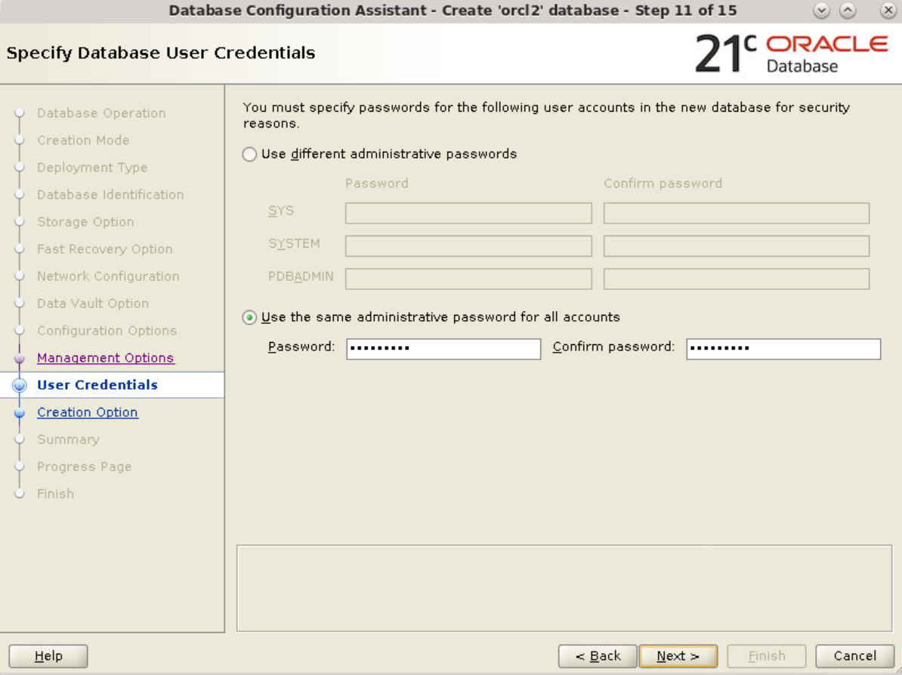

	**Note:** The password must conform to the Oracle recommended standards.

12. The Creation Option window displays the default option **Create database** selected.  
	For the remaining fields, leave the defaults and click **Next**.

    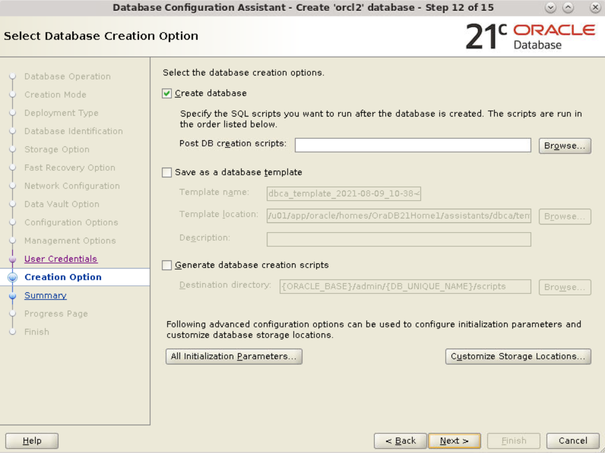

13. Review the summary and click **Finish** to create your Oracle Database.

	

	The Progress Page window displays the status of Oracle Database creation process.

	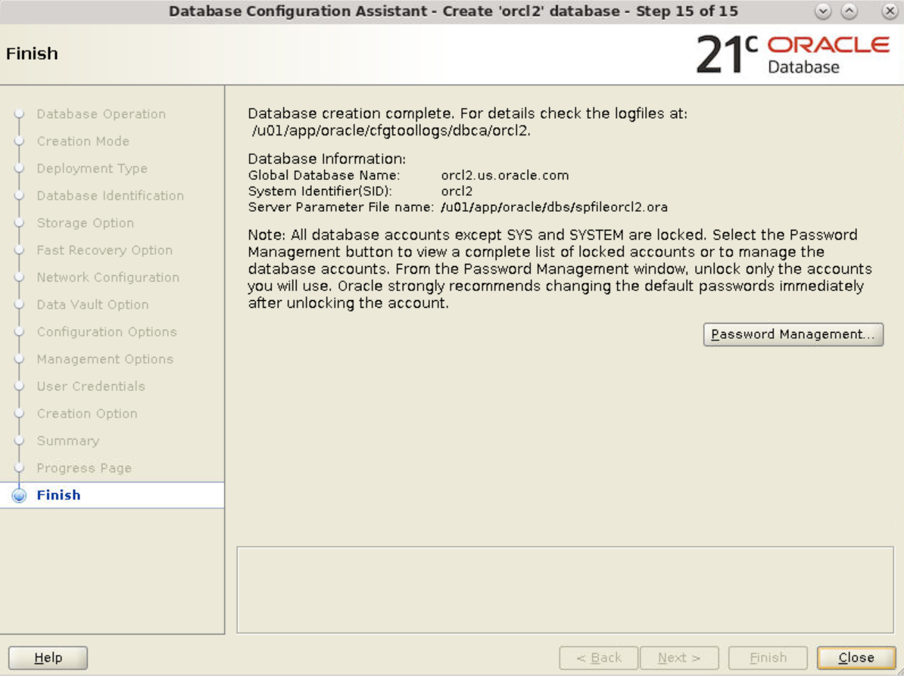

	The confirmation message in the Finish window indicates that you created an Oracle Database successfully

	**Password Management**

	In the Finish window, click **Password Management** to view the status of Oracle Database user accounts. Except SYS and SYSTEM, all other users are initially in locked state.

	

	To unlock a user, click the **Lock Account** column. You can also change the default password for the users in this window. However, you can do these tasks later.

	Click **OK** to save any changes you made and to close the Password Management window.

Click **Close** to exit Oracle Database Configuration Assistant.

Congratulations! You have successfully completed this workshop on *Oracle Database 21c installation*.

## Acknowledgements

- **Author**: Manish Garodia, Principal User Assistance Developer, Database Technologies

- **Contributors**: Suresh Rajan, Prakash Jashnani, Subhash Chandra, Subrahmanyam Kodavaluru, Dharma Sirnapalli, Malai Stalin

- **Last Updated By/Date**: Manish Garodia, September 2021
