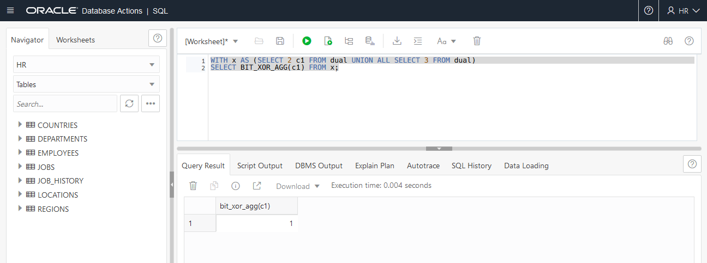

# Using Bitwise Aggregate Functions

## Introduction
Bitwise aggregation functions enable bitwise type processing directly in SQL. Use of these new functions improves overall query performance by eliminating unnecessary data movement and by taking full advantage of other database capabilities such as parallel processing.

This lab shows how to use the new `BIT_AND_AGG`, `BIT_OR_AGG` and `BIT_XOR_AGG` bitwise aggregate functions at the bit level of records within a group. `BIT_AND_AGG`, `BIT_OR_AGG` and `BIT_XOR_AGG` return the result of bitwise AND, OR and XOR operations respectively. These aggregates can be performed on a single numeric column or an expression. The return type of a bitwise aggregate operation is always a number.

Estimated Lab Time: 15 minutes

### Objectives
In this lab, you will:
* Test the bitwise AND function
* Test the bitwise OR function
* Test the bitwise XOR function

### Prerequisites
<if type="dbcs">
* An Oracle Free Tier, Paid or LiveLabs Cloud Account
* Lab: SSH Keys
* Lab: Create a DBCS VM Database
* Lab: 21c Setup
</if>
<if type="atp">
* An Oracle Always Free/Free Tier, Paid or LiveLabs Cloud Account
* Lab: Provision ADB
* Lab: Setup
</if>

<if type="dbcs">
## Task 1: Login to database

1. Login to the instance using ssh

2. Switch to the oracle user
    ```
    <copy>sudo su - oracle</copy>
    ```

3. Connect to `PDB21` as `SYSTEM` to query values with numbers and bitwise aggregate functions.

    ```
    $ <copy>sqlplus system@PDB21</copy>
    Copyright (c) 1982, 2019, Oracle.  All rights reserved.
    Enter password: <b><i>WElcome123##</i></b>
    Connected to:
    SQL>
    ```
</if>

<if type="atp">
## **STEP  1**: Login to SQL Developer Web on ADB

There are multiple ways to access your Autonomous Database.  You can access it via SQL\*Plus or by using SQL Developer Web.  To access it via SQL\*Plus, skip to [Step 1B](#STEP1B:LogintoADBusingSQLPlus).

1.  If you aren't still logged in, login to your ADB screen by clicking on the Hamburger Menu and selecting the Autonomous Database flavor you selected (ATP, ADW or AJD). Otherwise skip to the next step.
      

2.  If you can't find your ADB instance, ensure you are in the correct compartment, you have chosen the flavor of ADB you choose in the earlier lab and that you are in the correct region.
3.  Click on the **Display Name** to go to your ADB main page.
      

4.  Click on the **Tools** tab, select **Database Actions**, a new browser will open up.
      

5.  Login using the username *hr* and password *WElcome123##*
6.  Click on the **SQL** button.

## **STEP  1B**: Login to ADB using SQL Plus
1. If you aren't logged into the cloud, log back in
2. Open up Cloud Shell
3. Connect to the HR user using SQL\*Plus by entering the commands below.

    ```
    export TNS_ADMIN=$(pwd)/wallet
    sqlplus /nolog
	  conn hr/WElcome123##@adb1_high
	  ```
</if>

## Task 2: Test the bitwise AND function

1.  A bitwise AND is a binary operation that takes two equal-length binary representations and performs the logical AND operation on each pair of the corresponding bits. If both bits in the compared position are 1, the bit in the resulting binary representation is 1, otherwise, the result is 0. Apply the `BIT_AND_AGG` function on two numbers. The bit pattern for the values used in the examples below are 01 for 1, 10 for 2, and 11 for 3.

    ```
    SQL> <copy>
    WITH x AS (SELECT 2 c1 FROM dual UNION ALL SELECT 3 FROM dual)
    SELECT BIT_AND_AGG(c1) FROM x;</copy>
    ```

    <if type="atp">
    
    </if>

    <if type="dbcs">
    ```
    BIT_AND_AGG(C1)
    ---------------
                  2
    ```
    </if>

## Task 3: Test the bitwise OR function

A bitwise OR is a binary operation that takes two bit patterns of equal length and performs the logical inclusive OR operation on each pair of corresponding bits. The result in each position is 0 if both bits are 0, otherwise the result is 1.

1. Apply the `BIT_OR_AGG` function on two numbers.

    ```
    SQL> <copy>WITH x AS (SELECT 2 c1 FROM dual UNION ALL SELECT 3 FROM dual)
    SELECT BIT_OR_AGG(c1) FROM x;</copy>
    ```
    <if type="atp">
    
    </if>
    <if type="dbcs">
    ```
    BIT_OR_AGG(C1)
    --------------
                3
    ```
    </if>

## Task 4: Test the bitwise XOR function

A bitwise XOR is a binary operation that takes two bit patterns of equal length and performs the logical exclusive OR operation on each pair of corresponding bits. The result in each position is 1 if only the first bit is 1 or only the second bit is 1, but will be 0 if both are 0 or both are 1. Therefore, the comparison of two bits results in 1 if the two bits are different, and 0 if they are equal.

1. Apply the `BIT_XOR_AGG` function on two numbers.

    ```
    SQL> <copy>WITH x AS (SELECT 2 c1 FROM dual UNION ALL SELECT 3 FROM dual)
    SELECT BIT_XOR_AGG(c1) FROM x;</copy>
    ```
    <if type="atp">
    
    </if>

    <if type="dbcs">
    ```
    BIT_XOR_AGG(C1)
    ---------------
                  1
    ```
    </if>


<if type="dbcs">
2.  Exit SQL*Plus

    ```
    <copy>EXIT</copy>
    ```
</if>

<if type="atp">
2.  Click on the down arrow in the upper left corner of the SQL Developer Web, click **Sign Out**
</if>

You may now [proceed to the next lab](#next).


## Learn More
- [Bitwise Aggregate Functions - Documentation](https://docs.oracle.com/en/database/oracle/oracle-database/21/nfcon/bitwise-aggregate-functions-274057636.html)


## Acknowledgements
* **Author** - Donna Keesling, Database UA Team
* **Contributors** -  David Start, Kay Malcolm, Didi Han, Database Product Management
* **Last Updated By/Date** - Tom McGinn, July 2021
