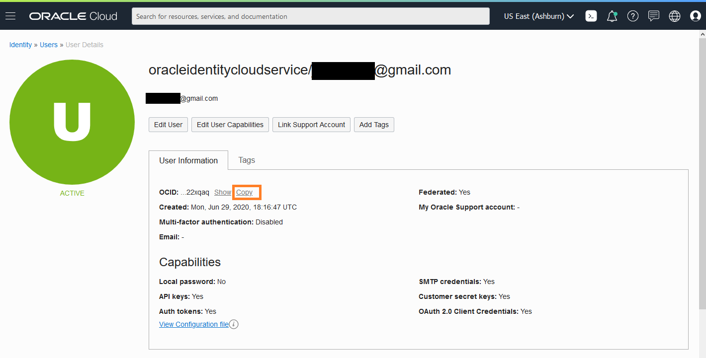
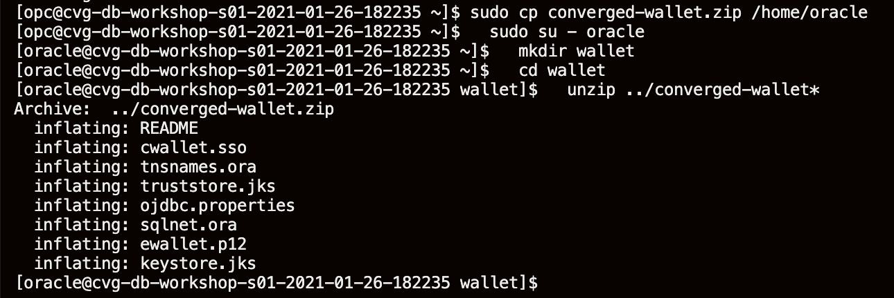

# Setup

## Introduction
In the previous lab you created an ADB instance.  In this lab you will connect to the ADB instance from Oracle Cloud Shell.

*This lab is under construction*

*Estimated time:* 20 Minutes

### Objectives
- Create auth token and Oracle Wallet 
- Login to SQL Developer
- Connect application to ADB

### Prerequisites
- Lab: Setup Compute and ADB

## **STEP 1:** Create Oracle Wallet
There are multiple ways to create an Oracle Wallet for ADB.  We will be using Oracle Cloud Shell as this is not the focus of this workshop.  To learn more about Oracle Wallets and use the interface to create one, please refer to the lab in this workshop: [Analyzing Your Data with ADB - Lab 6](https://apexapps.oracle.com/pls/apex/dbpm/r/livelabs/view-workshop?p180_id=553)

1.  Go back to your ADB screen by clicking on the Hamburger Menu -> **Autonomous Transaction Processing** 
      

2.  Click on the **Display Name** to go to your ADB main page.
   
3.  Locate the **OCID** (Oracle Cloud ID), click **Copy**.  

4.  Use your autonomous\_database\_ocid to create the Oracle Wallet. You will be setting the wallet password to the same value as the ADB admin password for ease of use. This is not a recommended practice and just used for the purposes of this lab. *WElcome123##*. Fill in the autonomous database ocid that is listed in the output section of your terraform.
   
      ````
      <copy>
      cd ~
      oci db autonomous-database generate-wallet --password WElcome123## --file 21c-wallet.zip --autonomous-database-id </copy> ocid1.autonomousdatabase.oc1.iad.xxxxxxxxxxxxxxxxxxxxxx
      ````

      

5.  The wallet file will be downloaded to your cloud shell file system in /home/yourtenancyname

6.  Enter the list command in your cloud shell below to verify the *21c-wallet.zip* was created
   
      ````
      ls
      ````
      

## **STEP 2:** Create Auth Token

1.  Click on the person icon in the upper right corner.
2.  Select **User Settings**
      

3.  Under the **User Information** tab, click the **Copy** button to copy your User OCID.
      

4.  Create your auth token using the command below substituting your actual *user id* for the userid below.  *Note: If you already have an auth token, you may get an error if you try to create more than 2 per user*
   
      ````
      <copy>
       oci iam auth-token create --description 21cdb --user-id </copy> ocid1.user.oc1..axxxxxxxxxxxxxxxxxxxxxx
      ````
      

5.  Identify the line in the output that starts with "token".
6.  Copy the value for the token somewhere safe, you will need it for the next step.


## **STEP 3:** Create Users
1.  Go back to your ADB screen by clicking on the Hamburger Menu -> **Autonomous Transaction Processing** 
      

2.  Click on the **Display Name** to go to your ADB main page.
      

3.  Click on the **Tools** tab, select **Database Actions**, a new browser will open up
      

4.  Login with the *admin* user, click **Next**.  Enter the password *WElcome123##* 
      

5.  Click the SQL button
6.  Run the script below to create all the users

      ````
      create user oe identified by WElcome123##;
      create user hr identified by WElcome123##;
      alter user oe quota unlimited on data;
      alter user hr quota unlimited on data;
      ````


## **STEP 4:**  Load ADB Instance with Application Schemas
1. Go back to your cloud shell and start the cloud shell if it isn't already running
2. Enter the command below to login to your compute instance.    

    ````
    ssh -i ~/.ssh/<sshkeyname> opc@<Your Compute Instance Public IP Address>
    ````
      

3. Execute the following commands on your compute instance to move and extract your wallet file in the /home/oracle/wallet directory. This should run as the *opc* user. 

      ````
      <copy>
      unzip ../21c-wallet*
      </copy>
      ````
      

4. Make sure you are the *oracle* user, run the next command to set your oracle environment.  If you are not, run the sudo su - oracle command to become oracle.  When prompted enter the database name for your ADB instance. 

      ````
      <copy>. oraenv</copy>
      ORACLE_SID = [oracle] ? <<enter name here>
      ````

      
   
5. Run the wget command to download the load_21c.sh script from object storage.

      ````
      <copy>
      cd $HOME
      pwd
      wget 21c.sh
      </copy>
      ````

6.   Run the load script passing in two arguments, your admin password and the name of your ATP instance.  This script will import all the data into your ATP instance for your application and set up SQL Developer Web for each schema.  This script runs as the opc user.  Your ATP name should be the name of your ADB instance.  In the example below we used *db21c*.  This load script takes approximately 2 minutes to run. 
   
      ``` 
      <copy> 
      chmod +x load-21c.sh
      ./load-21c.sh WElcome123## db21c 2>&1 > load-21c.out</copy>
     
      ```
7.  As the script is running, you will note several failures on the DBA role. The DBA role is not available in Autonomous Database, the DWROLE is used instead. This error is expected. 
   
8.  Test to ensure that your data has loaded by logging into SQL Developer Web and issuing the command below. *Note* The Username and Password for SQL Developer Web are admin/WElcome123##. You should get 1 row.  

      ````
      <copy>
      export TNS_ADMIN=/home/oracle/wallet
      sqlplus admin/WElcome123##@db21c_high
      select count(*) from hr.countries;
      </copy>
      ````
      

9. Exit the sql prompt

    ````
    exit
    ````
    

You may now [proceed to the next lab](#next).

## Acknowledgements
* **Authors** - Kay Malcolm
* **Contributors** - David Start, Kamryn Vinson
* **Last Updated By/Date** - Kay Malcolm, March 2021

