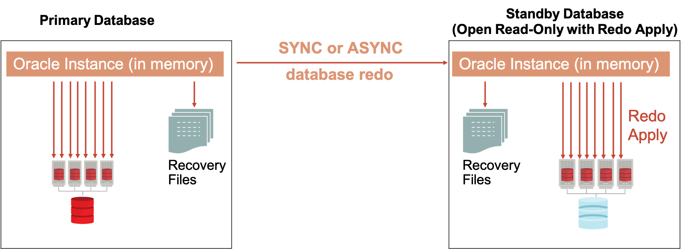
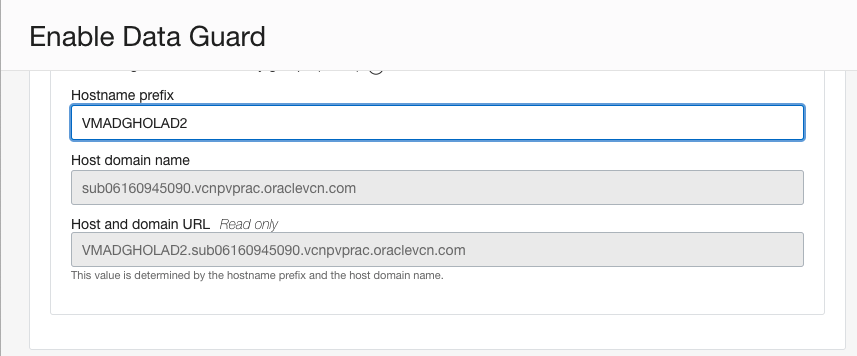
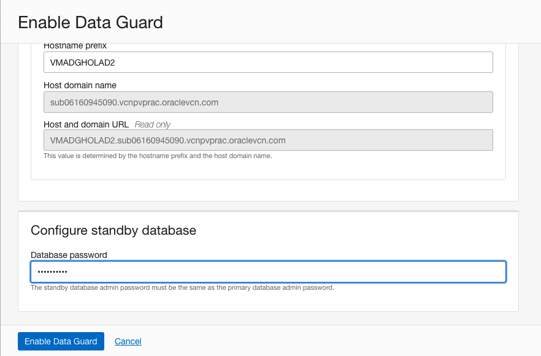

# Create the Standby Database

## Introduction
In this lab, we will create the standby database.

A standby database is a transactionally consistent copy of the primary database.

Using a backup copy of the primary database, you can create up to thirty standby databases and incorporate them into an Oracle Data Guard configuration. Oracle Data Guard automatically maintains each standby database by transmitting redo data from the primary database and then applying the redo to the standby database.

Similar to a primary database, a standby database can be either a single-instance Oracle database or an Oracle RAC database.

Estimated Lab Time: 45 Minutes

### Objectives
-   Create the standby database

### Prerequisites
- Create the primary database

## Task: Create the Standby database

To create the primary database we need to follow a wizard.

1. Lab 1 ended with this screen:
    

2. Scroll down to the part with the Databases in the DB System and click the Hamburger Menu and select **Enable Data Guard**
    

3. This will bring you to the wizard that will create the Standby database. The first part, you cannot modify this. The Standby database will be created with the Maximum Performance protection mode, meaning that it will use asynchronous redo transport mode.
    

    This is not an issue. Even if synchronous mode is not required, this can be altered manually if needed.

    Next step is to define the Peer DB System.
4. Use following data to create the Peer DB System.
    * Display Name: ADGHOLAD2
    * Region: use the same region as you have created the primary database. When all goes right, it populates correctly automatically.
    * Availability Domain: Choose the second availability domain. In the Frankfurt Example this is AD2.
    * Do not change the shape. By default the tooling selects the same shape as the primary shape. This helps to ensure like database performance if a role transition is performed.

    

5. Provide a Hostname prefix: **VMADGHOLAD2**

    

6. Enter the Primary Database password.
    Remember that it was set to **WElcome123##**
    

7. Then click **Enable Data Guard**.

8. First the Peer DB System will be created and then Data Guard will be instantiated.
    

9. Click on the Display name and that brings you to the DB System.
    

10. Scroll down to the Databases section of the page
    

11. Click on the Database Name, in this example DGHOL.
    That will bring you to the Database details page where you can find that the standby database has been successfully created and that the Data Guard status is **Enabled**

    

    When this step has been completed, then you have successfully set up a basic Data Guard configuration in the Oracle Cloud Infrastructure in Maximum Performance mode.

You may now [proceed to the next lab](#next).

## Acknowledgements

- **Author** - Pieter Van Puymbroeck, Product Manager Data Guard, Active Data Guard and Flashback Technologies
- **Contributors** - Robert Pastijn, Kamryn Vinson
- **Last Updated By/Date** -  Kamryn Vinson, March 2021
