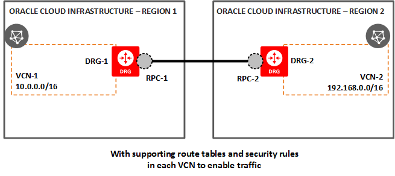
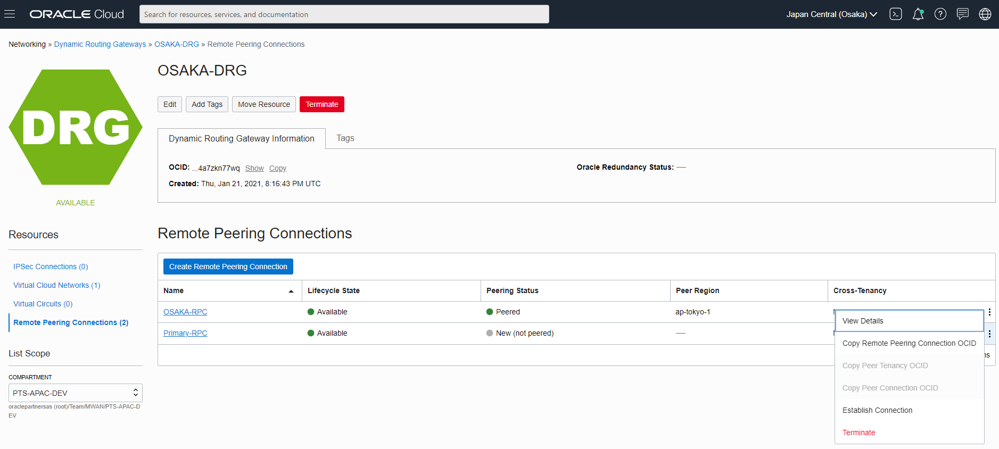

# Peer the VCN Together

Prerequisite

- User policies to set up the VCN peering  (if you do not have admin policies, refer to the documentation to add peering policies)

- VCNs already created in your primary and standby regions

- Oracle Database Cloud Service created in your primary region

In order to configure Data Guard across regions we must first set up remote VCN peering.  Remote VCN peering connects VCNs in different regions together.  The peering allows resources such as the database with private IP address to communicate across regions.

A picture of the remote VCN peering is shown below.  

If you don't have admin policies you will need to add remote peering policies.  A diagram of the policies follows.  Refer to the documentation for more information.

The DRG or Dynamic Routing Gateway must be set up on both VCNs and the RPC or Remote Peering Connection is then configured to connect the two VCNs.  

The route rule and security list must also be configured to access the resources in the VCN.  

1. Create the DRGs in both VCNs.  

2. Select a region to start with.  You can pick either the primary side or the standby.

3. Select the menu Networking

4. Ensure you are in the right region and compartment

5. Under Customer Connectivity select Dynamic Routing Gateway

6. Click Create Dynamic Routing Gateway

7. Name your DRG and click create

After creating the DRG, you must attach it to your VCN.

8. Navigate to your VCN details, select Dynamic Routing Gateways, and click Attach Dynamic Routing Gateways

9. Select your compartment and DRG

Do the same steps above in your second region.

Now let's create the Remote Peering Connections in both VCNs.

10. Create the Remote Peering Connections in both VCNs.

11. Select the DRG you created.

12. Ensure you are in the correct region and compartment.

13. Select from Resources the Remote Peering Connections.

15. Click Create Remote Peering Connection.

16. Provide a name for the connection.

17. Create the RPC.

Now do the same on the other DRG in the other region.

Once you have both DRGs and RPCs created.  You must decide which side accepts a connection, and which side requests a connection.

For our lab, we'll use the standby side as the acceptor, and the primary side as the requestor.  

18. Navigate to the standby region.

19. Record the OCID of the RPC on the standby side.  You will provide this to the primary side later to establish the peering.

20. Navigate to your primary region.

21. Select the DRG then the RPC you created.

22. On the right 3 dot action menu, select Establish Connection.

23. Enter the standby region you will establish the connection with.

24. Paste in the OCID of the RPC from the standby region.

25. Click Establish Connection.  Your connection will be established in a few minutes.

The Peering Status will show Peered if it is successful.
