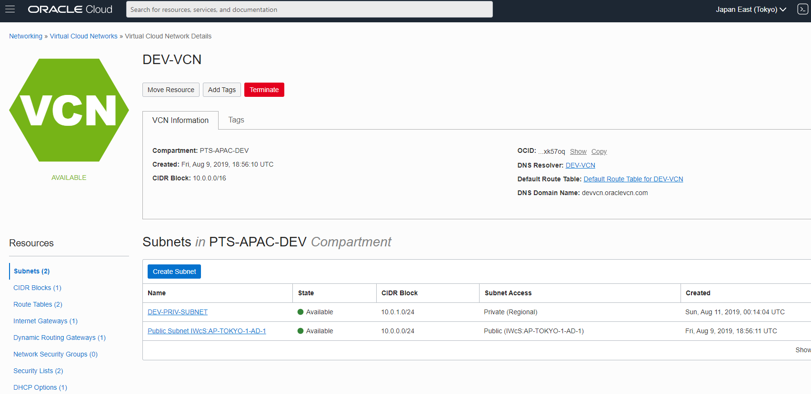
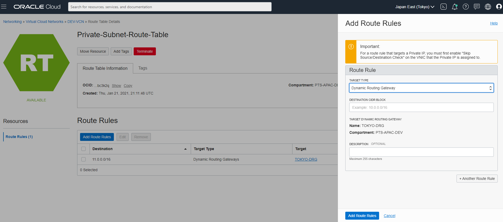

# Configure Route Rule and Security List for Data Guard Cross Region

## Introduction
After creating your VCN and DRG on both regions.  You will need to set the route rules and security lists so that the primary and standby databases can communicate.

Estimated lab time:  10 minutes

### Objective
- Configure the routing and security list for the connection

### Prerequisite
- VCN created in both the primary and standby regions
- DRG created in both the primary and standby regions

  

Let's start on the standby side.  

## **STEP 1:** Setup the route table and rules
1. From your VCN details select Route Tables, then select the private subnet route table or click Create Route Table if the private subnet route table is not there.

2. Click Add Route Rules

3. Select the Target Type as Dynamic Routing Gateways and select the name of the DRG gateway you created.

4. Enter the Destination CIDR Block.  The destination will be the primary region.  You can enter the CIDR block for the primary VCN or the primary private subnet CIDR block.  ie: 10.0.0.0/16 or 10.0.1.0/24

5. Add description if desired.

6. Click Add Route Rules to finish.

  

## **STEP 2:** Now configure the security list  

1. Navigate to Security Lists and click Create Security List and name it something like Sec-List-Private-Subnet.

2. Ensure you are in the correct compartment.

3. Click Add Ingress Rule with the following:

4. Stateless is unchecked.

5. Source Type is CIDR

6. Source CIDR is from your primary VCN or private subnet.  ie: 10.0.0.0/16 or 10.0.1.0/24.

7. IP Protocol is TCP

8. Source Port Range is All

9. Destination Port Range is 1521 for the database.

10. Add a description if desired.

  

11. Add an Egress Rule for outbound communication to the standby.

12. Stateless is unchecked.

13. Destination Type is CIDR.

14. Destination CIDR is your primary VCN or private subnet CIDR Block.  ie: 10.0.0.0/16 or 10.0.1.0/24.

15. IP Protocol is TCP

16. Source Port Range is All

17. Destination Port Range is 1521

18. Click Create Security List

  

## **STEP 3:** Now do the same steps for the primary side  

This time the CIDR block should be different since they can not overlap with the standby.
When you have completed the primary side proceed to the next lab.

You may now [proceed to the next lab](#next).

## Acknowledgements
* **Author** - Milton Wan, Database Product Management, Dec 2020
* **Contributors** -  
* **Last Updated By/Date** - Milton Wan, Jun 2021
* **Workshop Expiry Date** -
