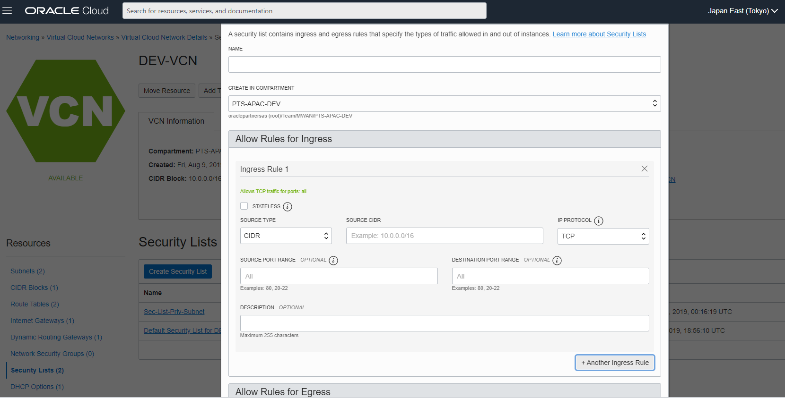
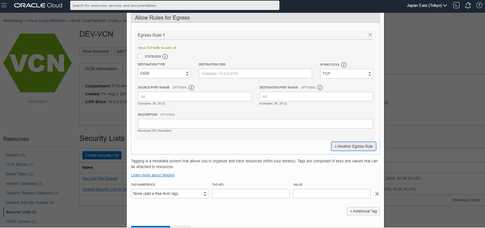

# Configure Route Rule and Security List for Data Guard Cross Region

After creating your VCN and DRG on both regions.  You will need to set the route rules and security lists so that the primary and standby databases can communicate.

### Estimated lab time:  10 minutes

Let's start on the standby side.  From your VCN hosting your standby database, select Route Tables.

1. Select the private subnet route table or click Create Route Table if the private subnet route table is not there.

2. Click Add Route Rules

3. Select the Target Type as Dynamic Routing Gateways and select the name of the DRG gateway you created.

4. Enter the Destination CIDR Block.  The destination will be the primary region.  You can enter the CIDR block for the primary VCN or the primary private subnet CIDR block.  ie: 10.0.0.0/16 or 10.0.1.0/24

5. Add description if desired.

6. Click Add Route Rules to finish.

Now configure the security list.  

7. Navigate to Security Lists and click Create Security List and name it something like Sec-List-Private-Subnet.

8. Ensure you are in the correct compartment.

9. Click Add Ingress Rule with the following:

10. Stateless is unchecked.

11. Source Type is CIDR

12. Source CIDR is from your primary VCN or private subnet.  ie: 10.0.0.0/16 or 10.0.1.0/24.

13. IP Protocol is TCP

14. Source Port Range is All

15. Destination Port Range is 1521 for the database.

16. Add a description if desired.

17. Add an Egress Rule for outbound communication to the standby.

18. Stateless is unchecked.

19. Destination Type is CIDR.

20. Destination CIDR is your primary VCN or private subnet CIDR Block.  ie: 10.0.0.0/16 or 10.0.1.0/24.

21. IP Protocol is TCP

22. Source Port Range is All

23. Destination Port Range is 1521

24. Click Create Security List

Now do the same steps for the primary side.  This time the CIDR should be different since they can not overlap with the standby.
