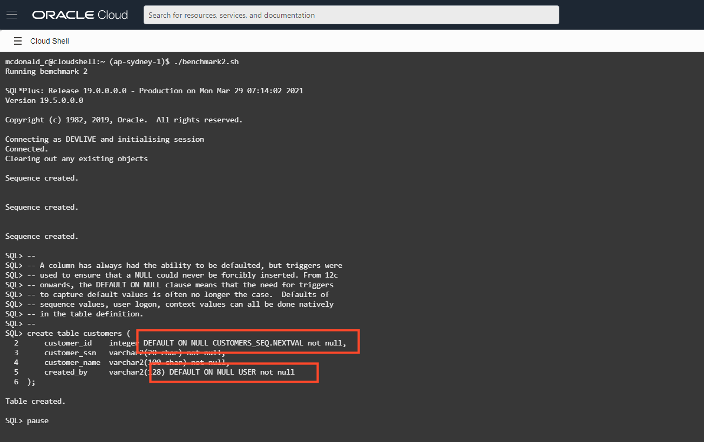
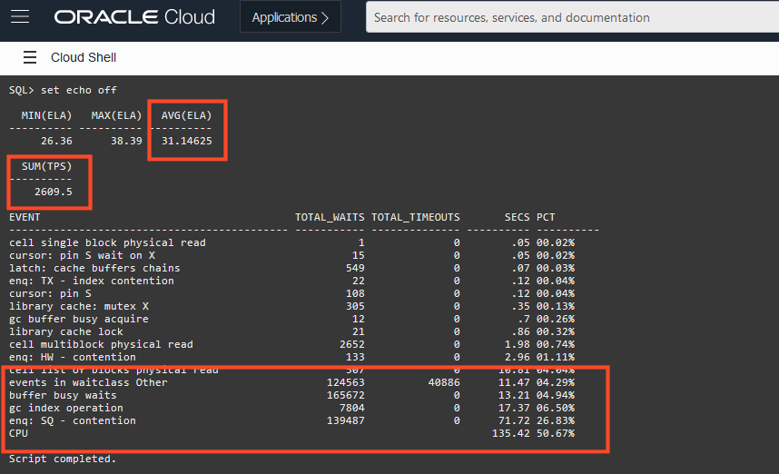

<!-- Updated March 24, 2020 -->


# Optimize the design for throughput

## Introduction

In this lab, you will modify the physical design to improve benchmark performance.

Estimated lab time: 10 minutes

### Prerequisites

-   This lab requires completion of the preceding labs in the Contents menu on the left.

## **STEP 1:** Run the New Benchmark via Cloud Shell

Using Cloud Shell, run the benchmark2 shell script.

If you are already in the home directory, you can skip the initial CD command.

````
<copy>
cd ~
./benchmark2.sh
</copy>
````

The script will connect to your autonomous database, and rebuilds the schema from scratch.  The only elements that will be presented verbosely on screen are those that have been changed from the initial baseline.



The first change here is focussed around reducing the number of database **triggers** down to a minimum. There is a performance cost to firing trigger during a DML operation. Sometimes the complexity of business requirements makes a trigger mandatory, but often, triggers are used just to populate potentially missing column values. A column has *always* had the ability to be given a default value, but triggers were used to ensure that a NULL could never be forcibly inserted into such columns. 

However, from Oracle Database 12c onwards, the DEFAULT ON NULL clause means that the need for triggers to capture default values is often no longer the case.  Defaults of sequence values, user logon, context values can all be done natively in the table definition.

As the schema generation continues, you will see that all of the trigger creation code is no longer required as has been commented out.


The script will pause when it has rebuilt the schema back to the state and is ready to launch the benchmark.


This time, because you are now familiar with the benchmark process, the 8 sessions will be launched and the initiating commit will occur automatically, thus you simply need to wait for the benchmark to complete.

## **STEP 2:** Review results

The benchmark will produce a similar performance summary to the first execution.

    

As mentioned earlier, your results will be different, but using the results in the image above, you can observe that with the revised design which has eliminated triggers:

- Throughput has improved **2609** transactions per second (up from 1524)
- Elapsed time per session has improved to **31** seconds (down from 52)
- CPU time is still at only **51** percent of the total benchmark time

The results here should not be understated. Often when tuning applications, a few percentage points is seen as a "win" but in this instance, simply utilising the DEFAULT ON NULL database feature, the performance has almost doubled. However, CPU is still not the major contributor of total elapsed time, so this suggests there are potentially more benefits to be found.

If you not have done so already, press Enter to exit the benchmark and please **proceed to the next lab.**

## Want to Learn More?

For more information on the [DEFAULT ON NULL](https://blogs.oracle.com/oraclemagazine/improved-defaults-in-oracle-database-12c) clause.

## Acknowledgements

- **Author** - Connor McDonald, Database Advocate
- **Last Updated By/Date** - Connor McDonald, March 2021
