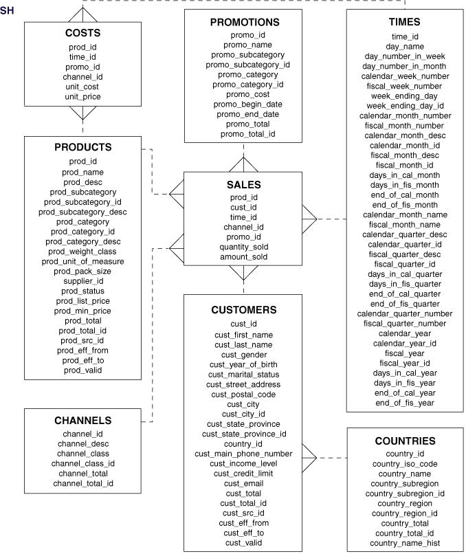

<!-- Updated March 24, 2020 -->

# Familiarize with the Sales History Sample Schema

## Introduction

In this lab, you examine the structures and data in the Sales History (SH) sample schema that comes with the database.

Estimated lab time: 10 minutes

### Objectives

-   Familiarize with the tables and their relationships within the SH sample schema

-   Use the DESCRIBE command to examine the details of an SH table

### Prerequisites

-   This lab requires completion of the preceding labs in the Contents menu on the left.

## **STEP 1:** Examine the SH Tables and Their Relationships

A database schema is a collection of metadata that describes the relationship between the data in a database. A schema can be simply described as the "layout" of a database or the blueprint that outlines how data is organized into tables.

Schema objects are database objects that contain data or that govern or perform operations on data. By definition, each schema object belongs to a specific schema. The following are commonly used schema objects:
-   **Tables**: Basic units of data storage in an Oracle database. Here, data is stored in rows and columns. You define a table with a table name and a set of columns.
-   **Indexes**: Performance-tuning methods for allowing faster retrieval of records.
-   **Views**: Representations of SQL statements that are stored in memory so that they can be reused.

The Sales History (SH) sample schema that comes with the Oracle Autonomous Database is based on a fictitious company that sells goods through various channels. The company operates worldwide to fill orders for products. It has several divisions, each of which is represented by a sample database schema. The SH schema tracks business statistics to facilitate business decisions.

This fictitious company does a high volume of business, so it runs business statistics reports to aid in decision making. Many of these reports are time-based and nonvolatile. That is, they analyze past data trends. The company loads data into its data warehouse regularly to gather statistics for these reports. These reports include annual, quarterly, monthly, and weekly sales figures by product. It also analyzes sales by geographical area. These reports are stored with the help of the Sales History (SH) schema.

Here is the entity-relationship diagram of the SH schema:

## **STEP 2:** Use the DESCRIBE Command to Examine the Details of an SH Table

The `DESCRIBE` command provides a description of a specified table or view. The description for tables and views contains the following information:
-   Column names
-   Whether null values are allowed (NULL or NOT NULL) for each column
-   Data type of columns, such as DATE, NUMBER, VARCHAR2
-   Precision of columns, such as VARCHAR2(50)

Syntax: DESC[RIBE] schema\_name.table\_name

1. With the SQL Developer Web worksheet tab that you opened in the previous lab, type the following command to view the description of the COUNTRIES table:

    `DESCRIBE SH.COUNTRIES;`

    Click the **Run Script** button to run it.

    

2. If you wish, use the `DESCRIBE` command to view descriptions of other tables in the SH schema, such as CHANNELS, CUSTOMERS and SALES.

    You may now **proceed to the next lab.**

## Want to Learn More?

For more information on the SH schema, see the documentation on [Sample Schemas](https://docs.oracle.com/en/database/oracle/oracle-database/19/comsc/introduction-to-sample-schemas.html#GUID-844E92D8-A4C8-4522-8AF5-761D4BE99200) and [Schema Diagrams](https://docs.oracle.com/en/database/oracle/oracle-database/19/comsc/schema-diagrams.html#GUID-D268A4DE-BA8D-428E-B47F-80519DC6EE6E).

## Acknowledgements

- **Author** - Richard Green, Principal Developer, Database User Assistance
- **Last Updated By/Date** - Richard Green, April 2021
