# Essbase Features: Advanced

## Introduction

This lab walks you through some of the advanced features of Essbase 21c. For example:
* Data load to cubes 
* Execution of calculation scripts 
* Utilities for migration to Essbase 21c 
* Overview of Essbase REST API functionality
* Dimension build using rule file

Estimated Lab Time: *90 minutes*.

### **Objectives**

* Learn how to build rules, calculations and run corresponding jobs.
* Understand the migration utilities.
* Understand the Essbase REST API functionality.

### Prerequisites

This lab requires -

* Essbase 21c instance
* Service administrator role
* Windows Operating System for Essbase add-ins (Smart View and Cube Designer)
* Files: Sample\_Basic.xlsx, Data\_Basic.txt, Dim_Market.txt
* You have completed:  
     * Lab: Generate SSH Keys (Free-tier and Paid Tenants only)  
     * Lab: Prepare Setup (Free-tier and Paid Tenants only)  
     * Lab: Environment Setup  
     * Lab: Introduction to Essbase  
     * Lab: Initialize Environment  
     * Lab: Essbase Features: Basic


## Task 1: Dimension build using Rule file

You can edit and map dimensions to an Essbase outline using a rule, rather than manually building empty dimensions in the Essbase outline editor. In this section, we are building build dimension from a flat file, using a rule.

When you build using a rule, you define the hierarchical structure of dimensions and member metadata. You can create one or more dimensions using a single rule file, or use one rule file per dimension.

You can build a dimension to add or modify dimensions, but you can’t use it to delete an existing dimension.

1. Download the dimension metadata file, **Dim_Market.txt**, and open in a formatted text editor. 
   
   This file is part of workshop artifacts. Steps to download the artifacts are mentioned in **Lab: Initialize Environment-> step2**.

   Notice that the file doesn't have a header row and that the file delimiter is a comma.

2. Sign into the Essbase web interface.

3. On the home page, expand the DynamicCorp application, and select the Sales cube.

4. Now you create the rule file.

    * From the Actions menu to the right of the cube, click **Inspect**.
      	

    * Click **Scripts**, and then **Rules**. The rules editor is displayed, showing the currently defined  rules.

    * Click **Create** and select **Dimension Build (Indexed Based)** to define the build dimension rule. 
    An index-based build dimension rule removes dependency of fields to each other and allows the fields to appear in any order.
      


    * In the New Rule dialog box, enter **Dim_market1** as the name of the rule file.

    * Under the Source Type, select **File**.

    * Click the browse icon and locate the file **Dim_Market.txt** that you downloaded and click **Open** to select it.
    
    * As you saw earlier, the first row of the flat file doesn’t contain header values. Enter the Header Record Number as 0.

    * Specify the Delimiter value as Comma, based on the file format.

    * Set the preview data count value to 10.

    

    * Click **Preview Data**.

      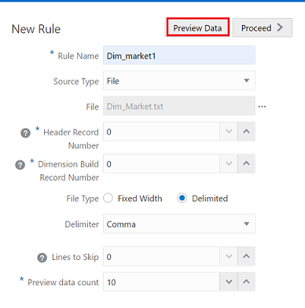

   

    * Click **Proceed**.

     

    You can now preview the dimension structure in the rules editor, with the columns displayed based on the input flat file.

    The top-right toolbar in the rules editor shows the Global options for a rule. You can change the properties or data source here and view the results. The left toolbar of the rules editor shows the Field options for the rule.

5. On the rules editor page, you can now set up and edit the rule.

      * On Preview page for the new rule, in the first field (column), click **Dimension**, and select **Market** as dimension name. Market dimension is now assigned to all fields.

      * Under Market, in the first field, it, click **Type**, and select the dimension type, **Parent**.
        The source file for this rule is in parent-child format. 

      * Set up the other fields:

         * Set Field 2 - **Child**.  
         * Set Field 3 - **Property**, and third row Parent/Child box to Child.
         * For Field 4 and 5, set **UDA**, and third row Parent/Child boxes to Child.
         * For Field 6-9, set **Alias**, third row Alias boxes to ChineseNames, JapaneseNames, RussianNames, and GermanNames respectively; and fourth row boxes to Child.
         * Set Field 10 - **Attribute Member**, third row box to Population, and fourth row box to Child.
           

       * Now check the field properties for a field. Select the last field column, **Population**.
       
          On the Field options toolbar, click **Properties** and verify that Case is set to No Operation. This means that uppercase and lowercase text aren’t handled differently here than they were in the source text file.
          
          


       * Click **Dimensions** under the Global toolbar and select **Market**.

       * Go to Advanced and Check Allow Property Changes. Click **OK**.
         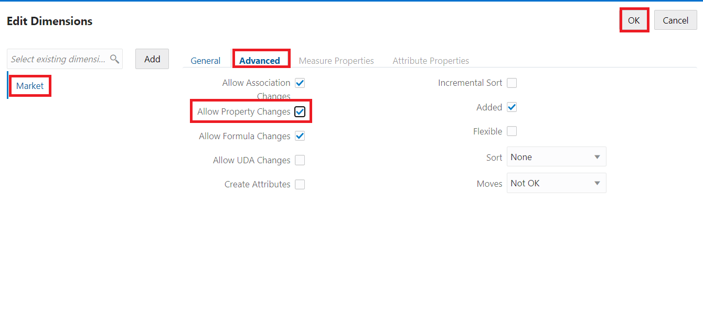

       * When you have finished defining the rule, click **Verify** in the Global toolbar, to validate the rule syntax.

       * Click **Save and Close**.
         

       * Click **Refresh**. See that your created rule is now listed in the rules pane of the Scripts tab. 
         Click **Close** to return to the home page.	

6. Next, you create and run a job to build the dimension using the rule.

    * On the home page, select Jobs, and then New Job.

    * Select **Build Dimension**.
      

    * In the Build Dimension dialog box, from the Application list, select 'DynamicCorp' application.

    * In the Database list, select 'Sales' cube. 

    * In the Script list, select the build dimension rule that you created, **Dim_market1.rul**.

    * For Load Type, select **File**.

    * In the Data File list, select **Dim_Market.txt** as the data dimension data file. This file is located in the DynamicCorp,Sales folder.

    * From the Restructure Options list, select **Preserve Input Data** for the data you want to preserve.

     For input data, only blocks that contain data being loaded are preserved. 
     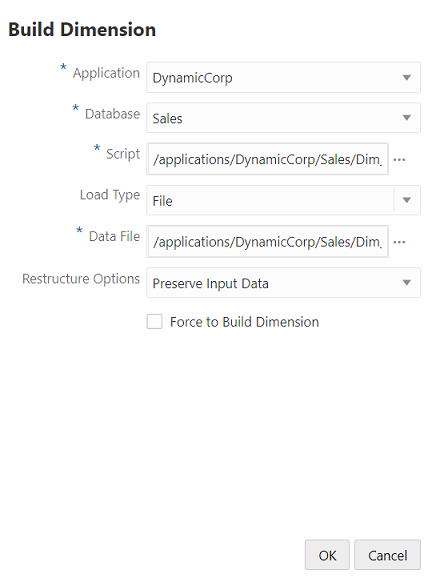

    * Click **OK**. The build dimension job is executed.

    * On the Jobs page, click **Refresh** to monitor the job status.

    * When the job completes, click **Actions** for the executed job, and select **Job Details** to verify the status of your build job.
    
    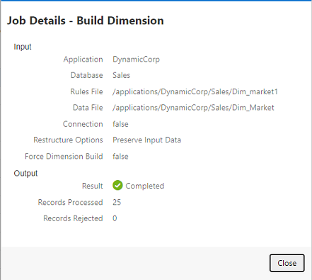


7.	On the Applications home page, to the right of the Sales cube in the DynamicCorp application, open Actions, and then Outline to verify the dimension hierarchy. 

You have now completed building a dimension using a rule.

## Task 2: Data Load to Cube

DataCorp IT group stores data in an Oracle data warehouse that is being used to normalize the data. The IT group extracts data in flat files on a regular basis.

Loading data is the process of adding data values to a cube from any number of data sources or SQL database. Since data sources seldom are configured solely to support Essbase dimension build and data load processes, a rule file is generally used to create Essbase-compatible directives to be applied to the data source.

Create a rule file that is based on a sample file from the data warehouse.

1.	Download the data file **Data_Basic.txt**.
 
    This file is part of Workshop artifacts. Steps to download the artifacts are mentioned in **Lab: Initialize Environment-> step2**.
   
    Open the downloaded data file "Data_Basic.txt". Notice that there's no header row and the file delimiter is a comma.

    

2.	Sign in to the Essbase web interface.

3.	On the home page, expand the 'DynamicCorp' application, and select the 'Sales' cube.

4.	Now create the load rule.  
    * In the Sales cube, from the right side hamburger, click **Inspect**.  
       

	* On the Scripts tab, select **Rules**. The Rules editor shows defined rules.  

	* Click **Create** and select **Data Load** to define the load data rule.  

	   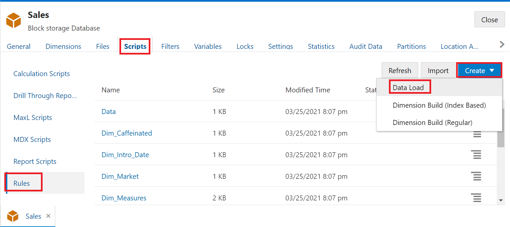

	* In the New Rule dialog box, enter **LoadCorp** as the name of rule.

	* Under Source Type, select **File** for flat file input.

	* Browse the downloaded file **Data_Basic.txt**. Click **Open** to select it.

	* As you saw earlier, the first row of the flat file doesn't contain header values. Enter the Header Record Number as 0.  

	* Select **Comma** as the Delimiter value based on the file format.  

	* Click **Preview Data**.  

	    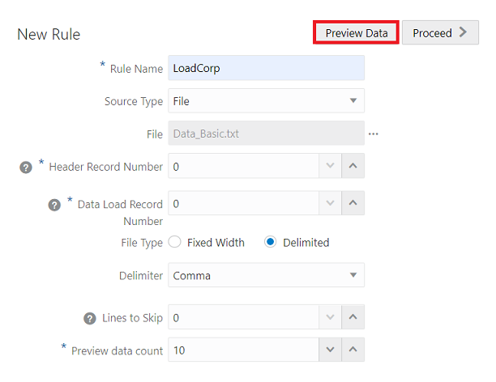

    * Click **Proceed**.

      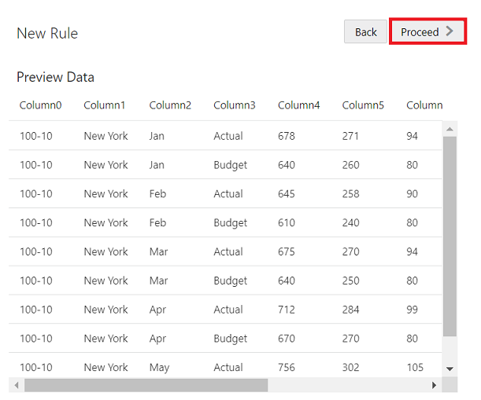

5.  You can now see the preview of the data in the rules editor based on the input flat file.

    The Global options toolbar, on the top right of the rules editor allows you to modify file properties or the data source and to see the results in the rules editor. The Field options toolbar on the left side of the rules editor allows you map fields in the rule.

    Because there were no headers in the input file, you need to map each column to the appropriate dimensions and members.

6. In the rules editor, you can now set up the rule fields.

    

    * Click **Edit** on Field 1 and map the fields as below:

      

      * Field 1 - Search Product in member tree and double-click or enter Product under Field Name. Click **Next**.
      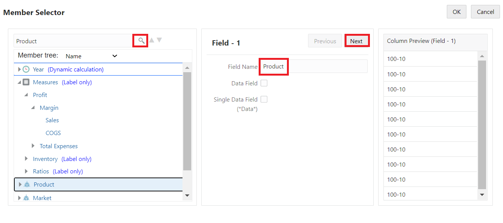
      * Repeat the same as above for Field 2- Field 4 and enter the Field Name as mentioned below.
      * Field 2 - Market
      * Field 3 - Year
      * Field 4 - Scenario
      * Field 5 - Search Sales in member tree and select it as Field Name. Check **Data field** option and select the Storage type as **Sum**. Click **Next**.
        
    Repeat the same as above for Field 6 – Field 11 and enter the Field Name as mentioned below.

      * Field 6 - COGS
      * Field 7 - Marketing
      * Field 8 - Payroll
      * Field 9 - Misc
      * Field 10 - Opening Inventory
      * Field 11 - Additions  
  
       All dimensions must be represented in the load data rule before any data can be loaded.

       Click **OK**.

    * After defining the rule with field options, click **Verify** on the Global toolbar to validate the syntax and then click **Save and Close**.

      

    * Click **Refresh**. See that the created rule is now listed in the Rules pane of the Scripts tab.

    * Click **Close** to return to the Applications home page. Next create a job to load the data using the rule.

7. On the home page, select **Jobs** and then **New Job**.
    

    * Select **Load Data**.

    * In the Load Data dialog box, from the Application menu, select the 'DynamicCorp' application.

    * In the Database list, select the 'Sales' cube.

    * For Load Type, select **File**.

    * Select the file **Data-basic.txt** from the Data File list. This file is located in the DataCorp > Sales folder.

    * In the Script list, select the load data rule that you created, **LoadCorp.rul**.

    * Optional: select the Abort on error check box if you want the load to stop if an error occurs.

    * Click **OK**. The load data job is executed.

      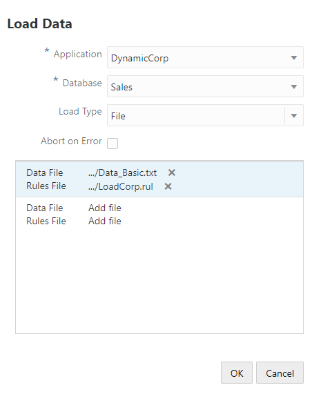

    * On the Jobs page, click Refresh to monitor the job status.


8. After the job is completed, verify that the input records were processed and loaded.

    * Select **Job Details** to check the load data job details.

    * Click **Close**.
      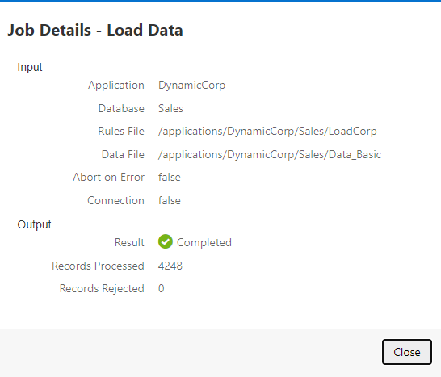

9.	On the Applications page, click **Actions** to the right of the DynamicCorp - Sales cube and click **Inspect**.

10.  Select **Statistics** to view the resulting statistics for the Sales cube.  
    

    You have now completed the data load using rule file.

## Task 3: Calculating Essbase Cube

A cube contains two types of values: values that you enter called input data and values that are calculated from input data.

A cube can be calculated using one of two methods:
*  Outline calculation: The calculation of a cube is based on the relationships between members in the cube outline (the hierarchy) and on any formulas that are associated with members in the outline. 

* Script based calculations: This contains a series of calculation commands, equations, and formulas, which allows you to define calculations other than those defined by the database outline calculation.  
  
  You create calculation scripts using a script editor in the Essbase web interface.  
  Calculation scripts do not apply to aggregate storage applications.

1.	On the Application page, expand the application.

2.	From the Actions menu on the right of the cube, click **Inspect**.

    

3.	Select **Scripts** tab, and then select **Calculation Scripts** tab.

    

4.	Click **+** icon to create a new calculation script.

    NOTE:   
    If member names are required in your calculation script, drill into the member tree to find the members you want to add.
    Right-click dimension or member names to insert them into the script.  

    If function names are required in your calculation script, use the Function Name menu to find calculation functions and add them to the script.
    See the Function description under the menu to read descriptions of each function.

5.	The following calculation script, based on the DynamicCorp.Sales database, calculates the Actual values from the Year, Measures, Market, and Product dimensions:

    ```
    <copy>        
          FIX (Actual)
		CALC DIM(Year, Measures, Market, Product);
	ENDFIX</copy>
    ````


1. In the name field of script editor give the name to script as **CalcActual**.

    

7.	Click **Validate** before saving your script. Validating a script verifies the script syntax. For example, incorrectly spelled function names and omitted end-of-line semicolons are identified. Validation also verifies dimension names and member names.

8.	Correct any validation errors.

9.	Click **Save and Close**.

10.  After creating and saving calculation scripts, use the Jobs page to execute them and perform the calculations on data loaded in your cube.


11.	On the Jobs page, click **New Job** and select **Run Calculation**.

    

12.	On the Run Calculation dialog box, select the application - **DynamicCorp** and cube – **Sales**.

13.	Select the script – **CalcActual**.

    

14.	Click **OK** to start the calculation.

15.	Click **Refresh** to see the status of your calculation.

To verify if the data is aggregated at all the dimension levels for Actual, you can go to excel and build a retrieval sheet using Smart View.

## Task 4: Migration Utilities

1. Download and configure CLI:  

     * Log in to Essbase web user interface. Navigate to top left-hand corner, click the hamburger, select **Console** and then **Desktop Tools**.

     * Expand the Command Line Tools section. Download the Command-Line Tool by clicking download for "Command-Line Tool".
        

     * Unzip the cli.zip file in a directory e.g. C:\app\cli  
     
     * In your machine, search for Command Prompt. Open it by right-clicking **Run as administrator**.
       Change directory to where you unzipped the CLI tool.  
    
       **Tip:  To run the CLI tool you need JAVA\_HOME to be set or you will get this error**
       **C:\app\cli>esscs.bat**
       **Install JDK8 and set JAVA_HOME variable to JDK8 installed location**  

       Note: Please check the links: [link1](https://confluence.atlassian.com/conf59/setting-the-java_home-variable-in-windows-792499849.html),  [link2](https://docs.oracle.com/cd/E19182-01/820-7851/inst_cli_jdk_javahome_t/) to install jdk8 and above and set JAVA_HOME path.
      
     * From the command window type esscs.bat to get a list of the available command. 
         

     * Use the below command and enter the password to login:
         ```
       <copy>        
             esscs login -url http://ip:9000/essbase -u userid
   	</copy>
       ````
         
   


2. Import Sample.Basic from CLI:

      * Download the file **Sample_Basic.xlsx**. Copy the file to the folder: C:\app\cli.

        This file is part of Workshop artifacts. Steps to download the artifacts are mentioned in **Lab: Initialize Environment-> step2**.

        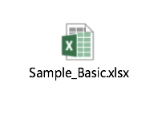

         This file is imported using CLI and it is used for rest of the exercise.   

      * Enter below command to deploy the the Sample cube using the Sample_Basic.xlsx file.  Name the application **Sample01** and cube as **Base**.

        ```
        <copy> esscs.bat deploy --help
        esscs.bat deploy -a Sample01 -db Basic -file C:\app\cli\Sample_Basic.xlsx </copy>
        ```

        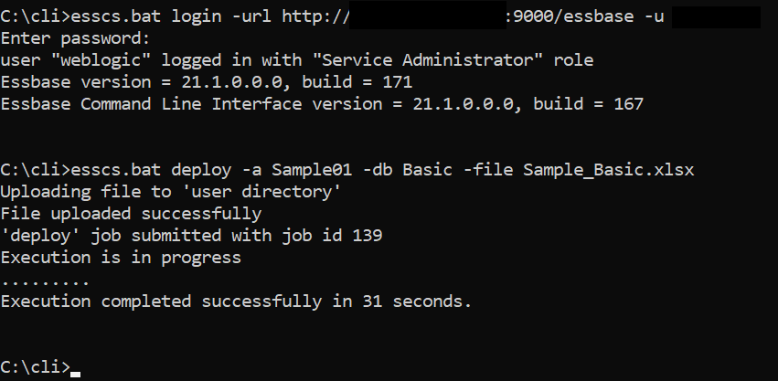

      * Next, review the newly create cube from the Essbase web interface.

        

3. LcmExport: The LcmExport CLI command backs up cube artifacts to a Lifecycle Management (LCM) .zip file. To export Sample application, deployed in last step, use this command.


    ```
    <copy> 
    esscs.bat lcmExport --help  
    esscs lcmExport -application Sample01 -zipfilename Sample01.zip </copy>
    ```

    

4. LcmImport: Restores cube artifacts from a Lifecycle Management (LCM) .zip file.

    ```
		<copy> 
        esscs.bat lcmImport --help 
        esscs lcmImport -z  C:/app/cli/Sample01.zip -o </copy>
    ```

    *NOTE:* The mentioned path should not contain spaces.

    

## Task 5: REST APIs

REST API for Oracle Essbase enables you to automate management of Essbase resources and operations. All requests and responses are communicated over HTTP.

You can view a list of all REST Endpoints.

**Explore the Swagger Interface**

The Swagger interface for Essbase REST enables you to try out REST requests in a visual interface, even before you have set up cURL (Client URL) or another API implementation method. cURL is a command-line data transfer tool you can use for making HTTP requests and other requests.

To use the Swagger interface,

1. Log in to Essbase web interface with url. For example: http://ip:9000/essbase/jet

2. In your browser address bar, select all of the URL string that immediately follows essbase, and replace it with /rest/doc/. For example, change the URL to:  **http://ip:9000/essbase/rest/doc/**

3. On Swagger web interface, you are presented with a number of REST APIs.  

4.	Under Application logs, click the second **GET** button. (Download Latest Log)

    

    

5.	Click **Try it Out**.

    

6.	Enter the name of application.

    

7.	Click **Execute**.

8.	Look under the Server response section. If the request was successful, then you should see a 200 response with a body such as the following:

    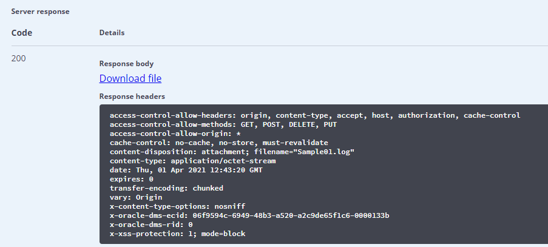

9.	Click **Download File** to download zip file containing application log.

10.  You can integrate REST APIs with cURL in order to automate various Essbase tasks.

You may [proceed to the next lab](#next).

## Acknowledgements
* **Authors** -Sudip Bandyopadhyay, Manager, Analytics Platform Specialist Team, NA Technology
* **Contributors** - Eshna Sachar, Jyotsana Rawat, Kowshik Nittala, Venkata Anumayam
* **Last Updated By/Date** - Jyotsana Rawat, Solution Engineer, Analytics, NA Technology, August 2021


