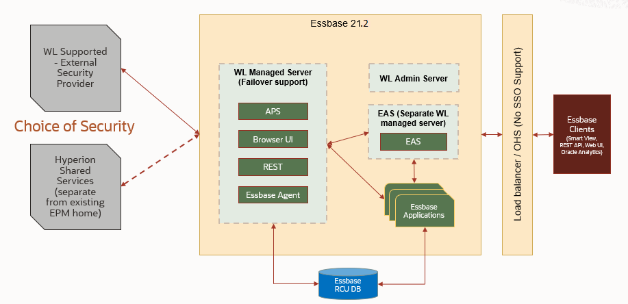

# Introduction

## About this Workshop

In this workshop, you will learn how business users can utilize multiple data sources and Oracle Essbase to benefit their business through advanced data management and analytics. 

This workshop is designed to give you a hands-on experience with various components of Oracle Essbase.

Estimated Workshop Time: *5.75 hours*.

### About Product/Technology

Lines of business are under enormous pressure to generate more insights, faster, from their financial systems and other critical data sources. But for most organizations, far too much time is spent manually sourcing, managing, preparing, and securing data – leaving far too little time for true analysis and insight.

Oracle Essbase is a business analytics solution that uses a proven, flexible, best-in-class architecture for analysis, reporting, and collaboration. Essbase delivers instant value and greater productivity for your business users, analysts, modelers, and decision-makers, across all lines of business within your organization.

Oracle Essbase helps you to build your company’s On-Premise strategy efficiently by avoiding data and business process fragmentation. Oracle Essbase can be easily deployed on Oracle Cloud Infrastructure, which can then be widely used to solve simple to complex business analytics use cases across all industries. It is designed to help you model business performance levels and deliver what-if analyses for varying conditions. 

### Features of Oracle Essbase

1. Oracle Essbase provides a complete set of tools and features for deriving and sharing data insights.

2. Both large organizations and small teams can share data easily, without the need to manage or consolidate multiple versions of spreadsheets, and quickly perform ad hoc analysis of the spreadsheet data.

3. Application developers can utilize interfaces that enable them to extend, customize and embed rich analytic experiences in the application flow.

4. Oracle Essbase is a multi-dimensional engine that allows you to extract data from any source, handle real-time data and collaborate easily.

5. With Essbase you can create and manage Essbase applications from Microsoft Excel by using Cube Designer.

6. Create connections and data sources for drill-through, data loads, and dimension builds.

7. We can use Essbase to collect collaborative data, create scenarios, and perform what-if analysis using Smart View.

### Essbase 21c Architecture

  

### Objectives

-   Learn how to use Oracle Essbase with your data and applications to help you model business performance levels and deliver what-if analyses for varying conditions.

### Prerequisites

-   An Oracle public cloud tenancy where you have the admin privileges and resources available to provision an ATP instance with one OCPU and an Essbase 21c instance with one OCPU.
-   Smartview Plugin (steps provided in Essbase lab)

## Acknowledgements
* **Authors** -Sudip Bandyopadhyay, Manager, Analytics Platform Specialist Team, NA Technology
* **Contributors** - Eshna Sachar, Jyotsana Rawat, Kowshik Nittala, Venkata Anumayam
* **Last Updated By/Date** - Jyotsana Rawat, Solution Engineer, Analytics, NA Technology, May 2021

## Need Help?
Please submit feedback or ask for help using our [LiveLabs Support Forum](https://community.oracle.com/tech/developers/categories/oracle-analytics-cloud). Please click the **Log In** button and login using your Oracle Account. Click the **Ask A Question** button to the left to start a *New Discussion* or *Ask a Question*.  Please include your workshop name and lab name.  You can also include screenshots and attach files.  Engage directly with the author of the workshop.

If you do not have an Oracle Account, click [here](https://profile.oracle.com/myprofile/account/create-account.jspx) to create one. Please include the workshop name and lab in your request.
