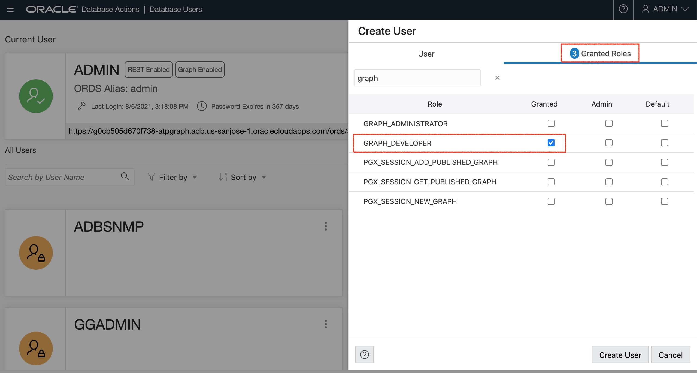

# Create and Enable a Database User in Database Actions

## Introduction

This lab walks you through the steps to get started with Database Actions. You will learn how to create a user in Database Actions and provide that user the access to Database Actions.

Estimated time: 3 minutes

### Objectives

- Learn how to setup the required database roles in Database Actions.
- Learn how to create a database user in Database Actions.

### Prerequisites

* Oracle cloud account
* Provisioned Autonomous Database Shared Instance

<<<<<<< HEAD
## Task 1: Login to Database Actions

Login as the Admin user in Database Actions of the newly created ADB instance.

Click the **Navigation Menu** in the upper left, navigate to **Oracle Database**, and select **Autonomous Transaction Processing**.


In Autonomous Database Details page, open **Tools** tab and click **Database Actions**. Make sure your brower allow pop-up windows.


Enter `ADMIN` as Username and go next.


Input the password (you set up at Lab 2) and sign in.


Go to **SQL** menu once you logged in as the `ADMIN` user. 


## Taks 2: Create database roles

Now create the roles required for the graph feature. Enter the following commands into the SQL Worksheet and run it while connected as the Admin user.
=======
## Task 1: Create database roles

1. Login as the Admin user in SQL Developer Web of the newly created ADB instance.

    Click the **Navigation Menu** in the upper left, navigate to **Oracle Database**, and select **Autonomous Transaction Processing**.

	  

    In Autonomous Database Details page, click **Service Console**. Make sure your brower allow pop-up windows.

    

    Choose Development from the list on the left, then click the **SQL Developer Web**.

    

    Enter `ADMIN` as Username and go next.

    

    Input the password (you set up at Lab 2 Step 2, Section 7) and sign in.

    
  
    Logged in as the `ADMIN` user. 

    

2. Now create the roles required for the graph feature. Enter the following commands into the SQL Worksheet and run it while connected as the Admin user.

    Create the roles required by the graph server.
    ```
    <copy>
    DECLARE
      PRAGMA AUTONOMOUS_TRANSACTION;
      role_exists EXCEPTION;
      PRAGMA EXCEPTION_INIT(role_exists, -01921);
      TYPE graph_roles_table IS TABLE OF VARCHAR2(50);
      graph_roles graph_roles_table;
    BEGIN
      graph_roles := graph_roles_table(
        'GRAPH_DEVELOPER',
        'GRAPH_ADMINISTRATOR',
        'PGX_SESSION_CREATE',
        'PGX_SERVER_GET_INFO',
        'PGX_SERVER_MANAGE',
        'PGX_SESSION_READ_MODEL',
        'PGX_SESSION_MODIFY_MODEL',
        'PGX_SESSION_NEW_GRAPH',
        'PGX_SESSION_GET_PUBLISHED_GRAPH',
        'PGX_SESSION_COMPILE_ALGORITHM',
        'PGX_SESSION_ADD_PUBLISHED_GRAPH');
      FOR elem IN 1 .. graph_roles.count LOOP
      BEGIN
        dbms_output.put_line('create_graph_roles: ' || elem || ': CREATE ROLE ' || graph_roles(elem));
        EXECUTE IMMEDIATE 'CREATE ROLE ' || graph_roles(elem);
      EXCEPTION
        WHEN role_exists THEN
          dbms_output.put_line('create_graph_roles: role already exists. continue');
        WHEN OTHERS THEN
          RAISE;
        END;
      END LOOP;
    EXCEPTION
      when others then
        dbms_output.put_line('create_graph_roles: hit error ');
        raise;
    END;
    /
    </copy>
    ```

    Assign the default permissions to the roles, `GRAPH_DEVELOPER` and `GRAPH_ADMINISTRATOR`, to group multiple permissions together.
    ```
    <copy>
    GRANT PGX_SESSION_CREATE TO GRAPH_ADMINISTRATOR;
    GRANT PGX_SERVER_GET_INFO TO GRAPH_ADMINISTRATOR;
    GRANT PGX_SERVER_MANAGE TO GRAPH_ADMINISTRATOR;
    GRANT PGX_SESSION_CREATE TO GRAPH_DEVELOPER;
    GRANT PGX_SESSION_NEW_GRAPH TO GRAPH_DEVELOPER;
    GRANT PGX_SESSION_GET_PUBLISHED_GRAPH TO GRAPH_DEVELOPER;
    GRANT PGX_SESSION_MODIFY_MODEL TO GRAPH_DEVELOPER;
    GRANT PGX_SESSION_READ_MODEL TO GRAPH_DEVELOPER;
    </copy>
    ```

## Task 2: Create a database user

Now create the `CUSTOMER_360` user. Enter the following commands into the SQL Worksheet and run it while connected as the Admin user.

Note: Replace **<specify_a_password>** with a valid password string after copying and pasting the text below but **before executing** it in SQL Developer Web.
>>>>>>> upstream/master

```
<copy>
DECLARE
  PRAGMA AUTONOMOUS_TRANSACTION;
  role_exists EXCEPTION;
  PRAGMA EXCEPTION_INIT(role_exists, -01921);
  TYPE graph_roles_table IS TABLE OF VARCHAR2(50);
  graph_roles graph_roles_table;
BEGIN
  graph_roles := graph_roles_table(
    'GRAPH_DEVELOPER',
    'GRAPH_ADMINISTRATOR',
    'PGX_SESSION_CREATE',
    'PGX_SERVER_GET_INFO',
    'PGX_SERVER_MANAGE',
    'PGX_SESSION_READ_MODEL',
    'PGX_SESSION_MODIFY_MODEL',
    'PGX_SESSION_NEW_GRAPH',
    'PGX_SESSION_GET_PUBLISHED_GRAPH',
    'PGX_SESSION_COMPILE_ALGORITHM',
    'PGX_SESSION_ADD_PUBLISHED_GRAPH');
  FOR elem IN 1 .. graph_roles.count LOOP
  BEGIN
    dbms_output.put_line('create_graph_roles: ' || elem || ': CREATE ROLE ' || graph_roles(elem));
    EXECUTE IMMEDIATE 'CREATE ROLE ' || graph_roles(elem);
  EXCEPTION
    WHEN role_exists THEN
      dbms_output.put_line('create_graph_roles: role already exists. continue');
    WHEN OTHERS THEN
      RAISE;
    END;
  END LOOP;
EXCEPTION
  when others then
    dbms_output.put_line('create_graph_roles: hit error ');
    raise;
END;
/
</copy>
```

Assign the default permissions to the roles, `GRAPH_DEVELOPER` and `GRAPH_ADMINISTRATOR`, to group multiple permissions together.
```
<copy>
GRANT PGX_SESSION_CREATE TO GRAPH_ADMINISTRATOR;
GRANT PGX_SERVER_GET_INFO TO GRAPH_ADMINISTRATOR;
GRANT PGX_SERVER_MANAGE TO GRAPH_ADMINISTRATOR;
GRANT PGX_SESSION_CREATE TO GRAPH_DEVELOPER;
GRANT PGX_SESSION_NEW_GRAPH TO GRAPH_DEVELOPER;
GRANT PGX_SESSION_GET_PUBLISHED_GRAPH TO GRAPH_DEVELOPER;
GRANT PGX_SESSION_MODIFY_MODEL TO GRAPH_DEVELOPER;
GRANT PGX_SESSION_READ_MODEL TO GRAPH_DEVELOPER;
</copy>
```

## Task 3: Create a database user

Now create the `CUSTOMER_360` user and provide Database Actions access for this user.

<<<<<<< HEAD
Open the main menu and click "Database Users".
=======
## Task 3: Enable SQL Developer Web for the new user
>>>>>>> upstream/master


Click `Create User` button, input user name and password. Enable **Web Access** and set the quota to `UNLILMITED`.


Go to **Granted Roles** tab and grant `GRAPH_DEVELOPER` role to this user. (Two roles `CONNECT` and `RESOURCE` are selected by default. Please keep them checked so they will be also granted.)



Proceed with **Create User**, and open the login window.


Confirm that you can login with the new user.


For details, see the ["Provide Database Actions Access to Database Users"](https://docs.oracle.com/en/cloud/paas/autonomous-data-warehouse-cloud/user/sql-developer-web.html#GUID-4B404CE3-C832-4089-B37A-ADE1036C7EEA) section in the documentation.

You may now proceed to the next lab.

## Acknowledgements

* **Author** - Jayant Sharma, Product Manager, Spatial and Graph.
* **Contributors** - Thanks to Jenny Tsai for helpful, constructive feedback that improved this workshop. Arabella Yao, Product Manager Intern, Database Management.
* **Last Updated By/Date** - Ryota Yamanaka, August 2021

