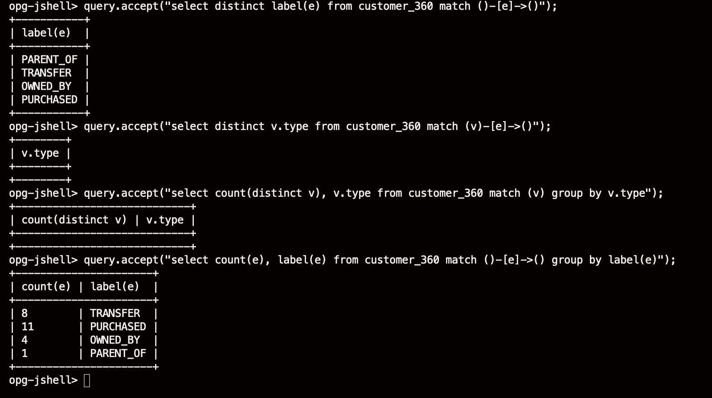

# Create the Graph

## Introduction

Now, the tables are created and populated with data. Let's create a graph representation of them.

Estimated time: 5 minutes

### Objectives

Learn how to create a graph from relational data sources by:
- Restarting the graph server
- Starting a client (Python shell) that connects to the server
- Using PGQL Data Definition Language (DDL) (e.g. CREATE PROPERTY GRAPH) to instantiate a graph

### Prerequisites

- This lab assumes you have successfully completed the lab - Create and populate tables.

## **STEP 1:** Start the Python client

3. Then start a client shell instance that connects to the server

    ```
    <copy>
    opgpy -b http://localhost:7007 --username customer_360
    </copy>
    ```

    You should see the following if the client shell starts up successfully.

    ```
    enter password for user graph_dev (press Enter for no password):    <-- input "Welcome1"
    
    Oracle Graph Client Shell 20.4.0
    >>>
    ```

## **STEP 2:** Create the graph

1. Set up the create property graph statement.

    ```    
    // create the graph from the existing tables
    <copy>
    statement = '''
    CREATE PROPERTY GRAPH customer_360
      VERTEX TABLES (
        customer
          PROPERTIES (type, name, age, location, gender, student)
      , account
          PROPERTIES (type, account_no, balance)
      , merchant
          PROPERTIES (type, name)
     )
     EDGE TABLES (
        owned_by
          SOURCE KEY(from_id) REFERENCES account
          DESTINATION KEY(to_id) REFERENCES customer
          LABEL owned_by
          PROPERTIES (since)
      , parent_of
          SOURCE KEY(from_id) REFERENCES customer
          DESTINATION KEY(to_id) REFERENCES customer
          LABEL parent_of
      , purchased
          SOURCE KEY(from_id) REFERENCES account
          DESTINATION KEY(to_id) REFERENCES merchant
          LABEL purchased
          PROPERTIES (amount)
      , transfer
          SOURCE KEY(from_id) REFERENCES account
          DESTINATION KEY(to_id) REFERENCES account
          LABEL transfer
          PROPERTIES (amount, date)
      )
    '''
    </copy>
    ```

    

2. Now execute the PGQL DDL to create the graph.

    ```
    // drop when this graph exists first
    <copy>
    graph.destroy()
    </copy>
    ```

    ```
    // Now create the graph 
    <copy>
    session.prepare_pgql(statement).execute()
    </copy>
    ```

    

## **STEP 3:** Check the newly created graph

Check that the graph was created. Copy, paste, and run the following statements in the Python shell.

1. Attach the graph to check that the graph was created.

    ```
    <copy>
    graph = session.get_graph("customer_360")
    graph
    </copy>
    PgxGraph(name: customer_360, v: 180, e: 835, directed: True, memory(Mb): 0)
    ```

2. Run some PGQL queries.

    ```
    // what are the edge labels i.e. categories of edges
    <copy>
    graph.query_pgql("""
      select distinct label(e) from customer_360 match ()-[e]->()
    """).print()
    </copy>
    ```
    
    ```
    // what are the vertex types i.e. values of the property named "type"
    <copy>
    graph.query_pgql("""
      select distinct v.type from customer_360 match (v)-[e]->()
    """).print()
    </copy>
    ```

    ```
    // how many vertices with each type/category
    <copy>
    graph.query_pgql("""
      select count(distinct v), v.type from customer_360 match (v) group by v.type
    """).print()
    </copy>
    ```

    ```
    // how many edges with each label/category
    <copy>
    graph.query_pgql("""
      select count(e), label(e) from customer_360 match ()-[e]->() group by label(e)
    """).print()
    </copy>
    ```

    

You may now proceed to the next lab (query and analyse the graph in JShell.

## Acknowledgements

- **Author** - Jayant Sharma, Product Manager, Spatial and Graph
- **Contributors** - Thanks to Jenny Tsai for helpful, constructive feedback that improved this workshop. Arabella Yao, Product Manager Intern, Database Management
- **Last Updated By/Date** - Ryota Yamanaka, December 2020

## Need Help?
Please submit feedback or ask for help using our [LiveLabs Support Forum](https://community.oracle.com/tech/developers/categories/oracle-graph). Please click the **Log In** button and login using your Oracle Account. Click the **Ask A Question** button to the left to start a *New Discussion* or *Ask a Question*.  Please include your workshop name and lab name.  You can also include screenshots and attach files.  Engage directly with the author of the workshop.

If you do not have an Oracle Account, click [here](https://profile.oracle.com/myprofile/account/create-account.jspx) to create one.
