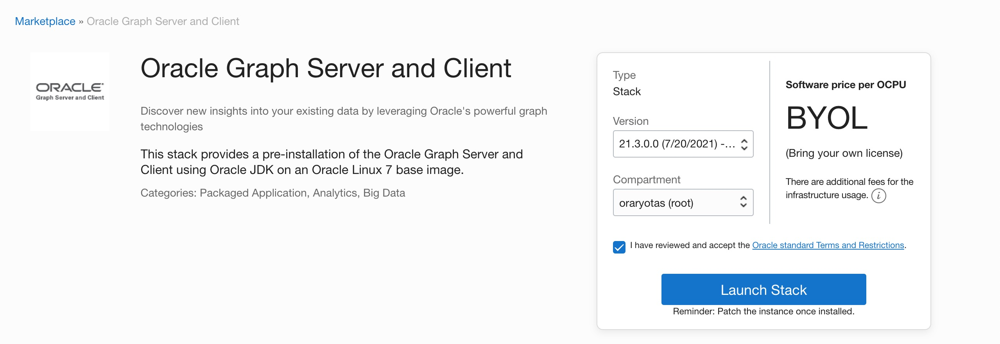
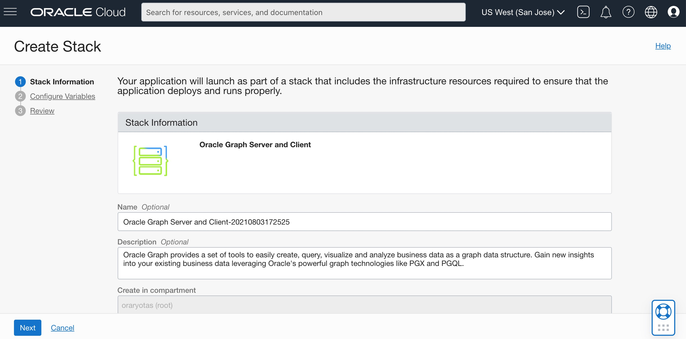
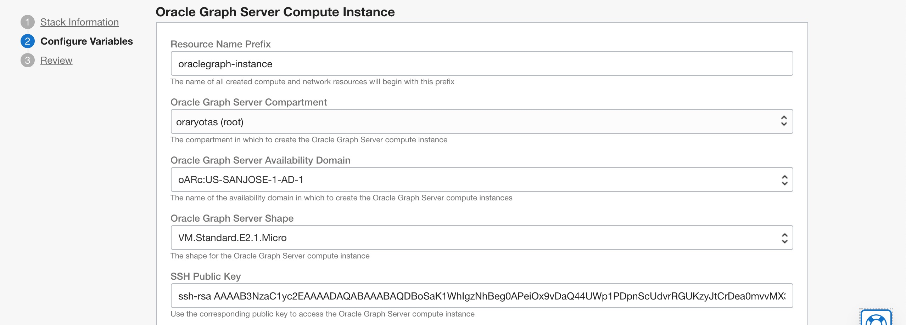
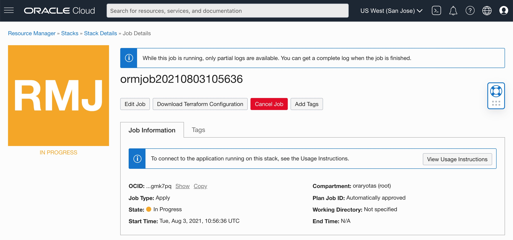
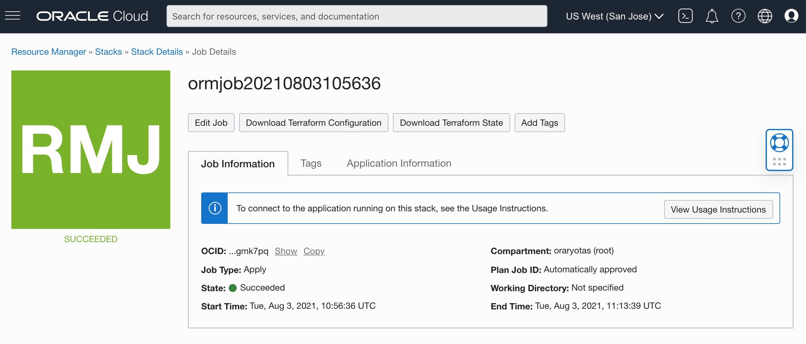
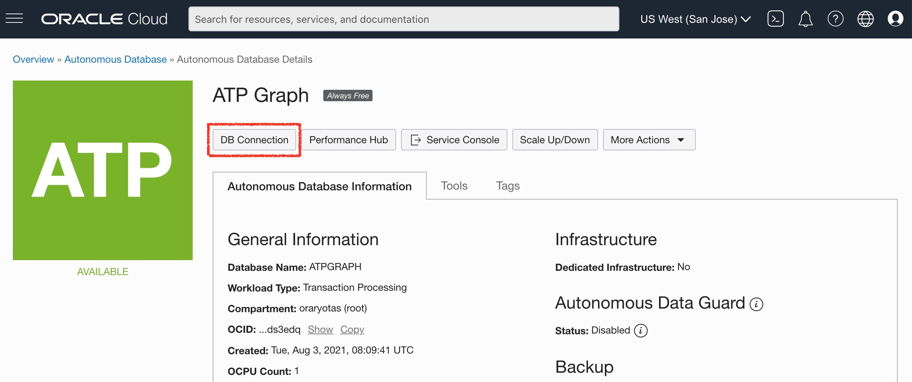
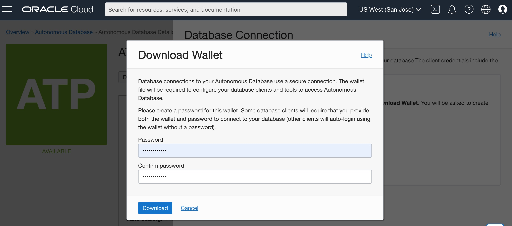

# Deploy the Graph Server & Client Marketplace Image

## Introduction

This lab walks you through the steps to deploy and configure the Graph Server and Client kit on a compute instance via an Oracle Cloud Marketplace stack. You will need to provide the SSH key, VCN and Subnet information, and the JDBC URL for the ADB instance during the deployment process.

Estimated time: 7 minutes

### Objectives

- Learn how to deploy the Graph Server and Client OCI Marketplace image.

### Prerequisites

* SSH Keys to use for connecting to a compute instance
* An ADB instance with the downloaded wallet

## **STEP 1:** Create Network for Graph Server

1. Go to Oracle Cloud console > Networking > Virtual Cloud Networks

    

2. Start VCN Wizard > Create VCN with Internet Connectivity > Start VCN Wizard

    - VCN NAME: e.g. `vcn1`
    - The rest of the items: Do not need to be changed

3. you need to open port 7007. Go to Virtual Cloud Networks > `vcn1` > `Public Subnet-vcn1` > `Default Security List for vcn1` > `Add Ingress Rules` and create the rule below:

    - Source Type: `CIDR`
    - Source CIDR: `0.0.0.0/0` (This setting is for testing only. Please replace to the IP address of the client machines for actual use.)
    - IP Protocol: `TCP`
    - Source Port Range: `(All)`
    - Destination Port Range: `7007`
    - Description: `For Graph Server`

    


## **STEP 2:** Locate the Graph Server and Client in the Marketplace

Oracle Cloud Marketplace is an online platform which offers Oracle and partner software as click-to-deploy solutions that are built to extend Oracle Cloud products and services.

Oracle Cloud Marketplace stacks are a set of Terraform templates that provide a fully automated end-to-end deployment of a partner solution on Oracle Cloud Infrastructure.

1. Go to your Cloud Console. Navigate to the **Marketplace** tab and enter "Graph Server and Client" in the serach bar. Click on the Oracle Graph Server and Client stack.

    

2. Select the stack and then review the System Requirements and Usage Instructions. Then select the version **20.4** (18-month patch release) or **21.3.0** and choose a compartment and click on `Launch Stack`.

    

0. **Stack Information**: You do not need to change. Proceed with `Next`.

    

3. **Configure Variables**: You will need to choose or provide the following:

    - Oracle Graph Server Shape: an always free eligible shape is `VM.Standard.E2.1.Micro`
    - SSH Public Key: This is used when you ssh into the provisioned instance later.

    

    - Existing Virtual cloud network: The one created above, `vcn1`
    - Existing Subnet: The one created above, `Public Subnet-vcn1`
    
    

    - JDBC URL for authentication: `jdbc:oracle:thin:@atpgraph_low?TNS_ADMIN=/etc/oracle/graph/wallets`
      - This is the TNS_ADMIN entry points to the directory where you **will** have uploaded and unzipped the wallet **on the Compute instance** which will be created in this process
      - If you named your database something else, e.g. `myatpgraph` then replace `@atpgraph_low` with `@myatpgraph_low` in the JDBC URL
      - This JDBC URL is stored in `/etc/oracle/graph/pgx.conf` which can be updated later if necessary
    
    

4. Click `Next` to initiate the Resource Manager Job for the stack. The job will take 2-3 minutes to complete.

    

    You'll see the progress in the log output.

    

    Once the job has successfully completed the status will change from "In Progess" to "Succeeded". If you get **"shape VM.Standard.E2.1.Micro not found"** error, the availability domain cannot provide the selected shape. Please edit the job and change the availability domain and retry. (An always-free compute VM can only be created in your home region. If you have previously created an always-free compute VM then this new VM.Standard.E2.1.Micro instance can only be created in the same availability domain as the previous one.)

    

    ***NOTE:*** *On completion please make a note of `public_ip` and `graphviz_public_url`, so that you can SSH into the running instance and access the graph viz later in this lab.*

## **STEP 3:** Download ADB Wallet

1. Go to your Cloud console, under **Oracle Database**, select **Autonomous Transaction Processing**. If you don't see your instance, make sure the **Workload Type** is **Transaction Processing** or **All**.

    

1. Click on your Autonomous Database instance. In your Autonomous Database Details page, click **DB Connection**.

    

1. In Database Connection window, select **Instance Wallet** as your Wallet Type, click **Download Wallet**.

    

1. In the Download Wallet dialog, enter a (new) wallet password in the Password fields. This password protects the downloaded client credentials wallet.

    Click **Download** to save the client security credentials zip file.
    

    By default the filename is: `Wallet_<database_name>.zip`.

Content in this section is adapted from [Download Client Credentials (Wallets)](https://docs.oracle.com/en/cloud/paas/autonomous-data-warehouse-cloud/user/connect-download-wallet.html#GUID-B06202D2-0597-41AA-9481-3B174F75D4B1)

## **STEP 4:** Upload and Unzip ADB Wallet

In this step, you need the shell tool to run `scp` and `ssh` commands, e.g. Oracle Cloud Shell, Terminal if you are using MAC, or Gitbash if you are using Windows.

1. Copy the wallet from your local machine to the Graph Server instance on OCI.

    ```
    <copy>
    scp -i <private_key> <Wallet_database_name>.zip opc@<public_ip_for_compute>:/etc/oracle/graph/wallets
    </copy>
    ```

    Example:
    ```
    scp -i key.pem ~/Downloads/Wallet_ATPGRAPH.zip opc@203.0.113.14:/etc/oracle/graph/wallets
    ```

1. Connect to the compute instance via SSH as `opc` user, using the private key you created earlier.

    ```
    <copy>
    ssh -i <private_key> opc@<public_ip_for_compute>
    </copy>
    ```

    Example:
    ```
    ssh -i key.pem opc@203.0.113.14
    ```

1. Unzip the ADB wallet to the `/etc/oracle/graph/wallets/` directory and change the group permission.

    ```
    <copy>
    cd /etc/oracle/graph/wallets/
    unzip Wallet_ATPGRAPH.zip
    chgrp oraclegraph *
    </copy>
    ```

1. Optionally, check that you used the right service name in the JDBC URL you entered when configuring the OCI stack.

    ```
    <copy>
    cat /etc/oracle/graph/wallets/tnsnames.ora
    </copy>
    ```

    You will see the entry `atpgraph_low` similar to:
    ``` 
    atpgraph_low =
        (description=
            (address=
                (https_proxy=proxyhostname)(https_proxy_port=80)(protocol=tcps)(port=1521)
                (host=adwc.example.oraclecloud.com)
            )
            (connect_data=(service_name=adwc1_low.adwc.oraclecloud.com))
            (security=(ssl_server_cert_dn="adwc.example.oraclecloud.com,OU=Oracle BMCS US,O=Oracle Corporation,L=Redwood City,ST=California,C=US"))
    )
    ```

You may now proceed to the next lab.

## Acknowledgements

* **Author** - Jayant Sharma, Product Manager, Spatial and Graph
* **Contributors** - Thanks to Jenny Tsai for helpful, constructive feedback that improved this workshop. Arabella Yao, Product Manager Intern, Database Management.
* **Last Updated By/Date** - Ryota Yamanaka, August 2021

