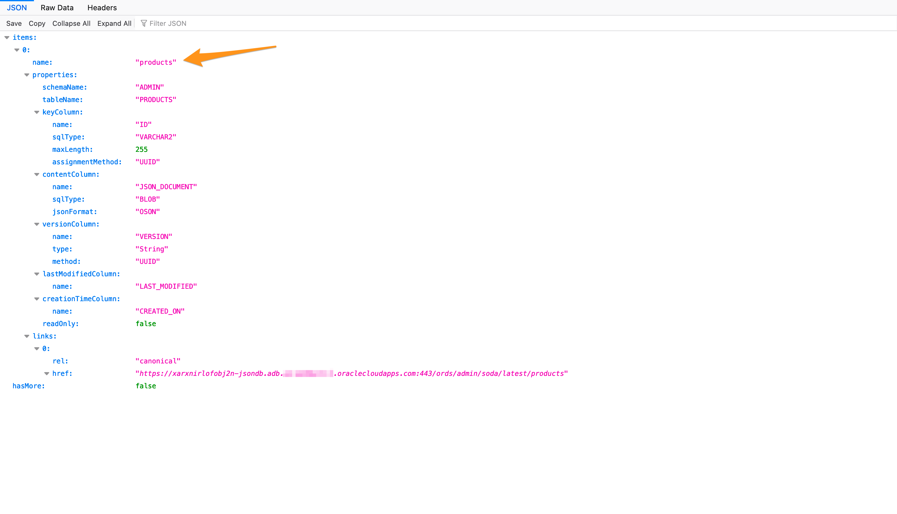
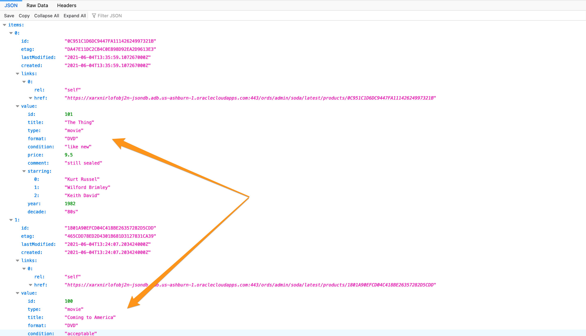
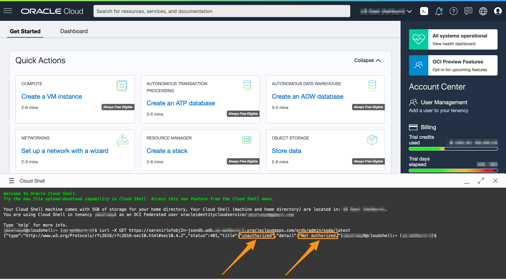
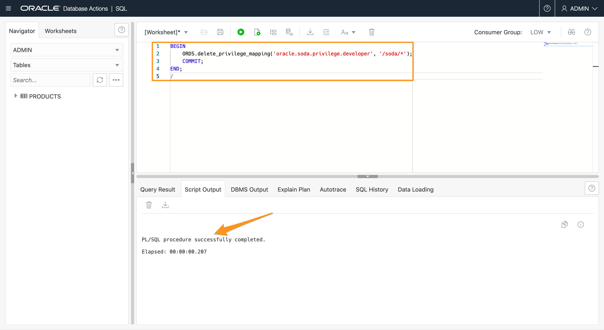
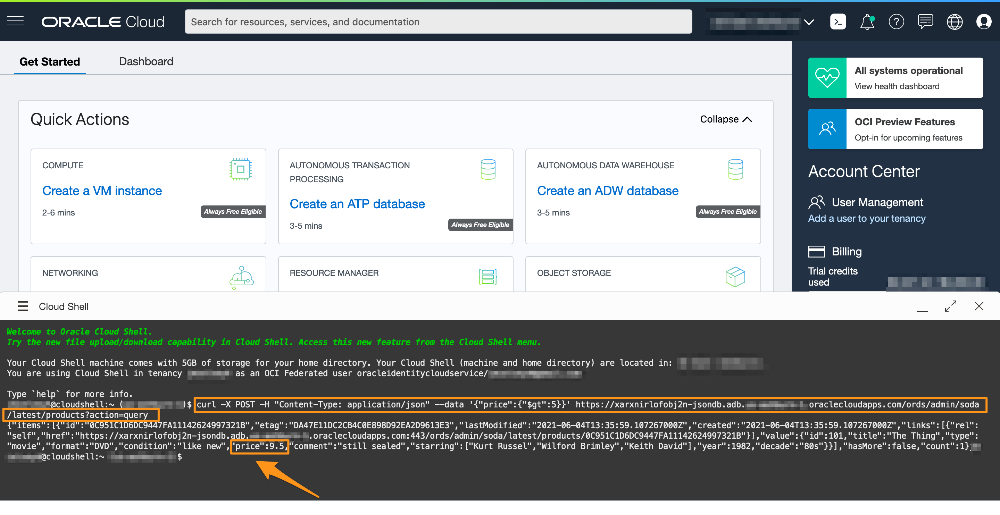
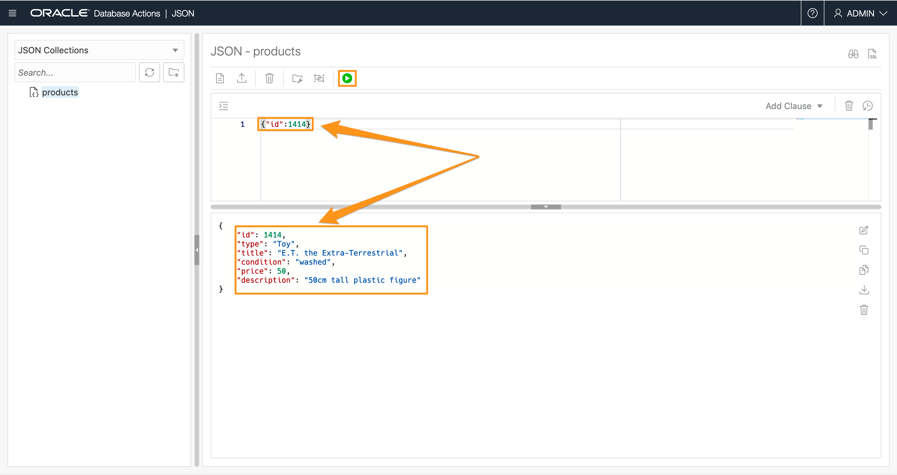

# Using SODA for REST

## Introduction

So far, all collection operations have been issued from a UI in the browser. In a real application these operations would be called directly from a programming language (for example using the open-source SODA drivers for Java, Python or NodeJS). Another option is to use REST. In this lab,

Estimated Lab Time: 10 minutes

### Objectives

In this lab, you will...

* Perform Simple REST Operations in Oracle Cloud Shell

### Prerequisites

* Have successfully created a JSON collection in Autonomous JSON Database and have inserted few documents

<!---
## **STEP 1:** Mass Insert

1. Now do mass insert:

	Click on New JSON Document icon, copy and paste the following query in the worksheet and click **Create**.

	```
	<copy>
	soda insert products {"id":101,"title":"Top Gun","category":"VHS","condition":"like new","price":8,"starring":["Tom Cruise","Kelly McGillis","Anthony Edwards","Val Kilmer"],"year":1986,"decade":"80s"}
	</copy>
	```

## **STEP 2:** Queries using QBE

let's perform more QBEs to analyze the data.

-> More QBEs to analyze data

1. Find all DVD's cheaper than 10$ and order by price

	```
	<copy>
	{"type":"DVD", "price":{"$lte":10}}
	</copy>
	```

2. Find all movies, there is no movie category, look for DVD, Blueray, VHS, LaserDisk, Betamax

	```
	<copy>
	{}
	</copy>
	```

3. Find all movies by Arnold

	```
	<copy>
	Fulltext search
	</copy>
	```
---->
## **STEP 1:** Perform Simple REST Operations in Oracle Cloud Shell

1. A simple REST request can be done from the browser - open a new window and copy the URL from the 'JSON Workshop' or the 'SQL Developer Web' into it.

	The URL should look similar to this:

	```
	https://ppkenzghg74avsq-atp19cdb.adb.eu-frankfurt-1.oraclecloudapps.com/ords/admin/_sdw/?nav=worksheet
	```

	*Note* - In this lab, we refer *your URL* in code snippets where your URL is similar to `ppkenzghg74avsq-atp19cdb.adb.eu-frankfurt-1.oraclecloudapps.com`. Replace *your URL* with your URL in all the code snippets wherever mentioned.

2. In the URL, remove the part - *_sdw/?nav=worksheet* and replace it with *soda/latest*.

	```
	https://<your URL>/ords/admin/soda/latest/
	```

	Your URL should now look like this:

	```
	https://ppkhnzjhg74axsq-bedasatpdb.adb.eu-frankfurt-1.oraclecloudapps.com/ords/admin/soda/latest
	```

3. Hit Enter to load this URL. You should see a JSON document which lists all existing collection - it shows the 'products' collection with some addition information.

	

4. In order do see the contents of the collection (the documents) all we have to do is append */products* (the collection name) to the URL and hit Enter.

	```
	https://<your URL>/ords/admin/soda/latest/products
	```

	Your URL should now look like this:

	```
	https://ppkhnzjhg74axsq-atp19cdb.adb.eu-frankfurt-1.oraclecloudapps.com/ords/admin/soda/latest/products
	```
	

5. The browser is limited to GET requests. For further operations we need to also perform other requests. For this we switch to use the 'curl' in the Oracle Cloud Shell. If you are familiar with other REST tools like Postman you can also use them for the following examples.

	Navigate to Oracle Cloud Console and click on Cloud Shell Icon.

	

6.	In the cloud shell, use the same URL to make a GET request as follows:

	```
	curl -X GET https://<your URL>/ords/admin/soda/latest
	```

	Your URL should now look like this:

	```
	curl -X GET https://ppkhnzjhg74axsq-bedasatpdb.adb.eu-frankfurt-1.oraclecloudapps.com/ords/admin/soda/latest
	```

	You'll see an authorization error. Oracle's security mechanisms kicked in as this REST request came from outside the database cloud service. Instead of explaining different authentication mechanisms here we turn it off. You would not do that in a real production system!

	

7. Navigate to the JSON workshop tab, click on the navigation menu on the top left and select **SQL** under Development.
	
	

8. Copy and paste the below procedure in SQL Developer Web worksheet and run it.

	```
	<copy>
	BEGIN
		ORDS.delete_privilege_mapping('oracle.soda.privilege.developer', '/soda/*');
		COMMIT;
	END;
	/
	</copy>
	```

	

8. Navigate back to the tab with Oracle Cloud Shell. Running the same curl command again should now return the same result that we have seen in the web browser : the contents of the 'products' collection.

	```
	curl -X GET https://<your URL>/ords/admin/soda/latest
	```

	Your URL should now look like this:

	```
	curl -X GET https://ppkhnzjhg74axsq-bedasatpdb.adb.eu-frankfurt-1.oraclecloudapps.com/ords/admin/soda/latest
	```
	
	
9. We can also run a QBE using curl. This would be a post request. Make sure you add *?action=query* to the URL.

	The following example issues a QBE selecting all products costing more than 5.

	```
	curl -X POST -H "Content-Type: application/json" --data '{"price":{"$gt":5}}' https://<your URL>/ords/admin/soda/latest/products?action=query
	```

	Your URL should now look like this:

	```
	curl -X POST -H "Content-Type: application/json" --data '{"price":{"$gt":5}}' https://ppkhnzjhg74axsq-atp19cdb.adb.eu-frankfurt-1.oraclecloudapps.com/ords/admin/soda/latest/products?action=query
	```

	

10. We can insert a new document, also using a POST request but without the ?action=query` at the end of the URL.

	```
	curl -X POST -H "Content-Type: application/json" --data '{"id": 1414,"type": "Toy","title": "E.T. the Extra-Terrestrial","condition": "washed","price": 50.00,"description": "50cm tall plastic figure"}' https://<your URL>/ords/admin/soda/latest/products
	```

	Your URL should now look like this:

	```
	curl -X POST -H "Content-Type: application/json" --data '{"id": 1414,"type": "Toy","title": "E.T. the Extra-Terrestrial","condition": "washed","price": 50.00,"description": "50cm tall plastic figure"}' https://ppkhnzjhg74axsq-atp19cdb.adb.eu-frankfurt-1.oraclecloudapps.com/ords/admin/soda/latest/products
	```
	

11. To verify if the new document was inserted, navigate to the tab with SQL Developer Web, click on the navigation menu on the top left and select **JSON** under Development.

		

	If you use the following QBE in the JSON Workshop by copying and pasting the following query in the worksheet and running it, you should see a new document.

	```
	<copy>
	{"id":1414}
	</copy>
	```
		

12. Now, let's do a bulk load to insert more data. 

-->Navigate back to the tab with Oracle Cloud Shell.

	TODO: how to get the file accessible by cloud shell

13. Verify in the JSON workshop that you have many more movies in the collection. Navigate to the tab with JSON Workshop,...

You may now [proceed to the next lab](#next).

## Acknowledgements

- **Author** - Beda Hammerschmidt, Roger Ford
- **Contributors** - Anoosha Pilli, Product Manager, Oracle Database
- **Last Updated By/Date** - Anoosha Pilli, May 2021
