# Using SQL to work with JSON

## Introduction

So far, we've focused mostly on the document store API where we dealt with JSON data as a collection of documents. But there is another way to interact with your JSON data: SQL.

SQL is a very mature query language. Oracle added new operators to work with JSON data (we created an open standard called SQL/JSON which was adopted by the ISO SQL standard).

A key characteristic of a JSON collection (like 'products') is that it is backed by a table - a table then gets auto-created when you create a collection so that you do not have to specify columns and data types.

In the following we show you how you can use SQL to work with the JSON data in a collection.

Estimated Lab Time: 30 minutes

### Objectives

In this lab, you will:

* Use JSON_Serialize to convert binary JSON data to a human-readable string.
* Use dot notation to extract values from JSON data.

### Prerequisites

* All previous labs have been successfully completed.

## **STEP: 1** SQL Developer Web

1. Click on the navigation menu on the top left and select **SQL** under Development.

    

2. On the left side, click on PRODUCTS - this is the table for the 'products' collection.

    

    You see that the table 'PRODUCTS' has 5 columns: an 'ID' which is a unique identifier for the document, a 'JSON\_DOCUMENT' which holds the document, 2 metadata columns to keep track of creation and update timestamps and 'VERSION' which is typically a hash value for the document and allows to keep caches in sync (similar to an eTag). None of this is really important at this point as we will only use the JSON\_DOCUMENT column in the following examples.

    *Learn more -* [Use Oracle Database Actions with JSON Collections](https://docs.oracle.com/en/cloud/paas/autonomous-json-database/ajdug/use-oracle-database-actions-json-collections1.html) and [Use SQL With JSON Data](https://docs.oracle.com/en/database/oracle/oracle-database/21/adjsn/json-in-oracle-database.html#GUID-04377B36-654B-47C4-A480-535E00E46D1F)

## **STEP: 2** JSON_Serialize

1. Because the JSON data is stored in a binary representation (for query and update efficiency) we need to convert it to a human-readable string using JSON_Serialize.

    Copy and paste this query in SQL Developer Web worksheet and run it. It returns 9 (random) documents from the table/collection.

    ```
    <copy>
    select JSON_Serialize(json_document) from products where rownum < 10;
    </copy>
    ```

    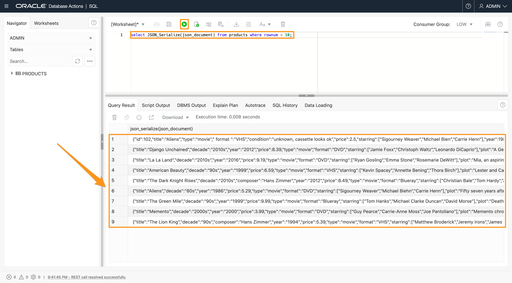

2. Simple dot notation - We can extract values from the JSON data using a simple notation (similar to JavaScript) directly from SQL.

    For example, running the below query shows all movies costing more than 5.

    ```
    <copy>
    select JSON_Serialize(json_document) 
    from products p
    where p.json_document.type.string() = 'movie'
    and p.json_document.format.string() = 'DVD'
    and p.json_document.price.number() > 5;
    </copy>
    ```
    

    We use a trailing function like 'string()' or 'number()' to map a selected JSON scalar value to a SQL value.

3. You can also extract values this way in the `select` part. Copy and paste the query in SQL Developer Web worksheet and run it.

    ```
    <copy>
    select p.json_document.title.string(), p.json_document.year.number()
    from products p
    where p.json_document.type.string() = 'movie'
    order by 2 DESC;
    </copy>
    ```
    

4. It is also possible to use aggregation or grouping with values from the JSON data.

    The following calculates the average price of movies per decade.

    ```
    <copy>
    select p.json_document.decade,
    avg(p.json_document.price.number())
    from products p
    where p.json_document.type.string() = 'movie'
    group by p.json_document.decade;
    </copy>
    ```
      

    *Learn more -* [Oracle SQL Function JSON_SERIALIZE](https://docs.oracle.com/en/database/oracle/oracle-database/21/adjsn/json-in-oracle-database.html#GUID-667D37FF-F5FB-465D-B8AE-DAE88F191B2F), and [Simple Dot-Notation Access to JSON Data](https://docs.oracle.com/en/database/oracle/oracle-database/21/adjsn/simple-dot-notation-access-to-json-data.html#GUID-7249417B-A337-4854-8040-192D5CEFD576)

## **STEP 3:** Unnesting JSON arrays

All above examples extracted singleton values from the JSON data - values that only occurred once per document (like title or price). But JSON can have nested arrays - how can we access those?

1. Let's say we want to extract all actor names. They occur as JSON strings in the array called 'starring'. Since one movie has typically more than one actor the overall number of actor names is larger than the number of documents. We therefore need a mechanism that generates rows - a row source. This is why we use the 'nested' clause in the FROM part of the query - here we generate the rows and extract the value we're interested in as column values.

    The simplest example is the following, run it first then we will explain it.

    ```
    <copy>
    select jt.* 
    from products p nested json_document columns (id, title, year NUMBER) jt;
    </copy>
    ```
    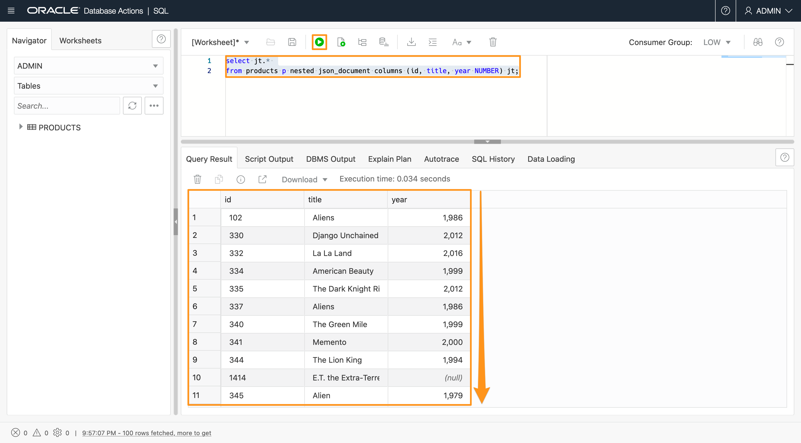

    As you can see we're extracting the 'id', the 'title' and the 'year' from each document. Instead of a trailing function we can specify an optional SQL data type like NUMBER - the default (used for the title) is a VARCHAR2(4000).

2.  We could have written this query with the simple dot notation, as well, because we do not drill into any JSON array yet. Let's do that in  this query, by using the NESTED clause also in the COLUMNS clause.

    ```
    <copy>
    select jt.* 
    from products p nested json_document columns (id, title, year NUMBER, nested starring[*] columns (actor path '$')) jt;
    </copy>
    ```
    

    The second 'nested' acts over the JSON array called 'starring'. The '[*]' means that we want to select every item of the array; [0] would only select the first one, for example. Then the second columns clause defines which value we want to extract from inside the array. The 'starring' array consists only of string values; we therefore need to select the entire value. This is done with the path expression '$'. We give selected values the column name 'actor'. You will learn more about path expressions in the next step.

3.  It is also possible to directly access the actors ('starring' array) as the following query shows: here we only select the actor names.

    ```
    <copy>
    select jt.* 
    from products p nested json_document.starring[*] columns (actor path '$') jt;
    </copy>
    ```
    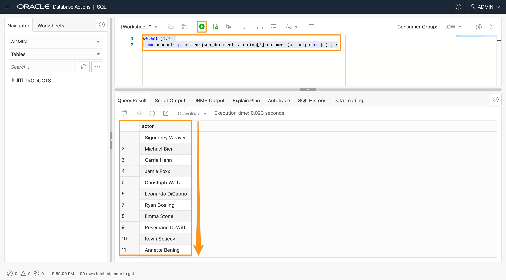

4.  On this we can do here by slightly modifying the query is to count the number of movies by actor. All we do is group the results by actor name and count the group's size. The 'order by' clause orders the results based on the second column (the count).

    ```
    <copy>
    select jt.actor, count(1)
    from products p nested json_document.starring[*] columns (actor path '$') jt
    group by actor
    order by 2 DESC;
    </copy>
    ```
    

    *Learn more -* [SQL NESTED Clause Instead of JSON_TABLE](https://docs.oracle.com/en/database/oracle/oracle-database/21/adjsn/function-JSON_TABLE.html#GUID-D870AAFF-58B0-4162-AC11-4DDC74B608A5)

## **STEP 4:** SQL/JSON operators

The 'simple dot notation' as shown in the previous steps is a syntax simplification of the SQL/JSON operators. Compared to the 'simple dot notation' they're a bit more verbose but also allow for more customization. These operators are part of the SQL standard.

### SQL/JSON Path Expression

SQL/JSON relies on 'path expressions' which consist of steps: A step can navigate into an object or array.

An object step starts with a dot followed by a key name; e.g '.name' or '.id'. If the key name starts with a non-Ascii character you need to quote it; e.g. '."0abc"'.

An array step uses square brackets; '[0]' selects the first value in an array. It is possible to select more than one element form the array, e.g. '[*]' selects all values, '[0,1,2]' selects the first three elements, and '[10 to 20]' selects elements 11 through 21.

Steps can be chained together. A path expression typically starts with the '$' symbol which refers to the document itself.

Path expressions are evaluated in a 'lax' mode. This means that an object step like '.id' can also be evaluated on an array value: it then means to select the 'id' values of each object in the array. This will be explained a bit in JSON_Exists, where we also explain Path Predicates (filters).

*Learn more -* [SQL/JSON Path Expressions](https://docs.oracle.com/en/database/oracle/oracle-database/21/adjsn/json-path-expressions.html#GUID-2DC05D71-3D62-4A14-855F-76E054032494)

Now let's look at the different SQL/JSON operators step by step:

### JSON_Value

JSON_VALUE takes one scalar value from the JSON data and returns it as a SQL scalar value.

1.  The first argument is the input, the column 'json_document' from the products collection/table. This is followed by a path expression, in this case we select the value for field 'format'. The optional 'returning' clause allows to specify the return type, in this case a varchar2 value of length 10. Because not every product has a 'format' value (only the movies do) there are cases where no value can be selected. By default NULL is returned in this case. The optional ON EMPTY clause allows to specify a default value (like 'none') or to raise an error - with ERROR ON EMPTY.

    ```
    <copy>
    select JSON_Value (json_document, '$.format' returning varchar2(10) default 'none' on empty) from products;
    </copy>
    ```
    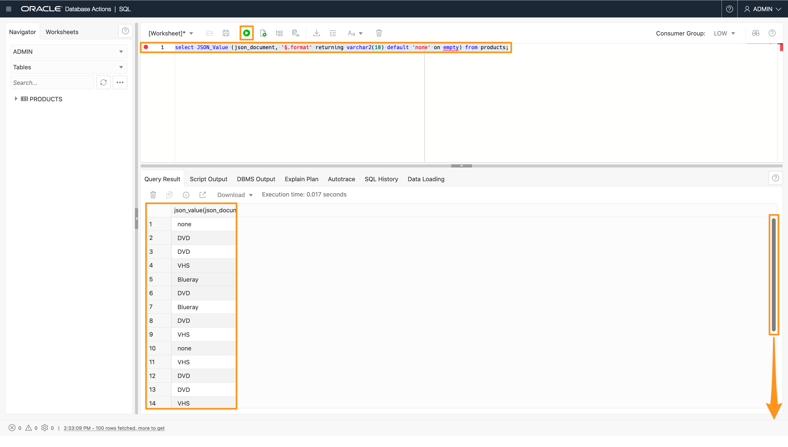

2.  JSON_Value can only select one scalar value. The following query will not return a result because it selects the array of actors.

    ```
    <copy>
    select JSON_Value (json_document, '$.starring[0,1]') from products;
    </copy>
    ```
    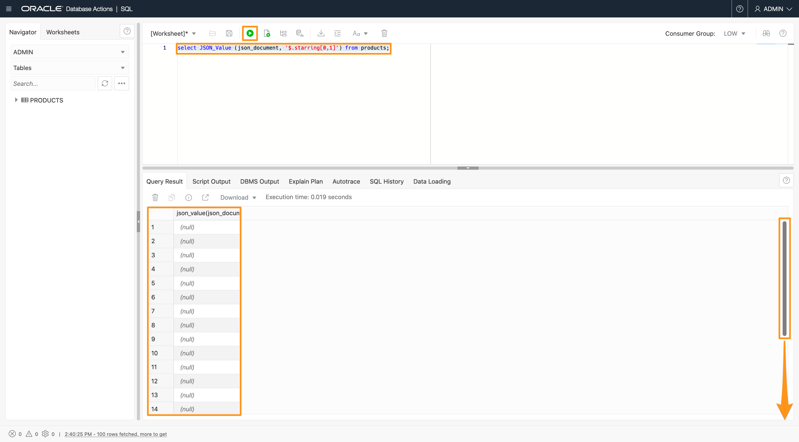

3.  But instead of seeing an error you'll see a lot of NULL values. This is because the NULL ON ERROR default applies. This fault-tolerant mode is to make working with schema-flexible data easier. To see the error you need to override this default with ERROR ON ERROR.

    This query will raise ORA-40456: JSON_VALUE evaluated to non-scalar value

    ```
    <copy>
    select JSON_Value (json_document, '$.starring' ERROR ON ERROR) from products;
    </copy>
    ```
    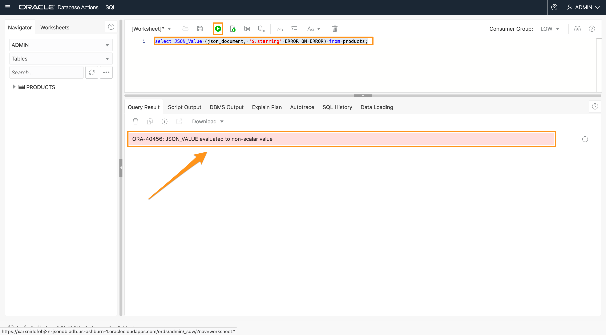

4.  This query will raise ORA-40470: JSON_VALUE evaluated to multiple values.

    ```
    <copy>
    select JSON_Value (json_document, '$.starring[0,1]' ERROR ON ERROR) from products;
    </copy>
    ```
    

    *Learn more -* [SQL/JSON Function JSON_VALUE](https://docs.oracle.com/en/database/oracle/oracle-database/21/adjsn/function-JSON_VALUE.html#GUID-0565F0EE-5F13-44DD-8321-2AC142959215)

### JSON_Query

Unlike JSON\_Value (which returns one SQL scalar value) the function JSON\_Query can extract complex values (objects or arrays), and it can also return multiple values as a new JSON array. The result of JSON_Query is JSON data itself, for example an object or array.

1. This query extracts the embedded array of actors. Scroll down the `Query Result` to see the values.

    ```
    <copy>
    select JSON_Query(p.json_document, '$.starring')
    from products p;
    </copy>
    ```
    

2.  The following query selects two values: the first two actor names in the 'starring' array. You need to specify the 'with array wrapper' clause to return both values as one array. Scroll down the `Query Result` to see the values.

    ```
    <copy>
    select JSON_Query(p.json_document, '$.starring[0,1]' with array wrapper)
    from products p;
    </copy>
    ```
    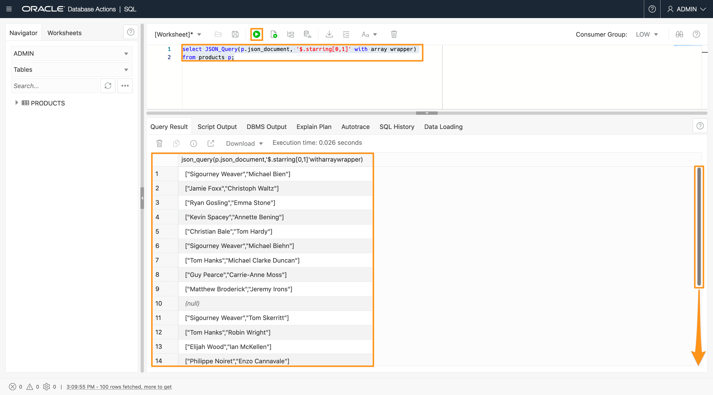


    *Learn more -* [SQL/JSON Function JSON_QUERY](https://docs.oracle.com/en/database/oracle/oracle-database/21/adjsn/function-JSON_QUERY.html#GUID-D64C7BE9-335D-449C-916D-1123539BF1FB)

### JSON_Exists

JSON_Exists is used to filter rows, therefore you find it in the WHERE clause. Instead of using a path expression to select and return a value, this operator just tests if such value exits.

1.  For example, count all documents which have a field 'format' - regardless of the field value.

    ```
    <copy>
    select count(1)
    from products 
    where JSON_Exists(json_document, '$.format');
    </copy>
    ```

    

2.  The following example returns all documents that have a field 'starring' that has the value 'Jim Carrey'.

    ```
    <copy>
    select JSON_SERIALIZE(p.json_document)
    from products p
    where JSON_Exists(p.json_document, '$.starring?(@ == "Jim Carrey")');
    </copy>
    ```
    


    This is expressed using a path predicate using the question mark (?) symbol and a comparison following in parentheses. The '@' symbol represents the current value being used in the comparison. For an array the context will be every item of the array - one can think of iterating through the array and performing the comparison for each item of the array. If any item satisfies the condition than JSON_Exists selects the row.

3.  The following selects all movies with two or more genres, one genre has to be 'Sci-Fi' and an actor's name has to begin with 'Sigourney'.

    ```
    <copy>
    select JSON_SERIALIZE(p.json_document)
    from products p
    where JSON_Exists(p.json_document, '$?(@.genres.size() >= 2 && @.genres == "Sci-Fi" && @.starring starts with "Sigourney")');
    </copy>
    ```
    

    SODA QBE filter expressions are rewritten to use JSON_Exists.

    *Note:* Indexes can be added to speed up finding the right documents.

    *Learn more -* [SQL/JSON Condition JSON_EXISTS](https://docs.oracle.com/en/database/oracle/oracle-database/21/adjsn/condition-JSON_EXISTS.html#GUID-D60A7E52-8819-4D33-AEDB-223AB7BDE60A)

### JSON_Table

JSON\_Table is used to 'flatten' hierarchical JSON data to a table consisting of rows and columns. It is commonly used for analytics or reporting over JSON data. Similarly to the 'nested' clause in the simple dot notation JSON\_Table allows to unnest an embedded JSON array. JSON\_Table consists of 'row' path expressions (which define the number of rows) and column path expressions (which extract a value and map it to a column with a given data type). Each row can have JSON\_Value, JSON\_Query and JSON\_Exists semantics. This lets to combine a set of these operations into one single JSON\_Table expression.

1.  In this example, let's combine a set of these operations into one single JSON_Table expression.

    ```
    <copy>
    select jt.*
    from products,
    JSON_TABLE (json_document, '$' columns (
      id NUMBER,
      ProductName varchar2(50) path '$.title',
      type,
      actors varchar(100) FORMAT JSON path '$.starring',
      year EXISTS,
      numGenres NUMBER path '$.genres.size()'
    )) jt;
    </copy>
    ```
    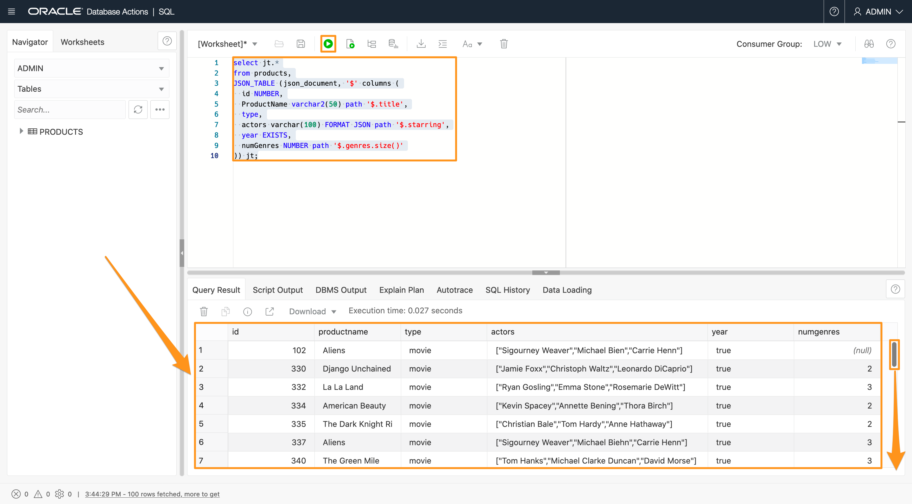

2.  Like the other SQL/JSON operators the first input is the JSON data - the column 'json_document' from the products collection/table. The first path expressions, '$', is the row path expression - in this case we select the entire document. It would be possible to directly access an embedded object or array here, for example '$.starring[*]' would then generate a row for each actor.

    The columns clause then lists each column. Let's go over this line by line:
    *	The 'id' column is defined to be a number instead of the default VARCHAR2(4000).
    *	The next column is called 'ProductName' which is not a field name in the JSON data, we therefore need to tell which field name we want to use. This is done by providing title column path expression, '$.title', which targets field 'title'.. We also set the data type to be a VARCHAR2 of length 50.
    *	The column 'type' uses the same name as the field in the JSON, therefore we do not need to provide a path expression. Also we accept the default datatype.
    *	Field 'actors' does not exists, so we map the the actors, which are elements of array 'starring', to column 'actors' using path expression '$.starring'. We use FORMAT JSON to specify JSON\_Table that this column has JSON\_Query  semantics and the returned value is JSON itself - in this case we extract the embedded array.
    *	Similarly, we use the keyword 'EXISTS' to specify that the next column ('year') or JSON_Exists semantics. We're not interested in the actual year value - only if a value exists or not. You will therefore see true|false values for this column (or 1|0 if you change the return type to NUMBER).
    *	The last column 'numGenres' is an example of using a path item method (or trailing function), in this case we call 'size()' on an array to count the number of values in the array. There are many other trailing functions that can be used.

    Multiple JSON arrays on the same level can also be projected out by using 'nested paths' on the same level, as the following example shows with the array of actors and genres. The values of the sibling arrays are returned in separate rows instead of merging them into the same row, for two reasons: The arrays could be of different sizes and there is no clear rule how to combine values from different arrays. In this example, 'genres' and 'actors' have nothing to do with each other. Why should the first actor name be place in the same row as the first genre? This is why you see the NULL values in the result. This is a UNION join.

    ```
    <copy>
    select jt.*
    from products, 
    JSON_TABLE (json_document, '$' columns (
      title, 
      nested path '$.starring[*]' 
      columns (actor path '$'),
      nested path '$.genres[*]' 
      columns (genre path '$')
    )) jt;
    </copy>
    ```
    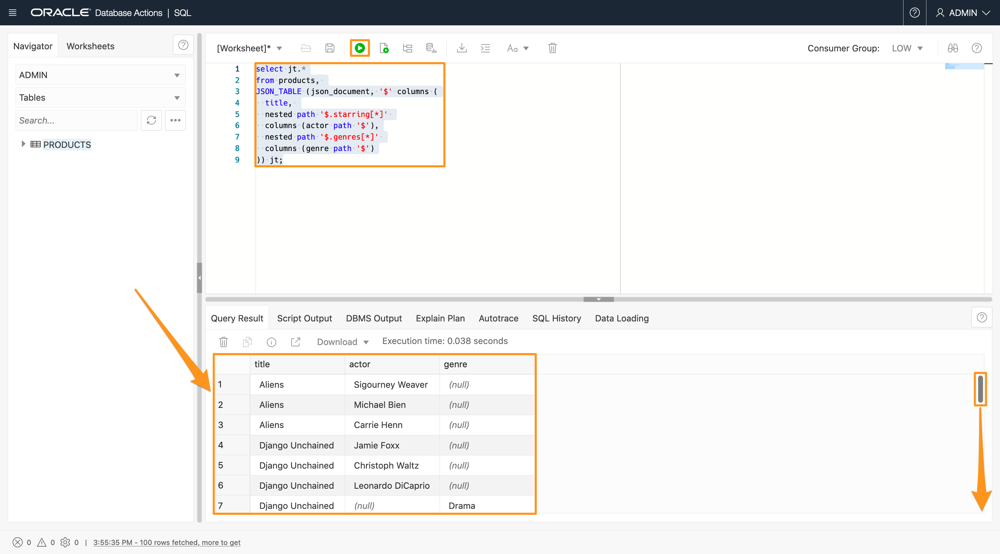

3.  A common practice is to define a database view using JSON\_TABLE. Then you can describe and query the view like a relational table. Fast refreshable materialized views are possible with JSON\_Table but not covered in this lab.

    For example, create view movie_view as:

    ```
    <copy>
    create view movie_view as
    select jt.*
    from products, 
    JSON_TABLE (json_document, '$' columns (
      id NUMBER,
      ProductName varchar2(50) path '$.title',
      type,
      actors varchar(100) FORMAT JSON path '$.starring',
      year EXISTS,
      numGenres NUMBER path '$.genres.size()'
    )) jt;
    </copy>
    ```
    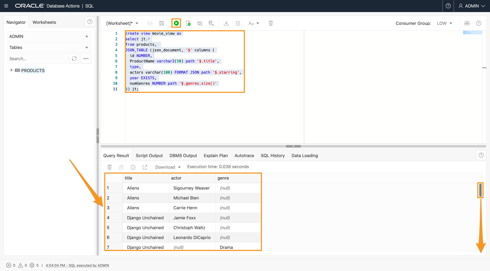

    Describe the movie_view:

    ```
    <copy>
    desc movie_view;
    </copy>
    ```
    

    select columns from the movie_view:

    ```
    <copy>
    select productName, numGenres
    from movie_view
    where year = 'true'
    order by numGenres;
    </copy>
    ```
    

    *Learn more -* [SQL/JSON Function JSON_TABLE](https://docs.oracle.com/en/database/oracle/oracle-database/21/adjsn/function-JSON_TABLE.html#GUID-0172660F-CE29-4765-BF2C-C405BDE8369A)

## **STEP 5:** JSON Updates

### JSON_Mergepatch

Besides replacing an old JSON document with an new one there are two operators which allow you to perform updates - JSON_Mergepatch and JSON_Transform.

JSON_Mergepatch follows RFC 7386 [https://datatracker.ietf.org/doc/html/rfc7386](https://datatracker.ietf.org/doc/html/rfc7386). It lets you update a JSON instance with a so-called 'patch' which is a JSON document. The simplest way to think about this is that you merge the patch into the JSON instance.

1.  Let's look at an example. Run this query:

    ```
    <copy>
    select JSON_Serialize(json_document)
    from products p
    where p.json_document.id = 1414;
    </copy>
    ```
    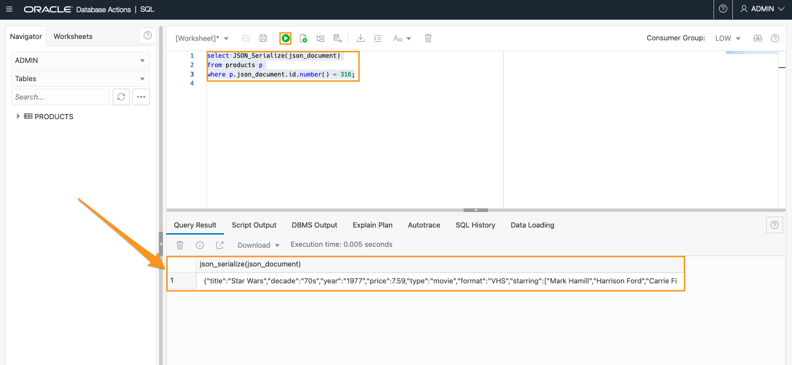

2.  This brings us the 'ET' doll which we have not sold yet. Maybe we should update the price and add a note?

    ```
    <copy>
    update products p
    set p.json_document = JSON_Mergepatch(json_document, '{"price":45, "note":"only 100 were made!"}')
    where p.json_document.id = 1414;
    </copy>
    ```
    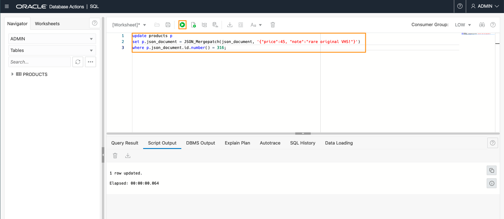

3.  Run the select query again to see the effect of the change: the price was updated, and a note got added.

    ```
    <copy>
    select JSON_Serialize(json_document)
    from products p
    where p.json_document.id = 1414;
    </copy>
    ```
    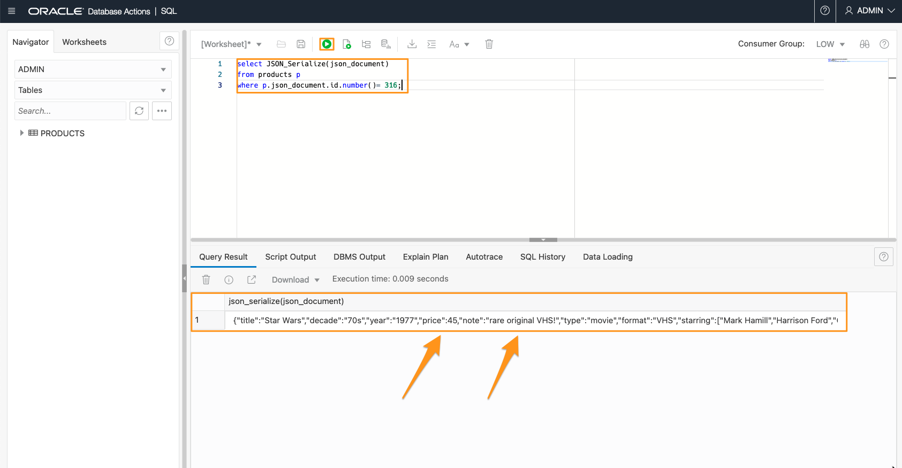

    JSON\_Mergepatch also allows you to delete a value (by setting it to null) but JSON\_Mergepatch is not able to handle updates on JSON\_Arrays. This is why we added a more powerful operator: JSON\_Transform.

    *Learn more -* [Oracle SQL Function JSON_MERGEPATCH](https://docs.oracle.com/en/database/oracle/oracle-database/21/adjsn/oracle-sql-function-json_mergepatch.html#GUID-80B4DA1C-246F-4AB4-8DF5-D492E5661AA8)

### JSON_Transform

JSON\_Transform, like the other SQL/JSON operators, relies on path expressions to define the values to be modified. A JSON\_Transform operation consists of one or more modifying operations that are executed in the same sequence as they're defined. Let's explain this with the following example:

1.  This is the document we want to update

    ```
    <copy>
    select JSON_Serialize(json_document)
    from products p
    where p.json_document.id = 515;
    </copy>
    ```
    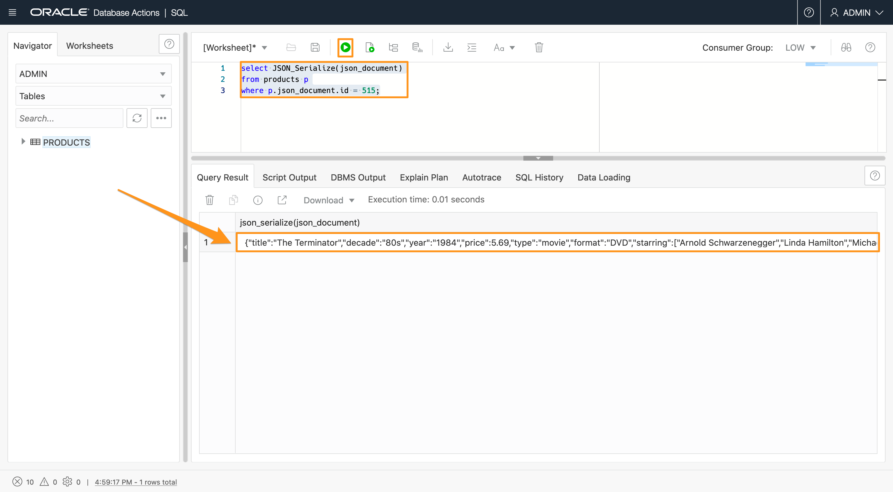

2.  We want to add a new fields (duration), calculate a new price (10% higher) and append a new genre (thriller) to the array.

    ```
    <copy>
    update products p
    set p.json_document = JSON_Transform(json_document,
    set '$.duration' = '108 minutes',
    set '$.price' = (p.json_document.price.number() * 1.10),
    append '$.genres' = 'Thriller'
    )
    where p.json_document.id = 515;
    </copy>
    ```
    

    *Learn more -* [Oracle SQL Function JSON_TRANSFORM](https://docs.oracle.com/en/database/oracle/oracle-database/21/adjsn/oracle-sql-function-json_transform.html#GUID-7BED994B-EAA3-4FF0-824D-C12ADAB862C1)

## **STEP 6:** JSON Generation functions

SQL/JSON has 4 operators to generate JSON objects and arrays: 2 are per-row operators that generate one object/array per input row, and 2 are aggregate operators that generate one object/array for all input rows. These operators come in handy when you want to generate JSON data from existing tables or you want to bring JSON data into a different shape.

1.  Let's first look at a simple example first. We create the following simple table:

    ```
    <copy>
    create table emp (empno number, ename varchar2(30), salary number);
    </copy>
    ```
    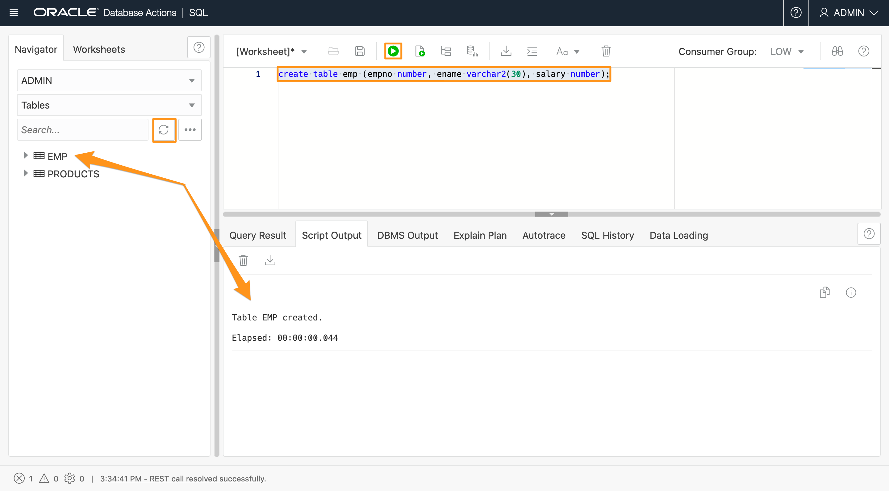

    ```
    <copy>
    insert into emp values (1, 'Arnold', 500000);
    insert into emp values (2, 'Sigourney', 800000);
    insert into emp values (3, 'Tom', 200000);
    </copy>
    ```
    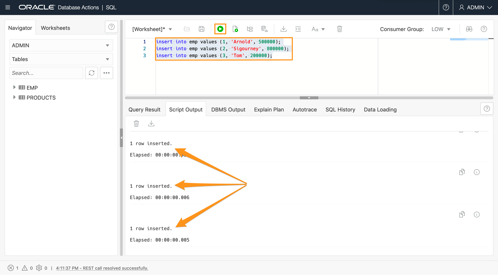

2.  With JSON_Object we can convert each row to a JSON object. The names are picked from the column names and are typically upper cased.

    ```
    <copy>
    select JSON_Object(*) from emp;
    </copy>
    ```

3.  If we want fewer columns or different field names we can specify this as follows:

    ```
    <copy>
    select JSON_Object('name' value ename, 'compensation' value (salary/1000)) from emp;
    </copy>
    ```

4.  As you can see, one JSON object is generated per row. Using JSON\_ObjectAgg we can summarize the information in one JSON\_Object - note that the field names now originate from column values:

    ```
    <copy>
    select JSON_ObjectAgg(ename value (salary/1000)) from emp;
    </copy>
    ```

5.  Similary, we use JSON\_Array and JSON\_ArrayAgg to build arrays:

    ```
    <copy>
    select JSON_Array(empno, ename, salary) from emp;
    </copy>
    ```

    ```
    <copy>
    select JSON_ArrayAgg(ename) from emp;
    </copy>
    ```

6.  We now use JSON generation together with JSON_Table to create a new JSON representation of information that is in the product collection: Every movie points to an array of actors. The same actor occurs in multiple arrays if she/he played in multiple movies.

    What if we wanted the opposite: a list of unique actors referring to the list of movies that they played in?

    First, we need to have a map of actors and the movies they played in

    ```
    <copy>
    select jt.id, jt.title, jt.actor
    from products NESTED json_document COLUMNS(
      id NUMBER,
      title,
      NESTED starring[*] COLUMNS(
       actor path '$'
      )) jt
    where jt.actor is not null;
    </copy>
    ```

7.  This list contains multiple entries for the same actor. How do we find the distinct actor names? By just issuing a 'DISTINCT' query on top of the previous query. We use the WITH clause to define the above query as an inlined subquery named ' actor\_title\_map'.

    ```
    <copy>
    with 
    actor_title_map as (
    select jt.id, jt.title, jt.actor
    from products NESTED json_document COLUMNS(
      id NUMBER,
      title,
      NESTED starring[*] COLUMNS(
       actor path '$'
      )) jt
    where jt.actor is not null
    )
    select DISTINCT actor
    from actor_title_map;
    </copy>
    ```

8.  Now, we know each actor, and with the first query we're able to map each actor to all their movie titles. We can then use JSON generation functions to convert this information into a brand new JSON. The distinct actor names also become an inlined subquery in the following example:

    ```
    <copy>
    with 
    actor_title_map as (
    select jt.id, jt.title, jt.actor
    from products NESTED json_document COLUMNS(
      id NUMBER,
      title,
      NESTED starring[*] COLUMNS(
       actor path '$'
      )) jt
    where jt.actor is not null
    ),
    distinct_actors as (
    select distinct actor 
    from actor_title_map 
    )
    select JSON_OBJECT(da.actor,
    'movies' VALUE (	select JSON_ArrayAgg(atm.title) 
    from actor_title_map atm
    where atm.actor = da.actor)) 
    from distinct_actors da;
    </copy>
    ```

    The value for the field 'movies' is the result of a subquery on the actor\_title\_map with a join on the actor's name.

    *Learn more -* [Generation of JSON Data Using SQL](https://docs.oracle.com/en/database/oracle/oracle-database/21/adjsn/generation.html#GUID-6C3441E8-4F02-4E95-969C-BBCA6BDBBD9A)

## **STEP 7:** JSON Dataguide

Often, you do not know all the fields that occur in a collection of JSON data, especially if it is from a third party. JSON\_Dataguide lets you retrieve a JSON schema for this data. It tells you all occurring field names, their data types and the paths to access them. It can even automate the generation of a JSON\_Table-based view.

1.  Let's assume for a second that we do not know anything about the JSON data in the products collection.

    ```
    <copy>
    select JSON_Dataguide(json_document, dbms_json.FORMAT_HIERARCHICAL)
    from products;
    </copy>
    ```

    ```
    {
        "type": "object",
        "o:length": 1,
        "properties": {
            "id": {
                "type": "number",
                "o:length": 4,
                "o:preferred_column_name": "id"
            },
            "note": {
                "type": "string",
                "o:length": 32,
                "o:preferred_column_name": "note"
            },
    ...
    ...
    ...
    }

    ```

2.  The output is a JSON document itself - a JSON schema which tells us that our data consists of objects which have fields 'id', 'note', etc . For every field the corresponding data type is shown, together with a length of the largest values (rounded up to the next power of 2). The JSON schema also tells us a default column name that would be used when creating a view. In many cases this default column name is a good choice but you may want to customize it. There are two column names  "scalar\_string" that we want to rename. We use our JSON\_Transform skills to rename them. We do this by temporarily storing the data guide in a new table (using an IS JSON check constraint) :

    ```
    <copy>
    create table tmp_dataguide (dg_val CLOB, check (dg_val is JSON));
    </copy>
    ```

    ```
    <copy>
    insert into tmp_dataguide (dg_val)
    select JSON_Dataguide(json_document, dbms_json.FORMAT_HIERARCHICAL)
    from products;
    </copy>
    ```

3.  We can find all the default column names using the following JSON_Query statement, which uses the '..' descendant path step. The descendant step is similar to the normal '.' object step, but it  also scans all descendants of the current object.

    ```
    <copy>
    select JSON_Query(dg_val, '$.."o:preferred_column_name"' with wrapper) 
    from tmp_dataguide;
    </copy>
    ```

4.  As a result, we see that the following column names use "scalar_string" twice.

    ```
    ["id","note","plot","type","year","price","title","author","decade","format","genres","scalar_string","comment"," format","category","composer","duration","starring","scalar_string","condition","description","originalTitle"]
    ```

5.  We use JSON_Transform to rename the column names to more user-friendly ones.

    ```
    <copy>
    update tmp_dataguide
    set dg_val = JSON_Transform(dg_val, 
    set '$.properties.genres.items."o:preferred_column_name"' = 'genre',
    set '$.properties.starring.items."o:preferred_column_name"' = 'actor'
    );
    </copy>
    ```

6.  Now we can use a simple PL/SQL procedure DBMS_JSON.create_view to automatically create a relational view over the JSON data. The JSON Dataguide provides all information for the columns like their name, data type and the JSON path expression to extract the corresponding values.

    ```
    <copy>
    declare
    dg clob;
    BEGIN
    select dg_val into dg from tmp_dataguide;
    dbms_json.create_view('prod_view', 'products', 'json_document', dg);
    END;
    /
    </copy>
    ```

    ```
    <copy>
    describe prod_view;
    </copy>
    ```

7.  You can now query prod_view like any other view

    ```
    <copy>
    select distinct "title" 
    from prod_view
    where "year" = 1988;
    </copy>
    ```

8.  If you describe the underlying view you'll see that it is based on JSON_Table, and all the column clauses have been built automatically.

    ```
    <copy>
    select dbms_metadata.get_ddl('VIEW', 'PROD_VIEW') from dual;
    </copy>
    ```

    ```
    CREATE OR REPLACE FORCE EDITIONABLE VIEW ...
    AS 
    SELECT ...
    FROM "PRODUCTS" RT,
    JSON_TABLE("JSON_DOCUMENT", '$[*]' COLUMNS 
    "id" number path '$.id',
    "note" varchar2(32) path '$.note',
    "plot" varchar2(2048) path '$.plot',
    "type" varchar2(8) path '$.type',
    "year" varchar2(4) path '$.year',
    "price" number path '$.price',
    "title" varchar2(128) path '$.title',
    "author" varchar2(32) path '$.author',
    "decade" varchar2(8) path '$.decade',
    "format" varchar2(16) path '$.format',
    NESTED PATH '$.genres[*]' COLUMNS (
    "genre" varchar2(16) path '$[*]'),
    "comment" varchar2(64) path '$.comment',
    " format " varchar2(4) path '$." format "',
    "category" varchar2(4) path '$.category',
    "composer" varchar2(16) path '$.composer',
    "duration" varchar2(16) path '$.duration',
        NESTED PATH '$.starring[*]' COLUMNS (
    "actor" varchar2(32) path '$[*]'),
    "condition" varchar2(32) path '$.condition',
    "description" varchar2(32) path '$.description',
    "originalTitle" varchar2(1) path '$.originalTitle')JT
    ```

    *Learn more -* [JSON Data Guide](https://docs.oracle.com/en/database/oracle/oracle-database/21/adjsn/json-dataguide.html#GUID-219FC30E-89A7-4189-BC36-7B961A24067C)

## Acknowledgements

- **Author** - Beda Hammerschmidt, Architect
- **Contributors** - Anoosha Pilli, Product Manager, Oracle Database
- **Last Updated By/Date** - Anoosha Pilli, Brianna Ambler, June 2021